# Projects and dependencies analysis

This document provides a comprehensive overview of the projects and their dependencies in the context of upgrading to .NETFramework,Version=v4.8.1.

## Table of Contents

- [Executive Summary](#executive-Summary)
  - [Highlevel Metrics](#highlevel-metrics)
  - [Projects Compatibility](#projects-compatibility)
  - [Package Compatibility](#package-compatibility)
  - [API Compatibility](#api-compatibility)
- [Aggregate NuGet packages details](#aggregate-nuget-packages-details)
- [Top API Migration Challenges](#top-api-migration-challenges)
  - [Technologies and Features](#technologies-and-features)
  - [Most Frequent API Issues](#most-frequent-api-issues)
- [Projects Relationship Graph](#projects-relationship-graph)
- [Project Details](#project-details)

  - [MetroFramework\MetroFramework.Demo\MetroFramework.Demo.csproj](#metroframeworkmetroframeworkdemometroframeworkdemocsproj)
  - [MetroFramework\MetroFramework.Design\MetroFramework.Design.csproj](#metroframeworkmetroframeworkdesignmetroframeworkdesigncsproj)
  - [MetroFramework\MetroFramework.Fonts\MetroFramework.Fonts.csproj](#metroframeworkmetroframeworkfontsmetroframeworkfontscsproj)
  - [MetroFramework\MetroFramework\MetroFramework.csproj](#metroframeworkmetroframeworkmetroframeworkcsproj)
  - [NFe.Components.Info\NFe.Components.Info.csproj](#nfecomponentsinfonfecomponentsinfocsproj)
  - [NFe.Components.Wsdl\NFe.Components.Wsdl.csproj](#nfecomponentswsdlnfecomponentswsdlcsproj)
  - [NFe.Components\NFe.Components.csproj](#nfecomponentsnfecomponentscsproj)
  - [NFe.ConvertCFe\NFe.SAT.csproj](#nfeconvertcfenfesatcsproj)
  - [NFe.ConvertTxt\NFe.ConvertTxt.csproj](#nfeconverttxtnfeconverttxtcsproj)
  - [NFe.Service\NFe.Service.csproj](#nfeservicenfeservicecsproj)
  - [NFe.Settings\NFe.Settings.csproj](#nfesettingsnfesettingscsproj)
  - [NFe.Threadings\NFe.Threadings.csproj](#nfethreadingsnfethreadingscsproj)
  - [NFe.UI\NFe.UI.csproj](#nfeuinfeuicsproj)
  - [NFe.Validate\NFe.Validate.csproj](#nfevalidatenfevalidatecsproj)
  - [UniNFe.Service\UniNFe.Service.csproj](#uninfeserviceuninfeservicecsproj)
  - [uninfe\UniNFe.csproj](#uninfeuninfecsproj)

## Executive Summary

### Highlevel Metrics

| Metric | Count | Status |
| :--- | :---: | :--- |
| Total Projects | 16 | All require upgrade |
| Total NuGet Packages | 56 | All compatible |
| Total Code Files | 458 |  |
| Total Code Files with Incidents | 16 |  |
| Total Lines of Code | 122543 |  |
| Total Number of Issues | 16 |  |
| Estimated LOC to modify | 0+ | at least 0,0% of codebase |

### Projects Compatibility

| Project | Target Framework | Difficulty | Package Issues | API Issues | Est. LOC Impact | Description |
| :--- | :---: | :---: | :---: | :---: | :---: | :--- |
| [MetroFramework\MetroFramework.Demo\MetroFramework.Demo.csproj](#metroframeworkmetroframeworkdemometroframeworkdemocsproj) | net481 | 🟢 Low | 0 | 0 |  | ClassicWinForms, Sdk Style = False |
| [MetroFramework\MetroFramework.Design\MetroFramework.Design.csproj](#metroframeworkmetroframeworkdesignmetroframeworkdesigncsproj) | net481 | 🟢 Low | 0 | 0 |  | ClassicWinForms, Sdk Style = False |
| [MetroFramework\MetroFramework.Fonts\MetroFramework.Fonts.csproj](#metroframeworkmetroframeworkfontsmetroframeworkfontscsproj) | net481 | 🟢 Low | 0 | 0 |  | ClassicWinForms, Sdk Style = False |
| [MetroFramework\MetroFramework\MetroFramework.csproj](#metroframeworkmetroframeworkmetroframeworkcsproj) | net481 | 🟢 Low | 0 | 0 |  | ClassicWinForms, Sdk Style = False |
| [NFe.Components.Info\NFe.Components.Info.csproj](#nfecomponentsinfonfecomponentsinfocsproj) | net481 | 🟢 Low | 0 | 0 |  | ClassicWinForms, Sdk Style = False |
| [NFe.Components.Wsdl\NFe.Components.Wsdl.csproj](#nfecomponentswsdlnfecomponentswsdlcsproj) | net481 | 🟢 Low | 0 | 0 |  | ClassicClassLibrary, Sdk Style = False |
| [NFe.Components\NFe.Components.csproj](#nfecomponentsnfecomponentscsproj) | net481 | 🟢 Low | 0 | 0 |  | ClassicWinForms, Sdk Style = False |
| [NFe.ConvertCFe\NFe.SAT.csproj](#nfeconvertcfenfesatcsproj) | net481 | 🟢 Low | 0 | 0 |  | ClassicClassLibrary, Sdk Style = False |
| [NFe.ConvertTxt\NFe.ConvertTxt.csproj](#nfeconverttxtnfeconverttxtcsproj) | net481 | 🟢 Low | 0 | 0 |  | ClassicWinForms, Sdk Style = False |
| [NFe.Service\NFe.Service.csproj](#nfeservicenfeservicecsproj) | net481 | 🟢 Low | 0 | 0 |  | ClassicWinForms, Sdk Style = False |
| [NFe.Settings\NFe.Settings.csproj](#nfesettingsnfesettingscsproj) | net481 | 🟢 Low | 0 | 0 |  | ClassicWinForms, Sdk Style = False |
| [NFe.Threadings\NFe.Threadings.csproj](#nfethreadingsnfethreadingscsproj) | net481 | 🟢 Low | 0 | 0 |  | ClassicWinForms, Sdk Style = False |
| [NFe.UI\NFe.UI.csproj](#nfeuinfeuicsproj) | net481 | 🟢 Low | 0 | 0 |  | ClassicWinForms, Sdk Style = False |
| [NFe.Validate\NFe.Validate.csproj](#nfevalidatenfevalidatecsproj) | net481 | 🟢 Low | 0 | 0 |  | ClassicWinForms, Sdk Style = False |
| [UniNFe.Service\UniNFe.Service.csproj](#uninfeserviceuninfeservicecsproj) | net481 | 🟢 Low | 0 | 0 |  | ClassicDotNetApp, Sdk Style = False |
| [uninfe\UniNFe.csproj](#uninfeuninfecsproj) | net481 | 🟢 Low | 0 | 0 |  | ClassicWinForms, Sdk Style = False |

### Package Compatibility

| Status | Count | Percentage |
| :--- | :---: | :---: |
| ✅ Compatible | 56 | 100,0% |
| ⚠️ Incompatible | 0 | 0,0% |
| 🔄 Upgrade Recommended | 0 | 0,0% |
| ***Total NuGet Packages*** | ***56*** | ***100%*** |

### API Compatibility

| Category | Count | Impact |
| :--- | :---: | :--- |
| 🔴 Binary Incompatible | 0 | High - Require code changes |
| 🟡 Source Incompatible | 0 | Medium - Needs re-compilation and potential conflicting API error fixing |
| 🔵 Behavioral change | 0 | Low - Behavioral changes that may require testing at runtime |
| ✅ Compatible | 0 |  |
| ***Total APIs Analyzed*** | ***0*** |  |

## Aggregate NuGet packages details

| Package | Current Version | Suggested Version | Projects | Description |
| :--- | :---: | :---: | :--- | :--- |
| BouncyCastle.Cryptography | 2.6.2 |  | [NFe.Components.csproj](#nfecomponentsnfecomponentscsproj) [NFe.Components.Info.csproj](#nfecomponentsinfonfecomponentsinfocsproj) [NFe.ConvertTxt.csproj](#nfeconverttxtnfeconverttxtcsproj) [NFe.SAT.csproj](#nfeconvertcfenfesatcsproj) [NFe.Service.csproj](#nfeservicenfeservicecsproj) [NFe.Settings.csproj](#nfesettingsnfesettingscsproj) [NFe.Threadings.csproj](#nfethreadingsnfethreadingscsproj) [NFe.UI.csproj](#nfeuinfeuicsproj) [NFe.Validate.csproj](#nfevalidatenfevalidatecsproj) [UniNFe.csproj](#uninfeuninfecsproj) [UniNFe.Service.csproj](#uninfeserviceuninfeservicecsproj) | ✅Compatible |
| iTextSharp | 5.5.13.4 |  | [NFe.SAT.csproj](#nfeconvertcfenfesatcsproj) [NFe.Service.csproj](#nfeservicenfeservicecsproj) | ✅Compatible |
| Microsoft.Bcl.AsyncInterfaces | 10.0.0 |  | [NFe.Service.csproj](#nfeservicenfeservicecsproj) [UniNFe.csproj](#uninfeuninfecsproj) [UniNFe.Service.csproj](#uninfeserviceuninfeservicecsproj) | ✅Compatible |
| Microsoft.Bcl.Cryptography | 10.0.0 |  | [NFe.Components.csproj](#nfecomponentsnfecomponentscsproj) [NFe.Components.Info.csproj](#nfecomponentsinfonfecomponentsinfocsproj) [NFe.ConvertTxt.csproj](#nfeconverttxtnfeconverttxtcsproj) [NFe.Service.csproj](#nfeservicenfeservicecsproj) [NFe.Settings.csproj](#nfesettingsnfesettingscsproj) [NFe.Threadings.csproj](#nfethreadingsnfethreadingscsproj) [NFe.UI.csproj](#nfeuinfeuicsproj) [NFe.Validate.csproj](#nfevalidatenfevalidatecsproj) [UniNFe.csproj](#uninfeuninfecsproj) [UniNFe.Service.csproj](#uninfeserviceuninfeservicecsproj) | ✅Compatible |
| Microsoft.Bcl.Memory | 10.0.0 |  | [NFe.Service.csproj](#nfeservicenfeservicecsproj) [UniNFe.csproj](#uninfeuninfecsproj) [UniNFe.Service.csproj](#uninfeserviceuninfeservicecsproj) | ✅Compatible |
| Microsoft.Bcl.TimeProvider | 10.0.0 |  | [NFe.Service.csproj](#nfeservicenfeservicecsproj) [UniNFe.csproj](#uninfeuninfecsproj) [UniNFe.Service.csproj](#uninfeserviceuninfeservicecsproj) | ✅Compatible |
| Microsoft.CSharp | 4.7.0 |  | [NFe.Components.csproj](#nfecomponentsnfecomponentscsproj) [NFe.Components.Info.csproj](#nfecomponentsinfonfecomponentsinfocsproj) [NFe.ConvertTxt.csproj](#nfeconverttxtnfeconverttxtcsproj) [NFe.Service.csproj](#nfeservicenfeservicecsproj) [NFe.Settings.csproj](#nfesettingsnfesettingscsproj) [NFe.Threadings.csproj](#nfethreadingsnfethreadingscsproj) [NFe.UI.csproj](#nfeuinfeuicsproj) [NFe.Validate.csproj](#nfevalidatenfevalidatecsproj) [UniNFe.csproj](#uninfeuninfecsproj) [UniNFe.Service.csproj](#uninfeserviceuninfeservicecsproj) | ✅Compatible |
| Microsoft.Extensions.DependencyInjection | 10.0.0 |  | [NFe.Service.csproj](#nfeservicenfeservicecsproj) [UniNFe.csproj](#uninfeuninfecsproj) [UniNFe.Service.csproj](#uninfeserviceuninfeservicecsproj) | ✅Compatible |
| Microsoft.Extensions.DependencyInjection.Abstractions | 10.0.0 |  | [NFe.Service.csproj](#nfeservicenfeservicecsproj) [UniNFe.csproj](#uninfeuninfecsproj) [UniNFe.Service.csproj](#uninfeserviceuninfeservicecsproj) | ✅Compatible |
| Microsoft.Extensions.Logging | 10.0.0 |  | [NFe.Service.csproj](#nfeservicenfeservicecsproj) [UniNFe.csproj](#uninfeuninfecsproj) [UniNFe.Service.csproj](#uninfeserviceuninfeservicecsproj) | ✅Compatible |
| Microsoft.Extensions.Logging.Abstractions | 10.0.0 |  | [NFe.Service.csproj](#nfeservicenfeservicecsproj) [UniNFe.csproj](#uninfeuninfecsproj) [UniNFe.Service.csproj](#uninfeserviceuninfeservicecsproj) | ✅Compatible |
| Microsoft.Extensions.Options | 10.0.0 |  | [NFe.Service.csproj](#nfeservicenfeservicecsproj) [UniNFe.csproj](#uninfeuninfecsproj) [UniNFe.Service.csproj](#uninfeserviceuninfeservicecsproj) | ✅Compatible |
| Microsoft.Extensions.Primitives | 10.0.0 |  | [NFe.Service.csproj](#nfeservicenfeservicecsproj) [UniNFe.csproj](#uninfeuninfecsproj) [UniNFe.Service.csproj](#uninfeserviceuninfeservicecsproj) | ✅Compatible |
| Microsoft.Identity.Abstractions | 9.6.0 |  | [NFe.Service.csproj](#nfeservicenfeservicecsproj) [UniNFe.csproj](#uninfeuninfecsproj) [UniNFe.Service.csproj](#uninfeserviceuninfeservicecsproj) | ✅Compatible |
| Microsoft.IdentityModel.Abstractions | 8.15.0 |  | [NFe.Service.csproj](#nfeservicenfeservicecsproj) [UniNFe.csproj](#uninfeuninfecsproj) [UniNFe.Service.csproj](#uninfeserviceuninfeservicecsproj) | ✅Compatible |
| Microsoft.IdentityModel.JsonWebTokens | 8.15.0 |  | [NFe.Service.csproj](#nfeservicenfeservicecsproj) [UniNFe.csproj](#uninfeuninfecsproj) [UniNFe.Service.csproj](#uninfeserviceuninfeservicecsproj) | ✅Compatible |
| Microsoft.IdentityModel.Logging | 8.15.0 |  | [NFe.Service.csproj](#nfeservicenfeservicecsproj) [UniNFe.csproj](#uninfeuninfecsproj) [UniNFe.Service.csproj](#uninfeserviceuninfeservicecsproj) | ✅Compatible |
| Microsoft.IdentityModel.Tokens | 8.15.0 |  | [NFe.Service.csproj](#nfeservicenfeservicecsproj) [UniNFe.csproj](#uninfeuninfecsproj) [UniNFe.Service.csproj](#uninfeserviceuninfeservicecsproj) | ✅Compatible |
| Newtonsoft.Json | 13.0.4 |  | [NFe.Components.csproj](#nfecomponentsnfecomponentscsproj) [NFe.Components.Info.csproj](#nfecomponentsinfonfecomponentsinfocsproj) [NFe.ConvertTxt.csproj](#nfeconverttxtnfeconverttxtcsproj) [NFe.Service.csproj](#nfeservicenfeservicecsproj) [NFe.Settings.csproj](#nfesettingsnfesettingscsproj) [NFe.Threadings.csproj](#nfethreadingsnfethreadingscsproj) [NFe.UI.csproj](#nfeuinfeuicsproj) [NFe.Validate.csproj](#nfevalidatenfevalidatecsproj) [UniNFe.csproj](#uninfeuninfecsproj) [UniNFe.Service.csproj](#uninfeserviceuninfeservicecsproj) | ✅Compatible |
| System.Buffers | 4.6.1 |  | [NFe.Components.csproj](#nfecomponentsnfecomponentscsproj) [NFe.Components.Info.csproj](#nfecomponentsinfonfecomponentsinfocsproj) [NFe.ConvertTxt.csproj](#nfeconverttxtnfeconverttxtcsproj) [NFe.Service.csproj](#nfeservicenfeservicecsproj) [NFe.Settings.csproj](#nfesettingsnfesettingscsproj) [NFe.Threadings.csproj](#nfethreadingsnfethreadingscsproj) [NFe.UI.csproj](#nfeuinfeuicsproj) [NFe.Validate.csproj](#nfevalidatenfevalidatecsproj) [UniNFe.csproj](#uninfeuninfecsproj) [UniNFe.Service.csproj](#uninfeserviceuninfeservicecsproj) | ✅Compatible |
| System.ComponentModel.Annotations | 5.0.0 |  | [NFe.Service.csproj](#nfeservicenfeservicecsproj) [UniNFe.csproj](#uninfeuninfecsproj) [UniNFe.Service.csproj](#uninfeserviceuninfeservicecsproj) | ✅Compatible |
| System.Diagnostics.DiagnosticSource | 10.0.0 |  | [NFe.Service.csproj](#nfeservicenfeservicecsproj) [UniNFe.csproj](#uninfeuninfecsproj) [UniNFe.Service.csproj](#uninfeserviceuninfeservicecsproj) | ✅Compatible |
| System.Formats.Asn1 | 10.0.0 |  | [NFe.Components.csproj](#nfecomponentsnfecomponentscsproj) [NFe.Components.Info.csproj](#nfecomponentsinfonfecomponentsinfocsproj) [NFe.ConvertTxt.csproj](#nfeconverttxtnfeconverttxtcsproj) [NFe.Service.csproj](#nfeservicenfeservicecsproj) [NFe.Settings.csproj](#nfesettingsnfesettingscsproj) [NFe.Threadings.csproj](#nfethreadingsnfethreadingscsproj) [NFe.UI.csproj](#nfeuinfeuicsproj) [NFe.Validate.csproj](#nfevalidatenfevalidatecsproj) [UniNFe.csproj](#uninfeuninfecsproj) [UniNFe.Service.csproj](#uninfeserviceuninfeservicecsproj) | ✅Compatible |
| System.IdentityModel.Tokens.Jwt | 8.15.0 |  | [NFe.Service.csproj](#nfeservicenfeservicecsproj) [UniNFe.csproj](#uninfeuninfecsproj) [UniNFe.Service.csproj](#uninfeserviceuninfeservicecsproj) | ✅Compatible |
| System.IO | 4.3.0 |  | [NFe.Components.csproj](#nfecomponentsnfecomponentscsproj) [NFe.Components.Info.csproj](#nfecomponentsinfonfecomponentsinfocsproj) [NFe.ConvertTxt.csproj](#nfeconverttxtnfeconverttxtcsproj) [NFe.Service.csproj](#nfeservicenfeservicecsproj) [NFe.Settings.csproj](#nfesettingsnfesettingscsproj) [NFe.Threadings.csproj](#nfethreadingsnfethreadingscsproj) [NFe.UI.csproj](#nfeuinfeuicsproj) [NFe.Validate.csproj](#nfevalidatenfevalidatecsproj) [UniNFe.csproj](#uninfeuninfecsproj) [UniNFe.Service.csproj](#uninfeserviceuninfeservicecsproj) | ✅Compatible |
| System.IO.Pipelines | 10.0.0 |  | [NFe.Service.csproj](#nfeservicenfeservicecsproj) [UniNFe.csproj](#uninfeuninfecsproj) [UniNFe.Service.csproj](#uninfeserviceuninfeservicecsproj) | ✅Compatible |
| System.Memory | 4.6.3 |  | [NFe.Components.csproj](#nfecomponentsnfecomponentscsproj) [NFe.Components.Info.csproj](#nfecomponentsinfonfecomponentsinfocsproj) [NFe.ConvertTxt.csproj](#nfeconverttxtnfeconverttxtcsproj) [NFe.Service.csproj](#nfeservicenfeservicecsproj) [NFe.Settings.csproj](#nfesettingsnfesettingscsproj) [NFe.Threadings.csproj](#nfethreadingsnfethreadingscsproj) [NFe.UI.csproj](#nfeuinfeuicsproj) [NFe.Validate.csproj](#nfevalidatenfevalidatecsproj) [UniNFe.csproj](#uninfeuninfecsproj) [UniNFe.Service.csproj](#uninfeserviceuninfeservicecsproj) | ✅Compatible |
| System.Numerics.Vectors | 4.6.1 |  | [NFe.Components.csproj](#nfecomponentsnfecomponentscsproj) [NFe.Components.Info.csproj](#nfecomponentsinfonfecomponentsinfocsproj) [NFe.ConvertTxt.csproj](#nfeconverttxtnfeconverttxtcsproj) [NFe.Service.csproj](#nfeservicenfeservicecsproj) [NFe.Settings.csproj](#nfesettingsnfesettingscsproj) [NFe.Threadings.csproj](#nfethreadingsnfethreadingscsproj) [NFe.UI.csproj](#nfeuinfeuicsproj) [NFe.Validate.csproj](#nfevalidatenfevalidatecsproj) [UniNFe.csproj](#uninfeuninfecsproj) [UniNFe.Service.csproj](#uninfeserviceuninfeservicecsproj) | ✅Compatible |
| System.Runtime | 4.3.1 |  | [NFe.Components.csproj](#nfecomponentsnfecomponentscsproj) [NFe.Components.Info.csproj](#nfecomponentsinfonfecomponentsinfocsproj) [NFe.ConvertTxt.csproj](#nfeconverttxtnfeconverttxtcsproj) [NFe.Service.csproj](#nfeservicenfeservicecsproj) [NFe.Settings.csproj](#nfesettingsnfesettingscsproj) [NFe.Threadings.csproj](#nfethreadingsnfethreadingscsproj) [NFe.UI.csproj](#nfeuinfeuicsproj) [NFe.Validate.csproj](#nfevalidatenfevalidatecsproj) [UniNFe.csproj](#uninfeuninfecsproj) [UniNFe.Service.csproj](#uninfeserviceuninfeservicecsproj) | ✅Compatible |
| System.Runtime.CompilerServices.Unsafe | 6.1.2 |  | [NFe.Components.csproj](#nfecomponentsnfecomponentscsproj) [NFe.Components.Info.csproj](#nfecomponentsinfonfecomponentsinfocsproj) [NFe.ConvertTxt.csproj](#nfeconverttxtnfeconverttxtcsproj) [NFe.Service.csproj](#nfeservicenfeservicecsproj) [NFe.Settings.csproj](#nfesettingsnfesettingscsproj) [NFe.Threadings.csproj](#nfethreadingsnfethreadingscsproj) [NFe.UI.csproj](#nfeuinfeuicsproj) [NFe.Validate.csproj](#nfevalidatenfevalidatecsproj) [UniNFe.csproj](#uninfeuninfecsproj) [UniNFe.Service.csproj](#uninfeserviceuninfeservicecsproj) | ✅Compatible |
| System.Runtime.InteropServices.RuntimeInformation | 4.3.0 |  | [NFe.Service.csproj](#nfeservicenfeservicecsproj) [UniNFe.csproj](#uninfeuninfecsproj) [UniNFe.Service.csproj](#uninfeserviceuninfeservicecsproj) | ✅Compatible |
| System.Security.AccessControl | 6.0.1 |  | [NFe.Components.csproj](#nfecomponentsnfecomponentscsproj) [NFe.Settings.csproj](#nfesettingsnfesettingscsproj) [NFe.Threadings.csproj](#nfethreadingsnfethreadingscsproj) [NFe.UI.csproj](#nfeuinfeuicsproj) [NFe.Validate.csproj](#nfevalidatenfevalidatecsproj) | ✅Compatible |
| System.Security.Cryptography.Algorithms | 4.3.1 |  | [NFe.Components.csproj](#nfecomponentsnfecomponentscsproj) [NFe.Components.Info.csproj](#nfecomponentsinfonfecomponentsinfocsproj) [NFe.ConvertTxt.csproj](#nfeconverttxtnfeconverttxtcsproj) [NFe.Service.csproj](#nfeservicenfeservicecsproj) [NFe.Settings.csproj](#nfesettingsnfesettingscsproj) [NFe.Threadings.csproj](#nfethreadingsnfethreadingscsproj) [NFe.UI.csproj](#nfeuinfeuicsproj) [NFe.Validate.csproj](#nfevalidatenfevalidatecsproj) [UniNFe.csproj](#uninfeuninfecsproj) [UniNFe.Service.csproj](#uninfeserviceuninfeservicecsproj) | ✅Compatible |
| System.Security.Cryptography.Cng | 5.0.0 |  | [NFe.Components.csproj](#nfecomponentsnfecomponentscsproj) [NFe.Components.Info.csproj](#nfecomponentsinfonfecomponentsinfocsproj) [NFe.ConvertTxt.csproj](#nfeconverttxtnfeconverttxtcsproj) | ✅Compatible |
| System.Security.Cryptography.Encoding | 4.3.0 |  | [NFe.Components.csproj](#nfecomponentsnfecomponentscsproj) [NFe.Components.Info.csproj](#nfecomponentsinfonfecomponentsinfocsproj) [NFe.ConvertTxt.csproj](#nfeconverttxtnfeconverttxtcsproj) [NFe.Service.csproj](#nfeservicenfeservicecsproj) [NFe.Settings.csproj](#nfesettingsnfesettingscsproj) [NFe.Threadings.csproj](#nfethreadingsnfethreadingscsproj) [NFe.UI.csproj](#nfeuinfeuicsproj) [NFe.Validate.csproj](#nfevalidatenfevalidatecsproj) [UniNFe.csproj](#uninfeuninfecsproj) [UniNFe.Service.csproj](#uninfeserviceuninfeservicecsproj) | ✅Compatible |
| System.Security.Cryptography.Primitives | 4.3.0 |  | [NFe.Components.csproj](#nfecomponentsnfecomponentscsproj) [NFe.Components.Info.csproj](#nfecomponentsinfonfecomponentsinfocsproj) [NFe.ConvertTxt.csproj](#nfeconverttxtnfeconverttxtcsproj) [NFe.Service.csproj](#nfeservicenfeservicecsproj) [NFe.Settings.csproj](#nfesettingsnfesettingscsproj) [NFe.Threadings.csproj](#nfethreadingsnfethreadingscsproj) [NFe.UI.csproj](#nfeuinfeuicsproj) [NFe.Validate.csproj](#nfevalidatenfevalidatecsproj) [UniNFe.csproj](#uninfeuninfecsproj) [UniNFe.Service.csproj](#uninfeserviceuninfeservicecsproj) | ✅Compatible |
| System.Security.Cryptography.Xml | 10.0.0 |  | [NFe.Components.csproj](#nfecomponentsnfecomponentscsproj) [NFe.Components.Info.csproj](#nfecomponentsinfonfecomponentsinfocsproj) [NFe.ConvertTxt.csproj](#nfeconverttxtnfeconverttxtcsproj) [NFe.Service.csproj](#nfeservicenfeservicecsproj) [NFe.Settings.csproj](#nfesettingsnfesettingscsproj) [NFe.Threadings.csproj](#nfethreadingsnfethreadingscsproj) [NFe.UI.csproj](#nfeuinfeuicsproj) [NFe.Validate.csproj](#nfevalidatenfevalidatecsproj) [UniNFe.csproj](#uninfeuninfecsproj) [UniNFe.Service.csproj](#uninfeserviceuninfeservicecsproj) | ✅Compatible |
| System.Security.Permissions | 10.0.0 |  | [NFe.Components.csproj](#nfecomponentsnfecomponentscsproj) [NFe.Settings.csproj](#nfesettingsnfesettingscsproj) [NFe.Threadings.csproj](#nfethreadingsnfethreadingscsproj) [NFe.UI.csproj](#nfeuinfeuicsproj) [NFe.Validate.csproj](#nfevalidatenfevalidatecsproj) | ✅Compatible |
| System.Security.Principal.Windows | 5.0.0 |  | [NFe.Components.csproj](#nfecomponentsnfecomponentscsproj) [NFe.Settings.csproj](#nfesettingsnfesettingscsproj) [NFe.Threadings.csproj](#nfethreadingsnfethreadingscsproj) [NFe.UI.csproj](#nfeuinfeuicsproj) [NFe.Validate.csproj](#nfevalidatenfevalidatecsproj) | ✅Compatible |
| System.Text.Encodings.Web | 10.0.0 |  | [NFe.Service.csproj](#nfeservicenfeservicecsproj) [UniNFe.csproj](#uninfeuninfecsproj) [UniNFe.Service.csproj](#uninfeserviceuninfeservicecsproj) | ✅Compatible |
| System.Text.Json | 10.0.0 |  | [NFe.Service.csproj](#nfeservicenfeservicecsproj) [UniNFe.csproj](#uninfeuninfecsproj) [UniNFe.Service.csproj](#uninfeserviceuninfeservicecsproj) | ✅Compatible |
| System.Threading.Tasks.Extensions | 4.6.3 |  | [NFe.Service.csproj](#nfeservicenfeservicecsproj) [UniNFe.csproj](#uninfeuninfecsproj) [UniNFe.Service.csproj](#uninfeserviceuninfeservicecsproj) | ✅Compatible |
| System.ValueTuple | 4.6.1 |  | [NFe.Components.csproj](#nfecomponentsnfecomponentscsproj) [NFe.Components.Info.csproj](#nfecomponentsinfonfecomponentsinfocsproj) [NFe.ConvertTxt.csproj](#nfeconverttxtnfeconverttxtcsproj) [NFe.Service.csproj](#nfeservicenfeservicecsproj) [NFe.Settings.csproj](#nfesettingsnfesettingscsproj) [NFe.Threadings.csproj](#nfethreadingsnfethreadingscsproj) [NFe.UI.csproj](#nfeuinfeuicsproj) [NFe.Validate.csproj](#nfevalidatenfevalidatecsproj) [UniNFe.csproj](#uninfeuninfecsproj) [UniNFe.Service.csproj](#uninfeserviceuninfeservicecsproj) | ✅Compatible |
| Topshelf | 4.3.0 |  | [UniNFe.Service.csproj](#uninfeserviceuninfeservicecsproj) | ✅Compatible |
| Unimake.AuthServer | 20250707.1650.48 |  | [NFe.Service.csproj](#nfeservicenfeservicecsproj) [UniNFe.csproj](#uninfeuninfecsproj) [UniNFe.Service.csproj](#uninfeserviceuninfeservicecsproj) | ✅Compatible |
| Unimake.Cryptography | 20251119.239.8 |  | [NFe.Components.csproj](#nfecomponentsnfecomponentscsproj) [NFe.Components.Info.csproj](#nfecomponentsinfonfecomponentsinfocsproj) [NFe.ConvertTxt.csproj](#nfeconverttxtnfeconverttxtcsproj) [NFe.Service.csproj](#nfeservicenfeservicecsproj) [NFe.Settings.csproj](#nfesettingsnfesettingscsproj) [NFe.Threadings.csproj](#nfethreadingsnfethreadingscsproj) [NFe.UI.csproj](#nfeuinfeuicsproj) [NFe.Validate.csproj](#nfevalidatenfevalidatecsproj) [UniNFe.csproj](#uninfeuninfecsproj) [UniNFe.Service.csproj](#uninfeserviceuninfeservicecsproj) | ✅Compatible |
| Unimake.DFe | 20251208.1618.15 |  | [NFe.Components.csproj](#nfecomponentsnfecomponentscsproj) [NFe.Components.Info.csproj](#nfecomponentsinfonfecomponentsinfocsproj) [NFe.ConvertTxt.csproj](#nfeconverttxtnfeconverttxtcsproj) [NFe.Service.csproj](#nfeservicenfeservicecsproj) [NFe.Settings.csproj](#nfesettingsnfesettingscsproj) [NFe.Threadings.csproj](#nfethreadingsnfethreadingscsproj) [NFe.UI.csproj](#nfeuinfeuicsproj) [NFe.Validate.csproj](#nfevalidatenfevalidatecsproj) [UniNFe.csproj](#uninfeuninfecsproj) [UniNFe.Service.csproj](#uninfeserviceuninfeservicecsproj) | ✅Compatible |
| Unimake.EBank.Primitives | 20251112.1820.34 |  | [NFe.Service.csproj](#nfeservicenfeservicecsproj) [UniNFe.csproj](#uninfeuninfecsproj) [UniNFe.Service.csproj](#uninfeserviceuninfeservicecsproj) | ✅Compatible |
| Unimake.EBank.Solutions | 20251114.208.14 |  | [NFe.Service.csproj](#nfeservicenfeservicecsproj) [UniNFe.csproj](#uninfeuninfecsproj) [UniNFe.Service.csproj](#uninfeserviceuninfeservicecsproj) | ✅Compatible |
| Unimake.Extensions | 20251119.239.8 |  | [NFe.Components.csproj](#nfecomponentsnfecomponentscsproj) [NFe.Components.Info.csproj](#nfecomponentsinfonfecomponentsinfocsproj) [NFe.ConvertTxt.csproj](#nfeconverttxtnfeconverttxtcsproj) [NFe.Service.csproj](#nfeservicenfeservicecsproj) [NFe.Settings.csproj](#nfesettingsnfesettingscsproj) [NFe.Threadings.csproj](#nfethreadingsnfethreadingscsproj) [NFe.UI.csproj](#nfeuinfeuicsproj) [NFe.Validate.csproj](#nfevalidatenfevalidatecsproj) [UniNFe.csproj](#uninfeuninfecsproj) [UniNFe.Service.csproj](#uninfeserviceuninfeservicecsproj) | ✅Compatible |
| Unimake.MessageBroker | 20251016.36.37 |  | [NFe.Service.csproj](#nfeservicenfeservicecsproj) [UniNFe.csproj](#uninfeuninfecsproj) [UniNFe.Service.csproj](#uninfeserviceuninfeservicecsproj) | ✅Compatible |
| Unimake.MessageBroker.Primitives | 20250623.1022.24 |  | [NFe.Service.csproj](#nfeservicenfeservicecsproj) [UniNFe.csproj](#uninfeuninfecsproj) [UniNFe.Service.csproj](#uninfeserviceuninfeservicecsproj) | ✅Compatible |
| Unimake.Primitives | 20251119.239.8 |  | [NFe.Service.csproj](#nfeservicenfeservicecsproj) [UniNFe.csproj](#uninfeuninfecsproj) [UniNFe.Service.csproj](#uninfeserviceuninfeservicecsproj) | ✅Compatible |
| Unimake.SAT | 20241216.1021.56 |  | [NFe.SAT.csproj](#nfeconvertcfenfesatcsproj) [UniNFe.csproj](#uninfeuninfecsproj) | ✅Compatible |
| Unimake.Security.Platform | 20230706.1027.33 |  | [NFe.UI.csproj](#nfeuinfeuicsproj) [UniNFe.csproj](#uninfeuninfecsproj) [UniNFe.Service.csproj](#uninfeserviceuninfeservicecsproj) | ✅Compatible |
| Unimake.Utils | 20251119.239.8 |  | [NFe.Components.csproj](#nfecomponentsnfecomponentscsproj) [NFe.Components.Info.csproj](#nfecomponentsinfonfecomponentsinfocsproj) [NFe.ConvertTxt.csproj](#nfeconverttxtnfeconverttxtcsproj) [NFe.Service.csproj](#nfeservicenfeservicecsproj) [NFe.Settings.csproj](#nfesettingsnfesettingscsproj) [NFe.Threadings.csproj](#nfethreadingsnfethreadingscsproj) [NFe.UI.csproj](#nfeuinfeuicsproj) [NFe.Validate.csproj](#nfevalidatenfevalidatecsproj) [UniNFe.csproj](#uninfeuninfecsproj) [UniNFe.Service.csproj](#uninfeserviceuninfeservicecsproj) | ✅Compatible |

## Top API Migration Challenges

### Technologies and Features

| Technology | Issues | Percentage | Migration Path |
| :--- | :---: | :---: | :--- |

### Most Frequent API Issues

| API | Count | Percentage | Category |
| :--- | :---: | :---: | :--- |

## Projects Relationship Graph

Legend:
📦 SDK-style project
⚙️ Classic project

```mermaid
flowchart LR
    P1["<b>⚙️&nbsp;NFe.Components.csproj</b><br/><small>net481</small>"]
    P2["<b>⚙️&nbsp;NFe.Components.Info.csproj</b><br/><small>net481</small>"]
    P3["<b>⚙️&nbsp;NFe.ConvertTxt.csproj</b><br/><small>net481</small>"]
    P4["<b>⚙️&nbsp;NFe.Service.csproj</b><br/><small>net481</small>"]
    P5["<b>⚙️&nbsp;NFe.Settings.csproj</b><br/><small>net481</small>"]
    P6["<b>⚙️&nbsp;NFe.Threadings.csproj</b><br/><small>net481</small>"]
    P7["<b>⚙️&nbsp;NFe.Validate.csproj</b><br/><small>net481</small>"]
    P8["<b>⚙️&nbsp;NFe.Components.Wsdl.csproj</b><br/><small>net481</small>"]
    P9["<b>⚙️&nbsp;NFe.UI.csproj</b><br/><small>net481</small>"]
    P10["<b>⚙️&nbsp;MetroFramework.csproj</b><br/><small>net481</small>"]
    P11["<b>⚙️&nbsp;MetroFramework.Design.csproj</b><br/><small>net481</small>"]
    P12["<b>⚙️&nbsp;MetroFramework.Fonts.csproj</b><br/><small>net481</small>"]
    P13["<b>⚙️&nbsp;MetroFramework.Demo.csproj</b><br/><small>net481</small>"]
    P14["<b>⚙️&nbsp;UniNFe.csproj</b><br/><small>net481</small>"]
    P15["<b>⚙️&nbsp;NFe.SAT.csproj</b><br/><small>net481</small>"]
    P16["<b>⚙️&nbsp;UniNFe.Service.csproj</b><br/><small>net481</small>"]
    P1 --> P10
    P2 --> P1
    P2 --> P5
    P3 --> P1
    P3 --> P5
    P4 --> P2
    P4 --> P1
    P4 --> P15
    P4 --> P3
    P4 --> P5
    P4 --> P7
    P5 --> P1
    P6 --> P1
    P6 --> P4
    P6 --> P5
    P7 --> P1
    P7 --> P5
    P9 --> P11
    P9 --> P12
    P9 --> P10
    P9 --> P2
    P9 --> P1
    P9 --> P3
    P9 --> P4
    P9 --> P5
    P9 --> P6
    P9 --> P7
    P11 --> P10
    P12 --> P10
    P13 --> P11
    P13 --> P12
    P13 --> P10
    P14 --> P11
    P14 --> P12
    P14 --> P10
    P14 --> P2
    P14 --> P8
    P14 --> P1
    P14 --> P3
    P14 --> P4
    P14 --> P5
    P14 --> P9
    P15 --> P1
    P15 --> P5
    P15 --> P7
    P16 --> P2
    P16 --> P1
    P16 --> P5
    P16 --> P6
    click P1 "#nfecomponentsnfecomponentscsproj"
    click P2 "#nfecomponentsinfonfecomponentsinfocsproj"
    click P3 "#nfeconverttxtnfeconverttxtcsproj"
    click P4 "#nfeservicenfeservicecsproj"
    click P5 "#nfesettingsnfesettingscsproj"
    click P6 "#nfethreadingsnfethreadingscsproj"
    click P7 "#nfevalidatenfevalidatecsproj"
    click P8 "#nfecomponentswsdlnfecomponentswsdlcsproj"
    click P9 "#nfeuinfeuicsproj"
    click P10 "#metroframeworkmetroframeworkmetroframeworkcsproj"
    click P11 "#metroframeworkmetroframeworkdesignmetroframeworkdesigncsproj"
    click P12 "#metroframeworkmetroframeworkfontsmetroframeworkfontscsproj"
    click P13 "#metroframeworkmetroframeworkdemometroframeworkdemocsproj"
    click P14 "#uninfeuninfecsproj"
    click P15 "#nfeconvertcfenfesatcsproj"
    click P16 "#uninfeserviceuninfeservicecsproj"

```

## Project Details

### MetroFramework\MetroFramework.Demo\MetroFramework.Demo.csproj

#### Project Info

- **Current Target Framework:** net481✅
- **SDK-style**: False
- **Project Kind:** ClassicWinForms
- **Dependencies**: 3
- **Dependants**: 0
- **Number of Files**: 12
- **Number of Files with Incidents**: 1
- **Lines of Code**: 1651
- **Estimated LOC to modify**: 0+ (at least 0,0% of the project)

#### Dependency Graph

Legend:
📦 SDK-style project
⚙️ Classic project

```mermaid
flowchart TB
    subgraph current["MetroFramework.Demo.csproj"]
        MAIN["<b>⚙️&nbsp;MetroFramework.Demo.csproj</b><br/><small>net481</small>"]
        click MAIN "#metroframeworkmetroframeworkdemometroframeworkdemocsproj"
    end
    subgraph downstream["Dependencies (3"]
        P11["<b>⚙️&nbsp;MetroFramework.Design.csproj</b><br/><small>net481</small>"]
        P12["<b>⚙️&nbsp;MetroFramework.Fonts.csproj</b><br/><small>net481</small>"]
        P10["<b>⚙️&nbsp;MetroFramework.csproj</b><br/><small>net481</small>"]
        click P11 "#metroframeworkmetroframeworkdesignmetroframeworkdesigncsproj"
        click P12 "#metroframeworkmetroframeworkfontsmetroframeworkfontscsproj"
        click P10 "#metroframeworkmetroframeworkmetroframeworkcsproj"
    end
    MAIN --> P11
    MAIN --> P12
    MAIN --> P10

```

### API Compatibility

| Category | Count | Impact |
| :--- | :---: | :--- |
| 🔴 Binary Incompatible | 0 | High - Require code changes |
| 🟡 Source Incompatible | 0 | Medium - Needs re-compilation and potential conflicting API error fixing |
| 🔵 Behavioral change | 0 | Low - Behavioral changes that may require testing at runtime |
| ✅ Compatible | 0 |  |
| ***Total APIs Analyzed*** | ***0*** |  |

### MetroFramework\MetroFramework.Design\MetroFramework.Design.csproj

#### Project Info

- **Current Target Framework:** net481✅
- **SDK-style**: False
- **Project Kind:** ClassicWinForms
- **Dependencies**: 1
- **Dependants**: 3
- **Number of Files**: 17
- **Number of Files with Incidents**: 1
- **Lines of Code**: 1304
- **Estimated LOC to modify**: 0+ (at least 0,0% of the project)

#### Dependency Graph

Legend:
📦 SDK-style project
⚙️ Classic project

```mermaid
flowchart TB
    subgraph upstream["Dependants (3)"]
        P9["<b>⚙️&nbsp;NFe.UI.csproj</b><br/><small>net481</small>"]
        P13["<b>⚙️&nbsp;MetroFramework.Demo.csproj</b><br/><small>net481</small>"]
        P14["<b>⚙️&nbsp;UniNFe.csproj</b><br/><small>net481</small>"]
        click P9 "#nfeuinfeuicsproj"
        click P13 "#metroframeworkmetroframeworkdemometroframeworkdemocsproj"
        click P14 "#uninfeuninfecsproj"
    end
    subgraph current["MetroFramework.Design.csproj"]
        MAIN["<b>⚙️&nbsp;MetroFramework.Design.csproj</b><br/><small>net481</small>"]
        click MAIN "#metroframeworkmetroframeworkdesignmetroframeworkdesigncsproj"
    end
    subgraph downstream["Dependencies (1"]
        P10["<b>⚙️&nbsp;MetroFramework.csproj</b><br/><small>net481</small>"]
        click P10 "#metroframeworkmetroframeworkmetroframeworkcsproj"
    end
    P9 --> MAIN
    P13 --> MAIN
    P14 --> MAIN
    MAIN --> P10

```

### API Compatibility

| Category | Count | Impact |
| :--- | :---: | :--- |
| 🔴 Binary Incompatible | 0 | High - Require code changes |
| 🟡 Source Incompatible | 0 | Medium - Needs re-compilation and potential conflicting API error fixing |
| 🔵 Behavioral change | 0 | Low - Behavioral changes that may require testing at runtime |
| ✅ Compatible | 0 |  |
| ***Total APIs Analyzed*** | ***0*** |  |

### MetroFramework\MetroFramework.Fonts\MetroFramework.Fonts.csproj

#### Project Info

- **Current Target Framework:** net481✅
- **SDK-style**: False
- **Project Kind:** ClassicWinForms
- **Dependencies**: 1
- **Dependants**: 3
- **Number of Files**: 5
- **Number of Files with Incidents**: 1
- **Lines of Code**: 135
- **Estimated LOC to modify**: 0+ (at least 0,0% of the project)

#### Dependency Graph

Legend:
📦 SDK-style project
⚙️ Classic project

### API Compatibility

| Category | Count | Impact |
| :--- | :---: | :--- |
| 🔴 Binary Incompatible | 0 | High - Require code changes |
| 🟡 Source Incompatible | 0 | Medium - Needs re-compilation and potential conflicting API error fixing |
| 🔵 Behavioral change | 0 | Low - Behavioral changes that may require testing at runtime |
| ✅ Compatible | 0 |  |
| ***Total APIs Analyzed*** | ***0*** |  |

### MetroFramework\MetroFramework\MetroFramework.csproj

#### Project Info

- **Current Target Framework:** net481✅
- **SDK-style**: False
- **Project Kind:** ClassicWinForms
- **Dependencies**: 0
- **Dependants**: 6
- **Number of Files**: 90
- **Number of Files with Incidents**: 1
- **Lines of Code**: 27611
- **Estimated LOC to modify**: 0+ (at least 0,0% of the project)

#### Dependency Graph

Legend:
📦 SDK-style project
⚙️ Classic project

```mermaid
flowchart TB
    subgraph upstream["Dependants (6)"]
        P1["<b>⚙️&nbsp;NFe.Components.csproj</b><br/><small>net481</small>"]
        P9["<b>⚙️&nbsp;NFe.UI.csproj</b><br/><small>net481</small>"]
        P11["<b>⚙️&nbsp;MetroFramework.Design.csproj</b><br/><small>net481</small>"]
        P12["<b>⚙️&nbsp;MetroFramework.Fonts.csproj</b><br/><small>net481</small>"]
        P13["<b>⚙️&nbsp;MetroFramework.Demo.csproj</b><br/><small>net481</small>"]
        P14["<b>⚙️&nbsp;UniNFe.csproj</b><br/><small>net481</small>"]
        click P1 "#nfecomponentsnfecomponentscsproj"
        click P9 "#nfeuinfeuicsproj"
        click P11 "#metroframeworkmetroframeworkdesignmetroframeworkdesigncsproj"
        click P12 "#metroframeworkmetroframeworkfontsmetroframeworkfontscsproj"
        click P13 "#metroframeworkmetroframeworkdemometroframeworkdemocsproj"
        click P14 "#uninfeuninfecsproj"
    end
    subgraph current["MetroFramework.csproj"]
        MAIN["<b>⚙️&nbsp;MetroFramework.csproj</b><br/><small>net481</small>"]
        click MAIN "#metroframeworkmetroframeworkmetroframeworkcsproj"
    end
    P1 --> MAIN
    P9 --> MAIN
    P11 --> MAIN
    P12 --> MAIN
    P13 --> MAIN
    P14 --> MAIN

```

### API Compatibility

| Category | Count | Impact |
| :--- | :---: | :--- |
| 🔴 Binary Incompatible | 0 | High - Require code changes |
| 🟡 Source Incompatible | 0 | Medium - Needs re-compilation and potential conflicting API error fixing |
| 🔵 Behavioral change | 0 | Low - Behavioral changes that may require testing at runtime |
| ✅ Compatible | 0 |  |
| ***Total APIs Analyzed*** | ***0*** |  |

### NFe.Components.Info\NFe.Components.Info.csproj

#### Project Info

- **Current Target Framework:** net481✅
- **SDK-style**: False
- **Project Kind:** ClassicWinForms
- **Dependencies**: 2
- **Dependants**: 4
- **Number of Files**: 4
- **Number of Files with Incidents**: 1
- **Lines of Code**: 358
- **Estimated LOC to modify**: 0+ (at least 0,0% of the project)

#### Dependency Graph

Legend:
📦 SDK-style project
⚙️ Classic project

```mermaid
flowchart TB
    subgraph upstream["Dependants (4)"]
        P4["<b>⚙️&nbsp;NFe.Service.csproj</b><br/><small>net481</small>"]
        P9["<b>⚙️&nbsp;NFe.UI.csproj</b><br/><small>net481</small>"]
        P14["<b>⚙️&nbsp;UniNFe.csproj</b><br/><small>net481</small>"]
        P16["<b>⚙️&nbsp;UniNFe.Service.csproj</b><br/><small>net481</small>"]
        click P4 "#nfeservicenfeservicecsproj"
        click P9 "#nfeuinfeuicsproj"
        click P14 "#uninfeuninfecsproj"
        click P16 "#uninfeserviceuninfeservicecsproj"
    end
    subgraph current["NFe.Components.Info.csproj"]
        MAIN["<b>⚙️&nbsp;NFe.Components.Info.csproj</b><br/><small>net481</small>"]
        click MAIN "#nfecomponentsinfonfecomponentsinfocsproj"
    end
    subgraph downstream["Dependencies (2"]
        P1["<b>⚙️&nbsp;NFe.Components.csproj</b><br/><small>net481</small>"]
        P5["<b>⚙️&nbsp;NFe.Settings.csproj</b><br/><small>net481</small>"]
        click P1 "#nfecomponentsnfecomponentscsproj"
        click P5 "#nfesettingsnfesettingscsproj"
    end
    P4 --> MAIN
    P9 --> MAIN
    P14 --> MAIN
    P16 --> MAIN
    MAIN --> P1
    MAIN --> P5

```

### API Compatibility

| Category | Count | Impact |
| :--- | :---: | :--- |
| 🔴 Binary Incompatible | 0 | High - Require code changes |
| 🟡 Source Incompatible | 0 | Medium - Needs re-compilation and potential conflicting API error fixing |
| 🔵 Behavioral change | 0 | Low - Behavioral changes that may require testing at runtime |
| ✅ Compatible | 0 |  |
| ***Total APIs Analyzed*** | ***0*** |  |

### NFe.Components.Wsdl\NFe.Components.Wsdl.csproj

#### Project Info

- **Current Target Framework:** net481✅
- **SDK-style**: False
- **Project Kind:** ClassicClassLibrary
- **Dependencies**: 0
- **Dependants**: 1
- **Number of Files**: 529
- **Number of Files with Incidents**: 1
- **Lines of Code**: 36
- **Estimated LOC to modify**: 0+ (at least 0,0% of the project)

#### Dependency Graph

Legend:
📦 SDK-style project
⚙️ Classic project

```mermaid
flowchart TB
    subgraph upstream["Dependants (1)"]
        P14["<b>⚙️&nbsp;UniNFe.csproj</b><br/><small>net481</small>"]
        click P14 "#uninfeuninfecsproj"
    end
    subgraph current["NFe.Components.Wsdl.csproj"]
        MAIN["<b>⚙️&nbsp;NFe.Components.Wsdl.csproj</b><br/><small>net481</small>"]
        click MAIN "#nfecomponentswsdlnfecomponentswsdlcsproj"
    end
    P14 --> MAIN

```

### API Compatibility

| Category | Count | Impact |
| :--- | :---: | :--- |
| 🔴 Binary Incompatible | 0 | High - Require code changes |
| 🟡 Source Incompatible | 0 | Medium - Needs re-compilation and potential conflicting API error fixing |
| 🔵 Behavioral change | 0 | Low - Behavioral changes that may require testing at runtime |
| ✅ Compatible | 0 |  |
| ***Total APIs Analyzed*** | ***0*** |  |

### NFe.Components\NFe.Components.csproj

#### Project Info

- **Current Target Framework:** net481✅
- **SDK-style**: False
- **Project Kind:** ClassicWinForms
- **Dependencies**: 1
- **Dependants**: 10
- **Number of Files**: 96
- **Number of Files with Incidents**: 1
- **Lines of Code**: 20031
- **Estimated LOC to modify**: 0+ (at least 0,0% of the project)

#### Dependency Graph

Legend:
📦 SDK-style project
⚙️ Classic project

```mermaid
flowchart TB
    subgraph upstream["Dependants (10)"]
        P2["<b>⚙️&nbsp;NFe.Components.Info.csproj</b><br/><small>net481</small>"]
        P3["<b>⚙️&nbsp;NFe.ConvertTxt.csproj</b><br/><small>net481</small>"]
        P4["<b>⚙️&nbsp;NFe.Service.csproj</b><br/><small>net481</small>"]
        P5["<b>⚙️&nbsp;NFe.Settings.csproj</b><br/><small>net481</small>"]
        P6["<b>⚙️&nbsp;NFe.Threadings.csproj</b><br/><small>net481</small>"]
        P7["<b>⚙️&nbsp;NFe.Validate.csproj</b><br/><small>net481</small>"]
        P9["<b>⚙️&nbsp;NFe.UI.csproj</b><br/><small>net481</small>"]
        P14["<b>⚙️&nbsp;UniNFe.csproj</b><br/><small>net481</small>"]
        P15["<b>⚙️&nbsp;NFe.SAT.csproj</b><br/><small>net481</small>"]
        P16["<b>⚙️&nbsp;UniNFe.Service.csproj</b><br/><small>net481</small>"]
        click P2 "#nfecomponentsinfonfecomponentsinfocsproj"
        click P3 "#nfeconverttxtnfeconverttxtcsproj"
        click P4 "#nfeservicenfeservicecsproj"
        click P5 "#nfesettingsnfesettingscsproj"
        click P6 "#nfethreadingsnfethreadingscsproj"
        click P7 "#nfevalidatenfevalidatecsproj"
        click P9 "#nfeuinfeuicsproj"
        click P14 "#uninfeuninfecsproj"
        click P15 "#nfeconvertcfenfesatcsproj"
        click P16 "#uninfeserviceuninfeservicecsproj"
    end
    subgraph current["NFe.Components.csproj"]
        MAIN["<b>⚙️&nbsp;NFe.Components.csproj</b><br/><small>net481</small>"]
        click MAIN "#nfecomponentsnfecomponentscsproj"
    end
    subgraph downstream["Dependencies (1"]
        P10["<b>⚙️&nbsp;MetroFramework.csproj</b><br/><small>net481</small>"]
        click P10 "#metroframeworkmetroframeworkmetroframeworkcsproj"
    end
    P2 --> MAIN
    P3 --> MAIN
    P4 --> MAIN
    P5 --> MAIN
    P6 --> MAIN
    P7 --> MAIN
    P9 --> MAIN
    P14 --> MAIN
    P15 --> MAIN
    P16 --> MAIN
    MAIN --> P10

```

### API Compatibility

| Category | Count | Impact |
| :--- | :---: | :--- |
| 🔴 Binary Incompatible | 0 | High - Require code changes |
| 🟡 Source Incompatible | 0 | Medium - Needs re-compilation and potential conflicting API error fixing |
| 🔵 Behavioral change | 0 | Low - Behavioral changes that may require testing at runtime |
| ✅ Compatible | 0 |  |
| ***Total APIs Analyzed*** | ***0*** |  |

### NFe.ConvertCFe\NFe.SAT.csproj

#### Project Info

- **Current Target Framework:** net481✅
- **SDK-style**: False
- **Project Kind:** ClassicClassLibrary
- **Dependencies**: 3
- **Dependants**: 1
- **Number of Files**: 19
- **Number of Files with Incidents**: 1
- **Lines of Code**: 2254
- **Estimated LOC to modify**: 0+ (at least 0,0% of the project)

#### Dependency Graph

Legend:
📦 SDK-style project
⚙️ Classic project

```mermaid
flowchart TB
    subgraph upstream["Dependants (1)"]
        P4["<b>⚙️&nbsp;NFe.Service.csproj</b><br/><small>net481</small>"]
        click P4 "#nfeservicenfeservicecsproj"
    end
    subgraph current["NFe.SAT.csproj"]
        MAIN["<b>⚙️&nbsp;NFe.SAT.csproj</b><br/><small>net481</small>"]
        click MAIN "#nfeconvertcfenfesatcsproj"
    end
    subgraph downstream["Dependencies (3"]
        P1["<b>⚙️&nbsp;NFe.Components.csproj</b><br/><small>net481</small>"]
        P5["<b>⚙️&nbsp;NFe.Settings.csproj</b><br/><small>net481</small>"]
        P7["<b>⚙️&nbsp;NFe.Validate.csproj</b><br/><small>net481</small>"]
        click P1 "#nfecomponentsnfecomponentscsproj"
        click P5 "#nfesettingsnfesettingscsproj"
        click P7 "#nfevalidatenfevalidatecsproj"
    end
    P4 --> MAIN
    MAIN --> P1
    MAIN --> P5
    MAIN --> P7

```

### API Compatibility

| Category | Count | Impact |
| :--- | :---: | :--- |
| 🔴 Binary Incompatible | 0 | High - Require code changes |
| 🟡 Source Incompatible | 0 | Medium - Needs re-compilation and potential conflicting API error fixing |
| 🔵 Behavioral change | 0 | Low - Behavioral changes that may require testing at runtime |
| ✅ Compatible | 0 |  |
| ***Total APIs Analyzed*** | ***0*** |  |

### NFe.ConvertTxt\NFe.ConvertTxt.csproj

#### Project Info

- **Current Target Framework:** net481✅
- **SDK-style**: False
- **Project Kind:** ClassicWinForms
- **Dependencies**: 2
- **Dependants**: 3
- **Number of Files**: 49
- **Number of Files with Incidents**: 1
- **Lines of Code**: 11871
- **Estimated LOC to modify**: 0+ (at least 0,0% of the project)

#### Dependency Graph

Legend:
📦 SDK-style project
⚙️ Classic project

```mermaid
flowchart TB
    subgraph upstream["Dependants (3)"]
        P4["<b>⚙️&nbsp;NFe.Service.csproj</b><br/><small>net481</small>"]
        P9["<b>⚙️&nbsp;NFe.UI.csproj</b><br/><small>net481</small>"]
        P14["<b>⚙️&nbsp;UniNFe.csproj</b><br/><small>net481</small>"]
        click P4 "#nfeservicenfeservicecsproj"
        click P9 "#nfeuinfeuicsproj"
        click P14 "#uninfeuninfecsproj"
    end
    subgraph current["NFe.ConvertTxt.csproj"]
        MAIN["<b>⚙️&nbsp;NFe.ConvertTxt.csproj</b><br/><small>net481</small>"]
        click MAIN "#nfeconverttxtnfeconverttxtcsproj"
    end
    subgraph downstream["Dependencies (2"]
        P1["<b>⚙️&nbsp;NFe.Components.csproj</b><br/><small>net481</small>"]
        P5["<b>⚙️&nbsp;NFe.Settings.csproj</b><br/><small>net481</small>"]
        click P1 "#nfecomponentsnfecomponentscsproj"
        click P5 "#nfesettingsnfesettingscsproj"
    end
    P4 --> MAIN
    P9 --> MAIN
    P14 --> MAIN
    MAIN --> P1
    MAIN --> P5

```

### API Compatibility

| Category | Count | Impact |
| :--- | :---: | :--- |
| 🔴 Binary Incompatible | 0 | High - Require code changes |
| 🟡 Source Incompatible | 0 | Medium - Needs re-compilation and potential conflicting API error fixing |
| 🔵 Behavioral change | 0 | Low - Behavioral changes that may require testing at runtime |
| ✅ Compatible | 0 |  |
| ***Total APIs Analyzed*** | ***0*** |  |

### NFe.Service\NFe.Service.csproj

#### Project Info

- **Current Target Framework:** net481✅
- **SDK-style**: False
- **Project Kind:** ClassicWinForms
- **Dependencies**: 6
- **Dependants**: 3
- **Number of Files**: 96
- **Number of Files with Incidents**: 1
- **Lines of Code**: 32011
- **Estimated LOC to modify**: 0+ (at least 0,0% of the project)

#### Dependency Graph

Legend:
📦 SDK-style project
⚙️ Classic project

```mermaid
flowchart TB
    subgraph upstream["Dependants (3)"]
        P6["<b>⚙️&nbsp;NFe.Threadings.csproj</b><br/><small>net481</small>"]
        P9["<b>⚙️&nbsp;NFe.UI.csproj</b><br/><small>net481</small>"]
        P14["<b>⚙️&nbsp;UniNFe.csproj</b><br/><small>net481</small>"]
        click P6 "#nfethreadingsnfethreadingscsproj"
        click P9 "#nfeuinfeuicsproj"
        click P14 "#uninfeuninfecsproj"
    end
    subgraph current["NFe.Service.csproj"]
        MAIN["<b>⚙️&nbsp;NFe.Service.csproj</b><br/><small>net481</small>"]
        click MAIN "#nfeservicenfeservicecsproj"
    end
    subgraph downstream["Dependencies (6"]
        P2["<b>⚙️&nbsp;NFe.Components.Info.csproj</b><br/><small>net481</small>"]
        P1["<b>⚙️&nbsp;NFe.Components.csproj</b><br/><small>net481</small>"]
        P15["<b>⚙️&nbsp;NFe.SAT.csproj</b><br/><small>net481</small>"]
        P3["<b>⚙️&nbsp;NFe.ConvertTxt.csproj</b><br/><small>net481</small>"]
        P5["<b>⚙️&nbsp;NFe.Settings.csproj</b><br/><small>net481</small>"]
        P7["<b>⚙️&nbsp;NFe.Validate.csproj</b><br/><small>net481</small>"]
        click P2 "#nfecomponentsinfonfecomponentsinfocsproj"
        click P1 "#nfecomponentsnfecomponentscsproj"
        click P15 "#nfeconvertcfenfesatcsproj"
        click P3 "#nfeconverttxtnfeconverttxtcsproj"
        click P5 "#nfesettingsnfesettingscsproj"
        click P7 "#nfevalidatenfevalidatecsproj"
    end
    P6 --> MAIN
    P9 --> MAIN
    P14 --> MAIN
    MAIN --> P2
    MAIN --> P1
    MAIN --> P15
    MAIN --> P3
    MAIN --> P5
    MAIN --> P7

```

### API Compatibility

| Category | Count | Impact |
| :--- | :---: | :--- |
| 🔴 Binary Incompatible | 0 | High - Require code changes |
| 🟡 Source Incompatible | 0 | Medium - Needs re-compilation and potential conflicting API error fixing |
| 🔵 Behavioral change | 0 | Low - Behavioral changes that may require testing at runtime |
| ✅ Compatible | 0 |  |
| ***Total APIs Analyzed*** | ***0*** |  |

### NFe.Settings\NFe.Settings.csproj

#### Project Info

- **Current Target Framework:** net481✅
- **SDK-style**: False
- **Project Kind:** ClassicWinForms
- **Dependencies**: 1
- **Dependants**: 9
- **Number of Files**: 7
- **Number of Files with Incidents**: 1
- **Lines of Code**: 4662
- **Estimated LOC to modify**: 0+ (at least 0,0% of the project)

#### Dependency Graph

Legend:
📦 SDK-style project
⚙️ Classic project

```mermaid
flowchart TB
    subgraph upstream["Dependants (9)"]
        P2["<b>⚙️&nbsp;NFe.Components.Info.csproj</b><br/><small>net481</small>"]
        P3["<b>⚙️&nbsp;NFe.ConvertTxt.csproj</b><br/><small>net481</small>"]
        P4["<b>⚙️&nbsp;NFe.Service.csproj</b><br/><small>net481</small>"]
        P6["<b>⚙️&nbsp;NFe.Threadings.csproj</b><br/><small>net481</small>"]
        P7["<b>⚙️&nbsp;NFe.Validate.csproj</b><br/><small>net481</small>"]
        P9["<b>⚙️&nbsp;NFe.UI.csproj</b><br/><small>net481</small>"]
        P14["<b>⚙️&nbsp;UniNFe.csproj</b><br/><small>net481</small>"]
        P15["<b>⚙️&nbsp;NFe.SAT.csproj</b><br/><small>net481</small>"]
        P16["<b>⚙️&nbsp;UniNFe.Service.csproj</b><br/><small>net481</small>"]
        click P2 "#nfecomponentsinfonfecomponentsinfocsproj"
        click P3 "#nfeconverttxtnfeconverttxtcsproj"
        click P4 "#nfeservicenfeservicecsproj"
        click P6 "#nfethreadingsnfethreadingscsproj"
        click P7 "#nfevalidatenfevalidatecsproj"
        click P9 "#nfeuinfeuicsproj"
        click P14 "#uninfeuninfecsproj"
        click P15 "#nfeconvertcfenfesatcsproj"
        click P16 "#uninfeserviceuninfeservicecsproj"
    end
    subgraph current["NFe.Settings.csproj"]
        MAIN["<b>⚙️&nbsp;NFe.Settings.csproj</b><br/><small>net481</small>"]
        click MAIN "#nfesettingsnfesettingscsproj"
    end
    subgraph downstream["Dependencies (1"]
        P1["<b>⚙️&nbsp;NFe.Components.csproj</b><br/><small>net481</small>"]
        click P1 "#nfecomponentsnfecomponentscsproj"
    end
    P2 --> MAIN
    P3 --> MAIN
    P4 --> MAIN
    P6 --> MAIN
    P7 --> MAIN
    P9 --> MAIN
    P14 --> MAIN
    P15 --> MAIN
    P16 --> MAIN
    MAIN --> P1

```

### API Compatibility

| Category | Count | Impact |
| :--- | :---: | :--- |
| 🔴 Binary Incompatible | 0 | High - Require code changes |
| 🟡 Source Incompatible | 0 | Medium - Needs re-compilation and potential conflicting API error fixing |
| 🔵 Behavioral change | 0 | Low - Behavioral changes that may require testing at runtime |
| ✅ Compatible | 0 |  |
| ***Total APIs Analyzed*** | ***0*** |  |

### NFe.Threadings\NFe.Threadings.csproj

#### Project Info

- **Current Target Framework:** net481✅
- **SDK-style**: False
- **Project Kind:** ClassicWinForms
- **Dependencies**: 3
- **Dependants**: 2
- **Number of Files**: 6
- **Number of Files with Incidents**: 1
- **Lines of Code**: 1163
- **Estimated LOC to modify**: 0+ (at least 0,0% of the project)

#### Dependency Graph

Legend:
📦 SDK-style project
⚙️ Classic project

```mermaid
flowchart TB
    subgraph upstream["Dependants (2)"]
        P9["<b>⚙️&nbsp;NFe.UI.csproj</b><br/><small>net481</small>"]
        P16["<b>⚙️&nbsp;UniNFe.Service.csproj</b><br/><small>net481</small>"]
        click P9 "#nfeuinfeuicsproj"
        click P16 "#uninfeserviceuninfeservicecsproj"
    end
    subgraph current["NFe.Threadings.csproj"]
        MAIN["<b>⚙️&nbsp;NFe.Threadings.csproj</b><br/><small>net481</small>"]
        click MAIN "#nfethreadingsnfethreadingscsproj"
    end
    subgraph downstream["Dependencies (3"]
        P1["<b>⚙️&nbsp;NFe.Components.csproj</b><br/><small>net481</small>"]
        P4["<b>⚙️&nbsp;NFe.Service.csproj</b><br/><small>net481</small>"]
        P5["<b>⚙️&nbsp;NFe.Settings.csproj</b><br/><small>net481</small>"]
        click P1 "#nfecomponentsnfecomponentscsproj"
        click P4 "#nfeservicenfeservicecsproj"
        click P5 "#nfesettingsnfesettingscsproj"
    end
    P9 --> MAIN
    P16 --> MAIN
    MAIN --> P1
    MAIN --> P4
    MAIN --> P5

```

### API Compatibility

| Category | Count | Impact |
| :--- | :---: | :--- |
| 🔴 Binary Incompatible | 0 | High - Require code changes |
| 🟡 Source Incompatible | 0 | Medium - Needs re-compilation and potential conflicting API error fixing |
| 🔵 Behavioral change | 0 | Low - Behavioral changes that may require testing at runtime |
| ✅ Compatible | 0 |  |
| ***Total APIs Analyzed*** | ***0*** |  |

### NFe.UI\NFe.UI.csproj

#### Project Info

- **Current Target Framework:** net481✅
- **SDK-style**: False
- **Project Kind:** ClassicWinForms
- **Dependencies**: 10
- **Dependants**: 1
- **Number of Files**: 114
- **Number of Files with Incidents**: 1
- **Lines of Code**: 17500
- **Estimated LOC to modify**: 0+ (at least 0,0% of the project)

#### Dependency Graph

Legend:
📦 SDK-style project
⚙️ Classic project

```mermaid
flowchart TB
    subgraph upstream["Dependants (1)"]
        P14["<b>⚙️&nbsp;UniNFe.csproj</b><br/><small>net481</small>"]
        click P14 "#uninfeuninfecsproj"
    end
    subgraph current["NFe.UI.csproj"]
        MAIN["<b>⚙️&nbsp;NFe.UI.csproj</b><br/><small>net481</small>"]
        click MAIN "#nfeuinfeuicsproj"
    end
    subgraph downstream["Dependencies (10"]
        P11["<b>⚙️&nbsp;MetroFramework.Design.csproj</b><br/><small>net481</small>"]
        P12["<b>⚙️&nbsp;MetroFramework.Fonts.csproj</b><br/><small>net481</small>"]
        P10["<b>⚙️&nbsp;MetroFramework.csproj</b><br/><small>net481</small>"]
        P2["<b>⚙️&nbsp;NFe.Components.Info.csproj</b><br/><small>net481</small>"]
        P1["<b>⚙️&nbsp;NFe.Components.csproj</b><br/><small>net481</small>"]
        P3["<b>⚙️&nbsp;NFe.ConvertTxt.csproj</b><br/><small>net481</small>"]
        P4["<b>⚙️&nbsp;NFe.Service.csproj</b><br/><small>net481</small>"]
        P5["<b>⚙️&nbsp;NFe.Settings.csproj</b><br/><small>net481</small>"]
        P6["<b>⚙️&nbsp;NFe.Threadings.csproj</b><br/><small>net481</small>"]
        P7["<b>⚙️&nbsp;NFe.Validate.csproj</b><br/><small>net481</small>"]
        click P11 "#metroframeworkmetroframeworkdesignmetroframeworkdesigncsproj"
        click P12 "#metroframeworkmetroframeworkfontsmetroframeworkfontscsproj"
        click P10 "#metroframeworkmetroframeworkmetroframeworkcsproj"
        click P2 "#nfecomponentsinfonfecomponentsinfocsproj"
        click P1 "#nfecomponentsnfecomponentscsproj"
        click P3 "#nfeconverttxtnfeconverttxtcsproj"
        click P4 "#nfeservicenfeservicecsproj"
        click P5 "#nfesettingsnfesettingscsproj"
        click P6 "#nfethreadingsnfethreadingscsproj"
        click P7 "#nfevalidatenfevalidatecsproj"
    end
    P14 --> MAIN
    MAIN --> P11
    MAIN --> P12
    MAIN --> P10
    MAIN --> P2
    MAIN --> P1
    MAIN --> P3
    MAIN --> P4
    MAIN --> P5
    MAIN --> P6
    MAIN --> P7

```

### API Compatibility

| Category | Count | Impact |
| :--- | :---: | :--- |
| 🔴 Binary Incompatible | 0 | High - Require code changes |
| 🟡 Source Incompatible | 0 | Medium - Needs re-compilation and potential conflicting API error fixing |
| 🔵 Behavioral change | 0 | Low - Behavioral changes that may require testing at runtime |
| ✅ Compatible | 0 |  |
| ***Total APIs Analyzed*** | ***0*** |  |

### NFe.Validate\NFe.Validate.csproj

#### Project Info

- **Current Target Framework:** net481✅
- **SDK-style**: False
- **Project Kind:** ClassicWinForms
- **Dependencies**: 2
- **Dependants**: 3
- **Number of Files**: 5
- **Number of Files with Incidents**: 1
- **Lines of Code**: 1400
- **Estimated LOC to modify**: 0+ (at least 0,0% of the project)

#### Dependency Graph

Legend:
📦 SDK-style project
⚙️ Classic project

```mermaid
flowchart TB
    subgraph upstream["Dependants (3)"]
        P4["<b>⚙️&nbsp;NFe.Service.csproj</b><br/><small>net481</small>"]
        P9["<b>⚙️&nbsp;NFe.UI.csproj</b><br/><small>net481</small>"]
        P15["<b>⚙️&nbsp;NFe.SAT.csproj</b><br/><small>net481</small>"]
        click P4 "#nfeservicenfeservicecsproj"
        click P9 "#nfeuinfeuicsproj"
        click P15 "#nfeconvertcfenfesatcsproj"
    end
    subgraph current["NFe.Validate.csproj"]
        MAIN["<b>⚙️&nbsp;NFe.Validate.csproj</b><br/><small>net481</small>"]
        click MAIN "#nfevalidatenfevalidatecsproj"
    end
    subgraph downstream["Dependencies (2"]
        P1["<b>⚙️&nbsp;NFe.Components.csproj</b><br/><small>net481</small>"]
        P5["<b>⚙️&nbsp;NFe.Settings.csproj</b><br/><small>net481</small>"]
        click P1 "#nfecomponentsnfecomponentscsproj"
        click P5 "#nfesettingsnfesettingscsproj"
    end
    P4 --> MAIN
    P9 --> MAIN
    P15 --> MAIN
    MAIN --> P1
    MAIN --> P5

```

### API Compatibility

| Category | Count | Impact |
| :--- | :---: | :--- |
| 🔴 Binary Incompatible | 0 | High - Require code changes |
| 🟡 Source Incompatible | 0 | Medium - Needs re-compilation and potential conflicting API error fixing |
| 🔵 Behavioral change | 0 | Low - Behavioral changes that may require testing at runtime |
| ✅ Compatible | 0 |  |
| ***Total APIs Analyzed*** | ***0*** |  |

### UniNFe.Service\UniNFe.Service.csproj

#### Project Info

- **Current Target Framework:** net481✅
- **SDK-style**: False
- **Project Kind:** ClassicDotNetApp
- **Dependencies**: 4
- **Dependants**: 0
- **Number of Files**: 6
- **Number of Files with Incidents**: 1
- **Lines of Code**: 185
- **Estimated LOC to modify**: 0+ (at least 0,0% of the project)

#### Dependency Graph

Legend:
📦 SDK-style project
⚙️ Classic project

```mermaid
flowchart TB
    subgraph current["UniNFe.Service.csproj"]
        MAIN["<b>⚙️&nbsp;UniNFe.Service.csproj</b><br/><small>net481</small>"]
        click MAIN "#uninfeserviceuninfeservicecsproj"
    end
    subgraph downstream["Dependencies (4"]
        P2["<b>⚙️&nbsp;NFe.Components.Info.csproj</b><br/><small>net481</small>"]
        P1["<b>⚙️&nbsp;NFe.Components.csproj</b><br/><small>net481</small>"]
        P5["<b>⚙️&nbsp;NFe.Settings.csproj</b><br/><small>net481</small>"]
        P6["<b>⚙️&nbsp;NFe.Threadings.csproj</b><br/><small>net481</small>"]
        click P2 "#nfecomponentsinfonfecomponentsinfocsproj"
        click P1 "#nfecomponentsnfecomponentscsproj"
        click P5 "#nfesettingsnfesettingscsproj"
        click P6 "#nfethreadingsnfethreadingscsproj"
    end
    MAIN --> P2
    MAIN --> P1
    MAIN --> P5
    MAIN --> P6

```

### API Compatibility

| Category | Count | Impact |
| :--- | :---: | :--- |
| 🔴 Binary Incompatible | 0 | High - Require code changes |
| 🟡 Source Incompatible | 0 | Medium - Needs re-compilation and potential conflicting API error fixing |
| 🔵 Behavioral change | 0 | Low - Behavioral changes that may require testing at runtime |
| ✅ Compatible | 0 |  |
| ***Total APIs Analyzed*** | ***0*** |  |

### uninfe\UniNFe.csproj

#### Project Info

- **Current Target Framework:** net481✅
- **SDK-style**: False
- **Project Kind:** ClassicWinForms
- **Dependencies**: 10
- **Dependants**: 0
- **Number of Files**: 9
- **Number of Files with Incidents**: 1
- **Lines of Code**: 371
- **Estimated LOC to modify**: 0+ (at least 0,0% of the project)

#### Dependency Graph

Legend:
📦 SDK-style project
⚙️ Classic project

```mermaid
flowchart TB
    subgraph current["UniNFe.csproj"]
        MAIN["<b>⚙️&nbsp;UniNFe.csproj</b><br/><small>net481</small>"]
        click MAIN "#uninfeuninfecsproj"
    end
    subgraph downstream["Dependencies (10"]
        P11["<b>⚙️&nbsp;MetroFramework.Design.csproj</b><br/><small>net481</small>"]
        P12["<b>⚙️&nbsp;MetroFramework.Fonts.csproj</b><br/><small>net481</small>"]
        P10["<b>⚙️&nbsp;MetroFramework.csproj</b><br/><small>net481</small>"]
        P2["<b>⚙️&nbsp;NFe.Components.Info.csproj</b><br/><small>net481</small>"]
        P8["<b>⚙️&nbsp;NFe.Components.Wsdl.csproj</b><br/><small>net481</small>"]
        P1["<b>⚙️&nbsp;NFe.Components.csproj</b><br/><small>net481</small>"]
        P3["<b>⚙️&nbsp;NFe.ConvertTxt.csproj</b><br/><small>net481</small>"]
        P4["<b>⚙️&nbsp;NFe.Service.csproj</b><br/><small>net481</small>"]
        P5["<b>⚙️&nbsp;NFe.Settings.csproj</b><br/><small>net481</small>"]
        P9["<b>⚙️&nbsp;NFe.UI.csproj</b><br/><small>net481</small>"]
        click P11 "#metroframeworkmetroframeworkdesignmetroframeworkdesigncsproj"
        click P12 "#metroframeworkmetroframeworkfontsmetroframeworkfontscsproj"
        click P10 "#metroframeworkmetroframeworkmetroframeworkcsproj"
        click P2 "#nfecomponentsinfonfecomponentsinfocsproj"
        click P8 "#nfecomponentswsdlnfecomponentswsdlcsproj"
        click P1 "#nfecomponentsnfecomponentscsproj"
        click P3 "#nfeconverttxtnfeconverttxtcsproj"
        click P4 "#nfeservicenfeservicecsproj"
        click P5 "#nfesettingsnfesettingscsproj"
        click P9 "#nfeuinfeuicsproj"
    end
    MAIN --> P11
    MAIN --> P12
    MAIN --> P10
    MAIN --> P2
    MAIN --> P8
    MAIN --> P1
    MAIN --> P3
    MAIN --> P4
    MAIN --> P5
    MAIN --> P9

```

### API Compatibility

| Category | Count | Impact |
| :--- | :---: | :--- |
| 🔴 Binary Incompatible | 0 | High - Require code changes |
| 🟡 Source Incompatible | 0 | Medium - Needs re-compilation and potential conflicting API error fixing |
| 🔵 Behavioral change | 0 | Low - Behavioral changes that may require testing at runtime |
| ✅ Compatible | 0 |  |
| ***Total APIs Analyzed*** | ***0*** |  |

