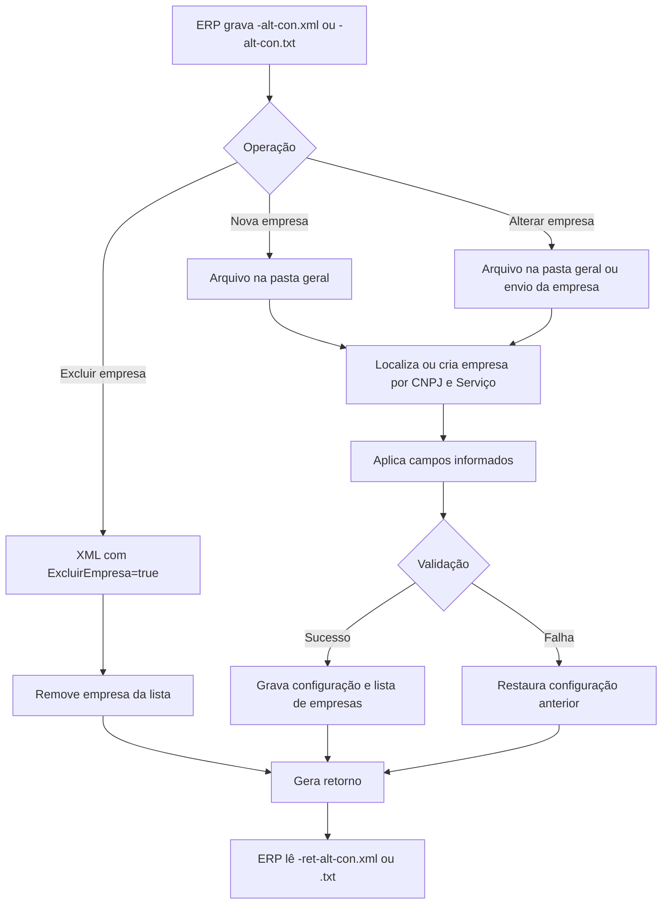

# Configuração automática do UniNFe por arquivo

O UniNFe permite que o ERP crie, altere ou exclua configurações por troca de arquivos, sem intervenção manual na tela de configurações.

Esse recurso é útil para instaladores, rotinas de implantação, suporte remoto e ERPs que precisam configurar empresas automaticamente após instalar o UniNFe.

O serviço usa arquivos com final:

- `-alt-con.xml`;
- `-alt-con.txt`.

## Quando usar

Use este recurso quando:

- o ERP precisa cadastrar uma nova empresa no UniNFe;
- o ERP precisa alterar pastas, certificado, ambiente, UF ou parâmetros de integração de uma empresa já cadastrada;
- o suporte precisa aplicar configuração padronizada em uma instalação;
- o ERP precisa atualizar configurações gerais, como proxy e senha de configuração;
- o ERP precisa excluir uma empresa cadastrada no UniNFe.

## Onde gravar o arquivo

Para incluir uma nova empresa, grave o arquivo na pasta geral do UniNFe:

```text
Geral
```

O retorno será gravado em:

```text
Geral\Retorno
```

Para alterar uma empresa já cadastrada, o arquivo pode ser gravado na pasta geral ou na pasta de envio da própria empresa. Quando o arquivo é processado pela pasta de envio da empresa, o retorno é gravado na pasta de retorno dessa empresa.

## Envio em XML

Para configurar o UniNFe em XML, gere um arquivo com o final:

```text
<identificador>-alt-con.xml
```

Exemplo:

```text
uninfe-alt-con.xml
```

Estrutura básica:

```xml
<?xml version="1.0" encoding="utf-8"?>
<altConfUniNFe>
  <DadosEmpresa CNPJ="06117473000150" Servico="0">
    <Nome>Unimake</Nome>
  </DadosEmpresa>
  <PastaXmlEnvio>c:\testenfe\envio</PastaXmlEnvio>
  <PastaXmlRetorno>c:\testenfe\retorno</PastaXmlRetorno>
  <PastaXmlEnviado>c:\testenfe\enviados</PastaXmlEnviado>
  <PastaXmlErro>c:\testenfe\erro</PastaXmlErro>
  <PastaBackup>c:\testenfe\backup</PastaBackup>
  <UnidadeFederativaCodigo>41</UnidadeFederativaCodigo>
  <AmbienteCodigo>2</AmbienteCodigo>
  <tpEmis>1</tpEmis>
</altConfUniNFe>
```

A tag raiz deve ser `altConfUniNFe`.

Para cadastrar ou localizar a empresa, informe `DadosEmpresa` com:

| Campo | Como preencher |
|---|---|
| `CNPJ` | CNPJ, CPF ou identificador cadastral da empresa, conforme usado no UniNFe. |
| `Servico` | Código ou nome do serviço que identifica o tipo de aplicação da empresa. |
| `Nome` | Nome exibido para a empresa no UniNFe. |

As demais tags são opcionais. Informe apenas os campos que deseja criar ou alterar.

## Envio em TXT

Para configurar o UniNFe em TXT, gere um arquivo com o final:

```text
<identificador>-alt-con.txt
```

Exemplo:

```text
uninfe-alt-con.txt
```

Estrutura básica:

```text
CNPJ|06117473000150
Servico|0
Nome|Unimake
PastaXmlEnvio|c:\testenfe\envio
PastaXmlRetorno|c:\testenfe\retorno
PastaXmlEnviado|c:\testenfe\enviados
PastaXmlErro|c:\testenfe\erro
PastaBackup|c:\testenfe\backup
UnidadeFederativaCodigo|41
AmbienteCodigo|2
tpEmis|1
```

No formato TXT, cada linha deve seguir o padrão:

```text
Campo|Valor
```

## Inclusão de nova empresa

Para incluir uma nova empresa:

1. Grave o arquivo `-alt-con.xml` ou `-alt-con.txt` na pasta geral.
2. Informe `CNPJ`, `Nome` e `Servico`.
3. Informe as pastas de trabalho necessárias.
4. Informe ambiente, UF, tipo de emissão e certificado quando o serviço exigir certificado.
5. Aguarde o retorno `-ret-alt-con.xml` ou `-ret-alt-con.txt`.

Se a empresa ainda não existir para o `CNPJ` e `Servico` informados, o UniNFe cria o cadastro e aplica as configurações recebidas.

## Alteração de empresa existente

Para alterar uma empresa já cadastrada:

1. Grave o arquivo na pasta geral ou na pasta de envio da empresa.
2. Informe o mesmo `CNPJ` e `Servico` da empresa que será alterada.
3. Informe somente as tags que deseja alterar.
4. Aguarde o retorno na pasta correspondente.

Quando o arquivo é processado pela pasta de envio da empresa, o retorno é gravado na pasta de retorno da própria empresa.

## Exclusão de empresa

Para excluir uma empresa, use XML com `ExcluirEmpresa` dentro de `DadosEmpresa`:

```xml
<?xml version="1.0" encoding="utf-8"?>
<altConfUniNFe>
  <DadosEmpresa CNPJ="01761135000132" Servico="10">
    <Nome>Unimake</Nome>
    <ExcluirEmpresa>true</ExcluirEmpresa>
  </DadosEmpresa>
</altConfUniNFe>
```

Quando a empresa é localizada, ela é removida da lista de empresas cadastradas e o retorno informa sucesso.

## Campos de configuração mais usados

| Campo | Finalidade |
|---|---|
| `PastaXmlEnvio` | Pasta monitorada para arquivos de envio da empresa. |
| `PastaXmlRetorno` | Pasta onde o UniNFe grava retornos para o ERP. |
| `PastaXmlEnviado` | Pasta onde o UniNFe organiza XMLs enviados e processados. |
| `PastaXmlErro` | Pasta usada para XMLs com erro. |
| `PastaBackup` | Pasta de backup. |
| `PastaXmlEmLote` | Pasta de envio em lote para NFe. |
| `PastaValidar` | Pasta usada para validação de XML. |
| `PastaDownloadNFeDest` | Pasta usada para download de documentos destinados, quando aplicável. |
| `UnidadeFederativaCodigo` | Código da UF da empresa. |
| `AmbienteCodigo` | Ambiente: produção ou homologação. |
| `tpEmis` | Tipo de emissão fiscal. |
| `UsaCertificado` | Indica se a empresa usa certificado digital. |
| `CertificadoInstalado` | Indica se o certificado está instalado no Windows. |
| `CertificadoDigitalThumbPrint` | ThumbPrint ou número de série do certificado instalado. |
| `CertificadoArquivo` | Caminho do certificado A1 em arquivo. |
| `CertificadoSenha` | Senha do certificado A1. |
| `CertificadoPIN` | PIN usado para certificado A3, quando aplicável. |
| `CriaPastasAutomaticamente` | Indica se o UniNFe deve criar pastas configuradas automaticamente. |
| `TempoConsulta` | Tempo usado em consultas automáticas de recibo. |
| `GravarRetornoTXTNFe` | Indica se retornos da NFe também devem ser gravados em TXT. |
| `IndSinc` | Indica envio síncrono para NFe quando aplicável. |
| `IndSincNFCe` | Indica envio síncrono para NFCe quando aplicável. |
| `IdentificadorCSC` | Identificador do CSC para NFCe. |
| `TokenCSC` | Token CSC para NFCe. |
| `RespTecCNPJ` | CNPJ do responsável técnico. |
| `RespTecXContato` | Nome do contato do responsável técnico. |
| `RespTecEmail` | E-mail do responsável técnico. |
| `RespTecTelefone` | Telefone do responsável técnico. |
| `RespTecIdCSRT` | Identificador do CSRT. |
| `RespTecCSRT` | Código CSRT. |

## Configurações gerais aceitas

Além das configurações da empresa, o arquivo pode alterar configurações gerais do UniNFe:

| Campo | Finalidade |
|---|---|
| `Proxy` | Habilita ou desabilita proxy. |
| `ProxyServidor` | Servidor do proxy. |
| `ProxyUsuario` | Usuário do proxy. |
| `ProxySenha` | Senha do proxy. |
| `ProxyPorta` | Porta do proxy. |
| `ChecarConexaoInternet` | Habilita verificação de conexão com a internet. |
| `GravarLogOperacaoRealizada` | Habilita gravação de log de operações realizadas. |
| `SenhaConfig` | Define a senha de acesso às configurações do UniNFe. |
| `ChecarCNPJCPFCertificado` | Quando verdadeiro, valida se o CNPJ ou CPF do certificado confere com o cadastro da empresa. |
| `AppID` | Identificador de aplicação usado por integrações que exigem esse dado. |
| `Secret` | Segredo de aplicação usado por integrações que exigem esse dado. |

Quando `Proxy` estiver habilitado, servidor, usuário, senha e porta devem estar preenchidos.

## Códigos do campo Serviço

O campo `Servico` identifica o tipo de aplicação da empresa. Para os serviços já aceitos por código na configuração automática, informe um dos valores abaixo:

| Código | Nome aceito | Serviço |
|---|---|---|
| `0` | `Nfe` | NF-e, NFC-e, GNRE e DARE |
| `1` | `Cte` | CT-e, GNRE e DARE |
| `2` | `Nfse` | NFS-e |
| `3` | `MDFe` | MDF-e |
| `4` | `NFCe` | NFC-e |
| `6` | `EFDReinf` | EFD-Reinf |
| `7` | `eSocial` | eSocial |
| `8` | `EFDReinfeSocial` | EFD-Reinf e eSocial |
| `9` | `GNREeDARE` | GNRE e DARE |
| `10` | `Todos` | Todos os DFe, exceto NFS-e |
| `11` | `NF3e` | NF3-e |
| `12` | `NFCom` | NFCom |
| `13` | `DCe` | DCe |
| `14` | `NFGas` | NFGas |
| `15` | `CIOT` | CIOT |

Também é possível informar o nome do serviço aceito pelo UniNFe. Para `DCe`, `NFGas` e `CIOT`, use o nome do serviço no campo `Servico`.

## Retorno em XML

Quando a entrada é XML, o retorno tem o final:

```text
<identificador>-ret-alt-con.xml
```

Exemplo:

```text
uninfe-ret-alt-con.xml
```

Estrutura:

```xml
<?xml version="1.0" encoding="utf-8"?>
<retAltConfUniNFe>
  <cStat>1</cStat>
  <xMotivo>Configuração do UniNFe alterada com sucesso</xMotivo>
  <CertificadoDigitalThumbPrint>...</CertificadoDigitalThumbPrint>
</retAltConfUniNFe>
```

## Retorno em TXT

Quando a entrada é TXT, o retorno tem o final:

```text
<identificador>-ret-alt-con.txt
```

Exemplo:

```text
uninfe-ret-alt-con.txt
```

Estrutura:

```text
cStat|1
xMotivo|Configuração do UniNFe alterada com sucesso
```

## Códigos de retorno

| `cStat` | Significado | Como tratar |
|---|---|---|
| `1` | Configuração alterada com sucesso ou empresa excluída com sucesso. | O ERP pode considerar a configuração aplicada. |
| `2` | Falha ao alterar a configuração. | Leia `xMotivo`, corrija o arquivo ou ambiente e envie novamente. |

Quando a configuração falha, o UniNFe recarrega as configurações gravadas anteriormente.

## Fluxo operacional

1. O ERP gera `-alt-con.xml` ou `-alt-con.txt`.
2. Para criar nova empresa, grava o arquivo na pasta geral.
3. Para alterar empresa existente, grava o arquivo na pasta geral ou na pasta de envio da empresa.
4. O UniNFe identifica a solicitação pelo final do nome do arquivo.
5. O UniNFe localiza ou cria a empresa pelo `CNPJ` e `Servico`.
6. O UniNFe aplica apenas os campos informados.
7. O UniNFe valida proxy, pastas e certificado quando essas configurações são usadas.
8. O UniNFe grava as configurações e atualiza a lista de empresas.
9. O UniNFe grava o retorno `-ret-alt-con.xml` ou `-ret-alt-con.txt`.
10. O arquivo de solicitação é removido após o processamento.



## Arquivos envolvidos

| Etapa | Pasta | Arquivo | O que significa |
|---|---|---|---|
| Entrada XML | Pasta geral ou pasta de envio da empresa | `<identificador>-alt-con.xml` | Solicitação XML para criar, alterar ou excluir configuração. |
| Entrada TXT | Pasta geral ou pasta de envio da empresa | `<identificador>-alt-con.txt` | Solicitação TXT para criar ou alterar configuração. |
| Retorno XML | `Geral\Retorno` ou pasta de retorno da empresa | `<identificador>-ret-alt-con.xml` | Retorno XML com `cStat`, `xMotivo` e, quando aplicável, `CertificadoDigitalThumbPrint`. |
| Retorno TXT | `Geral\Retorno` ou pasta de retorno da empresa | `<identificador>-ret-alt-con.txt` | Retorno TXT com `cStat` e `xMotivo`. |
| Erro local | Pasta de retorno correspondente | `<identificador>-ret-alt-con.err` | Erro ao gerar o retorno quando não foi possível gravar XML ou TXT. |

## Boas práticas

- Para nova empresa, grave o arquivo na pasta geral.
- Para alteração, prefira gravar na pasta de envio da própria empresa quando ela já existir.
- Informe apenas os campos que deseja alterar.
- Preencha `CNPJ`, `Nome` e `Servico` sempre que o arquivo precisar localizar ou criar uma empresa.
- Use `CriaPastasAutomaticamente` quando desejar que o UniNFe crie as pastas configuradas.
- Ao usar certificado instalado, informe `CertificadoDigitalThumbPrint` ou número de série válido.
- Ao usar certificado A1 em arquivo, informe `CertificadoArquivo` e `CertificadoSenha`.
- Use `ChecarCNPJCPFCertificado` para impedir configuração com certificado de outro CNPJ ou CPF.
- Após receber `cStat` igual a `1`, o ERP pode usar a [consulta de informações do UniNFe](../servicos/uninfe/consulta-informacoes.md) para conferir a configuração aplicada.

## Erros comuns

As causas mais comuns de erro são:

- arquivo de nova empresa gravado fora da pasta geral;
- ausência de `CNPJ`, `Nome` ou `Servico`;
- código de `Servico` inválido;
- pasta configurada inexistente quando `CriaPastasAutomaticamente` não está habilitado;
- proxy habilitado sem servidor, usuário, senha ou porta;
- certificado instalado não localizado no repositório do Windows;
- certificado A1 com caminho ou senha inválidos;
- CNPJ ou CPF do certificado diferente do cadastro quando `ChecarCNPJCPFCertificado` está habilitado;
- falta de permissão para gravar arquivos de configuração ou retorno.
