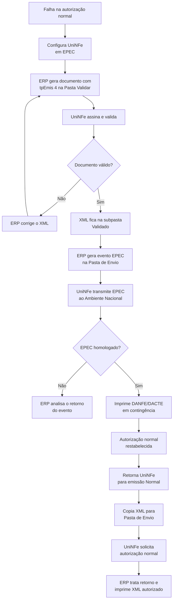

# Contingência EPEC

EPEC significa Evento Prévio de Emissão em Contingência. Nesta modalidade, o XML do documento fiscal é validado localmente e um evento EPEC é transmitido ao Ambiente Nacional. Depois da homologação do evento, o documento auxiliar pode ser impresso em contingência. Quando a autorização normal voltar, o XML original do documento deve ser enviado para autorização.

## Documentos atendidos

- NF-e;
- NFC-e, atualmente para o Estado de São Paulo;
- CT-e.

O documento fiscal deve ser gerado com `tpEmis` igual a `4`.

## Antes de iniciar

1. Altere o **Tipo de Emissão** da empresa no UniNFe para **EPEC**, pela tela de configurações ou pela configuração automática integrada ao ERP.
2. Garanta que o ERP consiga gerar tanto o XML do documento fiscal quanto o XML do evento EPEC correspondente.
3. Use o mesmo ambiente configurado para a empresa e mantenha o certificado digital disponível para os envios.

## Procedimento no UniNFe

1. Gere a NF-e, NFC-e ou CT-e com `tpEmis` igual a `4` na **Pasta Validar**. O UniNFe valida o XML e, se estiver correto, o mantém em `Pasta Validar\Validado`.
2. Gere o XML do evento EPEC na **Pasta de Envio**. O evento deve referenciar a chave de acesso do documento gerado em contingência.
3. Acompanhe o retorno do evento. Só prossiga com a impressão quando o EPEC tiver sido homologado.
4. Imprima o DANFE ou DACTE de contingência a partir do XML validado. Para a impressão pelo UniDANFe, informe também o XML de distribuição do evento EPEC retornado pelo UniNFe.
5. Quando a autorização normal for restabelecida, retorne o **Tipo de Emissão** da empresa para **Normal**.
6. Copie os XMLs de documentos que permanecem em `Validado` para a Pasta de Envio, sem alterar o `tpEmis` nem a chave de acesso.
7. Trate os retornos da autorização posterior como no fluxo regular. Após a autorização, imprima o DANFE ou DACTE do XML autorizado para encaminhamento ao destinatário, conforme a exigência fiscal.

## Fluxo operacional

## Cuidados importantes

- A homologação do EPEC não substitui a autorização de uso do documento fiscal. A NF-e, NFC-e ou CT-e continua pendente de autorização até o envio posterior.
- O evento EPEC e o documento fiscal devem se referir à mesma chave de acesso de contingência. Não gere outro XML com numeração ou chave diferente para concluir a mesma operação.
- Para evitar rejeições, aguarde a sincronização do evento antes de reenviar o documento para autorização quando o ambiente normal retornar.
- Não tente cancelar uma operação apenas com o EPEC. Primeiro conclua a autorização do documento e, depois, siga o procedimento de cancelamento aplicável.
- Conserve os retornos do evento e da autorização, pois eles comprovam as etapas da emissão em contingência.

Para o formato e o envio de eventos, consulte [Eventos de NFe e NFCe por arquivo](../servicos/nfe/eventos.md). Para a autorização posterior, consulte [Autorização de NFe e NFCe por arquivo](../servicos/nfe/autorizacao.md).
