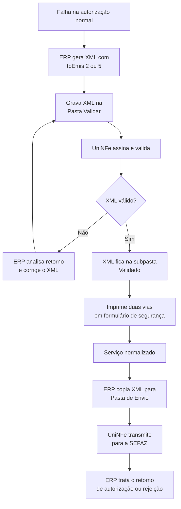

# Contingência em formulário de segurança

Use esta modalidade quando a autorização normal não estiver disponível e a empresa precisar emitir o documento com formulário de segurança. No UniNFe, o ERP primeiro envia o XML somente para validação; a transmissão para a SEFAZ ocorre depois, quando o serviço for restabelecido.

## Documentos atendidos

- NF-e;
- CT-e;
- MDF-e.

## Preparação do XML

O ERP deve gerar o XML do documento com a modalidade de emissão correta:

| Modalidade | Valor de `tpEmis` |
|---|---:|
| Formulário de Segurança (FS) | `2` |
| Formulário de Segurança para impressão de Documento Auxiliar (FS-DA) | `5` |

O XML precisa conter a justificativa e a data/hora de entrada em contingência quando essas informações forem exigidas pelo leiaute do documento fiscal. O tipo de emissão também faz parte da identificação fiscal do documento; portanto, não altere o XML validado antes da transmissão posterior.

## Procedimento no UniNFe

1. Gere o XML na **Pasta Validar** configurada para a empresa, e não na Pasta de Envio.
2. O UniNFe assina e valida o arquivo. Acompanhe o retorno de validação para confirmar que o XML está estruturalmente correto.
3. Quando a validação for concluída, o XML fica disponível na subpasta `Validado` da Pasta Validar. Não o mova nem o altere enquanto estiver em contingência.
4. Imprima o DANFE, DACTE ou DAMDFE a partir do XML validado, em duas vias, usando o formulário de segurança aplicável. O documento auxiliar deve evidenciar a emissão em contingência.
5. Após a normalização do serviço autorizador, copie os XMLs que permanecem em `Validado` para a Pasta de Envio.
6. O UniNFe transmite os documentos para a SEFAZ e grava os retornos nas pastas configuradas. O ERP deve ler esses retornos e atualizar a situação de cada documento.

## Fluxo operacional

## Cuidados importantes

- A validação no UniNFe não equivale à autorização de uso pela SEFAZ. O documento só estará autorizado após a transmissão posterior e o retorno correspondente.
- Imprima a via de contingência somente a partir do XML que passou pela validação.
- Antes de considerar a contingência encerrada, confirme que todos os XMLs em `Validado` foram enviados e que cada um recebeu o retorno fiscal esperado.
- A adoção de FS ou FS-DA, inclusive o papel utilizado e a guarda das vias, deve observar a legislação aplicável ao documento e à UF.

Para o fluxo regular de envio e leitura dos retornos, consulte [Autorização de NFe e NFCe por arquivo](../servicos/nfe/autorizacao.md).
