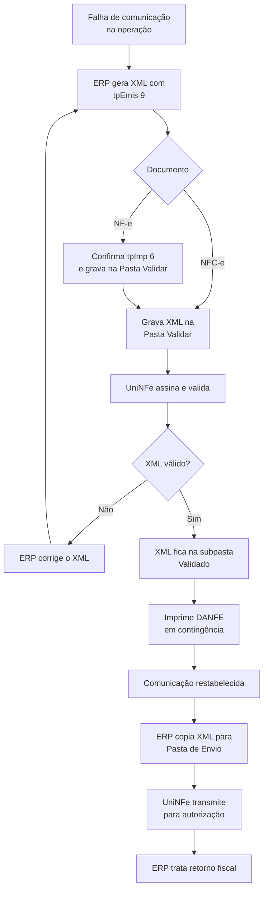

# Contingência Off-line

A contingência Off-line permite emitir uma NFC-e ou uma NF-e com DANFE Simplificado Tipo 2 quando não for possível obter a autorização no momento da operação. O UniNFe valida o XML localmente; o envio para autorização acontece depois que a comunicação for restabelecida.

## Documentos atendidos e campos obrigatórios

Em ambos os casos, informe `tpEmis` igual a `9`:

| Documento | Modelo | `tpImp` | Documento auxiliar |
|---|---:|---:|---|
| NFC-e | `65` | Conforme o leiaute de NFC-e | DANFE NFC-e em contingência |
| NF-e | `55` | `6` | DANFE Simplificado Tipo 2 em contingência |

Para NF-e, a contingência Off-line descrita nesta página depende de `tpImp` igual a `6`, que identifica o DANFE Simplificado Tipo 2. Não use esta modalidade para uma NF-e com outro tipo de impressão.

## Procedimento no UniNFe

1. Gere o XML da NFC-e ou da NF-e com `tpEmis` igual a `9` e grave-o na **Pasta Validar** configurada para a empresa, em vez da Pasta de Envio.
2. Para NF-e, informe também `tpImp` igual a `6`. Verifique se o XML corresponde ao DANFE Simplificado Tipo 2 antes de gravá-lo na Pasta Validar.
3. O UniNFe assina e valida o XML. Verifique o retorno da validação; se houver falha, corrija o documento e gere outro arquivo.
4. Quando válido, o XML permanece na subpasta `Validado` da Pasta Validar.
5. Imprima o DANFE correspondente a partir desse XML: DANFE NFC-e para modelo `65` ou DANFE Simplificado Tipo 2 para NF-e modelo `55`. A impressão deve indicar a emissão em contingência.
6. Ao restabelecer a comunicação com a SEFAZ, copie os XMLs da subpasta `Validado` para a Pasta de Envio.
7. O UniNFe transmite os XMLs e grava os retornos. O ERP deve tratar autorização, rejeição e falhas de comunicação como faz no envio regular.

## Fluxo operacional

## O que não fazer durante a contingência

Nesta modalidade, o fluxo imediato é apenas de emissão do documento fiscal. Não tente usar a contingência Off-line para cancelar ou inutilizar documentos. Esses procedimentos dependem da comunicação com a SEFAZ e devem ser executados quando o ambiente estiver disponível, observando as regras fiscais aplicáveis.

## Cuidados importantes

- A NFC-e ou NF-e validada localmente ainda não está autorizada. O XML precisa ser transmitido depois para obter a autorização de uso.
- Preserve a chave de acesso e o XML original ao transferir o arquivo da Pasta Validar para a Pasta de Envio.
- Para NF-e, confira simultaneamente `tpEmis=9` e `tpImp=6`; a combinação identifica a emissão com DANFE Simplificado Tipo 2 em contingência.
- Transmita os documentos emitidos em contingência dentro do prazo definido pela legislação da UF do emitente. O prazo pode variar; confirme-o sempre na orientação fiscal vigente da sua SEFAZ.
- Confirme que não restaram documentos pendentes na subpasta `Validado` antes de encerrar a ocorrência.

Para detalhes do envio posterior, consulte [Autorização de NFe e NFCe por arquivo](../servicos/nfe/autorizacao.md).
