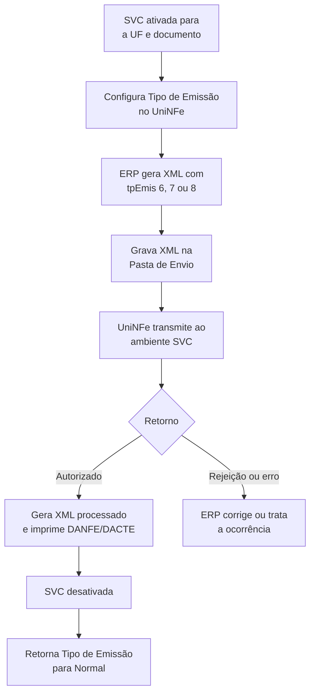

# Contingência SVC (RS, AN e SP)

SVC é a modalidade em que o documento continua sendo transmitido e autorizado por um ambiente virtual de contingência. No UniNFe, o fluxo de arquivos é o mesmo da emissão normal: o ERP grava o XML na Pasta de Envio e trata os retornos normalmente. A diferença é o tipo de emissão informado no XML e configurado para a empresa.

## Modalidades e documentos atendidos

| Modalidade | Valor de `tpEmis` | Documentos atendidos |
|---|---:|---|
| SVC-AN | `6` | NF-e |
| SVC-RS | `7` | NF-e e CT-e |
| SVC-SP | `8` | CT-e |

A SVC deve ser usada quando estiver disponibilizada para a UF e para o documento. A escolha entre AN, RS e SP não é livre: siga a ativação e as orientações divulgadas pela administração tributária.

## Como configurar e operar

1. Na configuração da empresa no UniNFe, altere **Tipo de Emissão** para SVC-AN, SVC-RS ou SVC-SP. A alteração pode ser feita pela tela de configurações ou pela integração de configuração automática do ERP.
2. Gere a NF-e ou o CT-e normalmente na Pasta de Envio, com a tag `tpEmis` igual a `6`, `7` ou `8`, de acordo com a SVC adotada.
3. Mantenha o mesmo contrato de arquivo do envio regular, por exemplo `<chave>-nfe.xml` para NF-e.
4. Aguarde e trate o retorno de autorização, rejeição ou erro como no fluxo normal.
5. Após a autorização, imprima o DANFE ou DACTE em papel comum.
6. Quando a SVC for desativada, retorne o **Tipo de Emissão** do UniNFe para **Normal** antes dos próximos documentos que serão autorizados no ambiente normal.

## Fluxo operacional

## Serviços posteriores

Enquanto a modalidade estiver ativa, os serviços relacionados ao documento também continuam disponíveis no UniNFe, como cancelamento, carta de correção, consulta de situação e consulta de status. Use os arquivos e retornos desses serviços conforme as páginas específicas da documentação.

## Cuidados importantes

- SVC não é uma validação local nem uma autorização posterior: a autorização é obtida no ambiente SVC durante o envio.
- Não mantenha a empresa configurada em SVC após a normalização sem necessidade; ajuste o Tipo de Emissão antes de retomar a emissão normal.
- Confirme o retorno de autorização antes de liberar a impressão do documento auxiliar como autorizado.
- Para a NF-e, consulte também [Autorização de NFe e NFCe por arquivo](../servicos/nfe/autorizacao.md); para CT-e, use a documentação de autorização aplicável ao seu fluxo.
