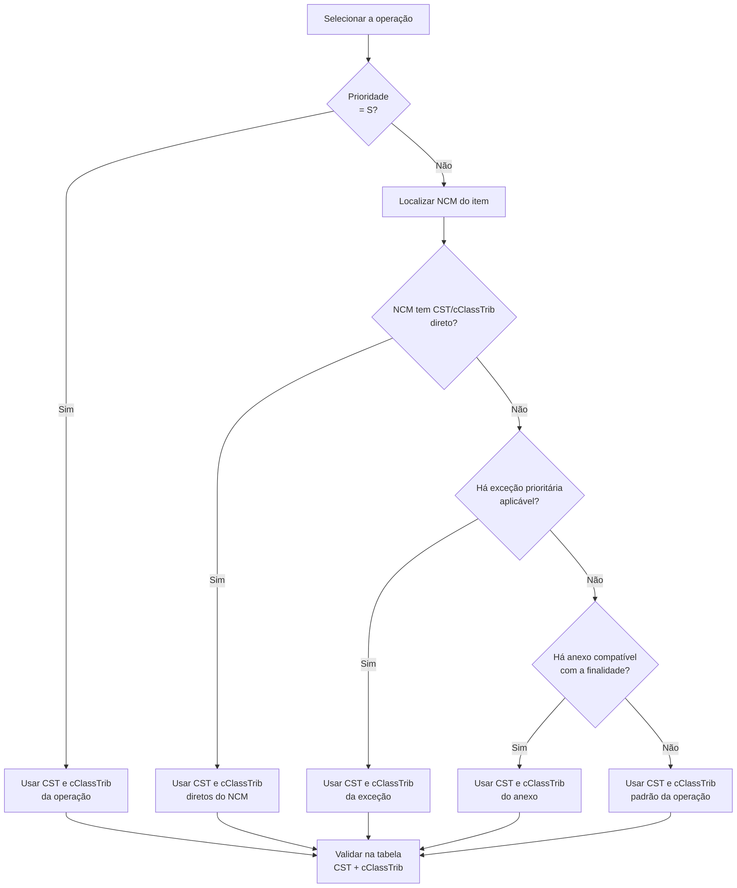

# Reforma Tributária - NFe/NFCe

Este manual orienta a classificação IBS/CBS de itens de NFe e NFCe com as tabelas disponibilizadas pela Unimake.

**Versão de referência:** arquivos disponibilizados pela Unimake e consultados em 21/07/2026.  
**Objetivo:** selecionar, para cada item do documento fiscal, o par correto `CST` + `cClassTrib` de IBS/CBS e usar as tabelas como fonte de validação e rastreabilidade legal.

## 1. Visão geral

As cinco tabelas não são alternativas: elas se complementam.

| Tabela | Papel na solução |
| --- | --- |
| [Tabela de Operações](https://www.unimake.com.br/downloads/Tabela_Operacao.json) | Ponto de partida. Classifica a natureza da operação e fornece o enquadramento padrão ou prioritário. |
| [Tabela NCM](https://www.unimake.com.br/downloads/tabela_ncm.json) | Identifica o produto e aponta enquadramento direto, anexos ordinários e exceções legais prioritárias. |
| [Tabela de Anexos da LC 214](https://www.unimake.com.br/downloads/tabela_anexos_lc214.json) | Catálogo descritivo dos Anexos I a XV. É usado para interpretar a finalidade de cada anexo apontado pelo NCM; não contém a regra de seleção por si só. |
| [Tabela CST IBS/CBS](https://www.unimake.com.br/downloads/tabela_cst_ibscbs.json) | Define a situação tributária e quais grupos técnicos do leiaute podem/devem ser preenchidos para cada CST. |
| [Tabela CST e cClassTrib IBS/CBS](https://www.unimake.com.br/downloads/tabela_cst_classtrib_ibscbs.json) | Fonte final e oficial da combinação válida `CST` + `cClassTrib`, vigência, fundamento legal, percentuais de redução e compatibilidade com cada DF-e. |

O `cClassTrib` detalha a hipótese legal e o seu prefixo de três posições deve corresponder ao `CST`. Exemplo: `200035` pertence ao CST `200`.

> Importante: NCM sozinho não prova o benefício. Quando o mesmo NCM aparece em mais de um anexo, ou possui exceção, a finalidade e as condições materiais da operação devem ser conhecidas pelo ERP e validadas pelo responsável fiscal.

## 2. Relação entre as tabelas



### Precedência de seleção

1. **Operação com `Prioridade = "S"`**: use o `CST` e o `cClassTrib` da própria operação. Não consulte NCM, anexos ou exceções para substituir essa classificação.
2. **Operação com `Prioridade = "N"`**: consulte o NCM do item.
3. Se o NCM possuir `CST` e `cClassTrib` diretamente no nível do NCM, eles prevalecem. Na versão analisada, esses registros não convivem com `Anexos_excecao_prioritaria` no mesmo NCM.
4. Se não houver classificação direta, verifique `Anexos_excecao_prioritaria`. Havendo exceção aplicável às condições reais do item/operação, use-a antes dos anexos ordinários.
5. Se não houver exceção aplicável, escolha em `Anexos` o anexo cuja finalidade legal corresponda ao uso efetivo do bem ou serviço.
6. Não existindo anexo aplicável, mantenha o `CST` e o `cClassTrib` padrão da operação.
7. Por fim, valide a combinação escolhida nas tabelas de CST e de cClassTrib, inclusive vigência, documento fiscal e grupos do XML.

`Finalidade` é uma informação de negócio/fiscal que **não está codificada como campo próprio** em nenhuma das cinco tabelas. A aplicação deve obtê-la da parametrização da operação, do cadastro do item, de informações complementares ou de uma regra fiscal. Não é seguro escolher simplesmente o primeiro anexo retornado pelo NCM.

## 3. Algoritmo de referência

```text
operacao = localizar Tabela_Operacao pelo Codigo

se operacao.Prioridade == "S":
    resultado = (operacao.CST, operacao.cClassTrib)
senão:
    ncm = localizar Tabela_NCM.Nomenclaturas pelo Codigo do item

    se ncm possui CST e cClassTrib diretos:
        resultado = (ncm.CST, ncm.cClassTrib)
    senão:
        excecao = localizar em ncm.Anexos_excecao_prioritaria
                  a regra cuja hipótese legal seja efetivamente atendida
        se excecao encontrada:
            resultado = (excecao.CST, excecao.cClassTrib)
        senão:
            anexo = localizar em ncm.Anexos o anexo compatível com a finalidade fiscal
            se anexo encontrado:
                resultado = (anexo.CST, anexo.cClassTrib)
            senão:
                resultado = (operacao.CST, operacao.cClassTrib)

validar que (resultado.CST, resultado.cClassTrib) exista na tabela CST/cClassTrib;
validar vigência, DF-e e indicadores de grupos do leiaute;
se operacao.CodCredPresumido não estiver vazio, validar também na tabela específica cCredPres.
```

## 4. Tabela de Operações — `Tabela_Operacao.json`

É a tabela inicial. O usuário ou a regra de negócio seleciona uma linha por seu `Codigo`; a tabela não substitui a análise da situação concreta quando a operação não é prioritária.

| Campo | Para que serve | Como usar |
| --- | --- | --- |
| `Codigo` | Identificador da operação na tabela. | Chave de pesquisa. Deve ser guardado na parametrização da operação do ERP. Ex.: `00100` = venda de produção própria ou de terceiros. |
| `Descricao` | Nome legível da natureza da operação. | Apresentar ao usuário e usar como apoio à configuração; não deve ser usada como chave técnica. |
| `CST` | CST IBS/CBS padrão ou prioritário da operação. | Use junto com o `cClassTrib` da mesma linha. Nunca use isoladamente para definir toda a tributação. |
| `cClassTrib` | Classificação tributária padrão ou prioritária. | É o resultado quando `Prioridade = S` ou o fallback quando o NCM não produzir regra aplicável. |
| `Prioridade` | Define se a classificação da operação encerra a decisão. | `S`: a dupla `CST`/`cClassTrib` da operação prevalece e a pesquisa de NCM/anexos é ignorada. `N`: permite a especialização pelo NCM. |
| `CodCredPresumido` | Código de crédito presumido associado à operação, quando houver. | Se preenchido, deve ser validado na tabela própria de crédito presumido (`cCredPres`), que não integra este conjunto de cinco arquivos. Não presuma que todo item terá crédito. |
| `Atualizar` | Indicador operacional de atualização/manutenção da regra da operação. | Na versão analisada, todas as linhas trazem `True`. Trate-o como metadado de controle da tabela; ele não altera a precedência do `cClassTrib`. |
| `EmergenciaNacional` | Marca uma operação relacionada a hipótese de emergência nacional. | Campo de apoio à regra de negócio. Está `False` em todas as linhas atuais; se vier `True` em atualização futura, a regra correspondente deve ser revisada à luz da legislação e do leiaute vigente. |
| `Doacao` | Sinaliza operação de doação/amostra gratuita. | Permite distinguir a operação que demanda o tratamento fiscal próprio de doação. Ex.: operação `00920` possui `True`. |
| `modalidadeOperacao` | Caracteriza a onerosidade e a tributação da operação. | Informação para a regra de negócio e conferência: `1-Onerosa e Tributada`, `2-Onerosa e Não Tributada` ou `3-Não onerosa e Não Tributada`. Não substitui `CST`/`cClassTrib`. |

## 5. Tabela NCM — `tabela_ncm.json`

O arquivo possui um cabeçalho e o vetor `Nomenclaturas`. Há registros hierárquicos de capítulo, posição, subposição e NCM completo; para a tributação do item, a pesquisa deve usar o código NCM efetivamente informado, respeitando pontuação e vigência.

### 5.1 Campos de cabeçalho

| Campo | Para que serve | Como usar |
| --- | --- | --- |
| `Data_Ultima_Atualizacao_NCM` | Informação de vigência/atualização global da NCM usada no arquivo. | Registrar na auditoria da carga e comparar com versões posteriores. |
| `Ato` | Ato normativo de referência da nomenclatura. | Dado documental; não participa da escolha de `cClassTrib`. |
| `Nomenclaturas` | Lista de registros NCM e seus vínculos fiscais. | Coleção a ser indexada por `Codigo`. |

### 5.2 Campos do registro em `Nomenclaturas`

| Campo | Para que serve | Como usar |
| --- | --- | --- |
| `Codigo` | Código NCM, inclusive registros de níveis hierárquicos. | Chave de busca do produto. Para a regra fiscal, prefira o NCM completo/cadastrado no item. |
| `Descricao` | Descrição oficial da classificação NCM. | Apoia a conferência da classificação do produto; não dispensa a análise da mercadoria real. Pode conter marcação HTML. |
| `Data_Inicio` | Data inicial de vigência da linha NCM. | Use para validar o NCM na data de emissão. |
| `Data_Fim` | Data final de vigência da linha NCM. | Use para encerrar a validade; `31/12/9999` representa vigência aberta no arquivo. |
| `Tipo_Ato` | Tipo do ato que instituiu/alterou a nomenclatura. | Metadado de rastreabilidade da NCM. |
| `Numero_Ato` | Número do ato normativo da NCM. | Usado com `Tipo_Ato` e `Ano_Ato` para auditoria. |
| `Ano_Ato` | Ano do ato normativo da NCM. | Complementa a identificação do ato. |
| `CST` | CST IBS/CBS atribuído diretamente ao NCM, quando existente. | Se a operação não for prioritária e o NCM também possuir `cClassTrib`, esta é a classificação direta do NCM. |
| `cClassTrib` | cClassTrib atribuído diretamente ao NCM, quando existente. | Deve ser usado sempre com o `CST` direto. Exemplo atual: determinados combustíveis têm classificação monofásica direta. |
| `Anexos` | Lista de anexos ordinários da LC 214 associados ao NCM. | Use somente se não houver regra direta nem exceção aplicável. Pode conter mais de um anexo; escolha pela finalidade legal. |
| `Anexos_excecao_prioritaria` | Lista de hipóteses legais específicas que prevalecem sobre anexos ordinários quando suas condições forem atendidas. | Não usar apenas porque existe no NCM: confirmar a hipótese material do artigo. Havendo aderência, usar o `CST`/`cClassTrib` da exceção. |

### 5.3 Objeto de anexo ordinário — `Anexos[]`

| Campo | Para que serve | Como usar |
| --- | --- | --- |
| `Legislacao` | Identifica a legislação da regra. | Atualmente aponta `LC 214/2025`; valida a origem do vínculo. |
| `Anexo` | Número romano do Anexo da LC 214. | Chave de ligação com `tabela_anexos_lc214.json.Anexo`. É também a referência para verificar a finalidade descrita. |
| `CST` | CST aplicável àquele NCM quando enquadrado no anexo. | Use com o `cClassTrib` da mesma entrada do vetor. |
| `cClassTrib` | Classificação tributária aplicável ao anexo. | É o resultado da seleção do anexo compatível com a finalidade. |

### 5.4 Objeto de exceção — `Anexos_excecao_prioritaria[]`

| Campo | Para que serve | Como usar |
| --- | --- | --- |
| `Legislacao` | Legislação da hipótese excepcional. | Confirma a origem legal, atualmente `LC 214/2025`. |
| `Artigo` | Artigo da LC 214 que descreve a situação específica. | Chave jurídica da exceção; deve ser confrontado com as condições reais da operação. |
| `CST` | CST da exceção. | Use somente se a hipótese do artigo for satisfeita. |
| `cClassTrib` | cClassTrib da exceção. | Substitui o resultado de anexos ordinários quando a exceção for aplicável. |

### 5.5 Por que a exceção existe

O NCM `9619.00.00` demonstra bem a diferença: ele aparece no Anexo VIII com `200035` (produtos de higiene e limpeza com redução de 60%), mas também possui exceção do art. 147 com `200013` para tampões, absorventes internos/externos, calcinhas absorventes e coletores menstruais, com redução de 100%. Portanto, não se deve usar automaticamente `200035` para todo produto daquela NCM.

Outro exemplo é o NCM `3004.20.59`, que pode apontar Anexo XIV, Anexo IX e exceção do art. 133. A classificação depende de a mercadoria atender, ou não, às condições do medicamento registrado/manipulado e da hipótese de alíquota zero. A presença de múltiplos vínculos é justamente o sinal de que a regra precisa da finalidade e das condições legais, além do NCM.

## 6. Tabela de anexos da LC 214 — `tabela_anexos_lc214.json`

Esta tabela é descritiva. Ela não traz NCM, CST ou `cClassTrib`; a ligação é feita por `NCM.Anexos[].Anexo` = `Anexo` desta tabela.

| Campo | Para que serve | Como usar |
| --- | --- | --- |
| `ID` | Identificador interno sequencial do anexo. | Pode ser usado como chave interna de armazenamento; a ligação fiscal principal é pelo campo `Anexo`. |
| `Ativo` | Situação do anexo no catálogo. | Considere `S` como ativo. Preserve a checagem para futuras versões que tragam anexos desativados. |
| `Legislacao` | Norma à qual o anexo pertence. | Atualmente `LC 214/2025`. |
| `Anexo` | Número romano do Anexo. | Chave para relacionar com `NCM.Anexos[].Anexo` e com a coluna `ANEXO` da tabela de cClassTrib quando esta trouxer o número do anexo. |
| `Descricao` | Finalidade e tratamento geral previstos no anexo. | É a referência para decidir se o uso concreto se enquadra no anexo: cesta básica, educação, saúde, dispositivos médicos, insumos agropecuários, medicamentos, entre outros. |

## 7. Tabela CST IBS/CBS — `tabela_cst_ibscbs.json`

Esta tabela tem 18 CSTs e é técnica: seus indicadores controlam grupos do XML/DF-e. Em regra, `1` indica que o grupo é aplicável/exigível conforme o leiaute e `0` que não é aplicável. A Nota Técnica e o schema do documento continuam sendo a referência final da obrigatoriedade.

| Campo | Para que serve | Como usar |
| --- | --- | --- |
| `CST` | Código de Situação Tributária do IBS/CBS. | Chave da tabela. Validar que corresponde aos três primeiros dígitos do `cClassTrib` selecionado. |
| `Descricao` | Significado do CST. | Exibir para conferência fiscal, como tributação integral, alíquota reduzida, isenção, monofásica, diferimento etc. |
| `ind_gIBSCBS` | Indicador do grupo regular de IBS/CBS. | Use para controlar o grupo `gIBSCBS` do leiaute. |
| `ind_gIBSCBSMono` | Indicador do grupo de tributação monofásica. | Use para controlar `gIBSCBSMono` quando o CST for monofásico. |
| `ind_gRed` | Indicador do grupo de redução de alíquota. | Use para controlar o grupo de redução correspondente. |
| `ind_gDif` | Indicador do grupo de diferimento. | Use para controlar o grupo de diferimento. |
| `ind_gTransfCred` | Indicador do grupo de transferência de crédito. | Use para controlar o grupo de transferência de crédito. |
| `ind_gCredPresIBSZFM` | Indicador do grupo de crédito presumido de IBS na Zona Franca de Manaus. | Use apenas nas hipóteses compatíveis com ZFM. |
| `ind_gAjusteCompet` | Indicador do grupo de ajuste de competência. | Use para controlar o grupo de ajuste de competência, quando previsto pelo leiaute. |
| `ind_RedutorBC` | Indicador do redutor de base de cálculo. | Use para controlar o grupo/campo de redução da base de cálculo. |
| `DataAtualizacao` | Data de atualização daquela linha CST. | Armazenar para auditoria e recarga de tabelas. |

## 8. Tabela CST e cClassTrib — `tabela_cst_classtrib_ibscbs.json`

É a tabela de validação final. Depois da seleção, procure a linha cujo `CST` e `cClassTrib` sejam exatamente os escolhidos. A linha informa fundamento, vigência, redução e capacidade técnica do DF-e.

### 8.1 Identificação, descrição e base legal

| Campo | Para que serve | Como usar |
| --- | --- | --- |
| `CST` | CST IBS/CBS da classificação. | Deve ser igual ao CST escolhido e ao prefixo de `cClassTrib`. |
| `Descricao_CST` | Descrição do CST da linha. | Conferência humana do CST. |
| `cClassTrib` | Código de Classificação Tributária do IBS/CBS. | Chave de resultado do processo e valor a informar no DF-e. |
| `Nome_cClassTrib` | Nome curto da classificação. | Exibição em telas, logs e cadastros. |
| `Descricao_cClassTrib` | Descrição completa da hipótese tributária. | Principal apoio para conferir o enquadramento material da operação. |
| `LC_214_25` | Referência resumida ao dispositivo da LC 214/2025. | Usar para rastreabilidade jurídica e consulta fiscal. |
| `LC_Redacao` | Redação legal armazenada na tabela. | Apoio documental; não dispense a consulta à versão vigente da lei. |
| `ANEXO` | Identificação de anexo ligado à classificação. | Pode ser o número romano do anexo ou um identificador técnico no formato `9XXXY`; não confundir o identificador técnico com o Anexo I a XV. |
| `Link` | URL para o dispositivo legal de referência. | Use em telas de consulta e auditoria. |
| `Regulamento_CBS` | Referência/redação do regulamento da CBS, quando existente. | Complementa a base legal da CBS. |
| `Regulamento_IBS` | Referência/redação do regulamento do IBS, quando existente. | Complementa a base legal do IBS. |

### 8.2 Alíquota, redução e vigência

| Campo | Para que serve | Como usar |
| --- | --- | --- |
| `TipoDeAliquota` | Tipo de alíquota aplicável à classificação. | Usar como informação de cálculo e conferência, juntamente com o leiaute e a legislação. |
| `pRedIBS` | Percentual de redução da alíquota do IBS. | Aplicar somente quando a classificação e o leiaute exigirem a redução; exemplo: `60` ou `100`. |
| `pRedCBS` | Percentual de redução da alíquota da CBS. | Mesma regra de `pRedIBS`, para CBS. |
| `dIniVig` | Início de vigência do `cClassTrib`. | A classificação só pode ser usada em documentos emitidos a partir desta data. |
| `dFimVig` | Fim de vigência do `cClassTrib`. | Vazio significa sem encerramento indicado; se preenchido, não usar depois da data. |
| `DataAtualizacao` | Data da última atualização daquela linha. | Controle de sincronização e auditoria; não substitui `dIniVig`/`dFimVig`. |
| `tpRBSN` | Tipo de receita bruta aplicável ao Simples Nacional. | Use somente nas regras específicas do Simples Nacional, conforme o leiaute e a parametrização do contribuinte. Os valores são códigos técnicos (`0`, `1`, `2`, `3`, `4`, `5`, `9`), não percentuais. |

### 8.3 Indicadores de grupos tributários do leiaute

| Campo | Para que serve | Como usar |
| --- | --- | --- |
| `ind_gTribRegular` | Indicador do grupo de tributação regular. | Controla a aplicação desse grupo no DF-e. |
| `ind_gCredPresOper` | Indicador do grupo de crédito presumido da operação. | Controla o grupo de crédito presumido; depende também de código válido de `cCredPres`, quando aplicável. |
| `ind_gMonoPadrao` | Indicador do grupo de tributação monofásica padrão. | Controla o preenchimento do grupo monofásico padrão. |
| `indMonoReten` | Indicador de monofásica com retenção. | Controla o subgrupo/campo de retenção monofásica. |
| `indMonoRet` | Indicador de monofásica com retenção já ocorrida. | Controla o subgrupo/campo de tributação monofásica retida. |
| `indMonoDif` | Indicador de monofásica com diferimento. | Controla a informação monofásica diferida nas classificações que ainda o possuam. |
| `ind_gEstornoCred` | Indicador do grupo de estorno de crédito. | Controla o grupo de estorno de créditos. |
| `ind_gpBioDiferenca` | Indicador do grupo de diferença de biocombustível. | Quando ativo, controla `gpBioDiferenca` no contexto de IBS ad rem/combustíveis. |

### 8.4 Indicadores de documentos fiscais

Cada campo abaixo indica se a classificação pode ser informada no respectivo modelo de documento. Use `1` como permitido/aplicável e `0` como não permitido/não aplicável, sempre em conjunto com a Nota Técnica do DF-e.

| Campo | Documento ou finalidade |
| --- | --- |
| `indNFeABI` | NF-e de Alienação de Bens Imóveis. |
| `indNFe` | Nota Fiscal Eletrônica — NF-e. |
| `indNFCe` | Nota Fiscal de Consumidor Eletrônica — NFC-e. |
| `indCTe` | Conhecimento de Transporte Eletrônico — CT-e. |
| `indCTeOS` | CT-e Outros Serviços. |
| `indBPe` | Bilhete de Passagem Eletrônico — BP-e. |
| `indBPeTA` | BP-e Transporte Aquaviário. |
| `indBPeTM` | BP-e Transporte Metropolitano. |
| `indNF3e` | Nota Fiscal de Energia Elétrica Eletrônica — NF3e. |
| `indNFSe` | Nota Fiscal de Serviço eletrônica — NFS-e. |
| `indNFSe_Via` | NFS-e de exploração de via. |
| `indNFCom` | Nota Fiscal de Comunicação eletrônica — NFCom. |
| `indNFAg` | Nota Fiscal da Água e Saneamento eletrônica — NFAg. |
| `indNFGas` | Nota Fiscal de Gás Canalizado eletrônica — NFGas. |
| `indDERE` | Declarações de Regimes Específicos. |
| `indDIR` | Declaração de Incentivos, Renúncias, Benefícios e Imunidades de Natureza Tributária — DIR. |
| `indDUIMP` | Declaração Única de Importação — DUIMP. |

## 9. Validações obrigatórias antes de gerar o XML

- A operação selecionada deve existir na Tabela de Operações.
- O NCM deve ser válido na data do documento, quando a operação não for prioritária.
- O par `CST` + `cClassTrib` deve existir na tabela de classificação; o CST deve corresponder ao prefixo do `cClassTrib`.
- A classificação deve estar vigente entre `dIniVig` e `dFimVig`.
- O indicador do DF-e emitido deve permitir o uso da classificação.
- Os grupos tributários devem obedecer aos indicadores da tabela CST e da tabela `cClassTrib`.
- Se a operação trouxer `CodCredPresumido`, valide-o na tabela `cCredPres` vigente e preencha seus grupos somente quando permitidos.
- Registre em auditoria a origem da decisão: `OPERACAO_PRIORITARIA`, `NCM_DIRETO`, `EXCECAO_ARTIGO`, `ANEXO` ou `OPERACAO_PADRAO`, além do código do anexo/artigo usado.

## 10. Exemplo resumido

**Venda normal** (`Codigo` da operação `00100`, `Prioridade = N`) de item NCM `9619.00.00`:

1. A operação não é prioritária; consultar NCM.
2. O NCM possui Anexo VIII (`200035`) e exceção do art. 147 (`200013`).
3. Se o item é um dos produtos do art. 147 — tampão, absorvente interno/externo, calcinha absorvente ou coletor menstrual — usar `CST 200` + `cClassTrib 200013`.
4. Se não atende à hipótese específica do art. 147, avaliar o Anexo VIII e a sua finalidade, usando `CST 200` + `cClassTrib 200035` quando aplicável.
5. Validar `200013` ou `200035` na tabela de classificação, a vigência e a permissão para o DF-e emitido.

## 11. Referências oficiais e fontes das tabelas

- [Lei Complementar nº 214/2025 — Planalto](https://www.planalto.gov.br/ccivil_03/leis/lcp/lcp214.htm)
- [Projeto Reforma Tributária do Consumo / Portal Nacional da NF-e](https://www.nfe.fazenda.gov.br/portal/principal.aspx)
- [Tabela de NCM Unimake](https://www.unimake.com.br/downloads/tabela_ncm.json)
- [Tabela CST IBS/CBS Unimake](https://www.unimake.com.br/downloads/tabela_cst_ibscbs.json)
- [Tabela CST e cClassTrib Unimake](https://www.unimake.com.br/downloads/tabela_cst_classtrib_ibscbs.json)
- [Tabela de Operações Unimake](https://www.unimake.com.br/downloads/Tabela_Operacao.json)
- [Tabela de Anexos LC 214 Unimake](https://www.unimake.com.br/downloads/tabela_anexos_lc214.json)

> Este manual descreve a lógica de integração das tabelas e a sua aplicação técnica. A definição fiscal da finalidade, a classificação correta do produto e a confirmação dos requisitos legais de cada benefício devem permanecer sujeitas à validação tributária da empresa.
