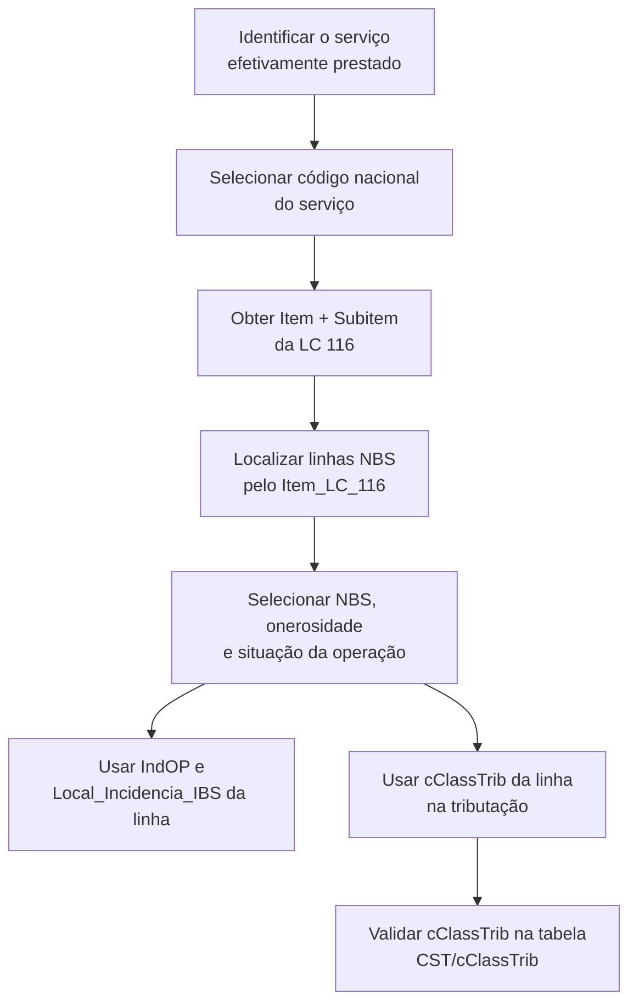

# Reforma Tributária - NFSe

Este manual orienta a classificação de serviços para NFS-e e IBS/CBS com as tabelas disponibilizadas pela Unimake.

**Versão de referência:** arquivos disponibilizados pela Unimake e consultados em 21/07/2026.  
**Objetivo:** explicar os campos das tabelas utilizadas na classificação de serviços para NFS-e e IBS/CBS, a sua relação correta e a obtenção do `cClassTrib`.

## 1. Visão geral

| Tabela | Papel na solução |
| --- | --- |
| [Tabela NBS](https://www.unimake.com.br/downloads/tabela_nbs.json) | Tabela de correlação entre item da LC 116, NBS, características da prestação, `cIndOp`, local de incidência do IBS e `cClassTrib`. É a fonte da classificação tributária do serviço. |
| [Tabela de Códigos de Serviços Nacional](https://www.unimake.com.br/downloads/tabela_codigos_servicos_nacional.json) | Catálogo nacional de serviços, estruturado por item, subitem e desdobramento. É usado para identificar e apresentar o serviço nacional e relacioná-lo ao item/subitem da LC 116. |
| [Tabela CST IBS/CBS](https://www.unimake.com.br/downloads/tabela_cst_ibscbs.json) | Tabela complementar de validação do CST associado ao `cClassTrib`; também orienta os grupos técnicos do leiaute IBS/CBS. |
| [Tabela CST e cClassTrib IBS/CBS](https://www.unimake.com.br/downloads/tabela_cst_classtrib_ibscbs.json) | Tabela complementar que valida o `cClassTrib` selecionado na NBS, seu CST correspondente, vigência, fundamento legal e compatibilidade com a NFS-e. |

O resultado tributário principal está na linha da **Tabela NBS**: o `cClassTrib` nela informado deve ser utilizado na tributação do serviço, após a seleção da linha que representa a situação concreta.

## 2. Como as tabelas se relacionam

### 2.1 Ligação efetiva entre os dois JSONs

A ligação semântica entre estes dois arquivos é:

```text
NBS.Item_LC_116 = CodigoServicoNacional.Item + "." + CodigoServicoNacional.Subitem
```

Exemplo: o item da LC 116 `01.01` da tabela NBS corresponde aos registros da tabela nacional em que `Item = "01"` e `Subitem = "01"`, como `Codigo = "010100"` e seus desdobramentos.

O `Desdobro_Nacional` permite detalhar o mesmo item/subitem. Assim, a relação pode ser de um item da LC 116 para vários códigos nacionais; o ERP deve escolher o código cuja descrição corresponda ao serviço efetivamente prestado.

### 2.2 Atenção: `IndOP` não é o código de serviço nacional

No JSON NBS, o campo é chamado `IndOP`; no leiaute da NFS-e ele corresponde ao **código indicador da operação**, normalmente referido como `cIndOp`. Ele é um código de seis posições relacionado à natureza/local da operação e deve ser informado conforme a linha selecionada da NBS.

Apesar de ambos terem seis posições, `NBS.IndOP` e `CodigoServicoNacional.Codigo` são domínios diferentes. Portanto, **não faça um `join` de `IndOP = Codigo`**. Na versão analisada, a igualdade existe apenas em parte dos valores e não representa a correlação semântica do serviço.

O `cIndOp` é definido pela tabela específica **Anexo VII — Indicadores da Operação**. A NBS já entrega o código a usar, juntamente com o local de incidência e o `cClassTrib`; para validar a descrição completa do indicador, a aplicação deve carregar também a tabela oficial de cIndOp.

## 3. Fluxo de uso



### Sequência prática

1. Classifique o serviço no catálogo nacional e selecione o `Codigo` mais específico disponível.
2. Extraia `Item` e `Subitem` do código nacional e localize as linhas NBS cujo `Item_LC_116` seja igual a `Item + "." + Subitem`.
3. Entre as linhas encontradas, escolha a NBS que descreve exatamente o serviço prestado.
4. Se houver mais de uma linha para a mesma NBS, considere as características da operação: prestação onerosa, aquisição do exterior, local de incidência e `IndOP` aplicável.
5. Use o `cClassTrib` da linha final para a tributação IBS/CBS; o `Nome_cClassTrib` é apenas a descrição de apoio.
6. Use o `IndOP` da mesma linha para o campo `cIndOp` da NFS-e e observe `Local_Incidencia_IBS` ao montar os dados de localidade.
7. Valide o `cClassTrib` na tabela de CST e cClassTrib IBS/CBS, especialmente vigência, CST correspondente e compatibilidade com a NFS-e.

> Um mesmo NBS pode aparecer em diversas linhas porque o `cIndOp` pode variar conforme o local ou a forma concreta da prestação. Não escolha uma linha apenas pelo NBS sem conferir os demais campos.

## 4. Tabela NBS — `tabela_nbs.json`

Esta tabela contém a correlação entre a lista de serviços da LC 116, a Nomenclatura Brasileira de Serviços (NBS), características da operação e a classificação IBS/CBS.

| Campo | Para que serve | Como usar |
| --- | --- | --- |
| `Item_LC_116` | Item e subitem da lista de serviços da LC 116/2003. | É a chave de ligação com o catálogo nacional por `Item` + `Subitem`. Ex.: `01.01`. Não é necessariamente único na tabela NBS. |
| `Descricao_Item` | Descrição do item/subitem da LC 116. | Use para conferência humana do enquadramento da lista de serviços. Não use como chave técnica. |
| `NBS` | Código da Nomenclatura Brasileira de Serviços. | Identifica de forma mais detalhada a natureza do serviço. Deve ser selecionado de acordo com o serviço real, não apenas pelo item da LC 116. |
| `Descricao_NBS` | Descrição do código NBS. | Apoia a escolha da linha correta e a auditoria da classificação. |
| `PS_Onerosa` | Indicador de prestação/fornecimento oneroso. | `S` significa que a linha se aplica à prestação onerosa; `N`, à não onerosa. Normalize a leitura para maiúsculas, pois a versão atual contém também `s`. |
| `ADQ_Exterior` | Indicador de aquisição do serviço no exterior. | Use para diferenciar hipóteses internas e de aquisição do exterior. Na versão consultada, todas as linhas possuem `N`, mas a aplicação deve manter o tratamento de `S` para versões futuras. |
| `IndOP` | Código indicador da operação — `cIndOp` no leiaute da NFS-e. | Informe o valor da linha selecionada no respectivo campo da NFS-e. Ele deve ser escolhido em conjunto com NBS, características da operação e local de incidência. Não o relacione diretamente ao `Codigo` da tabela de serviços nacional. |
| `Local_Incidencia_IBS` | Regra descritiva do local considerado para incidência do IBS. | Use para orientar a definição dos dados de endereço/localidade no DF-e. Exemplos atuais: domicílio principal do adquirente, local da prestação, local do imóvel, local do evento e via explorada. |
| `cClassTrib` | Código de Classificação Tributária do IBS/CBS aplicável ao serviço. | **É o código que deve ser usado na tributação**, após selecionar corretamente a linha NBS. Validar na tabela CST/cClassTrib IBS/CBS vigente. |
| `Nome_cClassTrib` | Nome resumido da classificação tributária. | Use em telas, logs e auditoria. Não substitui o código `cClassTrib` no XML. |

### Observações importantes sobre a NBS

- A mesma NBS pode ter mais de uma linha, inclusive com diferentes `IndOP`, em razão do local ou da forma de realização da operação.
- Um mesmo item da LC 116 pode ter vários NBS. Por isso, `Item_LC_116` é o ponto de entrada da pesquisa, mas não basta para concluir a tributação.
- A linha `NBS = "9.9999.99.99"` representa “Não classificado”. Ela não possui `IndOP` preenchido e requer tratamento de exceção/validação na aplicação.
- O `cClassTrib` vindo da NBS deve ser mantido como texto, preservando zeros à esquerda.

## 5. Tabela de Códigos de Serviços Nacional — `tabela_codigos_servicos_nacional.json`

É um catálogo nacional de serviços. A chave `Codigo` é formada por seis posições e seus componentes já aparecem separados nos demais campos.

| Campo | Para que serve | Como usar |
| --- | --- | --- |
| `Codigo` | Código nacional completo do serviço. | Chave técnica da tabela. É composto por `Item` + `Subitem` + `Desdobro_Nacional`, sem pontuação. Ex.: `010101` = item `01`, subitem `01`, desdobro `01`. |
| `Item` | Item principal da lista nacional de serviços. | Junte com `Subitem` para pesquisar `NBS.Item_LC_116`, com um ponto entre eles. |
| `Subitem` | Subitem do serviço. | Complementa o `Item` e participa da ligação com o item da LC 116. |
| `Desdobro_Nacional` | Desdobramento nacional do item/subitem. | Diferencia especializações dentro do mesmo item e subitem. Use-o para selecionar o `Codigo` mais preciso; ele não compõe, sozinho, `Item_LC_116`. |
| `Descricao` | Descrição do serviço nacional. | Base para a escolha do código mais aderente ao serviço efetivamente prestado. |

### Exemplo da composição do código

| Campo | Valor |
| --- | --- |
| `Item` | `01` |
| `Subitem` | `01` |
| `Desdobro_Nacional` | `01` |
| `Codigo` | `010101` |
| Ligação NBS | `Item_LC_116 = "01.01"` |

## 6. Exemplo resumido

Para uma prestação de análise e desenvolvimento de sistemas:

1. No catálogo nacional, os códigos iniciados por item `01` e subitem `01` representam análise e desenvolvimento de sistemas.
2. Pesquise na NBS as linhas com `Item_LC_116 = "01.01"`.
3. Escolha o NBS que represente o serviço realizado — por exemplo, software personalizado ou não personalizado — e confira a descrição.
4. Da linha NBS selecionada, obtenha `IndOP`, `Local_Incidencia_IBS` e `cClassTrib`.
5. Informe o `cClassTrib` retornado na tributação IBS/CBS e valide-o na tabela geral de CST/cClassTrib.

## 7. Validações recomendadas antes de gerar a NFS-e

- O código nacional selecionado deve existir na Tabela de Códigos de Serviços Nacional.
- O item/subitem do código deve localizar pelo menos uma linha NBS. Na versão analisada, a exceção é o item `99.99` (“Não classificado”).
- A NBS escolhida deve descrever o serviço real e ser compatível com o item da LC 116 e a prestação onerosa/não onerosa.
- O `IndOP` deve estar preenchido quando exigido pelo leiaute e ser escolhido junto com a regra de localidade, não por igualdade com o código de serviço nacional.
- O `cClassTrib` deve existir e estar vigente na tabela CST/cClassTrib IBS/CBS; a aplicação deve obter o CST correspondente nela.
- Preserve todos os códigos como texto para não perder zeros à esquerda.
- Registre em auditoria o código nacional, item da LC 116, NBS, `IndOP`, local de incidência e `cClassTrib` adotados.

## 8. Situação da tabela oficial

O Portal Nacional da NFS-e identifica o Anexo VIII — correlação entre item de serviço, NBS, `cClassTrib` e `cIndOp` — como trabalho ainda em desenvolvimento e informa que não havia regras de negócio baseadas nele no Piloto RTC nem em Produção na publicação consultada. Portanto, a tabela deve ser sincronizada periodicamente e a integração deve ser preparada para alterações de correlação e de validações futuras.

## 9. Referências e fontes das tabelas

- [Portal Nacional da NFS-e — RTC e Anexos](https://www.gov.br/nfse/pt-br/biblioteca/documentacao-tecnica/rtc)
- [Correlação oficial Item de Serviço, NBS, cClassTrib e cIndOp — Anexo VIII](https://www.gov.br/nfse/pt-br/biblioteca/documentacao-tecnica/rtc/anexoviii-correlacaoitemnbsindopcclasstrib_ibscbs_v1-01-00.xlsx)
- [Tabela NBS Unimake](https://www.unimake.com.br/downloads/tabela_nbs.json)
- [Tabela de Códigos de Serviços Nacional Unimake](https://www.unimake.com.br/downloads/tabela_codigos_servicos_nacional.json)
- [Tabela CST IBS/CBS Unimake](https://www.unimake.com.br/downloads/tabela_cst_ibscbs.json)
- [Tabela CST e cClassTrib IBS/CBS Unimake](https://www.unimake.com.br/downloads/tabela_cst_classtrib_ibscbs.json)

> Este manual explica a integração técnica das tabelas. A classificação do serviço real, a definição do local da operação e o enquadramento tributário continuam sujeitos à validação fiscal e às versões vigentes dos leiautes e tabelas oficiais.
