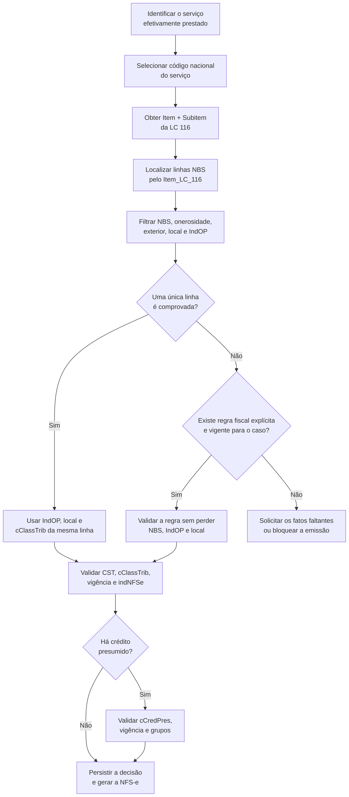

# Reforma Tributária - NFSe

Este manual orienta a classificação de serviços para NFS-e e IBS/CBS com as tabelas disponibilizadas pela Unimake.

**Versão de referência:** arquivos disponibilizados pela Unimake e consultados em 06/08/2026.

**Objetivo:** explicar os campos das tabelas utilizadas na classificação de serviços para NFS-e e IBS/CBS, a sua relação correta e a obtenção do `cClassTrib`.

## 1. Visão geral

| Tabela | Papel na solução |
| --- | --- |
| [Tabela NBS](https://www.unimake.com.br/downloads/tabela_nbs.json) | Tabela de correlação entre item da LC 116, NBS, características da prestação, `cIndOp`, local de incidência do IBS e `cClassTrib`. É a fonte da classificação tributária do serviço. |
| [Tabela de Códigos de Serviços Nacional](https://www.unimake.com.br/downloads/tabela_codigos_servicos_nacional.json) | Catálogo nacional de serviços, estruturado por item, subitem e desdobramento. É usado para identificar e apresentar o serviço nacional e relacioná-lo ao item/subitem da LC 116. |
| [Tabela CST IBS/CBS](https://www.unimake.com.br/downloads/tabela_cst_ibscbs.json) | Tabela complementar de validação do CST associado ao `cClassTrib`; também orienta os grupos técnicos do leiaute IBS/CBS. |
| [Tabela CST e cClassTrib IBS/CBS](https://www.unimake.com.br/downloads/tabela_cst_classtrib_ibscbs.json) | Tabela complementar que valida o `cClassTrib` selecionado na NBS, seu CST correspondente, vigência, fundamento legal e compatibilidade com a NFS-e. |
| [Tabela de Crédito Presumido IBS/CBS](https://www.unimake.com.br/downloads/tabela_ccredpres.json) | Catálogo complementar para validar `cCredPres`, vigências e grupos de IBS/CBS quando a classificação ou uma regra fiscal determinar crédito presumido. |
| [Tabela de Operações](https://www.unimake.com.br/downloads/Tabela_Operacao.json) | Ponto de partida opcional para uma regra fiscal explícita da aplicação. Não substitui NBS, código nacional, `cIndOp` nem local de incidência e não deve resolver ambiguidades sozinho. |

O resultado tributário principal está na linha da **Tabela NBS**: o `cClassTrib` nela informado deve ser utilizado na tributação do serviço, após a seleção da linha que representa a situação concreta.

As tabelas de NCM, tipos de aplicação de exceções de NCM e anexos da LC 214 usadas no fluxo de mercadorias não participam da escolha do serviço na NFS-e. Para esse documento, a classificação começa pelo código nacional, item da LC 116, NBS e características reais da prestação.

## 2. Como as tabelas se relacionam

### 2.1 Ligação efetiva entre os JSONs de serviço

A ligação semântica entre estes dois arquivos é:

```text
NBS.Item_LC_116 = CodigoServicoNacional.Item + "." + CodigoServicoNacional.Subitem
```

Exemplo: o item da LC 116 `01.01` da tabela NBS corresponde aos registros da tabela nacional em que `Item = "01"` e `Subitem = "01"`, como `Codigo = "010100"` e seus desdobramentos.

O `Desdobro_Nacional` permite detalhar o mesmo item/subitem. Assim, a relação pode ser de um item da LC 116 para vários códigos nacionais; o ERP deve escolher o código cuja descrição corresponda ao serviço efetivamente prestado.

### 2.2 Atenção: `IndOP` não é o código de serviço nacional

No JSON NBS, o campo é chamado `IndOP`; no leiaute da NFS-e ele corresponde ao **código indicador da operação**, normalmente referido como `cIndOp`. Ele é um código de seis posições relacionado à natureza/local da operação e deve ser informado conforme a linha selecionada da NBS.

Apesar de ambos terem seis posições, `NBS.IndOP` e `CodigoServicoNacional.Codigo` são domínios diferentes. Portanto, **não faça um `join` de `IndOP = Codigo`**. Na versão analisada, a igualdade existe apenas em parte dos valores e não representa a correlação semântica do serviço.

O `cIndOp` é definido pela tabela específica **Anexo VII — Indicadores da Operação**. A NBS já entrega o código a usar, juntamente com o local de incidência e o `cClassTrib`; para validar a descrição completa do indicador, a aplicação deve carregar também a tabela oficial de cIndOp.

## 3. Fluxo de uso


```mermaid
%%{init: {"flowchart": {"useMaxWidth": false}} }%%
flowchart TD
    A["Identificar o serviço<br/>efetivamente prestado"] --> B["Selecionar código nacional<br/>do serviço"]
    B --> C["Obter Item + Subitem<br/>da LC 116"]
    C --> D["Localizar linhas NBS<br/>pelo Item_LC_116"]
    D --> E["Filtrar NBS, onerosidade,<br/>exterior, local e IndOP"]
    E --> F{"Uma única linha<br/>é comprovada?"}
    F -- "Sim" --> G["Usar IndOP, local e<br/>cClassTrib da mesma linha"]
    F -- "Não" --> H{"Existe regra fiscal explícita<br/>e vigente para o caso?"}
    H -- "Sim" --> I["Validar a regra sem perder<br/>NBS, IndOP e local"]
    H -- "Não" --> J["Solicitar os fatos faltantes<br/>ou bloquear a emissão"]
    G --> K["Validar CST, cClassTrib,<br/>vigência e indNFSe"]
    I --> K
    K --> L{"Há crédito<br/>presumido?"}
    L -- "Sim" --> M["Validar cCredPres,<br/>vigência e grupos"]
    L -- "Não" --> N["Persistir a decisão<br/>e gerar a NFS-e"]
    M --> N
```

### Sequência prática

1. Classifique o serviço no catálogo nacional e selecione o `Codigo` mais específico disponível.
2. Extraia `Item` e `Subitem` do código nacional e localize as linhas NBS cujo `Item_LC_116` seja igual a `Item + "." + Subitem`.
3. Entre as linhas encontradas, escolha a NBS que descreve exatamente o serviço prestado.
4. Se houver mais de uma linha para a mesma NBS, filtre por prestação onerosa, aquisição do exterior, local de incidência e `IndOP`. Use somente fatos conhecidos da prestação.
5. Se ainda restar mais de uma hipótese, solicite ao usuário a informação de negócio que falta. Não escolha a primeira linha e não aplique silenciosamente uma operação genérica.
6. Uma regra fiscal explícita e vigente pode ser usada como ponto de partida ou fallback controlado, mas deve continuar coerente com código nacional, NBS, `cIndOp`, local e modalidade do documento.
7. Use o `cClassTrib` da linha final para a tributação IBS/CBS; o `Nome_cClassTrib` é apenas a descrição de apoio.
8. Use o `IndOP` da mesma linha para o campo `cIndOp` da NFS-e e observe `Local_Incidencia_IBS` ao montar os dados de localidade.
9. Valide o par CST/`cClassTrib`, sua vigência, a permissão para NFS-e e, quando aplicável, o código de crédito presumido.
10. Grave no documento a origem da decisão e os valores usados, para que mudanças posteriores nos cadastros ou JSONs não alterem a fotografia tributária da emissão.

> Um mesmo NBS pode aparecer em diversas linhas porque o `cIndOp` pode variar conforme o local ou a forma concreta da prestação. Não escolha uma linha apenas pelo NBS sem conferir os demais campos.

## 4. Tabela NBS — `tabela_nbs.json`

Esta tabela contém a correlação entre a lista de serviços da LC 116, a Nomenclatura Brasileira de Serviços (NBS), características da operação e a classificação IBS/CBS.

| Campo | Para que serve | Como usar |
| --- | --- | --- |
| `Item_LC_116` | Item e subitem da lista de serviços da LC 116/2003. | É a chave de ligação com o catálogo nacional por `Item` + `Subitem`. Ex.: `01.01`. Não é necessariamente único na tabela NBS. |
| `Descricao_Item` | Descrição do item/subitem da LC 116. | Use para conferência humana do enquadramento da lista de serviços. Não use como chave técnica. |
| `NBS` | Código da Nomenclatura Brasileira de Serviços. | Identifica de forma mais detalhada a natureza do serviço. Deve ser selecionado de acordo com o serviço real, não apenas pelo item da LC 116. |
| `Descricao_NBS` | Descrição do código NBS. | Apoia a escolha da linha correta e a auditoria da classificação. |
| `PS_Onerosa` | Indicador de prestação/fornecimento oneroso. | `S` significa que a linha se aplica à prestação onerosa; `N`, à não onerosa. Normalize a leitura para maiúsculas, pois a versão atual contém também `s`. |
| `ADQ_Exterior` | Indicador de aquisição do serviço no exterior. | Use para diferenciar hipóteses internas e de aquisição do exterior. Na versão consultada, todas as linhas possuem `N`, mas a aplicação deve manter o tratamento de `S` para versões futuras. |
| `IndOP` | Código indicador da operação — `cIndOp` no leiaute da NFS-e. | Informe o valor da linha selecionada no respectivo campo da NFS-e. Ele deve ser escolhido em conjunto com NBS, características da operação e local de incidência. Não o relacione diretamente ao `Codigo` da tabela de serviços nacional. |
| `Local_Incidencia_IBS` | Regra descritiva do local considerado para incidência do IBS. | Use para orientar a definição dos dados de endereço/localidade no DF-e. Exemplos atuais: domicílio principal do adquirente, local da prestação, local do imóvel, local do evento e via explorada. |
| `cClassTrib` | Código de Classificação Tributária do IBS/CBS aplicável ao serviço. | **É o código que deve ser usado na tributação**, após selecionar corretamente a linha NBS. Validar na tabela CST/cClassTrib IBS/CBS vigente. |
| `Nome_cClassTrib` | Nome resumido da classificação tributária. | Use em telas, logs e auditoria. Não substitui o código `cClassTrib` no XML. |

### Observações importantes sobre a NBS

- A mesma NBS pode ter mais de uma linha, inclusive com diferentes `IndOP`, em razão do local ou da forma de realização da operação.
- Um mesmo item da LC 116 pode ter vários NBS. Por isso, `Item_LC_116` é o ponto de entrada da pesquisa, mas não basta para concluir a tributação.
- A linha `NBS = "9.9999.99.99"` representa “Não classificado”. Ela não possui `IndOP` preenchido e requer tratamento de exceção/validação na aplicação.
- O `cClassTrib` vindo da NBS deve ser mantido como texto, preservando zeros à esquerda.

## 5. Tabela de Códigos de Serviços Nacional — `tabela_codigos_servicos_nacional.json`

É um catálogo nacional de serviços. A chave `Codigo` é formada por seis posições e seus componentes já aparecem separados nos demais campos.

| Campo | Para que serve | Como usar |
| --- | --- | --- |
| `Codigo` | Código nacional completo do serviço. | Chave técnica da tabela. É composto por `Item` + `Subitem` + `Desdobro_Nacional`, sem pontuação. Ex.: `010101` = item `01`, subitem `01`, desdobro `01`. |
| `Item` | Item principal da lista nacional de serviços. | Junte com `Subitem` para pesquisar `NBS.Item_LC_116`, com um ponto entre eles. |
| `Subitem` | Subitem do serviço. | Complementa o `Item` e participa da ligação com o item da LC 116. |
| `Desdobro_Nacional` | Desdobramento nacional do item/subitem. | Diferencia especializações dentro do mesmo item e subitem. Use-o para selecionar o `Codigo` mais preciso; ele não compõe, sozinho, `Item_LC_116`. |
| `Descricao` | Descrição do serviço nacional. | Base para a escolha do código mais aderente ao serviço efetivamente prestado. |

### Exemplo da composição do código

| Campo | Valor |
| --- | --- |
| `Item` | `01` |
| `Subitem` | `01` |
| `Desdobro_Nacional` | `01` |
| `Codigo` | `010101` |
| Ligação NBS | `Item_LC_116 = "01.01"` |

### 5.1 Tabelas de alíquotas do ISSQN por município

As tabelas de alíquotas do ISSQN são organizadas por UF e podem auxiliar o cadastro e a validação da tributação municipal da NFS-e. Cada registro relaciona o município e o código do serviço à alíquota e ao seu período de vigência.

Os arquivos usam os seguintes campos:

| Campo | Conteúdo |
| --- | --- |
| `codigo_ibge` | Código IBGE do município. |
| `uf` | Sigla da unidade federativa. |
| `nome_municipio` | Nome do município. |
| `codigo_servico` | Código do serviço ao qual a alíquota se aplica. |
| `incidencia` | Código de incidência relacionado ao serviço. |
| `aliquota` | Percentual de ISSQN informado para o município e o serviço. |
| `dt_ini` | Data inicial de vigência da alíquota. |
| `dt_fim` | Data final de vigência. Quando estiver vazia, o registro não informa uma data de encerramento. |

Mantenha códigos e alíquotas como texto durante a importação, valide as datas de vigência e selecione o arquivo correspondente à UF do município. Como o ISSQN é municipal, confirme a regra aplicável na legislação e no portal oficial do município antes de emitir a NFS-e.

| UF | Arquivo JSON | UF | Arquivo JSON |
| --- | --- | --- | --- |
| AC | [Alíquotas de ISSQN dos municípios do Acre](https://www.unimake.com.br/downloads/tabela_aliquotas_issqn_municipios_ac.json) | AL | [Alíquotas de ISSQN dos municípios de Alagoas](https://www.unimake.com.br/downloads/tabela_aliquotas_issqn_municipios_al.json) |
| AM | [Alíquotas de ISSQN dos municípios do Amazonas](https://www.unimake.com.br/downloads/tabela_aliquotas_issqn_municipios_am.json) | AP | [Alíquotas de ISSQN dos municípios do Amapá](https://www.unimake.com.br/downloads/tabela_aliquotas_issqn_municipios_ap.json) |
| BA | [Alíquotas de ISSQN dos municípios da Bahia](https://www.unimake.com.br/downloads/tabela_aliquotas_issqn_municipios_ba.json) | CE | [Alíquotas de ISSQN dos municípios do Ceará](https://www.unimake.com.br/downloads/tabela_aliquotas_issqn_municipios_ce.json) |
| ES | [Alíquotas de ISSQN dos municípios do Espírito Santo](https://www.unimake.com.br/downloads/tabela_aliquotas_issqn_municipios_es.json) | GO | [Alíquotas de ISSQN dos municípios de Goiás](https://www.unimake.com.br/downloads/tabela_aliquotas_issqn_municipios_go.json) |
| MA | [Alíquotas de ISSQN dos municípios do Maranhão](https://www.unimake.com.br/downloads/tabela_aliquotas_issqn_municipios_ma.json) | MG | [Alíquotas de ISSQN dos municípios de Minas Gerais](https://www.unimake.com.br/downloads/tabela_aliquotas_issqn_municipios_mg.json) |
| MS | [Alíquotas de ISSQN dos municípios de Mato Grosso do Sul](https://www.unimake.com.br/downloads/tabela_aliquotas_issqn_municipios_ms.json) | MT | [Alíquotas de ISSQN dos municípios de Mato Grosso](https://www.unimake.com.br/downloads/tabela_aliquotas_issqn_municipios_mt.json) |
| PA | [Alíquotas de ISSQN dos municípios do Pará](https://www.unimake.com.br/downloads/tabela_aliquotas_issqn_municipios_pa.json) | PB | [Alíquotas de ISSQN dos municípios da Paraíba](https://www.unimake.com.br/downloads/tabela_aliquotas_issqn_municipios_pb.json) |
| PE | [Alíquotas de ISSQN dos municípios de Pernambuco](https://www.unimake.com.br/downloads/tabela_aliquotas_issqn_municipios_pe.json) | PI | [Alíquotas de ISSQN dos municípios do Piauí](https://www.unimake.com.br/downloads/tabela_aliquotas_issqn_municipios_pi.json) |
| PR | [Alíquotas de ISSQN dos municípios do Paraná](https://www.unimake.com.br/downloads/tabela_aliquotas_issqn_municipios_pr.json) | RJ | [Alíquotas de ISSQN dos municípios do Rio de Janeiro](https://www.unimake.com.br/downloads/tabela_aliquotas_issqn_municipios_rj.json) |
| RN | [Alíquotas de ISSQN dos municípios do Rio Grande do Norte](https://www.unimake.com.br/downloads/tabela_aliquotas_issqn_municipios_rn.json) | RO | [Alíquotas de ISSQN dos municípios de Rondônia](https://www.unimake.com.br/downloads/tabela_aliquotas_issqn_municipios_ro.json) |
| RR | [Alíquotas de ISSQN dos municípios de Roraima](https://www.unimake.com.br/downloads/tabela_aliquotas_issqn_municipios_rr.json) | RS | [Alíquotas de ISSQN dos municípios do Rio Grande do Sul](https://www.unimake.com.br/downloads/tabela_aliquotas_issqn_municipios_rs.json) |
| SC | [Alíquotas de ISSQN dos municípios de Santa Catarina](https://www.unimake.com.br/downloads/tabela_aliquotas_issqn_municipios_sc.json) | SE | [Alíquotas de ISSQN dos municípios de Sergipe](https://www.unimake.com.br/downloads/tabela_aliquotas_issqn_municipios_se.json) |
| SP | [Alíquotas de ISSQN dos municípios de São Paulo](https://www.unimake.com.br/downloads/tabela_aliquotas_issqn_municipios_sp.json) | TO | [Alíquotas de ISSQN dos municípios do Tocantins](https://www.unimake.com.br/downloads/tabela_aliquotas_issqn_municipios_to.json) |

## 6. CST, cClassTrib e crédito presumido

Depois de encontrar a linha correta da NBS, procure o `cClassTrib` na tabela geral de CST e classificação tributária:

- o `CST` da linha deve corresponder aos três primeiros dígitos de `cClassTrib`;
- a data do documento deve estar entre `dIniVig` e `dFimVig`;
- `indNFSe` deve permitir o uso na NFS-e ou, no caso específico de exploração de via, deve ser observada a indicação correspondente;
- os grupos de redução, diferimento, tributação regular e crédito presumido devem respeitar os indicadores da tabela CST e da linha de `cClassTrib`;
- percentuais e tipos de alíquota devem vir da regra vigente, sem inferência pelo texto descritivo.

Quando a classificação tiver `ind_gCredPresOper = 1` ou uma regra fiscal trouxer código de crédito, valide-o na [Tabela de Crédito Presumido IBS/CBS](https://www.unimake.com.br/downloads/tabela_ccredpres.json). Confira `cCredPres`, fundamento, forma de apropriação, indicadores de grupo e vigências geral, da CBS e do IBS. A mera permissão do grupo não comprova que o prestador atende à hipótese legal.

## 7. Automação segura e intervenção do usuário

A integração pode automatizar os cenários em que código nacional, item/subitem, NBS, onerosidade, aquisição do exterior e local levem a uma única linha vigente. Uma regra fiscal específica já confirmada também pode evitar perguntas repetidas, desde que seja revalidada no contexto do documento.

Se faltarem fatos ou houver mais de uma linha possível, apresente opções com a descrição do serviço, NBS, `cIndOp`, local de incidência e classificação. Pergunte sobre a característica concreta da prestação, em vez de exigir que o usuário escolha diretamente um código tributário.

Persistir somente o cadastro de origem não basta. Grave no item do documento:

- código nacional, item da LC 116 e NBS;
- onerosidade, aquisição do exterior, `cIndOp` e local de incidência considerados;
- CST, `cClassTrib`, `cCredPres` e valores calculados;
- origem da decisão — automática, regra fiscal explícita ou confirmação manual;
- versão, data de referência ou hash dos catálogos usados;
- usuário e resposta informada, quando houver intervenção.

Assim, uma atualização futura das tabelas ou do cadastro não recalcula silenciosamente uma NFS-e já preparada ou emitida.

## 8. Sincronização segura dos JSONs

Trate os arquivos como tabelas versionadas e substitua a versão anterior somente depois de validar integralmente a nova:

1. Baixe para arquivo temporário e confirme resposta HTTP bem-sucedida.
2. Rejeite arquivo vazio, HTML, mensagem de erro, codificação inválida ou JSON corrompido.
3. Aceite propriedades novas e campos opcionais desconhecidos sem interromper a importação dos campos conhecidos; rejeite alteração estrutural incompatível.
4. Valide chaves, tipos mínimos, duplicidades, vigências e quantidade plausível de registros.
5. Importe em área temporária ou transação única, confira o resultado e só então confirme a substituição.
6. Em qualquer falha, faça rollback e preserve os dados anteriores.
7. Registre URL, data/hora, versão ou data declarada, hash, quantidade e resultado.

A rotina deve ser idempotente: importar duas vezes o mesmo conteúdo não pode duplicar registros nem mudar o resultado tributário.

## 9. Exemplo resumido

Para uma prestação de análise e desenvolvimento de sistemas:

1. No catálogo nacional, os códigos iniciados por item `01` e subitem `01` representam análise e desenvolvimento de sistemas.
2. Pesquise na NBS as linhas com `Item_LC_116 = "01.01"`.
3. Escolha o NBS que represente o serviço realizado — por exemplo, software personalizado ou não personalizado — e confira a descrição.
4. Da linha NBS selecionada, obtenha `IndOP`, `Local_Incidencia_IBS` e `cClassTrib`.
5. Informe o `cClassTrib` retornado na tributação IBS/CBS e valide-o na tabela geral de CST/cClassTrib.

## 10. Validações recomendadas antes de gerar a NFS-e

- O código nacional selecionado deve existir na Tabela de Códigos de Serviços Nacional.
- O item/subitem do código deve localizar pelo menos uma linha NBS. Na versão analisada, a exceção é o item `99.99` (“Não classificado”).
- A NBS escolhida deve descrever o serviço real e ser compatível com o item da LC 116 e a prestação onerosa/não onerosa.
- O `IndOP` deve estar preenchido quando exigido pelo leiaute e ser escolhido junto com a regra de localidade, não por igualdade com o código de serviço nacional.
- Mais de uma linha compatível sem fato suficiente para desempate deve exigir confirmação; não use ordem física do JSON, primeiro resultado ou regra genérica silenciosa.
- O `cClassTrib` deve existir e estar vigente na tabela CST/cClassTrib IBS/CBS; a aplicação deve obter e validar o CST correspondente nela.
- O indicador de documento deve permitir NFS-e, e os grupos enviados devem respeitar os indicadores das tabelas CST e `cClassTrib`.
- Quando houver crédito presumido, `cCredPres`, forma de apropriação, grupos e vigências devem ser válidos para a data do documento.
- Preserve todos os códigos como texto para não perder zeros à esquerda.
- Registre em auditoria o código nacional, item da LC 116, NBS, `IndOP`, local de incidência, classificação, origem da decisão e versão das tabelas adotadas.

## 11. Situação da documentação oficial

Na página atualizada em 15/07/2026, o Portal Nacional da NFS-e identifica o Anexo VIII v1.01.00 — correlação entre item de serviço, NBS, `cClassTrib` e `cIndOp` — como trabalho inicial ainda em desenvolvimento e informa que não há regras de negócio baseadas nele no Piloto RTC nem em Produção.

O mesmo portal informa a previsão de obrigatoriedade dos grupos IBS/CBS a partir de 03/08/2026 com base na NT 004 e no campo `tpRetPisCofins` da NT 007. As alterações da NT 009 não estavam previstas para os ambientes de produção e produção restrita em agosto de 2026. Portanto, implemente conforme o schema efetivamente publicado para o ambiente usado e mantenha o Anexo VIII sincronizável, sem antecipar validações ainda não ativadas oficialmente.

## 12. Referências e fontes das tabelas

- [Portal Nacional da NFS-e — RTC e Anexos](https://www.gov.br/nfse/pt-br/biblioteca/documentacao-tecnica/rtc)
- [Correlação oficial Item de Serviço, NBS, cClassTrib e cIndOp — Anexo VIII](https://www.gov.br/nfse/pt-br/biblioteca/documentacao-tecnica/rtc/anexoviii-correlacaoitemnbsindopcclasstrib_ibscbs_v1-01-00.xlsx)
- [Tabela NBS Unimake](https://www.unimake.com.br/downloads/tabela_nbs.json)
- [Tabela de Códigos de Serviços Nacional Unimake](https://www.unimake.com.br/downloads/tabela_codigos_servicos_nacional.json)
- [Tabela CST IBS/CBS Unimake](https://www.unimake.com.br/downloads/tabela_cst_ibscbs.json)
- [Tabela CST e cClassTrib IBS/CBS Unimake](https://www.unimake.com.br/downloads/tabela_cst_classtrib_ibscbs.json)
- [Tabela de Crédito Presumido IBS/CBS Unimake](https://www.unimake.com.br/downloads/tabela_ccredpres.json)
- [Tabela de Operações Unimake](https://www.unimake.com.br/downloads/Tabela_Operacao.json)

> Este manual explica a integração técnica das tabelas. A classificação do serviço real, a definição do local da operação e o enquadramento tributário continuam sujeitos à validação fiscal e às versões vigentes dos leiautes e tabelas oficiais.
