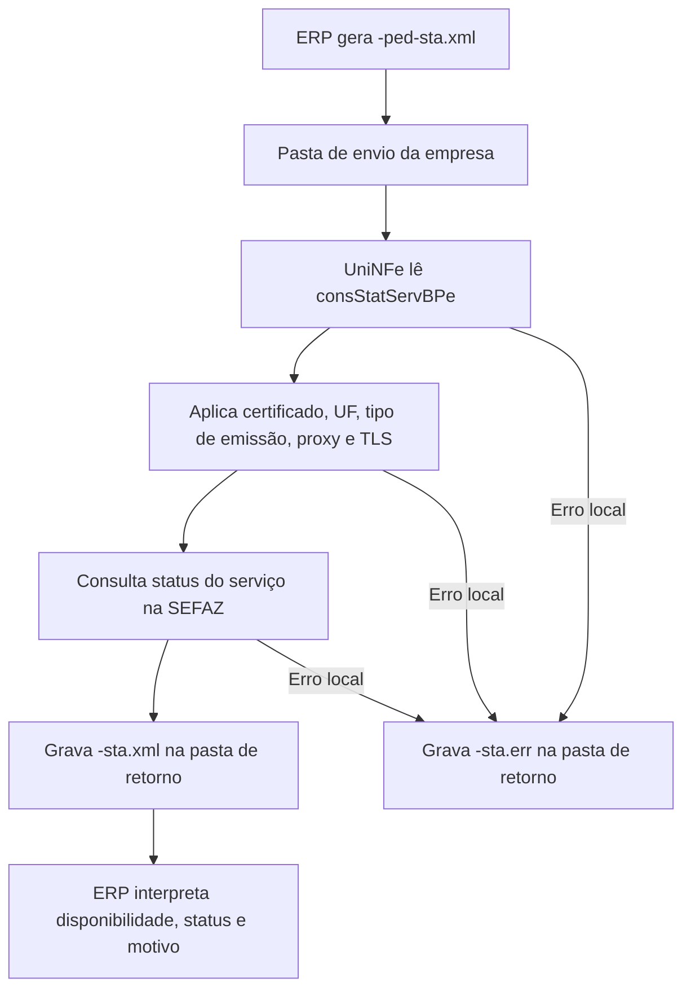

# Consulta status de serviço do BPe

A consulta status de serviço do BPe permite que o ERP verifique se o webservice de BPe da SEFAZ está disponível para a empresa, ambiente e UF configurados no UniNFe. Ela deve ser usada antes de operações fiscais ou sempre que houver suspeita de indisponibilidade no serviço.

Esta consulta não envia BPe, não autoriza documento e não gera XML de distribuição. O resultado serve para orientar o ERP, o suporte e o usuário sobre a disponibilidade do webservice.

## Quando usar

Use este serviço quando:

- O ERP precisa confirmar se o webservice de BPe está operando.
- O envio de BPe falhou por suspeita de indisponibilidade da SEFAZ.
- O suporte precisa validar ambiente, UF, certificado, proxy ou comunicação.
- A empresa deseja testar a comunicação antes de iniciar o envio de documentos.

Para consultar a situação de um BPe específico pela chave de acesso, use a [consulta de situação do BPe](consulta-situacao.md).

## Pré-requisitos

Antes de executar a consulta, confira na configuração da empresa:

- A empresa está cadastrada no UniNFe.
- A pasta de envio e a pasta de retorno estão configuradas.
- O certificado digital está configurado e válido.
- A UF da empresa corresponde à UF que será consultada.
- O ambiente informado no XML corresponde ao ambiente que será verificado.
- As configurações de proxy estão preenchidas, se a rede exigir proxy para acesso à internet.
- A preparação TLS está habilitada quando o ambiente exigir essa configuração.

## Arquivo de envio

O ERP deve gerar o XML de consulta na pasta de envio da empresa com o final fixo:

```text
<identificador>-ped-sta.xml
```

O `<identificador>` deve ser único para a consulta. Ele pode ser uma data/hora, um número sequencial ou outro identificador controlado pelo ERP.

Exemplo:

```text
consStatServBPe-ped-sta.xml
```

O conteúdo do XML deve usar a estrutura de consulta status de serviço do BPe:

```xml
<?xml version="1.0" encoding="utf-8"?>
<consStatServBPe versao="1.00" xmlns="http://www.portalfiscal.inf.br/bpe">
  <tpAmb>2</tpAmb>
  <xServ>STATUS</xServ>
</consStatServBPe>
```

Campos principais:

| Campo | Como preencher |
|---|---|
| `versao` | Versão do leiaute da consulta de status do BPe. |
| `tpAmb` | Ambiente consultado. Use `1` para produção ou `2` para homologação. |
| `xServ` | Informe `STATUS`. |

A UF e o tipo de emissão usados na consulta são obtidos da configuração da empresa no UniNFe.

## Fluxo de processamento

1. O ERP grava o arquivo `<identificador>-ped-sta.xml` na pasta de envio.
2. O UniNFe lê o XML e identifica a consulta status de serviço do BPe.
3. O UniNFe aplica as configurações da empresa, certificado digital, UF, tipo de emissão, proxy e preparação TLS quando configurados.
4. A consulta é enviada ao webservice da SEFAZ.
5. O retorno do webservice é gravado na pasta de retorno como `<identificador>-sta.xml`.
6. O arquivo de solicitação é removido da pasta de envio após o processamento.
7. Se ocorrer falha local, o UniNFe grava `<identificador>-sta.err` na pasta de retorno.

## Fluxograma



## Arquivos gerados

| Momento | Pasta | Nome do arquivo | Quando aparece |
|---|---|---|---|
| Pedido de consulta | Pasta de envio | `<identificador>-ped-sta.xml` | Arquivo criado pelo ERP para consultar a disponibilidade do webservice de BPe. |
| Retorno ao ERP | Pasta de retorno | `<identificador>-sta.xml` | Retorno XML recebido da SEFAZ com o status do serviço. |
| Erro ao ERP | Pasta de retorno | `<identificador>-sta.err` | Erro local antes ou durante a consulta, como falha de leitura, certificado, comunicação ou gravação. |

## Como tratar o retorno

O ERP deve monitorar a pasta de retorno e aguardar:

```text
<identificador>-sta.xml
```

Esse arquivo contém a resposta da SEFAZ para o ambiente consultado. O ERP deve analisar o status e o motivo retornados para decidir se pode iniciar ou continuar as operações de BPe.

Quando o retorno indicar que o serviço está disponível, o ERP pode prosseguir com as operações fiscais. Quando indicar indisponibilidade, o ERP deve aguardar a normalização do serviço ou orientar o usuário conforme a operação fiscal permitida para o cenário.

## Erros locais

Se a consulta não puder ser concluída por falha local, será gerado:

```text
<identificador>-sta.err
```

As causas mais comuns são:

- XML de consulta fora da estrutura esperada.
- Ambiente ausente ou inválido.
- UF incorreta na configuração da empresa.
- Certificado digital ausente, inválido ou vencido.
- Proxy ou conexão TLS configurados incorretamente.
- Falha de comunicação com o webservice.
- Falha de permissão ou acesso às pastas configuradas.

Depois de corrigir o problema, gere novamente o arquivo `<identificador>-ped-sta.xml` na pasta de envio.

## Cuidados para o integrador

- Use sempre o final `-ped-sta.xml` para consulta status de serviço.
- Consulte o mesmo ambiente usado nas operações da empresa.
- Confira a UF configurada para a empresa antes de usar o retorno como diagnóstico.
- Aguarde o arquivo `-sta.xml` para interpretar a disponibilidade do serviço.
- Não trate esta consulta como autorização de documento; ela apenas informa a disponibilidade do webservice.
- Em erros `.err`, corrija a causa local antes de reenviar a consulta.
