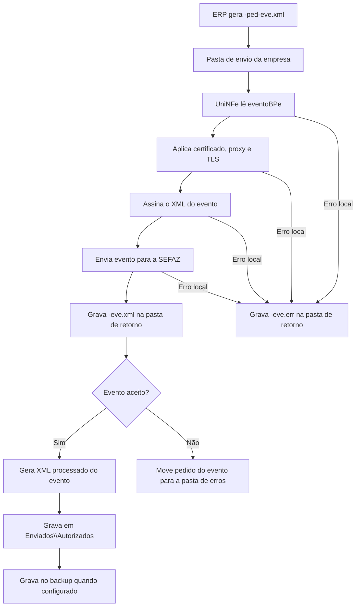

# Eventos do BPe

O serviço de eventos do BPe permite que o ERP envie eventos vinculados a um Bilhete de Passagem Eletrônico já emitido. O ERP grava o XML do evento na pasta de envio, o UniNFe assina o XML, transmite o evento para a SEFAZ e grava o retorno na pasta de retorno.

Use este serviço quando for necessário registrar uma ocorrência fiscal relacionada ao BPe, como cancelamento, não embarque, alteração de poltrona, excesso de bagagem, vinculação de pagamento ou cancelamento da vinculação de pagamento.

## Eventos atendidos nos exemplos

Os exemplos disponíveis para BPe cobrem estes tipos de evento:

| Tipo de evento | Descrição no XML |
|---|---|
| `110111` | Cancelamento |
| `110115` | Nao Embarque |
| `110116` | Alteracao Poltrona |
| `110117` | Excesso Bagagem |
| `110300` | Vinculacao do Pagamento |
| `110301` | Cancelamento da vinculacao do pagamento |

Use o tipo de evento, o detalhamento e as regras fiscais conforme o manual do BPe e conforme a situação real do documento.

## Pré-requisitos

Antes de enviar um evento, confira:

- A empresa emissora está cadastrada no UniNFe.
- A pasta de envio e a pasta de retorno estão configuradas.
- A pasta de XMLs enviados e a pasta de backup estão configuradas quando usadas pela empresa.
- O certificado digital da empresa está configurado e válido.
- O BPe referenciado no evento existe e a chave informada é a chave correta.
- O ambiente do evento é o mesmo ambiente em que o BPe foi emitido.
- As configurações de proxy e TLS estão corretas quando o ambiente exigir.

## Arquivo de envio

O ERP deve gerar o XML do evento na pasta de envio da empresa com o final fixo:

```text
<identificador>-ped-eve.xml
```

O `<identificador>` deve ser único para o evento. Uma forma prática é usar uma composição com o tipo de evento, a chave do BPe e a sequência.

Exemplos:

```text
110111_cancelamento-ped-eve.xml
110115_nao_embarque-ped-eve.xml
110116_alteracao_poltrona-ped-eve.xml
110117_excesso_bagagem-ped-eve.xml
110300_vinc_pgto-ped-eve.xml
110301_canc_vinc_pgto-ped-eve.xml
```

O conteúdo do XML deve usar a estrutura de evento do BPe:

```xml
<?xml version="1.0" encoding="utf-8"?>
<eventoBPe versao="1.00" xmlns="http://www.portalfiscal.inf.br/bpe">
  <infEvento Id="ID11011135260712345678000123630010000000011000000010001">
    <cOrgao>35</cOrgao>
    <tpAmb>2</tpAmb>
    <CNPJ>12345678000123</CNPJ>
    <chBPe>35260712345678000123630010000000011000000010</chBPe>
    <dhEvento>2026-07-06T15:00:00-03:00</dhEvento>
    <tpEvento>110111</tpEvento>
    <nSeqEvento>1</nSeqEvento>
    <detEvento versaoEvento="1.00">
      <evCancBPe>
        <descEvento>Cancelamento</descEvento>
        <nProt>135260000000001</nProt>
        <xJust>Cancelamento solicitado pelo emitente do BP-e.</xJust>
      </evCancBPe>
    </detEvento>
  </infEvento>
</eventoBPe>
```

Campos principais:

| Campo | Como preencher |
|---|---|
| `infEvento/@Id` | Identificador do evento. Deve ser compatível com o tipo de evento, chave do BPe e sequência. |
| `cOrgao` | Código da UF ou órgão responsável pelo evento. |
| `tpAmb` | Ambiente do evento. Use o mesmo ambiente do BPe. |
| `CNPJ` | CNPJ do emissor do evento. |
| `chBPe` | Chave de acesso do BPe vinculado ao evento. |
| `dhEvento` | Data e hora do evento. |
| `tpEvento` | Tipo do evento, como `110111`, `110115`, `110116`, `110117`, `110300` ou `110301`. |
| `nSeqEvento` | Número sequencial do evento para a mesma chave e tipo de evento. |
| `detEvento` | Grupo de detalhes do evento. O conteúdo muda conforme o tipo de evento. |
| `nProt` | Número do protocolo do BPe ou do evento relacionado, quando exigido pelo tipo de evento. |
| `xJust` | Justificativa do evento, quando exigida pelo tipo de evento. |

Nos eventos de vinculação de pagamento, o grupo de detalhes contém as informações do pagamento, como número do pagamento, identificação da transação, meio de pagamento, recebedor e PSP. No cancelamento da vinculação de pagamento, informe também o protocolo da vinculação que será cancelada.

## Fluxo de processamento

1. O ERP grava o arquivo `<identificador>-ped-eve.xml` na pasta de envio.
2. O UniNFe lê o XML `eventoBPe`.
3. O UniNFe aplica as configurações da empresa, certificado digital, proxy e preparação TLS quando configurados.
4. O UniNFe assina o XML do evento.
5. O evento é enviado para a SEFAZ.
6. O retorno do webservice é gravado na pasta de retorno como `<identificador>-eve.xml`.
7. Se o evento for aceito, o UniNFe gera o XML processado do evento em `Enviados\Autorizados`.
8. Quando houver pasta de backup configurada, o XML processado do evento também é gravado no backup.
9. Se o evento for rejeitado ou não puder ser confirmado como aceito, o XML original do pedido é movido para a pasta de erros.
10. Se ocorrer erro local, o UniNFe grava `<identificador>-eve.err` na pasta de retorno.
11. O arquivo de solicitação é removido da pasta de envio após o processamento.

## Fluxograma



## Arquivos gerados e movimentados

| Momento | Pasta | Nome do arquivo | Quando aparece |
|---|---|---|---|
| Pedido do evento | Pasta de envio | `<identificador>-ped-eve.xml` | Arquivo criado pelo ERP para enviar o evento do BPe. |
| Retorno ao ERP | Pasta de retorno | `<identificador>-eve.xml` | Retorno XML recebido da SEFAZ com o resultado do evento. |
| Erro ao ERP | Pasta de retorno | `<identificador>-eve.err` | Erro local antes ou durante o processamento do evento. |
| Evento processado | `Enviados\Autorizados\<subpasta por data>` | `<chaveBPe>_<tipoEvento>_<sequencia>-procEventoBPe.xml` | Evento aceito pela SEFAZ. O conteúdo do arquivo é um XML `procEventoBPe`. |
| Backup do evento processado | Pasta de backup, quando configurada | `<chaveBPe>_<tipoEvento>_<sequencia>-procEventoBPe.xml` | Cópia de segurança do evento aceito. |
| XML rejeitado ou não aceito | Pasta de erros configurada | `<identificador>-ped-eve.xml` | Evento rejeitado ou não confirmado como aceito pela SEFAZ. |

## Como tratar o retorno

O ERP deve monitorar a pasta de retorno e aguardar:

```text
<identificador>-eve.xml
```

Esse arquivo contém a resposta da SEFAZ para o evento enviado. O ERP deve analisar o status e o motivo retornados.

Quando o evento for aceito, o UniNFe gera um XML processado do evento com o conteúdo `procEventoBPe`. O arquivo é gravado em `Enviados\Autorizados`, dentro da subpasta de data configurada, usando o padrão:

```text
<chaveBPe>_<tipoEvento>_<sequencia>-procEventoBPe.xml
```

O ERP deve armazenar esse XML como comprovante do evento aceito. O UniNFe trata como evento aceito os retornos de evento registrado e vinculado ao documento, evento registrado sem vinculação e evento homologado conforme a resposta do webservice.

Quando o evento for rejeitado, o ERP deve apresentar o motivo ao usuário, corrigir os dados e gerar um novo arquivo `-ped-eve.xml` na pasta de envio.

## Erros locais

Se o UniNFe não conseguir concluir o processamento por falha local, será gerado:

```text
<identificador>-eve.err
```

As causas mais comuns são:

- XML do evento fora da estrutura esperada.
- Identificador do evento incompatível com tipo, chave ou sequência.
- Chave do BPe ausente ou inválida.
- Certificado digital ausente, inválido ou vencido.
- Ambiente do evento diferente do ambiente do BPe.
- Falha de assinatura.
- Falha de comunicação com o webservice.
- Proxy ou conexão TLS configurados incorretamente.
- Falha de permissão ou acesso às pastas configuradas.

Depois de corrigir o problema, gere novamente o arquivo `<identificador>-ped-eve.xml` na pasta de envio.

## Cuidados para o integrador

- Use sempre o final `-ped-eve.xml` para envio de evento do BPe.
- Gere o XML com a raiz `eventoBPe`.
- Informe `tpEvento` e `nSeqEvento` de acordo com a operação fiscal.
- Mantenha o identificador `infEvento/@Id` compatível com o evento enviado.
- Use o mesmo ambiente do BPe original.
- Aguarde o arquivo `-eve.xml` para interpretar o retorno da SEFAZ.
- Armazene o XML processado do evento quando o evento for aceito.
- Em rejeições, corrija o XML e envie um novo pedido de evento.
- Em erros `.err`, corrija a causa local antes de reenviar.
