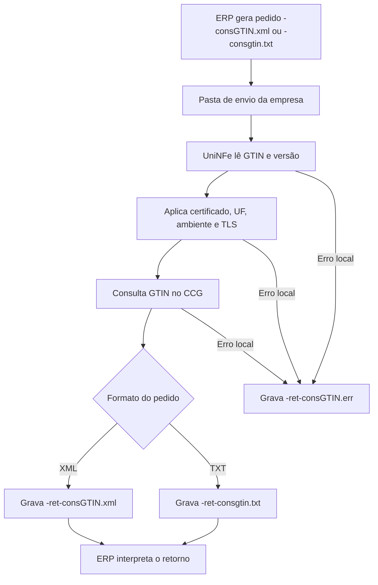

# Consulta GTIN

A consulta GTIN do CCG permite que o ERP consulte na Centralizada de Código GTIN as informações cadastrais de um produto a partir do código GTIN. O UniNFe envia a consulta ao webservice e grava o retorno para o ERP em XML ou TXT, conforme o formato usado no pedido.

Use este serviço quando o ERP precisa validar ou consultar dados vinculados a um GTIN, como descrição do produto, tipo do GTIN, NCM e CEST retornados pelo serviço.

## Pré-requisitos

Antes de executar a consulta, confira na configuração da empresa:

- A empresa está cadastrada no UniNFe.
- A pasta de envio e a pasta de retorno estão configuradas.
- O certificado digital está configurado e válido.
- A UF da empresa está configurada corretamente.
- O ambiente da empresa está configurado conforme a consulta desejada.
- As configurações de proxy e conexão TLS estão corretas, se a rede exigir proxy ou preparação TLS.

## Arquivo de envio em XML

Para consultar por XML, o ERP deve gerar o arquivo na pasta de envio da empresa com o final fixo:

```text
<identificador>-consGTIN.xml
```

O `<identificador>` deve ser único para a consulta. Ele pode ser uma data/hora, um número sequencial, o próprio GTIN ou outro identificador controlado pelo ERP.

Exemplo:

```text
0000000000-consGTIN.xml
```

O conteúdo do XML deve usar a estrutura de consulta GTIN:

```xml
<?xml version="1.0" encoding="utf-8"?>
<consGTIN versao="1.00" xmlns="http://www.portalfiscal.inf.br/nfe">
  <GTIN>7894900019896</GTIN>
</consGTIN>
```

Campos principais:

| Campo | Como preencher |
|---|---|
| `versao` | Versão do leiaute da consulta. |
| `GTIN` | Código GTIN que será consultado. |

## Arquivo de envio em TXT

Para consultar por TXT, o ERP deve gerar o arquivo na pasta de envio da empresa com o final fixo:

```text
<identificador>-consgtin.txt
```

Exemplo:

```text
0000000000-consgtin.txt
```

O conteúdo do TXT deve ter duas linhas:

```text
GTIN|7894900019896
Versao|1.00
```

Campos principais:

| Linha | Como preencher |
|---|---|
| `GTIN` | Código GTIN que será consultado. |
| `Versao` | Versão do leiaute da consulta. |

## Fluxo de processamento

1. O ERP grava o arquivo `<identificador>-consGTIN.xml` ou `<identificador>-consgtin.txt` na pasta de envio.
2. O UniNFe lê o pedido e identifica a consulta GTIN.
3. O UniNFe aplica as configurações da empresa, certificado, UF, ambiente e conexão TLS quando configurado.
4. A consulta é enviada ao webservice do CCG.
5. Para pedido em XML, o retorno é gravado como `<identificador>-ret-consGTIN.xml`.
6. Para pedido em TXT, além do retorno XML quando aplicável, o UniNFe grava `<identificador>-ret-consgtin.txt`.
7. Se ocorrer falha local, o UniNFe grava `<identificador>-ret-consGTIN.err` na pasta de retorno.
8. O arquivo de solicitação é removido da pasta de envio após o processamento.

## Fluxograma



## Arquivos gerados

| Momento | Pasta | Nome do arquivo | Quando aparece |
|---|---|---|---|
| Pedido XML | Pasta de envio | `<identificador>-consGTIN.xml` | Arquivo criado pelo ERP para consultar GTIN em XML. |
| Pedido TXT | Pasta de envio | `<identificador>-consgtin.txt` | Arquivo criado pelo ERP para consultar GTIN em TXT. |
| Retorno XML | Pasta de retorno | `<identificador>-ret-consGTIN.xml` | Retorno XML recebido do serviço CCG. |
| Retorno TXT | Pasta de retorno | `<identificador>-ret-consgtin.txt` | Retorno em TXT gerado quando o pedido foi enviado em TXT. |
| Erro ao ERP | Pasta de retorno | `<identificador>-ret-consGTIN.err` | Erro local antes ou durante a consulta, como falha de leitura, certificado, comunicação ou gravação. |

## Retorno em TXT

Quando o pedido é enviado em TXT, o retorno TXT contém as principais informações do resultado:

```text
CStat|<status>
XMotivo|<motivo>
GTIN|<codigo>
tpGTIN|<tipo>
xProd|<descricao>
NCM|<ncm>
CEST|<cest>
```

A linha `CEST` pode aparecer mais de uma vez quando o retorno trouxer mais de um código CEST.

## Como tratar o retorno

O ERP deve monitorar a pasta de retorno e aguardar o arquivo correspondente ao formato enviado:

```text
<identificador>-ret-consGTIN.xml
<identificador>-ret-consgtin.txt
```

No retorno, leia o status e o motivo para saber se a consulta foi atendida. Quando houver dados do produto, armazene ou apresente as informações de GTIN, tipo, descrição, NCM e CEST conforme a necessidade do ERP.

## Erros locais

Se a consulta não puder ser concluída por falha local, será gerado:

```text
<identificador>-ret-consGTIN.err
```

As causas mais comuns são:

- XML ou TXT fora da estrutura esperada.
- GTIN ausente ou inválido.
- Versão da consulta ausente ou inválida.
- Certificado digital ausente, inválido ou vencido.
- UF ou ambiente da empresa configurados incorretamente.
- Proxy ou conexão TLS configurados incorretamente.
- Falha de comunicação com o webservice.
- Falha de permissão ou acesso às pastas configuradas.

Depois de corrigir o problema, gere novamente o arquivo de consulta na pasta de envio.

## Cuidados para o integrador

- Use `-consGTIN.xml` para consulta em XML.
- Use `-consgtin.txt` para consulta em TXT.
- Informe o GTIN sem espaços ou caracteres adicionais.
- Aguarde o retorno correspondente ao formato enviado.
- Trate `CStat` e `XMotivo` antes de usar os dados do produto.
- Em erros `.err`, corrija a causa local antes de reenviar a consulta.
