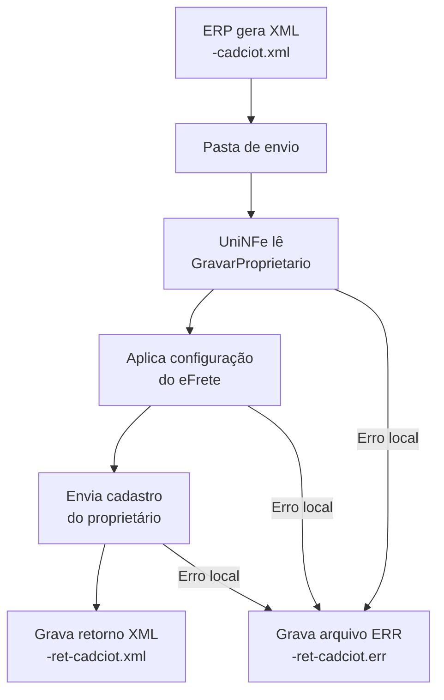

# Cadastro de proprietário no eFrete

O serviço cadastra o proprietário de veículo no provedor eFrete para uso nas operações de CIOT. O ERP grava o XML na pasta de envio, o UniNFe identifica o cadastro pela tag raiz `GravarProprietario`, transmite os dados e grava a resposta na pasta de retorno.

Este cadastro é exclusivo do **eFrete**. Use `EFrete` na tag `ProvedorCIOT`.

## Pré-requisitos

Antes de enviar o cadastro, confira:

- A empresa está cadastrada no UniNFe.
- A pasta de envio e a pasta de retorno estão configuradas.
- O ambiente está configurado conforme a operação desejada.
- O integrador e a forma de autenticação do eFrete estão preenchidos conforme a [visão geral do CIOT](README.md#configuração-do-efrete).
- As configurações de proxy estão preenchidas, se a rede exigir proxy para acesso à internet.
- O CNPJ, o RNTRC, a razão social, o endereço e os telefones do proprietário estão corretos.

## Arquivo de envio

O ERP deve gerar o XML na pasta de envio da empresa com o final fixo:

```text
<identificador>-cadciot.xml
```

O `<identificador>` deve ser único para evitar conflito entre cadastros. Exemplo:

```text
gravarProprietario-cadciot.xml
```

O conteúdo deve usar a raiz `GravarProprietario`, o namespace do CIOT e `ProvedorCIOT` como primeiro elemento:

```xml
<?xml version="1.0" encoding="utf-8"?>
<GravarProprietario xmlns="http://www.antt.gov.br/ciot">
    <ProvedorCIOT>EFrete</ProvedorCIOT>
    <CNPJ>12345678000199</CNPJ>
    <Endereco>
        <Bairro>Centro</Bairro>
        <Rua>Avenida Exemplo</Rua>
        <Numero>200</Numero>
        <Complemento>Galpao</Complemento>
        <CEP>01310930</CEP>
        <CodigoMunicipio>3550308</CodigoMunicipio>
    </Endereco>
    <RNTRC>12345678</RNTRC>
    <RazaoSocial>TRANSPORTADORA TESTE LTDA</RazaoSocial>
    <Telefones>
        <Celular><DDD>11</DDD><Numero>988888888</Numero></Celular>
        <Fixo><DDD>11</DDD><Numero>34444444</Numero></Fixo>
        <Fax><DDD>11</DDD><Numero>35555555</Numero></Fax>
    </Telefones>
</GravarProprietario>
```

### Campos do cadastro

| Campo | Como preencher |
|---|---|
| `ProvedorCIOT` | Use `EFrete`. Deve ser o primeiro elemento dentro de `GravarProprietario`. |
| `CNPJ` | CNPJ do proprietário. |
| `Endereco` | Grupo com bairro, rua, número, complemento, CEP e código do município. |
| `RNTRC` | Registro Nacional de Transportadores Rodoviários de Cargas do proprietário. |
| `RazaoSocial` | Razão social do proprietário. |
| `Telefones` | Grupo com telefone celular, fixo e fax, separados em DDD e número. |

## Fluxo de processamento

1. O ERP grava `<identificador>-cadciot.xml` na pasta de envio.
2. O UniNFe identifica a raiz `GravarProprietario` e lê os dados do cadastro.
3. O UniNFe aplica o ambiente, as credenciais do eFrete, o certificado configurado, o proxy e a preparação TLS.
4. O cadastro é enviado ao eFrete.
5. A resposta é gravada na pasta de retorno como `<identificador>-ret-cadciot.xml`.
6. Se ocorrer uma falha local, o UniNFe grava `<identificador>-ret-cadciot.err` na pasta de retorno.
7. O arquivo original da pasta de envio é removido após o processamento.

## Fluxograma



## Arquivos envolvidos

| Momento | Pasta | Nome do arquivo | Quando aparece |
|---|---|---|---|
| Envio pelo ERP | Pasta de envio | `<identificador>-cadciot.xml` | Solicitação com raiz `GravarProprietario`. |
| Retorno ao ERP | Pasta de retorno | `<identificador>-ret-cadciot.xml` | Resposta XML devolvida pelo eFrete. |
| Erro ao ERP | Pasta de retorno | `<identificador>-ret-cadciot.err` | Falha local de leitura, configuração, autenticação, comunicação ou gravação. |

## Como tratar o retorno

O ERP deve aguardar o arquivo `<identificador>-ret-cadciot.xml` e interpretar a resposta do eFrete antes de considerar o proprietário cadastrado. Este serviço não gera XML processado em `Enviados\Autorizados`; o resultado para o ERP é o retorno gravado na pasta de retorno.

Se for gerado `<identificador>-ret-cadciot.err`, corrija a causa informada e crie um novo arquivo de envio. Como os três cadastros eFrete usam o mesmo final `-cadciot.xml`, a tag raiz deve ser exatamente `GravarProprietario` para selecionar este serviço.

## Modelo no repositório

Consulte `exemplos xml/CIOT/eFrete/gravarProprietario-cadciot.xml` como modelo de estrutura e substitua os dados fictícios pelos dados do cadastro.

