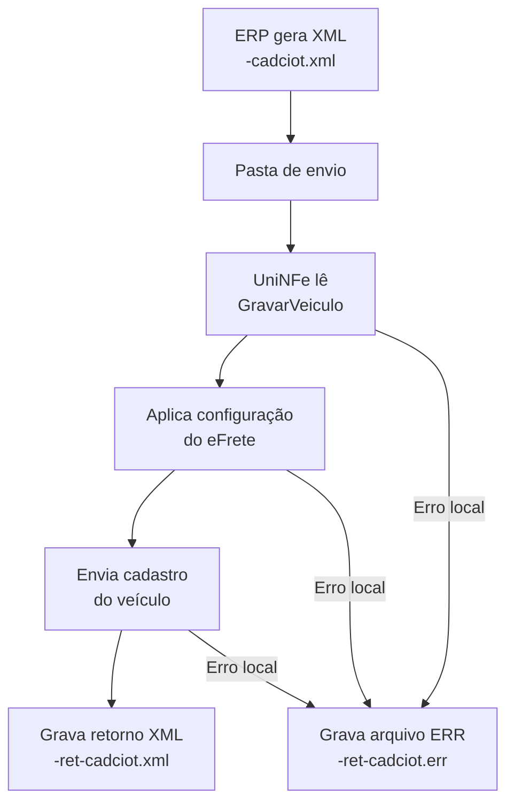

# Cadastro de veículo no eFrete

O serviço cadastra um veículo no provedor eFrete para uso nas operações de CIOT. O ERP grava o XML na pasta de envio, o UniNFe identifica o cadastro pela tag raiz `GravarVeiculo`, transmite os dados e grava a resposta na pasta de retorno.

Este cadastro é exclusivo do **eFrete**. Use `EFrete` na tag `ProvedorCIOT`.

## Pré-requisitos

Antes de enviar o cadastro, confira:

- A empresa está cadastrada no UniNFe.
- A pasta de envio e a pasta de retorno estão configuradas.
- O ambiente está configurado conforme a operação desejada.
- O integrador e a forma de autenticação do eFrete estão preenchidos conforme a [visão geral do CIOT](README.md#configuração-do-efrete).
- As configurações de proxy estão preenchidas, se a rede exigir proxy para acesso à internet.
- Os dados de identificação, capacidade, município, RNTRC e características do veículo estão corretos.

## Arquivo de envio

O ERP deve gerar o XML na pasta de envio da empresa com o final fixo:

```text
<identificador>-cadciot.xml
```

O `<identificador>` deve ser único para evitar conflito entre cadastros. Exemplo:

```text
gravarVeiculo-cadciot.xml
```

O conteúdo deve usar a raiz `GravarVeiculo`, o namespace do CIOT e `ProvedorCIOT` como primeiro elemento:

```xml
<?xml version="1.0" encoding="utf-8"?>
<GravarVeiculo xmlns="http://www.antt.gov.br/ciot">
    <ProvedorCIOT>EFrete</ProvedorCIOT>
    <Veiculo>
        <AnoFabricacao>2024</AnoFabricacao>
        <AnoModelo>2025</AnoModelo>
        <CapacidadeKg>25000</CapacidadeKg>
        <CapacidadeM3>90</CapacidadeM3>
        <Chassi>9BWZZZ377VT004251</Chassi>
        <CodigoMunicipio>3550308</CodigoMunicipio>
        <Cor>BRANCO</Cor>
        <Marca>MARCA TESTE</Marca>
        <Modelo>MODELO TESTE</Modelo>
        <NumeroDeEixos>3</NumeroDeEixos>
        <Placa>BRA2E19</Placa>
        <RNTRC>12345678</RNTRC>
        <Renavam>12345678901</Renavam>
        <Tara>9000</Tara>
        <TipoCarroceria>Granelera</TipoCarroceria>
        <TipoRodado>Truck</TipoRodado>
    </Veiculo>
</GravarVeiculo>
```

### Campos do cadastro

| Campo | Como preencher |
|---|---|
| `ProvedorCIOT` | Use `EFrete`. Deve ser o primeiro elemento dentro de `GravarVeiculo`. |
| `Veiculo` | Grupo que reúne todos os dados do veículo. |
| `AnoFabricacao` e `AnoModelo` | Ano de fabricação e ano do modelo. |
| `CapacidadeKg` e `CapacidadeM3` | Capacidades do veículo em quilogramas e metros cúbicos. |
| `Chassi`, `Placa` e `Renavam` | Identificadores do veículo. |
| `CodigoMunicipio` | Código do município relacionado ao veículo. |
| `Cor`, `Marca` e `Modelo` | Características de identificação do veículo. |
| `NumeroDeEixos` | Quantidade de eixos. |
| `RNTRC` | Registro Nacional de Transportadores Rodoviários de Cargas relacionado ao veículo. |
| `Tara` | Tara informada para o veículo. |
| `TipoCarroceria` e `TipoRodado` | Classificações da carroceria e do rodado. O modelo usa `Granelera` e `Truck`. |

## Fluxo de processamento

1. O ERP grava `<identificador>-cadciot.xml` na pasta de envio.
2. O UniNFe identifica a raiz `GravarVeiculo` e lê o grupo `Veiculo`.
3. O UniNFe aplica o ambiente, as credenciais do eFrete, o certificado configurado, o proxy e a preparação TLS.
4. O cadastro é enviado ao eFrete.
5. A resposta é gravada na pasta de retorno como `<identificador>-ret-cadciot.xml`.
6. Se ocorrer uma falha local, o UniNFe grava `<identificador>-ret-cadciot.err` na pasta de retorno.
7. O arquivo original da pasta de envio é removido após o processamento.

## Fluxograma



## Arquivos envolvidos

| Momento | Pasta | Nome do arquivo | Quando aparece |
|---|---|---|---|
| Envio pelo ERP | Pasta de envio | `<identificador>-cadciot.xml` | Solicitação com raiz `GravarVeiculo`. |
| Retorno ao ERP | Pasta de retorno | `<identificador>-ret-cadciot.xml` | Resposta XML devolvida pelo eFrete. |
| Erro ao ERP | Pasta de retorno | `<identificador>-ret-cadciot.err` | Falha local de leitura, configuração, autenticação, comunicação ou gravação. |

## Como tratar o retorno

O ERP deve aguardar o arquivo `<identificador>-ret-cadciot.xml` e interpretar a resposta do eFrete antes de considerar o veículo cadastrado. Este serviço não gera XML processado em `Enviados\Autorizados`; o resultado para o ERP é o retorno gravado na pasta de retorno.

Se for gerado `<identificador>-ret-cadciot.err`, corrija a causa informada e crie um novo arquivo de envio. Como os três cadastros eFrete usam o mesmo final `-cadciot.xml`, a tag raiz deve ser exatamente `GravarVeiculo` para selecionar este serviço.

## Modelo no repositório

Consulte `exemplos xml/CIOT/eFrete/gravarVeiculo-cadciot.xml` como modelo de estrutura e substitua os dados fictícios pelos dados do cadastro.

