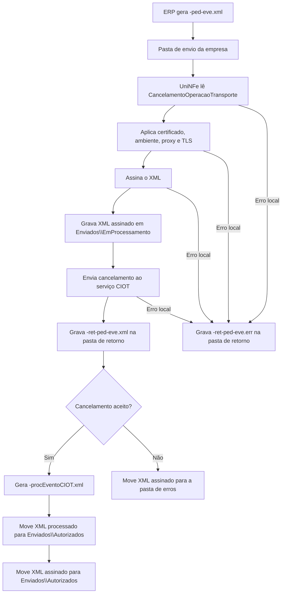

# Cancelamento da operação de transporte do CIOT

O serviço de cancelamento da operação de transporte do CIOT permite que o ERP solicite o cancelamento de uma operação de transporte já registrada. O ERP grava o XML de cancelamento na pasta de envio, o UniNFe assina o XML, transmite a solicitação e grava o retorno na pasta configurada para retornos.

Use este serviço quando uma operação de transporte CIOT precisa ser cancelada conforme as regras do serviço.

## Pré-requisitos

Antes de enviar o cancelamento, confira:

- A empresa está cadastrada no UniNFe.
- A pasta de envio, a pasta de retorno e a pasta de XMLs enviados estão configuradas.
- A pasta de backup está configurada, se a empresa utilizar backup dos XMLs processados.
- O certificado digital está configurado e válido.
- O ambiente está configurado conforme a operação original.
- As configurações de proxy estão preenchidas, se a rede exigir proxy para acesso à internet.
- O código de identificação da operação de transporte está correto.
- O motivo do cancelamento está preenchido.

## Arquivo de envio

O ERP deve gerar o XML de cancelamento na pasta de envio da empresa com o final fixo:

```text
<identificador>-ped-eve.xml
```

O `<identificador>` deve ser único para evitar conflito entre solicitações. Uma forma prática é usar uma composição com a operação e a palavra `cancelamento`.

Exemplo:

```text
cancelamentoOperacaoTransporte-ped-eve.xml
```

O conteúdo do XML deve usar a estrutura de cancelamento de operação de transporte:

```xml
<?xml version="1.0" encoding="utf-8"?>
<CancelamentoOperacaoTransporte xmlns="http://www.antt.gov.br/ciot">
    <CodigoIdentificacaoOperacao>1234567890123456</CodigoIdentificacaoOperacao>
    <MotivoCancelamento>Operacao nao realizada</MotivoCancelamento>
</CancelamentoOperacaoTransporte>
```

Campos principais:

| Campo | Como preencher |
|---|---|
| `CodigoIdentificacaoOperacao` | Código da operação de transporte que será cancelada. |
| `MotivoCancelamento` | Motivo do cancelamento que será enviado ao serviço CIOT. |

## Fluxo de processamento

1. O ERP grava o arquivo `<identificador>-ped-eve.xml` na pasta de envio.
2. O UniNFe lê o XML `CancelamentoOperacaoTransporte`.
3. O UniNFe aplica as configurações da empresa, certificado, ambiente, proxy e conexão TLS quando configurado.
4. O XML é assinado e gravado em `Enviados\EmProcessamento` com o mesmo nome do arquivo de envio.
5. O UniNFe envia o cancelamento ao serviço CIOT.
6. O retorno do serviço é gravado na pasta de retorno como `<identificador>-ret-ped-eve.xml`.
7. Se o retorno indicar que o cancelamento foi aceito, o UniNFe grava o XML processado `<identificador>-procEventoCIOT.xml` em `Enviados\Autorizados`.
8. O XML assinado `<identificador>-ped-eve.xml` também é movido para `Enviados\Autorizados`.
9. Se o cancelamento for rejeitado, o XML assinado em processamento é movido para a pasta de erros e o ERP deve tratar a mensagem de retorno.
10. Se ocorrer falha local, o UniNFe grava `<identificador>-ret-ped-eve.err` na pasta de retorno.
11. O arquivo original da pasta de envio é removido após o processamento.

## Fluxograma



## Arquivos gerados e movimentados

| Momento | Pasta | Nome do arquivo | Quando aparece |
|---|---|---|---|
| Envio pelo ERP | Pasta de envio | `<identificador>-ped-eve.xml` | Arquivo criado pelo ERP para solicitar o cancelamento da operação de transporte. |
| Em processamento | `Enviados\EmProcessamento` | `<identificador>-ped-eve.xml` | XML assinado pelo UniNFe enquanto o cancelamento está sendo processado. |
| Retorno ao ERP | Pasta de retorno | `<identificador>-ret-ped-eve.xml` | Retorno XML do serviço CIOT, tanto para aceite quanto para rejeição retornada pelo serviço. |
| Erro ao ERP | Pasta de retorno | `<identificador>-ret-ped-eve.err` | Erro local antes ou durante o processamento, como falha de leitura, certificado, assinatura, comunicação ou gravação. |
| XML processado | `Enviados\Autorizados\<subpasta por data>` | `<identificador>-procEventoCIOT.xml` | Cancelamento aceito. É o XML principal para armazenamento do evento processado. |
| XML original assinado | `Enviados\Autorizados\<subpasta por data>` | `<identificador>-ped-eve.xml` | XML assinado da solicitação aceita. |
| XML rejeitado | Pasta de erros configurada | `<identificador>-ped-eve.xml` | Cancelamento rejeitado ou não aceito pelo serviço CIOT. |

## Como tratar o retorno

O ERP deve monitorar a pasta de retorno e aguardar:

```text
<identificador>-ret-ped-eve.xml
```

Esse arquivo contém a resposta do serviço CIOT. Quando o cancelamento for aceito, o ERP deve localizar e armazenar o XML processado:

```text
<identificador>-procEventoCIOT.xml
```

O XML processado é gravado em `Enviados\Autorizados`, dentro da subpasta criada conforme a data do cancelamento retornada pelo serviço e a configuração de organização dos XMLs enviados.

Quando o retorno indicar rejeição, o ERP deve apresentar a mensagem ao usuário, corrigir os dados quando possível e gerar uma nova solicitação `-ped-eve.xml` na pasta de envio.

## Erros locais

Se o UniNFe não conseguir concluir o processamento por falha local, será gerado:

```text
<identificador>-ret-ped-eve.err
```

As causas mais comuns são:

- XML fora da estrutura esperada para `CancelamentoOperacaoTransporte`.
- Código de identificação da operação ausente ou inválido.
- Motivo de cancelamento ausente ou inválido.
- Certificado digital ausente, inválido ou vencido.
- Ambiente, proxy ou conexão TLS configurados incorretamente.
- Falha de assinatura.
- Falha de comunicação com o serviço CIOT.
- Falha de permissão ou acesso às pastas configuradas.

Depois de corrigir o problema, gere novamente o arquivo `<identificador>-ped-eve.xml` na pasta de envio.

## Cuidados para o integrador

- Use sempre o final `-ped-eve.xml` para cancelamento da operação de transporte do CIOT.
- Use o namespace `http://www.antt.gov.br/ciot` no XML.
- Informe corretamente o código da operação que será cancelada.
- Preencha um motivo de cancelamento compatível com a situação real.
- Aguarde o arquivo `-ret-ped-eve.xml` para interpretar o retorno do serviço.
- Armazene o XML `-procEventoCIOT.xml` quando o cancelamento for aceito.
- Em rejeições, corrija os dados quando possível e envie uma nova solicitação.
- Em erros `.err`, corrija a causa local antes de reenviar.
