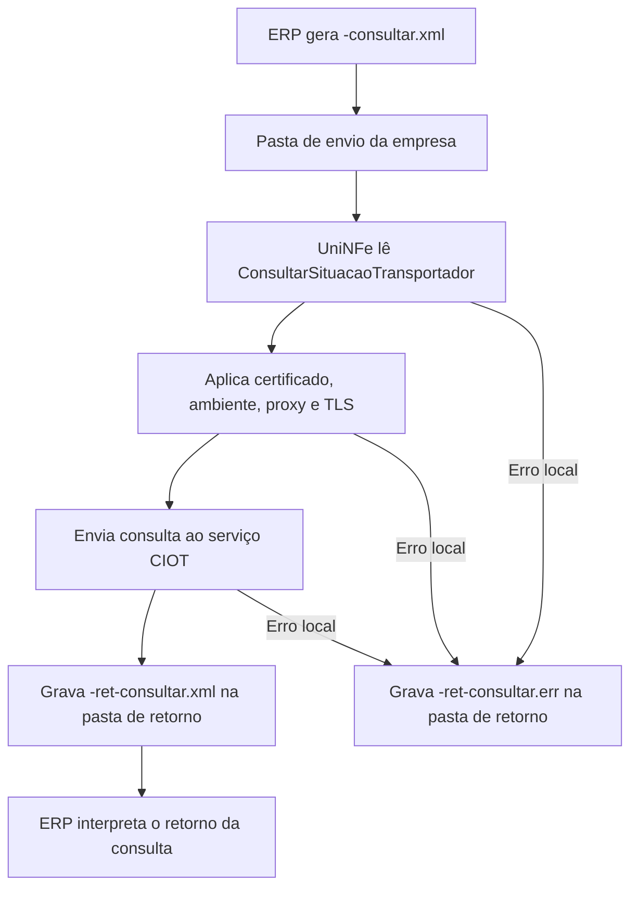

# Consultar situação do transportador no CIOT

O serviço de consulta de situação do transportador no CIOT permite que o ERP consulte a situação de um transportador no serviço CIOT. O ERP grava o XML de consulta na pasta de envio, o UniNFe transmite a solicitação e grava o retorno na pasta configurada para retornos.

Use este serviço quando for necessário validar ou consultar a situação cadastral/operacional de um transportador antes de seguir com operações CIOT.

## Pré-requisitos

Antes de executar a consulta, confira:

- A empresa está cadastrada no UniNFe.
- A pasta de envio e a pasta de retorno estão configuradas.
- O certificado digital está configurado e válido.
- O ambiente está configurado conforme a consulta desejada.
- As configurações de proxy estão preenchidas, se a rede exigir proxy para acesso à internet.
- O CPF ou CNPJ do interessado, o CPF ou CNPJ do transportador e o RNTRC estão corretos.

## Arquivo de envio

O ERP deve gerar o XML de consulta na pasta de envio da empresa com o final fixo:

```text
<identificador>-consultar.xml
```

O `<identificador>` deve ser único para evitar conflito entre consultas. Ele pode ser uma composição com o transportador, RNTRC, data/hora ou outro controle interno do ERP.

Exemplo:

```text
consultarSituacaoTransportador-consultar.xml
```

O conteúdo do XML deve usar a estrutura de consulta de situação do transportador:

```xml
<?xml version="1.0" encoding="utf-8"?>
<ConsultarSituacaoTransportador xmlns="http://www.antt.gov.br/ciot">
    <CpfCnpjInteressado>12345678000195</CpfCnpjInteressado>
    <CpfCnpjTransportador>12345678901</CpfCnpjTransportador>
    <RNTRCTransportador>012345678</RNTRCTransportador>
</ConsultarSituacaoTransportador>
```

Campos principais:

| Campo | Como preencher |
|---|---|
| `CpfCnpjInteressado` | CPF ou CNPJ do interessado na consulta. |
| `CpfCnpjTransportador` | CPF ou CNPJ do transportador consultado. |
| `RNTRCTransportador` | RNTRC do transportador. |

## Fluxo de processamento

1. O ERP grava o arquivo `<identificador>-consultar.xml` na pasta de envio.
2. O UniNFe lê o XML `ConsultarSituacaoTransportador`.
3. O UniNFe aplica as configurações da empresa, certificado, ambiente, proxy e conexão TLS quando configurado.
4. O UniNFe envia a consulta ao serviço CIOT.
5. O retorno do serviço é gravado na pasta de retorno como `<identificador>-ret-consultar.xml`.
6. Se ocorrer falha local, o UniNFe grava `<identificador>-ret-consultar.err` na pasta de retorno.
7. O arquivo original da pasta de envio é removido após o processamento.

## Fluxograma



## Arquivos gerados

| Momento | Pasta | Nome do arquivo | Quando aparece |
|---|---|---|---|
| Envio pelo ERP | Pasta de envio | `<identificador>-consultar.xml` | Arquivo criado pelo ERP para consultar a situação do transportador. |
| Retorno ao ERP | Pasta de retorno | `<identificador>-ret-consultar.xml` | Retorno XML do serviço CIOT com o resultado da consulta. |
| Erro ao ERP | Pasta de retorno | `<identificador>-ret-consultar.err` | Erro local antes ou durante o processamento, como falha de leitura, certificado, comunicação ou gravação. |

## Como tratar o retorno

O ERP deve monitorar a pasta de retorno e aguardar:

```text
<identificador>-ret-consultar.xml
```

Esse arquivo contém a resposta do serviço CIOT para os dados do transportador informados. O ERP deve analisar o conteúdo retornado para atualizar sua base ou orientar o usuário sobre a situação do transportador.

Este serviço não grava XML processado em `Enviados\Autorizados`. O resultado operacional para o ERP é o arquivo `-ret-consultar.xml` gerado na pasta de retorno.

## Erros locais

Se o UniNFe não conseguir concluir a consulta por falha local, será gerado:

```text
<identificador>-ret-consultar.err
```

As causas mais comuns são:

- XML fora da estrutura esperada para `ConsultarSituacaoTransportador`.
- CPF ou CNPJ do interessado ausente ou inválido.
- CPF ou CNPJ do transportador ausente ou inválido.
- RNTRC do transportador ausente ou inválido.
- Certificado digital ausente, inválido ou vencido.
- Ambiente, proxy ou conexão TLS configurados incorretamente.
- Falha de comunicação com o serviço CIOT.
- Falha de permissão ou acesso às pastas configuradas.

Depois de corrigir o problema, gere novamente o arquivo `<identificador>-consultar.xml` na pasta de envio.

## Cuidados para o integrador

- Use sempre o final `-consultar.xml` para consultar a situação do transportador no CIOT.
- Use o namespace `http://www.antt.gov.br/ciot` no XML.
- Informe corretamente o interessado, o transportador e o RNTRC.
- Aguarde o arquivo `-ret-consultar.xml` para interpretar o retorno do serviço.
- Não espere geração de XML processado em `Enviados\Autorizados` neste serviço.
- Em erros `.err`, corrija a causa local antes de reenviar.
