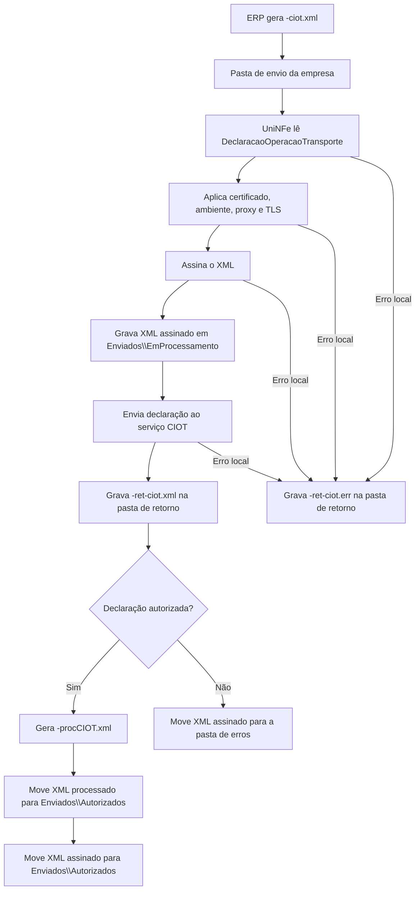

# Declaração de operação de transporte do CIOT

A declaração de operação de transporte do CIOT permite que o ERP registre uma operação de transporte junto ao serviço CIOT. O ERP grava o XML da declaração na pasta de envio, o UniNFe assina o XML, transmite a solicitação e grava o retorno na pasta configurada para retornos.

Use este serviço quando for necessário declarar uma nova operação de transporte e obter o XML processado da declaração.

## Pré-requisitos

Antes de enviar a declaração, confira na configuração da empresa:

- A empresa está cadastrada no UniNFe.
- A pasta de envio, a pasta de retorno e a pasta de XMLs enviados estão configuradas.
- A pasta de backup está configurada, se a empresa utilizar backup dos XMLs processados.
- O certificado digital está configurado e válido.
- O ambiente está configurado conforme a operação desejada.
- As configurações de proxy estão preenchidas, se a rede exigir proxy para acesso à internet.
- Os dados da operação de transporte, veículos, origem, destino, carga e pagamento estão preenchidos conforme as regras do CIOT.

## Arquivo de envio

O ERP deve gerar o XML da declaração na pasta de envio da empresa com o final fixo:

```text
<identificador>-ciot.xml
```

O `<identificador>` deve ser único para evitar conflito entre operações. Ele pode ser o identificador da operação de transporte ou outro controle interno do ERP.

Exemplo:

```text
declaracaoOperacaoTransporte-ciot.xml
```

O conteúdo do XML deve usar a estrutura de declaração de operação de transporte:

```xml
<?xml version="1.0" encoding="utf-8"?>
<DeclaracaoOperacaoTransporte xmlns="http://www.antt.gov.br/ciot">
    <IdOperacaoTransporte>OP1234567890</IdOperacaoTransporte>
    <TipoOperacao>1</TipoOperacao>
    <CpfCnpjContratado>12345678901</CpfCnpjContratado>
    <RNTRCContratado>012345678</RNTRCContratado>
    <CpfCnpjContratante>12345678000195</CpfCnpjContratante>
    <RNTRCContratante>987654321</RNTRCContratante>
    <ValorFrete>1500.50</ValorFrete>
    <DataDeclaracao>2026-05-25T10:00:00-03:00</DataDeclaracao>
</DeclaracaoOperacaoTransporte>
```

O exemplo acima mostra apenas os campos iniciais. A declaração completa também pode conter grupos como veículos, origem e destino, dados da carga, informações de pagamento e indicadores operacionais.

## Principais grupos do XML

| Grupo ou campo | Para que serve |
|---|---|
| `IdOperacaoTransporte` | Identifica a operação de transporte declarada pelo ERP. |
| `TipoOperacao` | Informa o tipo da operação declarada. |
| `CpfCnpjContratado` e `RNTRCContratado` | Identificam o contratado e seu RNTRC. |
| `CpfCnpjContratante` e `RNTRCContratante` | Identificam o contratante e seu RNTRC. |
| `CpfCnpjDestinatario` | Identifica o destinatário quando informado na operação. |
| `ValorFrete` | Valor do frete da operação. |
| `DataDeclaracao` | Data e hora da declaração. Também é usada pelo UniNFe para organizar os XMLs autorizados por data. |
| `IndContingencia` | Indica se a declaração está em contingência. |
| `DataInicioViagem` e `DataFimViagem` | Informam o período previsto da viagem. |
| `Veiculos` | Lista os veículos da operação, incluindo placa, RNTRC e número de eixos. |
| `OrigemDestino` | Informa pares de origem e destino, com município, CEP, coordenadas e distância percorrida. |
| `DadosCarga` | Descreve natureza, peso, tipo de carga e contratantes de carga fracionada, quando houver. |
| `InfPagamento` | Informa os dados de pagamento, como tipo de pagamento, favorecido e dados de PIX quando aplicável. |
| `InfIndicadoresOperacionais` | Indica características operacionais, como alto desempenho, retorno vazio e composição veicular. |

## Fluxo de processamento

1. O ERP grava o arquivo `<identificador>-ciot.xml` na pasta de envio.
2. O UniNFe lê o XML `DeclaracaoOperacaoTransporte`.
3. O UniNFe aplica as configurações da empresa, certificado, ambiente, proxy e conexão TLS quando configurado.
4. O XML é assinado e gravado em `Enviados\EmProcessamento` com o mesmo nome do arquivo de envio.
5. O UniNFe envia a declaração ao serviço CIOT.
6. O retorno do serviço é gravado na pasta de retorno como `<identificador>-ret-ciot.xml`.
7. Se o retorno indicar autorização da declaração, o UniNFe grava o XML processado `<identificador>-procCIOT.xml` em `Enviados\Autorizados`.
8. O XML assinado `<identificador>-ciot.xml` também é movido para `Enviados\Autorizados`.
9. Se a declaração for rejeitada, o XML assinado em processamento é movido para a pasta de erros e o ERP deve tratar a mensagem de retorno.
10. Se ocorrer falha local, o UniNFe grava `<identificador>-ret-ciot.err` na pasta de retorno.
11. O arquivo original da pasta de envio é removido após o processamento.

## Fluxograma



## Arquivos gerados e movimentados

| Momento | Pasta | Nome do arquivo | Quando aparece |
|---|---|---|---|
| Envio pelo ERP | Pasta de envio | `<identificador>-ciot.xml` | Arquivo criado pelo ERP para declarar a operação de transporte. |
| Em processamento | `Enviados\EmProcessamento` | `<identificador>-ciot.xml` | XML assinado pelo UniNFe enquanto a declaração está sendo processada. |
| Retorno ao ERP | Pasta de retorno | `<identificador>-ret-ciot.xml` | Retorno XML do serviço CIOT, tanto para autorização quanto para rejeição retornada pelo serviço. |
| Erro ao ERP | Pasta de retorno | `<identificador>-ret-ciot.err` | Erro local antes ou durante o processamento, como falha de leitura, certificado, assinatura, comunicação ou gravação. |
| XML processado | `Enviados\Autorizados\<subpasta por data>` | `<identificador>-procCIOT.xml` | Declaração autorizada. É o XML principal para armazenamento da operação processada. |
| XML original assinado | `Enviados\Autorizados\<subpasta por data>` | `<identificador>-ciot.xml` | XML assinado da declaração autorizada. |
| XML rejeitado | Pasta de erros configurada | `<identificador>-ciot.xml` | Declaração rejeitada ou não autorizada pelo serviço CIOT. |

## Como tratar o retorno

O ERP deve monitorar a pasta de retorno e aguardar:

```text
<identificador>-ret-ciot.xml
```

Esse arquivo contém a resposta do serviço CIOT. Quando a declaração for autorizada, o ERP deve localizar e armazenar o XML processado:

```text
<identificador>-procCIOT.xml
```

O XML processado é gravado em `Enviados\Autorizados`, dentro da subpasta criada conforme a data da declaração e a configuração de organização dos XMLs enviados.

Quando o retorno indicar rejeição, o ERP deve apresentar a mensagem ao usuário, corrigir os dados da declaração e gerar um novo arquivo `-ciot.xml` na pasta de envio.

## Erros locais

Se o UniNFe não conseguir concluir o processamento por falha local, será gerado:

```text
<identificador>-ret-ciot.err
```

As causas mais comuns são:

- XML fora da estrutura esperada para `DeclaracaoOperacaoTransporte`.
- Dados obrigatórios da operação de transporte ausentes ou inválidos.
- Certificado digital ausente, inválido ou vencido.
- Ambiente, proxy ou conexão TLS configurados incorretamente.
- Falha de assinatura.
- Falha de comunicação com o serviço CIOT.
- Falha de permissão ou acesso às pastas configuradas.

Depois de corrigir o problema, gere novamente o arquivo `<identificador>-ciot.xml` na pasta de envio.

## Cuidados para o integrador

- Use sempre o final `-ciot.xml` para declaração de operação de transporte.
- Use o namespace `http://www.antt.gov.br/ciot` no XML.
- Mantenha o `<identificador>` único para evitar conflito de arquivos.
- Aguarde o arquivo `-ret-ciot.xml` para interpretar o retorno do serviço.
- Armazene o XML `-procCIOT.xml` quando a declaração for autorizada.
- Em rejeições, corrija o XML e envie uma nova declaração.
- Em erros `.err`, corrija a causa local antes de reenviar.
