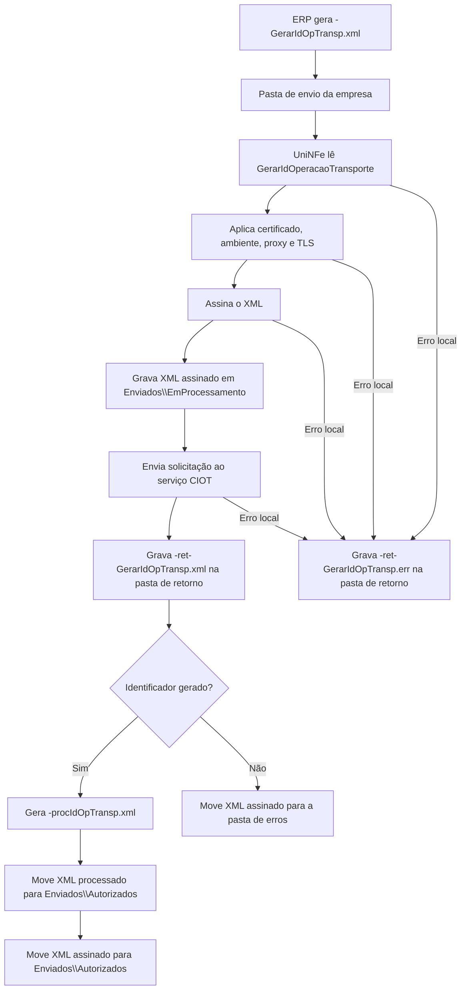

# Gerar identificador da operação de transporte do CIOT

O serviço de geração do identificador da operação de transporte do CIOT permite que o ERP solicite ao serviço CIOT um identificador para uma operação de transporte. O ERP grava o XML na pasta de envio, o UniNFe transmite a solicitação e grava o retorno na pasta configurada para retornos.

Use este serviço quando o ERP precisar obter o identificador da operação de transporte antes de seguir com os demais processos do CIOT.

## Pré-requisitos

Antes de enviar a solicitação, confira na configuração da empresa:

- A empresa está cadastrada no UniNFe.
- A pasta de envio, a pasta de retorno e a pasta de XMLs enviados estão configuradas.
- O certificado digital está configurado e válido.
- O ambiente está configurado conforme a operação desejada.
- As configurações de proxy estão preenchidas, se a rede exigir proxy para acesso à internet.
- O CPF ou CNPJ que será enviado na solicitação está correto.

## Arquivo de envio

O ERP deve gerar o XML na pasta de envio da empresa com o final fixo:

```text
<identificador>-GerarIdOpTransp.xml
```

Preserve as letras maiúsculas e minúsculas do final `-GerarIdOpTransp.xml`.

O `<identificador>` deve ser único para evitar conflito entre solicitações. Ele pode ser uma data/hora, um número sequencial ou outro controle interno do ERP.

Exemplo:

```text
gerarIdOperacaoTransporte-GerarIdOpTransp.xml
```

O conteúdo do XML deve usar a estrutura de geração do identificador da operação de transporte:

```xml
<?xml version="1.0" encoding="utf-8"?>
<GerarIdOperacaoTransporte xmlns="http://www.antt.gov.br/ciot" versao="1.00">
    <CpfCnpj>41942626000102</CpfCnpj>
</GerarIdOperacaoTransporte>
```

Campos principais:

| Campo | Como preencher |
|---|---|
| `versao` | Versão do leiaute da solicitação. |
| `CpfCnpj` | CPF ou CNPJ usado para solicitar o identificador da operação de transporte. |

## Fluxo de processamento

1. O ERP grava o arquivo `<identificador>-GerarIdOpTransp.xml` na pasta de envio.
2. O UniNFe lê o XML `GerarIdOperacaoTransporte`.
3. O UniNFe aplica as configurações da empresa, certificado, ambiente, proxy e conexão TLS quando configurado.
4. O XML é assinado e gravado em `Enviados\EmProcessamento` com o mesmo nome do arquivo de envio.
5. O UniNFe envia a solicitação ao serviço CIOT.
6. O retorno do serviço é gravado na pasta de retorno como `<identificador>-ret-GerarIdOpTransp.xml`.
7. Se o retorno indicar autorização, o UniNFe grava o XML processado `<identificador>-procIdOpTransp.xml` em `Enviados\Autorizados`.
8. O XML assinado `<identificador>-GerarIdOpTransp.xml` também é movido para `Enviados\Autorizados`.
9. Se a solicitação for rejeitada, o XML assinado em processamento é movido para a pasta de erros e o ERP deve tratar a mensagem de retorno.
10. Se ocorrer falha local, o UniNFe grava `<identificador>-ret-GerarIdOpTransp.err` na pasta de retorno.
11. O arquivo original da pasta de envio é removido após o processamento.

## Fluxograma



## Arquivos gerados e movimentados

| Momento | Pasta | Nome do arquivo | Quando aparece |
|---|---|---|---|
| Envio pelo ERP | Pasta de envio | `<identificador>-GerarIdOpTransp.xml` | Arquivo criado pelo ERP para solicitar o identificador da operação de transporte. |
| Em processamento | `Enviados\EmProcessamento` | `<identificador>-GerarIdOpTransp.xml` | XML assinado pelo UniNFe enquanto a solicitação está sendo processada. |
| Retorno ao ERP | Pasta de retorno | `<identificador>-ret-GerarIdOpTransp.xml` | Retorno XML do serviço CIOT, tanto para sucesso quanto para rejeição retornada pelo serviço. |
| Erro ao ERP | Pasta de retorno | `<identificador>-ret-GerarIdOpTransp.err` | Erro local antes ou durante o processamento, como falha de leitura, certificado, assinatura, comunicação ou gravação. |
| XML processado | `Enviados\Autorizados\<subpasta por data>` | `<identificador>-procIdOpTransp.xml` | Identificador gerado com sucesso. É o XML principal para armazenamento do resultado processado. |
| XML original assinado | `Enviados\Autorizados\<subpasta por data>` | `<identificador>-GerarIdOpTransp.xml` | XML assinado da solicitação autorizada. |
| XML rejeitado | Pasta de erros configurada | `<identificador>-GerarIdOpTransp.xml` | Solicitação rejeitada ou sem autorização pelo serviço CIOT. |

## Como tratar o retorno

O ERP deve monitorar a pasta de retorno e aguardar:

```text
<identificador>-ret-GerarIdOpTransp.xml
```

Esse arquivo contém a resposta do serviço CIOT. Quando o identificador for gerado com sucesso, o ERP deve localizar e armazenar o XML processado:

```text
<identificador>-procIdOpTransp.xml
```

O XML processado é gravado em `Enviados\Autorizados`, dentro da subpasta criada conforme a data de processamento e a configuração de organização dos XMLs enviados. O ERP deve usar esse retorno para obter e persistir o identificador da operação de transporte.

Quando o retorno indicar rejeição, o ERP deve apresentar a mensagem ao usuário, corrigir os dados da solicitação e gerar um novo arquivo `-GerarIdOpTransp.xml` na pasta de envio.

## Erros locais

Se o UniNFe não conseguir concluir o processamento por falha local, será gerado:

```text
<identificador>-ret-GerarIdOpTransp.err
```

As causas mais comuns são:

- XML fora da estrutura esperada para `GerarIdOperacaoTransporte`.
- CPF ou CNPJ ausente ou inválido.
- Certificado digital ausente, inválido ou vencido.
- Ambiente, proxy ou conexão TLS configurados incorretamente.
- Falha de assinatura.
- Falha de comunicação com o serviço CIOT.
- Falha de permissão ou acesso às pastas configuradas.

Depois de corrigir o problema, gere novamente o arquivo `<identificador>-GerarIdOpTransp.xml` na pasta de envio.

## Cuidados para o integrador

- Use sempre o final `-GerarIdOpTransp.xml` para solicitar a geração do identificador.
- Preserve maiúsculas e minúsculas nos nomes dos arquivos.
- Use o namespace `http://www.antt.gov.br/ciot` no XML.
- Mantenha o `<identificador>` único para evitar conflito de arquivos.
- Aguarde o arquivo `-ret-GerarIdOpTransp.xml` para interpretar o retorno do serviço.
- Armazene o XML `-procIdOpTransp.xml` quando o identificador for gerado com sucesso.
- Em rejeições, corrija o XML e envie uma nova solicitação.
- Em erros `.err`, corrija a causa local antes de reenviar.
