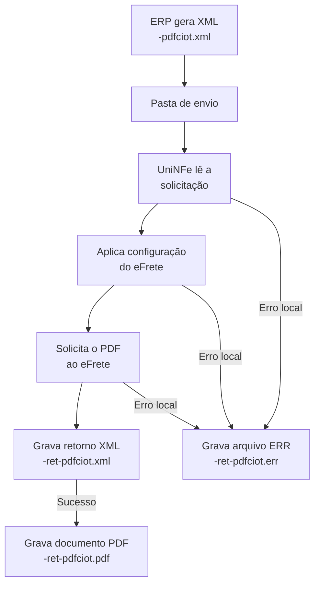

# Obter o PDF da operação de transporte no eFrete

O serviço obtém, no provedor eFrete, o PDF de uma operação de transporte já registrada. O ERP grava uma solicitação XML na pasta de envio e o UniNFe devolve a resposta XML na pasta de retorno. Quando o eFrete confirma o sucesso da solicitação, o UniNFe também grava o documento em PDF nessa pasta.

Este serviço é exclusivo do **eFrete**. Use `EFrete` na tag `ProvedorCIOT`.

## Quando usar

Use este serviço quando o ERP precisar recuperar o documento PDF de uma operação de transporte existente no eFrete. A solicitação identifica a operação pelo código de identificação e pelo documento da viagem.

## Pré-requisitos

Antes de solicitar o PDF, confira:

- A empresa está cadastrada no UniNFe.
- A pasta de envio e a pasta de retorno estão configuradas.
- O ambiente está configurado conforme a operação consultada.
- O integrador e a forma de autenticação do eFrete estão preenchidos conforme a [visão geral do CIOT](README.md#configuração-do-efrete).
- As configurações de proxy estão preenchidas, se a rede exigir proxy para acesso à internet.
- O código de identificação da operação e o documento da viagem correspondem à operação desejada.

## Arquivo de envio

O ERP deve gerar o XML na pasta de envio da empresa com o final fixo:

```text
<identificador>-pdfciot.xml
```

O `<identificador>` deve ser único para evitar conflito entre solicitações. Exemplo:

```text
obterOperacaoTransportePdf-pdfciot.xml
```

O conteúdo deve usar a raiz `ObterOperacaoTransportePdf`, o namespace do CIOT e `ProvedorCIOT` como primeiro elemento:

```xml
<?xml version="1.0" encoding="utf-8"?>
<ObterOperacaoTransportePdf xmlns="http://www.antt.gov.br/ciot">
    <ProvedorCIOT>EFrete</ProvedorCIOT>
    <CodigoIdentificacaoOperacao>992000000126</CodigoIdentificacaoOperacao>
    <DocumentoViagem>VIAGEM-TESTE-001</DocumentoViagem>
</ObterOperacaoTransportePdf>
```

### Campos da solicitação

| Campo | Como preencher |
|---|---|
| `ProvedorCIOT` | Use `EFrete`. Deve ser o primeiro elemento dentro de `ObterOperacaoTransportePdf`. |
| `CodigoIdentificacaoOperacao` | Informe o código de identificação da operação de transporte no eFrete. |
| `DocumentoViagem` | Informe o documento da viagem relacionado à operação. |

## Fluxo de processamento

1. O ERP grava `<identificador>-pdfciot.xml` na pasta de envio.
2. O UniNFe identifica a raiz `ObterOperacaoTransportePdf` e lê os dados da solicitação.
3. O UniNFe aplica o ambiente, as credenciais do eFrete, o certificado configurado, o proxy e a preparação TLS.
4. A solicitação é enviada ao eFrete.
5. A resposta do serviço é gravada como `<identificador>-ret-pdfciot.xml` na pasta de retorno.
6. Se a resposta indicar sucesso, o PDF é gravado como `<identificador>-ret-pdfciot.pdf` na mesma pasta.
7. Se ocorrer uma falha local, o UniNFe grava `<identificador>-ret-pdfciot.err` na pasta de retorno.
8. O arquivo original da pasta de envio é removido após o processamento.

## Fluxograma



## Arquivos envolvidos

| Momento | Pasta | Nome do arquivo | Quando aparece |
|---|---|---|---|
| Envio pelo ERP | Pasta de envio | `<identificador>-pdfciot.xml` | Solicitação com raiz `ObterOperacaoTransportePdf`. |
| Retorno ao ERP | Pasta de retorno | `<identificador>-ret-pdfciot.xml` | Resposta XML devolvida pelo eFrete. |
| Documento solicitado | Pasta de retorno | `<identificador>-ret-pdfciot.pdf` | Somente quando a resposta do eFrete indica sucesso. |
| Erro ao ERP | Pasta de retorno | `<identificador>-ret-pdfciot.err` | Falha local de leitura, configuração, autenticação, comunicação ou gravação. |

## Como tratar o retorno

O ERP deve aguardar e interpretar `<identificador>-ret-pdfciot.xml`. A existência desse XML não garante que o PDF tenha sido obtido: o arquivo `<identificador>-ret-pdfciot.pdf` só é criado quando o resultado devolvido pelo eFrete indica sucesso.

Se o retorno não indicar sucesso, consulte a mensagem contida no XML antes de repetir a solicitação. Se for gerado `<identificador>-ret-pdfciot.err`, corrija a causa local informada e crie um novo arquivo de envio.

Este serviço não gera XML processado em `Enviados\Autorizados`. Tanto o retorno XML quanto o PDF solicitado são entregues na pasta de retorno.

## Modelo no repositório

Consulte `exemplos xml/CIOT/eFrete/obterOperacaoTransportePdf-pdfciot.xml` como modelo de estrutura e substitua os dados fictícios pelos dados da operação.
