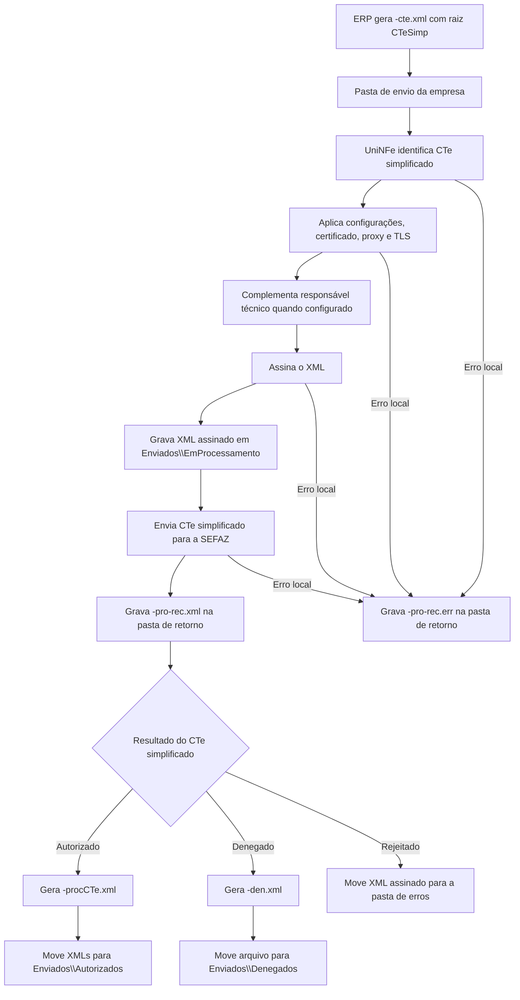

# Autorização de CTe simplificado

A autorização de CTe simplificado permite que o ERP envie um Conhecimento de Transporte Eletrônico simplificado ao UniNFe por troca de arquivos. O ERP grava o XML do CTe simplificado na pasta de envio configurada para a empresa, o UniNFe assina o documento, transmite para a SEFAZ e grava o retorno na pasta de retorno.

Use este serviço quando a empresa emite CTe simplificado, modelo `57`, com a estrutura `CTeSimp`, e precisa que o UniNFe faça o envio do XML para autorização.

## Pré-requisitos

Antes de enviar um CTe simplificado, confira na configuração da empresa:

- A empresa emissora está cadastrada no UniNFe.
- A pasta de envio, a pasta de retorno e a pasta de XMLs enviados estão configuradas.
- O certificado digital da empresa está configurado e válido.
- O ambiente de emissão está configurado conforme a operação desejada.
- As configurações de proxy estão preenchidas, se a rede exigir proxy para acesso à internet.
- Os dados do responsável técnico estão preenchidos, quando a emissão da empresa exigir essa informação.
- O XML contém a estrutura de CTe simplificado e todos os grupos exigidos pelo leiaute para a operação fiscal.

Se o XML do CTe simplificado não possuir o grupo do responsável técnico e os dados estiverem configurados na empresa, o UniNFe utiliza os dados da configuração para compor o XML antes do envio.

## Arquivo de envio

O ERP deve gerar o XML do CTe simplificado na pasta de envio da empresa com o final fixo:

```text
<identificador>-cte.xml
```

O `<identificador>` deve ser único para evitar conflito entre documentos. Normalmente ele é a chave de acesso do CTe simplificado.

Exemplo:

```text
50230500000000000000570010000008611017220679-cte.xml
```

O conteúdo do arquivo deve ser o XML do CTe simplificado, com a estrutura esperada para o documento fiscal:

```xml
<?xml version="1.0" encoding="utf-8"?>
<CTeSimp xmlns="http://www.portalfiscal.inf.br/cte">
  <infCte versao="4.00" Id="CTe50230500000000000000570010000008611099999999">
    <ide>
      <cUF>50</cUF>
      <mod>57</mod>
      <serie>1</serie>
      <nCT>861</nCT>
      <dhEmi>2023-05-15T18:14:48-03:00</dhEmi>
      <tpEmis>1</tpEmis>
      <tpAmb>2</tpAmb>
    </ide>
    <emit>
      <CNPJ>00000000000000</CNPJ>
      <IE>IE1</IE>
      <xNome>EMITENTE DO CTE</xNome>
    </emit>
  </infCte>
</CTeSimp>
```

O exemplo acima mostra apenas os principais grupos. O XML real deve conter todos os campos exigidos pelo leiaute do CTe simplificado para a operação fiscal.

Campos e grupos principais:

| Campo ou grupo | Como preencher |
|---|---|
| `CTeSimp` | Elemento raiz do documento. |
| `infCte/@Id` | Identificador do CTe simplificado. Deve ser compatível com a chave de acesso do documento. |
| `ide` | Dados de identificação, como UF, modelo `57`, série, número, data de emissão, ambiente, tipo de emissão, UF inicial e UF final. |
| `emit` | Dados do emitente do CTe simplificado. |
| `toma` | Dados do tomador do serviço. |
| `infCarga` | Informações da carga. |
| `infModal` | Dados do modal de transporte, quando exigidos. |
| `vPrest` | Valores da prestação do serviço. |
| `imp` | Informações tributárias do documento. |
| `infRespTec` | Dados do responsável técnico. Quando ausente no XML, pode ser preenchido com os dados configurados no UniNFe. |

Não inclua XML de consulta, evento ou status de serviço neste arquivo. O CTe simplificado é reconhecido pelo conteúdo `CTeSimp`, usando o mesmo final `-cte.xml` utilizado em outros fluxos de CTe.

## Fluxo de processamento

1. O ERP grava o arquivo `<identificador>-cte.xml` na pasta de envio.
2. O UniNFe identifica o documento como CTe simplificado pelo elemento `CTeSimp`.
3. O UniNFe lê o XML, aplica as configurações da empresa, prepara certificado, proxy e conexão TLS quando configurado.
4. Quando necessário, o UniNFe complementa o grupo do responsável técnico com os dados configurados na empresa.
5. O XML é assinado e gravado em `Enviados\EmProcessamento` com o mesmo nome do arquivo de envio.
6. O UniNFe envia o CTe simplificado para autorização na SEFAZ.
7. O retorno do webservice é gravado na pasta de retorno como `<identificador>-pro-rec.xml`.
8. Se o CTe simplificado for autorizado, o UniNFe cria o XML de distribuição `<identificador>-procCTe.xml` e move os arquivos para `Enviados\Autorizados`.
9. Se o CTe simplificado for denegado, o UniNFe cria o XML de denegação `<identificador>-den.xml` e move o arquivo para `Enviados\Denegados`.
10. Se o CTe simplificado for rejeitado, o XML assinado é movido para a pasta de erros e o ERP deve tratar a rejeição informada no retorno.
11. Se ocorrer erro local durante o envio, o UniNFe grava `<identificador>-pro-rec.err` na pasta de retorno.

## Fluxograma



## Arquivos gerados e movimentados

| Momento | Pasta | Nome do arquivo | Quando aparece |
|---|---|---|---|
| Envio pelo ERP | Pasta de envio | `<identificador>-cte.xml` | Arquivo criado pelo ERP para solicitar a autorização do CTe simplificado. |
| Em processamento | `Enviados\EmProcessamento` | `<identificador>-cte.xml` | XML já assinado pelo UniNFe enquanto o serviço está processando a autorização. |
| Retorno ao ERP | Pasta de retorno | `<identificador>-pro-rec.xml` | Retorno XML recebido do webservice, tanto para autorização, denegação ou rejeição retornada pela SEFAZ. |
| Erro local do envio | Pasta de retorno | `<identificador>-pro-rec.err` | Erro local durante o processamento, como falha de leitura, certificado, assinatura, comunicação ou gravação. |
| Erro de validação do arquivo | Pasta de retorno | `<identificador>-cte.err` | Erro identificado antes da conclusão do serviço de autorização do CTe. |
| XML de distribuição | `Enviados\Autorizados\<subpasta por data>` | `<identificador>-procCTe.xml` | CTe simplificado autorizado. É o XML principal para armazenamento fiscal e uso pelo ERP. |
| XML original assinado | `Enviados\Autorizados\<subpasta por data>` ou `Enviados\Originais\<subpasta por data>` | `<identificador>-cte.xml` | CTe simplificado autorizado. O destino depende da configuração para salvar somente o XML de distribuição. |
| XML de denegação | `Enviados\Denegados\<subpasta por data>` | `<identificador>-den.xml` | CTe simplificado denegado pela SEFAZ. |
| XML rejeitado | Pasta de erros configurada | `<identificador>-cte.xml` | CTe simplificado rejeitado pela SEFAZ ou com falha que exige correção e novo envio. |

## Como tratar o retorno

O ERP deve monitorar a pasta de retorno e aguardar o arquivo:

```text
<identificador>-pro-rec.xml
```

Esse arquivo contém a resposta do webservice da SEFAZ. O ERP deve ler as informações de status, motivo e protocolo quando existirem. Quando o status indicar autorização, o ERP também deve localizar e armazenar o XML de distribuição:

```text
<identificador>-procCTe.xml
```

O XML de distribuição é gravado em `Enviados\Autorizados`, dentro da subpasta criada conforme a configuração de organização por data. Ele contém o CTe simplificado autorizado com o protocolo anexado.

Quando o status indicar denegação, o ERP deve tratar o documento como denegado e consultar o arquivo:

```text
<identificador>-den.xml
```

Quando o status indicar rejeição, o ERP deve apresentar o motivo ao usuário, corrigir os dados do CTe simplificado e gerar um novo arquivo `-cte.xml` na pasta de envio.

## Erros locais

Se o UniNFe não conseguir concluir o processamento por falha local, será gerado:

```text
<identificador>-pro-rec.err
```

Também pode haver retorno de erro do próprio tipo de arquivo CTe:

```text
<identificador>-cte.err
```

Esses arquivos devem ser tratados pelo ERP ou pelo suporte antes de reenviar o CTe simplificado. As causas mais comuns são:

- XML fora da estrutura esperada para CTe simplificado.
- Elemento raiz diferente de `CTeSimp`.
- Modelo do documento diferente de `57`.
- Certificado digital ausente, inválido ou vencido.
- Falha de assinatura.
- Ambiente, proxy ou conexão TLS configurados incorretamente.
- Falha de comunicação com o webservice.
- Falha de permissão ou acesso às pastas configuradas.

Depois de corrigir o problema, gere novamente o arquivo `<identificador>-cte.xml` na pasta de envio.

## Cuidados para o integrador

- Use o final `-cte.xml`, mas envie o XML com raiz `CTeSimp`.
- Garanta que o modelo do documento seja `57`.
- Não reutilize o mesmo identificador enquanto houver processamento pendente para o documento.
- Aguarde o arquivo `-pro-rec.xml` para saber o resultado retornado pela SEFAZ.
- Armazene o XML `-procCTe.xml` quando o CTe simplificado for autorizado.
- Trate `-den.xml` como documento denegado, não como autorizado.
- Em rejeições, corrija o XML e envie novamente; não altere manualmente arquivos em `EmProcessamento`.
- Em erros `.err`, corrija a causa local antes de reenviar o documento.
