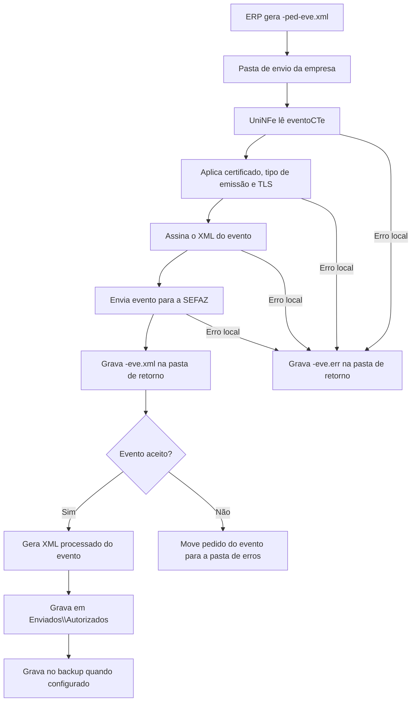

# Eventos do CTe

O serviço de eventos do CTe permite que o ERP envie eventos vinculados a um Conhecimento de Transporte Eletrônico já emitido. O ERP grava o XML do evento na pasta de envio, o UniNFe assina o XML, transmite o evento para a SEFAZ e grava o retorno na pasta de retorno.

Use este serviço quando for necessário registrar uma ocorrência fiscal relacionada ao CTe, como cancelamento, carta de correção, EPEC, comprovante de entrega, prestação em desacordo, insucesso de entrega ou eventos relacionados à vinculação de pagamento.

## Eventos atendidos nos exemplos

Os exemplos disponíveis para CTe cobrem estes tipos de evento:

| Tipo de evento | Descrição no XML |
|---|---|
| `110110` | Carta de Correcao |
| `110111` | Cancelamento |
| `110113` | EPEC |
| `110180` | Comprovante de Entrega do CT-e |
| `110181` | Cancelamento do Comprovante de Entrega do CT-e |
| `110190` | Insucesso na Entrega do CT-e |
| `110191` | Cancelamento do Insucesso de Entrega do CT-e |
| `110300` | Vinculacao do Pagamento |
| `110301` | Cancelamento da vinculacao do pagamento |
| `610110` | Prestacao do Servico em Desacordo |
| `610111` | Cancelamento Prestação do Serviço em Desacordo |

Use o tipo de evento, o detalhamento e as regras fiscais conforme o manual do CTe e conforme a situação real do documento.

## Pré-requisitos

Antes de enviar um evento, confira:

- A empresa emissora está cadastrada no UniNFe.
- A pasta de envio e a pasta de retorno estão configuradas.
- A pasta de XMLs enviados e a pasta de backup estão configuradas quando usadas pela empresa.
- O certificado digital da empresa está configurado e válido.
- O CTe referenciado no evento existe e a chave informada é a chave correta.
- O ambiente do evento é o mesmo ambiente em que o CTe foi emitido.
- O tipo de emissão informado no evento corresponde ao cenário fiscal, quando aplicável.

## Arquivo de envio

O ERP deve gerar o XML do evento na pasta de envio da empresa com o final fixo:

```text
<identificador>-ped-eve.xml
```

O `<identificador>` deve ser único para o evento. Uma forma prática é usar uma composição com o documento, o tipo de evento e a sequência.

Exemplos:

```text
canc50200206117473000150570010000005671227070615-ped-eve.xml
cce35150107565416000104570000000012301000012300-ped-eve.xml
epec41191110969488000113570010000000034295750350-ped-eve.xml
ce41131080568835000181570040000001081211931324-ped-eve.xml
eventoCTe_110300-ped-eve.xml
eventoCTe_110301-ped-eve.xml
```

O conteúdo do XML deve usar a estrutura de evento do CTe:

```xml
<?xml version="1.0" encoding="utf-8"?>
<eventoCTe versao="4.00" xmlns="http://www.portalfiscal.inf.br/cte">
  <infEvento Id="ID11011150200206117473000150570010000005671227070615001">
    <cOrgao>50</cOrgao>
    <tpAmb>2</tpAmb>
    <CNPJ>06117473000150</CNPJ>
    <chCTe>50200206117473000150570010000005671227070615</chCTe>
    <dhEvento>2023-05-15T17:05:06-03:00</dhEvento>
    <tpEvento>110111</tpEvento>
    <nSeqEvento>1</nSeqEvento>
    <detEvento versaoEvento="4.00">
      <evCancCTe>
        <descEvento>Cancelamento</descEvento>
        <nProt>500000000000000</nProt>
        <xJust>Justificativa para cancelamento da CTe de teste</xJust>
      </evCancCTe>
    </detEvento>
  </infEvento>
</eventoCTe>
```

Campos principais:

| Campo | Como preencher |
|---|---|
| `infEvento/@Id` | Identificador do evento. Deve ser compatível com o tipo de evento, a chave do CTe e a sequência. |
| `cOrgao` | Código da UF ou órgão responsável pelo evento. |
| `tpAmb` | Ambiente do evento. Use o mesmo ambiente do CTe. |
| `CNPJ` | CNPJ do emissor do evento. |
| `chCTe` | Chave de acesso do CTe vinculado ao evento. |
| `dhEvento` | Data e hora do evento. |
| `tpEvento` | Tipo do evento, como `110111`, `110110`, `110113`, `110180`, `110300` ou outro tipo aceito pelo leiaute. |
| `nSeqEvento` | Número sequencial do evento para a mesma chave e tipo de evento. |
| `detEvento` | Grupo de detalhes do evento. O conteúdo muda conforme o tipo de evento. |
| `nProt` | Número do protocolo do CTe ou do evento relacionado, quando exigido pelo tipo de evento. |
| `xJust` | Justificativa do evento, quando exigida pelo tipo de evento. |

Para carta de correção, o grupo de detalhes contém as informações corrigidas. Para EPEC, comprovante de entrega, insucesso de entrega, prestação em desacordo e eventos de pagamento, preencha os grupos específicos conforme o leiaute e a regra fiscal da operação.

## Fluxo de processamento

1. O ERP grava o arquivo `<identificador>-ped-eve.xml` na pasta de envio.
2. O UniNFe lê o XML `eventoCTe`.
3. O UniNFe aplica as configurações da empresa, certificado, tipo de emissão e conexão TLS quando configurada.
4. O UniNFe assina o XML do evento.
5. O evento é enviado para a SEFAZ.
6. O retorno do webservice é gravado na pasta de retorno como `<identificador>-eve.xml`.
7. Se o evento for aceito, o UniNFe gera o XML processado do evento em `Enviados\Autorizados`.
8. Quando houver pasta de backup configurada, o XML processado do evento também é gravado no backup.
9. Se o evento for rejeitado ou não puder ser confirmado como aceito, o XML original do pedido é movido para a pasta de erros.
10. Se ocorrer erro local, o UniNFe grava `<identificador>-eve.err` na pasta de retorno.
11. O arquivo de solicitação é removido da pasta de envio após o processamento.

## Fluxograma



## Arquivos gerados e movimentados

| Momento | Pasta | Nome do arquivo | Quando aparece |
|---|---|---|---|
| Pedido do evento | Pasta de envio | `<identificador>-ped-eve.xml` | Arquivo criado pelo ERP para enviar o evento do CTe. |
| Retorno ao ERP | Pasta de retorno | `<identificador>-eve.xml` | Retorno XML recebido da SEFAZ com o resultado do evento. |
| Erro ao ERP | Pasta de retorno | `<identificador>-eve.err` | Erro local antes ou durante o processamento do evento. |
| Evento processado | `Enviados\Autorizados\<subpasta por data>` | `<chaveCTe>_<tipoEvento>_<sequencia>-procEventoCTe.xml` | Evento aceito pela SEFAZ. O conteúdo do arquivo é um XML `procEventoCTe`. |
| Backup do evento processado | Pasta de backup, quando configurada | `<chaveCTe>_<tipoEvento>_<sequencia>-procEventoCTe.xml` | Cópia de segurança do evento aceito. |
| XML rejeitado ou não aceito | Pasta de erros configurada | `<identificador>-ped-eve.xml` | Evento rejeitado ou não confirmado como aceito pela SEFAZ. |

Na versão `3.00` do leiaute, a sequência do nome do XML processado é gravada com dois dígitos. Nas demais versões, a sequência é gravada com três dígitos.

## Como tratar o retorno

O ERP deve monitorar a pasta de retorno e aguardar:

```text
<identificador>-eve.xml
```

Esse arquivo contém a resposta da SEFAZ para o evento enviado. O ERP deve analisar o status e o motivo retornados.

Quando o evento for aceito, o UniNFe gera um XML processado do evento com o conteúdo `procEventoCTe`. O arquivo é gravado em `Enviados\Autorizados`, dentro da subpasta de data configurada, usando o padrão:

```text
<chaveCTe>_<tipoEvento>_<sequencia>-procEventoCTe.xml
```

O ERP deve armazenar esse XML como comprovante do evento aceito. Para eventos como cancelamento, carta de correção e EPEC, o UniNFe também pode acionar a rotina de geração ou impressão configurada para o documento.

Quando o evento for rejeitado, o ERP deve apresentar o motivo ao usuário, corrigir os dados e gerar um novo arquivo `-ped-eve.xml` na pasta de envio.

## Erros locais

Se o UniNFe não conseguir concluir o processamento por falha local, será gerado:

```text
<identificador>-eve.err
```

As causas mais comuns são:

- XML do evento fora da estrutura esperada.
- Identificador do evento incompatível com tipo, chave ou sequência.
- Chave do CTe ausente ou inválida.
- Certificado digital ausente, inválido ou vencido.
- Ambiente do evento diferente do ambiente do CTe.
- Tipo de emissão incompatível com o evento.
- Falha de assinatura.
- Falha de comunicação com o webservice.
- Falha de permissão ou acesso às pastas configuradas.

Depois de corrigir o problema, gere novamente o arquivo `<identificador>-ped-eve.xml` na pasta de envio.

## Cuidados para o integrador

- Use sempre o final `-ped-eve.xml` para envio de evento do CTe.
- Informe `tpEvento` e `nSeqEvento` de acordo com a operação fiscal.
- Mantenha o identificador `infEvento/@Id` compatível com o evento enviado.
- Use o mesmo ambiente do CTe original.
- Aguarde o arquivo `-eve.xml` para interpretar o retorno da SEFAZ.
- Armazene o XML processado do evento quando o evento for aceito.
- Em rejeições, corrija o XML e envie um novo pedido de evento.
- Em erros `.err`, corrija a causa local antes de reenviar.
