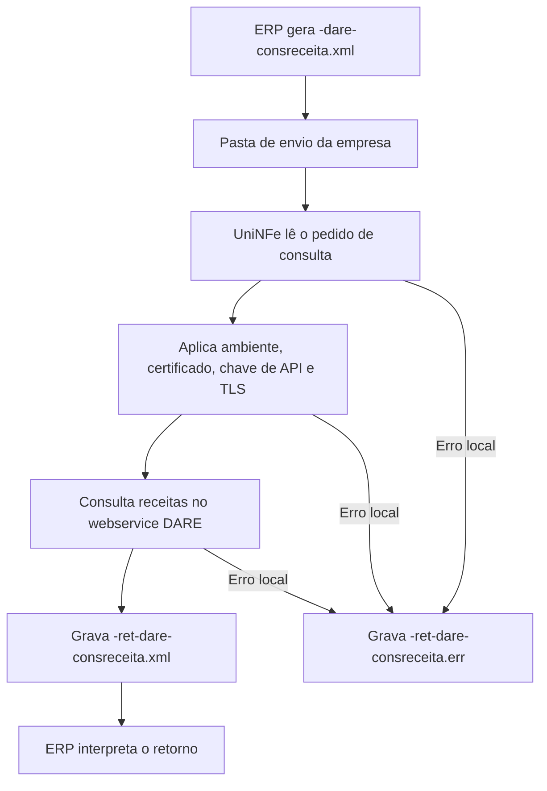

# Consulta de receitas do DARE

A consulta de receitas do DARE permite que o ERP solicite ao UniNFe a lista de receitas disponíveis no serviço DARE. O UniNFe lê o pedido gravado na pasta de envio da empresa, consulta o webservice e grava o retorno para o ERP na pasta de retorno.

Use este serviço quando o ERP precisa obter as receitas do DARE para preencher, validar ou atualizar opções usadas na geração de documentos DARE.

## Pré-requisitos

Antes de executar a consulta, confira na configuração da empresa:

- A empresa está cadastrada no UniNFe.
- A pasta de envio e a pasta de retorno estão configuradas.
- O certificado digital está configurado e válido.
- O ambiente da empresa está configurado conforme a consulta desejada.
- A senha ou chave de API do webservice DARE está configurada.
- As configurações de proxy e conexão TLS estão corretas, se a rede exigir proxy ou preparação TLS.

## Arquivo de envio

O ERP deve gerar o arquivo XML na pasta de envio da empresa com o final fixo:

```text
<identificador>-dare-consreceita.xml
```

O `<identificador>` deve ser único para a consulta. Ele pode ser uma data/hora, um número sequencial ou outro identificador controlado pelo ERP.

Exemplo:

```text
Receitas-dare-consreceita.xml
```

O conteúdo do XML deve usar a raiz `Receitas`:

```xml
<?xml version="1.0" encoding="utf-8"?>
<Receitas>
  <consulta>CONSULTAR</consulta>
</Receitas>
```

Campos principais:

| Campo | Como preencher |
|---|---|
| `Receitas` | Elemento principal do pedido de consulta de receitas. |
| `consulta` | Informe `CONSULTAR` para solicitar a consulta das receitas disponíveis. |

## Fluxo de processamento

1. O ERP grava o arquivo `<identificador>-dare-consreceita.xml` na pasta de envio da empresa.
2. O UniNFe identifica o pedido de consulta de receitas do DARE.
3. O UniNFe aplica as configurações da empresa, incluindo ambiente, certificado digital, chave de API e preparação TLS quando configurada.
4. A consulta é enviada ao webservice DARE.
5. O retorno do webservice é gravado como `<identificador>-ret-dare-consreceita.xml` na pasta de retorno.
6. Se ocorrer falha local antes ou durante a consulta, o UniNFe grava `<identificador>-ret-dare-consreceita.err` na pasta de retorno.
7. O arquivo de solicitação é removido da pasta de envio após o processamento.

## Fluxograma



## Arquivos gerados

| Momento | Pasta | Nome do arquivo | Quando aparece |
|---|---|---|---|
| Pedido | Pasta de envio | `<identificador>-dare-consreceita.xml` | Arquivo criado pelo ERP para consultar receitas do DARE. |
| Retorno | Pasta de retorno | `<identificador>-ret-dare-consreceita.xml` | Retorno XML recebido do webservice DARE. |
| Erro ao ERP | Pasta de retorno | `<identificador>-ret-dare-consreceita.err` | Erro local antes ou durante a consulta, como falha de leitura, certificado, comunicação ou gravação. |

## Como tratar o retorno

O ERP deve monitorar a pasta de retorno e aguardar o arquivo:

```text
<identificador>-ret-dare-consreceita.xml
```

Esse arquivo contém o retorno XML recebido do webservice DARE. O ERP deve ler o conteúdo retornado e tratar a resposta conforme o status, motivo e dados de receitas disponibilizados pelo serviço.

## Erros locais

Se a consulta não puder ser concluída por falha local, será gerado:

```text
<identificador>-ret-dare-consreceita.err
```

As causas mais comuns são:

- XML fora da estrutura esperada.
- Campo `consulta` ausente ou preenchido incorretamente.
- Certificado digital ausente, inválido ou vencido.
- Ambiente da empresa configurado incorretamente.
- Senha ou chave de API do webservice DARE ausente ou inválida.
- Proxy ou conexão TLS configurados incorretamente.
- Falha de comunicação com o webservice.
- Falha de permissão ou acesso às pastas configuradas.

Depois de corrigir o problema, gere novamente o arquivo de consulta na pasta de envio.

## Cuidados para o integrador

- Use sempre o final `-dare-consreceita.xml` no arquivo de envio.
- Use um identificador único para relacionar o pedido ao retorno.
- Preencha o campo `consulta` com `CONSULTAR`.
- Aguarde o retorno `-ret-dare-consreceita.xml` antes de atualizar os dados no ERP.
- Trate arquivos `.err` como falhas locais e corrija a causa antes de reenviar a consulta.
