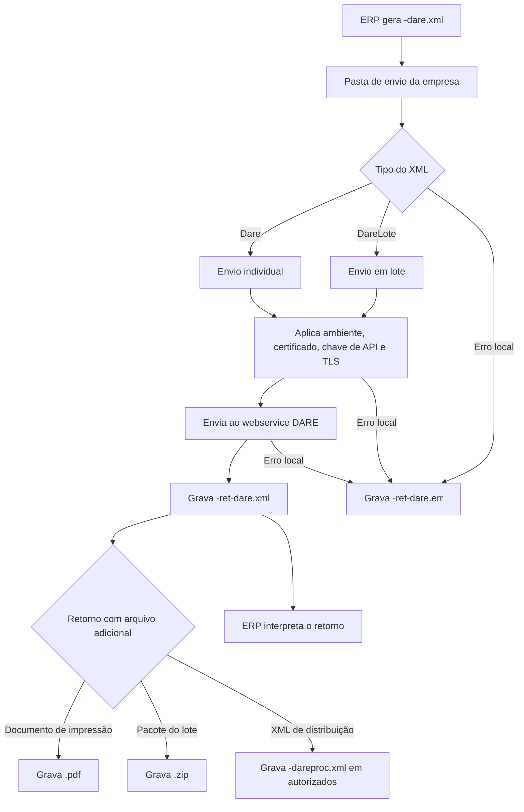

# Recepção do DARE

A recepção do DARE permite que o ERP envie ao UniNFe um pedido de geração de DARE individual ou em lote. O UniNFe lê o XML gravado na pasta de envio da empresa, envia o pedido ao webservice DARE e grava os arquivos de retorno para o ERP.

Use este serviço quando o ERP precisa gerar DARE e obter o retorno do serviço, incluindo o XML de resposta e, quando disponibilizado pelo webservice, o arquivo de impressão ou o pacote de documentos.

## Pré-requisitos

Antes de executar a recepção, confira na configuração da empresa:

- A empresa está cadastrada no UniNFe.
- A pasta de envio, a pasta de retorno e a pasta de XMLs enviados estão configuradas.
- O certificado digital está configurado e válido.
- O ambiente da empresa está configurado conforme o envio desejado.
- A senha ou chave de API do webservice DARE está configurada.
- As configurações de proxy e conexão TLS estão corretas, se a rede exigir proxy ou preparação TLS.

## Arquivo de envio

O ERP deve gerar o arquivo XML na pasta de envio da empresa com o final fixo:

```text
<identificador>-dare.xml
```

O `<identificador>` deve ser único para o envio. Ele pode ser uma data/hora, um número sequencial, o número de controle do DARE ou outro identificador controlado pelo ERP.

Exemplos:

```text
DARE-dare.xml
DARELote-dare.xml
```

O XML pode ser enviado em duas estruturas:

| Estrutura | Quando usar |
|---|---|
| `Dare` | Para geração de um DARE individual. |
| `DareLote` | Para geração de DARE em lote. |

## Envio individual

Para envio individual, o XML deve usar a raiz `Dare`:

```xml
<?xml version="1.0" encoding="utf-8"?>
<Dare xmlns="https://portal.fazenda.sp.gov.br/servicos/dare">
  <numeroControleDarePrincipal>123456789</numeroControleDarePrincipal>
  <gerarPDF>true</gerarPDF>
  <cnpj>06117473000150</cnpj>
  <cidade>São Paulo</cidade>
  <dataVencimento>2024-11-04T14:27:02</dataVencimento>
  <receita>
    <codigo>046-2</codigo>
    <codigoServicoDARE>4601</codigoServicoDARE>
    <nome>ICMS- Operações Próprias- RPA (04601)</nome>
  </receita>
  <referencia>10/2024</referencia>
  <uf>SP</uf>
  <valor>1.00</valor>
  <valorTotal>16.00</valorTotal>
</Dare>
```

Campos principais:

| Campo | Como preencher |
|---|---|
| `numeroControleDarePrincipal` | Número de controle usado para identificar o DARE. |
| `gerarPDF` | Informe `true` quando desejar que o serviço disponibilize o documento de impressão. |
| `cnpj` | CNPJ do contribuinte. |
| `cidade` | Cidade do contribuinte. |
| `dataVencimento` | Data e hora de vencimento no formato aceito pelo XML. |
| `receita/codigo` | Código da receita. |
| `receita/codigoServicoDARE` | Código do serviço DARE. |
| `receita/nome` | Nome da receita. |
| `referencia` | Referência do pagamento. |
| `uf` | UF relacionada ao DARE. |
| `valor`, `valorJuros`, `valorMulta`, `valorTotal` | Valores enviados para geração do DARE. |

## Envio em lote

Para envio em lote, o XML deve usar a raiz `DareLote`:

```xml
<?xml version="1.0" encoding="utf-8"?>
<DareLote xmlns="https://portal.fazenda.sp.gov.br/servicos/dare">
  <tipoAgrupamentoFilhotes>1</tipoAgrupamentoFilhotes>
  <itensParaGeracao>
    <numeroControleDarePrincipal>123456789</numeroControleDarePrincipal>
    <gerarPDF>true</gerarPDF>
    <cnpj>12345678000195</cnpj>
    <cidade>São Paulo</cidade>
    <dataVencimento>2024-10-31T15:10:49</dataVencimento>
    <receita>
      <codigo>046-2</codigo>
      <codigoServicoDARE>4601</codigoServicoDARE>
      <escopoUso>2</escopoUso>
      <nome>ICMS - Operações Próprias- RPA (04601)</nome>
    </receita>
    <referencia>07/2024</referencia>
    <uf>SP</uf>
    <valor>2.00</valor>
    <valorTotal>2.00</valorTotal>
  </itensParaGeracao>
</DareLote>
```

Campos principais:

| Campo | Como preencher |
|---|---|
| `tipoAgrupamentoFilhotes` | Tipo de agrupamento usado para os itens do lote. |
| `itensParaGeracao` | Grupo repetível com os dados de cada DARE que será gerado. |
| `dadosContribuinteNaoCadastrado` | Dados do contribuinte quando o envio exigir contribuinte não cadastrado. |
| `receita/escopoUso` | Escopo de uso da receita, quando exigido no item do lote. |

Os demais campos de cada item seguem a mesma finalidade do envio individual.

## Fluxo de processamento

1. O ERP grava o arquivo `<identificador>-dare.xml` na pasta de envio da empresa.
2. O UniNFe identifica se o XML é um envio individual ou em lote.
3. O UniNFe aplica as configurações da empresa, incluindo ambiente, certificado digital, chave de API e preparação TLS quando configurada.
4. O pedido é enviado ao webservice DARE.
5. O retorno do webservice é gravado como `<identificador>-ret-dare.xml` na pasta de retorno.
6. No envio individual, quando o retorno disponibiliza o documento de impressão, o UniNFe grava `<identificador>.pdf` na pasta de retorno.
7. No envio em lote, quando o retorno disponibiliza um pacote de documentos, o UniNFe grava `<identificador>.zip` na pasta de retorno.
8. Quando há XML de distribuição, o UniNFe grava `<identificador>-dareproc.xml` na pasta de XMLs autorizados da empresa.
9. Se ocorrer falha local antes ou durante o envio, o UniNFe grava `<identificador>-ret-dare.err` na pasta de retorno.
10. O arquivo de solicitação é removido da pasta de envio após o processamento.

## Fluxograma



## Arquivos gerados

| Momento | Pasta | Nome do arquivo | Quando aparece |
|---|---|---|---|
| Pedido | Pasta de envio | `<identificador>-dare.xml` | Arquivo criado pelo ERP para gerar DARE individual ou em lote. |
| Retorno | Pasta de retorno | `<identificador>-ret-dare.xml` | Retorno XML recebido do webservice DARE. |
| Documento de impressão | Pasta de retorno | `<identificador>.pdf` | Gerado no envio individual quando o webservice disponibiliza o documento de impressão. |
| Pacote de documentos | Pasta de retorno | `<identificador>.zip` | Gerado no envio em lote quando o webservice disponibiliza o pacote para download. |
| XML processado | Pasta de XMLs autorizados | `<identificador>-dareproc.xml` | Gravado quando há XML de distribuição retornado pelo serviço. |
| Erro ao ERP | Pasta de retorno | `<identificador>-ret-dare.err` | Erro local antes ou durante o envio, como falha de leitura, certificado, comunicação ou gravação. |

## Como tratar o retorno

O ERP deve monitorar a pasta de retorno e aguardar o arquivo:

```text
<identificador>-ret-dare.xml
```

Esse arquivo contém o retorno XML recebido do webservice DARE. O ERP deve ler o status, motivo e dados retornados antes de considerar o DARE como gerado.

Quando houver `<identificador>.pdf`, o arquivo pode ser usado para impressão ou disponibilização ao usuário. Quando houver `<identificador>.zip`, o ERP deve extrair ou armazenar o pacote conforme a regra de negócio. Quando houver `<identificador>-dareproc.xml`, ele representa o XML processado gravado na pasta de autorizados do UniNFe.

## Erros locais

Se o envio não puder ser concluído por falha local, será gerado:

```text
<identificador>-ret-dare.err
```

As causas mais comuns são:

- XML fora da estrutura esperada.
- Raiz diferente de `Dare` ou `DareLote`.
- Campos obrigatórios ausentes ou preenchidos incorretamente.
- Certificado digital ausente, inválido ou vencido.
- Ambiente da empresa configurado incorretamente.
- Senha ou chave de API do webservice DARE ausente ou inválida.
- Proxy ou conexão TLS configurados incorretamente.
- Falha de comunicação com o webservice.
- Falha de permissão ou acesso às pastas configuradas.

Depois de corrigir o problema, gere novamente o arquivo de envio na pasta de envio.

## Cuidados para o integrador

- Use sempre o final `-dare.xml` no arquivo de envio.
- Use a raiz `Dare` para envio individual e `DareLote` para envio em lote.
- Use um identificador único para relacionar pedido, retorno, PDF, ZIP e XML processado.
- Preencha `gerarPDF` com `true` quando desejar receber o documento de impressão, se o serviço disponibilizar esse retorno.
- Aguarde o retorno `-ret-dare.xml` antes de considerar o envio concluído.
- Trate arquivos `.err` como falhas locais e corrija a causa antes de reenviar o pedido.
