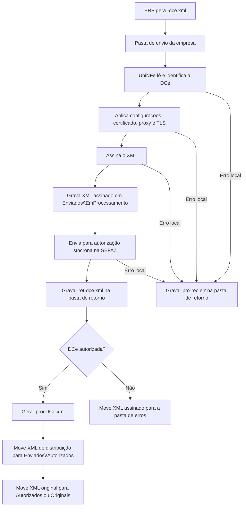

# Autorização síncrona de DCe

A autorização síncrona de DCe permite que o ERP envie uma Declaração de Conteúdo Eletrônica ao UniNFe por troca de arquivos. O ERP grava o XML da DCe na pasta de envio configurada para a empresa, o UniNFe assina o documento, transmite para a SEFAZ e grava o retorno na pasta de retorno.

Use este serviço quando a empresa emite DCe e precisa que o UniNFe faça o envio direto do XML para autorização.

## Pré-requisitos

Antes de enviar uma DCe, confira na configuração da empresa:

- A empresa emissora está cadastrada no UniNFe.
- A pasta de envio, a pasta de retorno e a pasta de XMLs enviados estão configuradas.
- O certificado digital da empresa está configurado e válido.
- O ambiente de emissão está configurado conforme a operação desejada.
- As configurações de proxy estão preenchidas, se a rede exigir proxy para acesso à internet.

## Arquivo de envio

O ERP deve gerar o XML da DCe na pasta de envio da empresa com o final fixo:

```text
<identificador>-dce.xml
```

O `<identificador>` deve ser único para evitar conflito entre documentos. Normalmente ele é a chave da DCe.

Exemplo:

```text
3526050000000000019959900000000011000001234567-dce.xml
```

O conteúdo do arquivo deve ser o XML da DCe, com a estrutura esperada para o documento fiscal:

```xml
<DCe xmlns="http://www.portalfiscal.inf.br/dce">
  <infDCe versao="1.00" Id="DCe3526050000000000019959900000000011000001234567">
    <ide>
      <cUF>35</cUF>
      <cDC>000123</cDC>
      <mod>99</mod>
      <serie>0</serie>
      <nDC>1</nDC>
      <dhEmi>2026-05-04T10:00:00-03:00</dhEmi>
      <tpEmis>1</tpEmis>
      <tpEmit>2</tpEmit>
      <tpAmb>2</tpAmb>
    </ide>
    <emit>
      <CNPJ>00000000000199</CNPJ>
      <xNome>Emitente Teste</xNome>
    </emit>
    <dest>
      <CPF>12345678909</CPF>
      <xNome>Destinatario Teste</xNome>
    </dest>
  </infDCe>
</DCe>
```

O exemplo acima mostra apenas os principais grupos. O XML real deve conter todos os campos exigidos pelo leiaute da DCe para a operação fiscal.

Campos e grupos principais:

| Campo ou grupo | Como preencher |
|---|---|
| `infDCe/@Id` | Identificador da DCe. Deve ser compatível com a chave de acesso do documento. |
| `ide` | Dados de identificação da DCe, como UF, código, modelo, série, número, emissão, ambiente e tipo de emissão. |
| `emit` | Dados do emitente da DCe. |
| `dest` | Dados do destinatário. |
| `autXML` | Pessoas autorizadas a acessar o XML, quando aplicável. |
| `det` | Itens ou produtos declarados. |
| `total` | Totais da DCe. |
| `transp` | Dados de transporte, quando exigidos pela operação. |
| `infAdic` | Informações adicionais. |
| `infDCeSupl` | Informações suplementares, como QR Code e URL de consulta, quando exigidas. |

Não inclua XML de consulta, evento ou status de serviço neste arquivo. Este serviço é síncrono: o envio e o retorno do webservice acontecem no mesmo processamento.

## Fluxo de processamento

1. O ERP grava o arquivo `<identificador>-dce.xml` na pasta de envio.
2. O UniNFe identifica o documento como DCe pelo XML e pelo final do arquivo.
3. O UniNFe lê o XML, aplica as configurações da empresa, prepara certificado, proxy e conexão TLS quando configurado.
4. O XML é assinado e gravado em `Enviados\EmProcessamento` com o mesmo nome do arquivo de envio.
5. O UniNFe envia a DCe para autorização síncrona na SEFAZ.
6. O retorno do webservice é gravado na pasta de retorno como `<identificador>-ret-dce.xml`.
7. Se a DCe for autorizada, o UniNFe cria o XML de distribuição `<identificador>-procDCe.xml` e move os arquivos para a pasta de autorizados.
8. Se a configuração da empresa estiver marcada para salvar somente o XML de distribuição, o XML original assinado é movido para `Enviados\Originais`.
9. Se a DCe for rejeitada, o XML assinado é movido para a pasta de erros e o ERP deve tratar a rejeição informada no retorno.
10. Se ocorrer erro local no processamento, o UniNFe grava um arquivo `<identificador>-pro-rec.err` na pasta de retorno com os detalhes do erro.

## Fluxograma



## Arquivos gerados e movimentados

| Momento | Pasta | Nome do arquivo | Quando aparece |
|---|---|---|---|
| Envio pelo ERP | Pasta de envio | `<identificador>-dce.xml` | Arquivo criado pelo ERP para solicitar a autorização da DCe. |
| Em processamento | `Enviados\EmProcessamento` | `<identificador>-dce.xml` | XML já assinado pelo UniNFe enquanto o serviço está processando a autorização. |
| Retorno ao ERP | Pasta de retorno | `<identificador>-ret-dce.xml` | Retorno XML recebido do webservice, tanto para autorização quanto para rejeição retornada pela SEFAZ. |
| Erro ao ERP | Pasta de retorno | `<identificador>-pro-rec.err` | Erro local antes ou durante o processamento, como falha de leitura, certificado, assinatura, comunicação ou gravação. |
| XML de distribuição | `Enviados\Autorizados\<subpasta por data>` | `<identificador>-procDCe.xml` | DCe autorizada. É o XML principal para armazenamento fiscal e uso pelo ERP. |
| XML original assinado | `Enviados\Autorizados\<subpasta por data>` ou `Enviados\Originais\<subpasta por data>` | `<identificador>-dce.xml` | DCe autorizada. O destino depende da configuração para salvar somente o XML de distribuição. |
| XML rejeitado | Pasta de erros configurada | `<identificador>-dce.xml` | DCe rejeitada pela SEFAZ ou com falha que exige correção e novo envio. |

## Como tratar o retorno

O ERP deve monitorar a pasta de retorno e aguardar o arquivo:

```text
<identificador>-ret-dce.xml
```

Esse arquivo contém a resposta do webservice da SEFAZ. O ERP deve ler as informações de status, motivo e protocolo quando existirem. Quando o status indicar autorização, o ERP também deve localizar e armazenar o XML de distribuição:

```text
<identificador>-procDCe.xml
```

O XML de distribuição é gravado na pasta `Enviados\Autorizados`, dentro da subpasta criada conforme a configuração de organização por data. Ele contém a DCe autorizada com o protocolo anexado.

Quando o status indicar rejeição, o ERP deve apresentar o motivo ao usuário, corrigir os dados da DCe e gerar um novo arquivo `-dce.xml` na pasta de envio. A rejeição não deve ser tratada como autorização.

## Erros locais

Se o UniNFe não conseguir concluir o processamento por falha local, será gerado um arquivo de erro na pasta de retorno:

```text
<identificador>-pro-rec.err
```

Esse arquivo deve ser tratado pelo ERP ou pelo suporte antes de reenviar a DCe. As causas mais comuns são:

- XML fora da estrutura esperada.
- Certificado digital ausente, inválido ou vencido.
- Falha de assinatura.
- Ambiente, proxy ou conexão TLS configurados incorretamente.
- Falha de comunicação com o webservice.
- Falha de permissão ou acesso às pastas configuradas.

Depois de corrigir o problema, gere novamente o arquivo `<identificador>-dce.xml` na pasta de envio.

## Cuidados para o integrador

- Use sempre o final `-dce.xml` para o arquivo de envio da DCe.
- Não reutilize o mesmo identificador enquanto houver processamento pendente para o documento.
- Aguarde o arquivo `-ret-dce.xml` para saber o resultado retornado pela SEFAZ.
- Armazene o XML `-procDCe.xml` quando a DCe for autorizada.
- Em rejeições, corrija o XML e envie novamente; não altere manualmente arquivos em `EmProcessamento`.
- Em erros `.err`, corrija a causa local antes de reenviar o documento.
