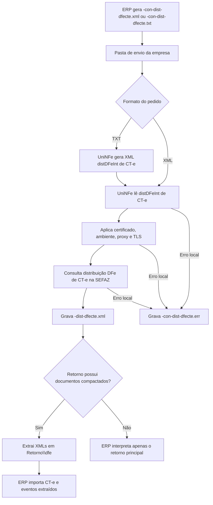

# Distribuição DFe de CT-e

A distribuição DFe de CT-e permite que o ERP consulte documentos e eventos de CT-e disponibilizados pela SEFAZ para um CNPJ ou CPF. O UniNFe lê o pedido gravado na pasta de envio da empresa, envia a consulta para a SEFAZ, grava o retorno principal para o ERP e extrai os XMLs compactados retornados pelo serviço.

Use este serviço quando o ERP precisa buscar CT-e ou eventos de CT-e distribuídos pela SEFAZ, controlando a sequência de documentos por NSU.

## Quando usar

Use a distribuição DFe de CT-e quando:

- O ERP precisa consultar documentos disponíveis a partir do último NSU conhecido.
- O ERP precisa consultar um NSU específico de CT-e.
- O ERP precisa importar XMLs processados de CT-e retornados pela distribuição.
- O ERP precisa importar eventos processados de CT-e retornados pela distribuição.
- A empresa precisa manter busca contínua de documentos destinados ou relacionados ao seu CNPJ ou CPF.

Para distribuição DFe de NF-e, use a página [Distribuição DFe](distribuicao-dfe.md).

## Pré-requisitos

Antes de executar a consulta, confira na configuração da empresa:

- A empresa está cadastrada no UniNFe.
- A pasta de envio e a pasta de retorno estão configuradas.
- O certificado digital está configurado e válido.
- O ambiente informado no XML ou TXT está correto.
- A UF autorizadora está correta.
- As configurações de proxy e conexão TLS estão corretas, se a rede exigir proxy ou preparação TLS.

## Arquivo de envio em XML

Para consultar por XML, o ERP deve gerar o arquivo na pasta de envio da empresa com o final fixo:

```text
<identificador>-con-dist-dfecte.xml
```

Exemplo:

```text
20120701184701-comCNPJ-con-dist-dfecte.xml
```

O XML deve usar a raiz `distDFeInt` no leiaute de distribuição DFe do CT-e:

```xml
<?xml version="1.0" encoding="utf-8"?>
<distDFeInt versao="1.00" xmlns="http://www.portalfiscal.inf.br/cte">
  <tpAmb>1</tpAmb>
  <cUFAutor>35</cUFAutor>
  <CNPJ>11111111111111</CNPJ>
  <distNSU>
    <ultNSU>000000000000000</ultNSU>
  </distNSU>
</distDFeInt>
```

Também é possível consultar informando CPF:

```xml
<?xml version="1.0" encoding="utf-8"?>
<distDFeInt versao="1.00" xmlns="http://www.portalfiscal.inf.br/cte">
  <tpAmb>2</tpAmb>
  <cUFAutor>35</cUFAutor>
  <CPF>22233366605</CPF>
  <distNSU>
    <ultNSU>000000000000000</ultNSU>
  </distNSU>
</distDFeInt>
```

Para consultar um NSU específico, use `consNSU`:

```xml
<?xml version="1.0" encoding="utf-8"?>
<distDFeInt versao="1.00" xmlns="http://www.portalfiscal.inf.br/cte">
  <tpAmb>2</tpAmb>
  <cUFAutor>35</cUFAutor>
  <CNPJ>11111111111111</CNPJ>
  <consNSU>
    <NSU>000000000000000</NSU>
  </consNSU>
</distDFeInt>
```

Campos principais:

| Campo | Como preencher |
|---|---|
| `versao` | Versão do leiaute da distribuição DFe de CT-e. |
| `tpAmb` | Ambiente da consulta. Use `1` para produção ou `2` para homologação. |
| `cUFAutor` | Código da UF autorizadora da consulta. |
| `CNPJ` | CNPJ do interessado na distribuição. |
| `CPF` | CPF do interessado, quando a consulta for feita por pessoa física. Use `CNPJ` ou `CPF`, não ambos. |
| `distNSU/ultNSU` | Último NSU conhecido pelo ERP. Use para buscar documentos posteriores a esse NSU. |
| `consNSU/NSU` | NSU específico que o ERP deseja consultar. |

## Arquivo de envio em TXT

Para consultar por TXT, o ERP deve gerar o arquivo na pasta de envio da empresa com o final fixo:

```text
<identificador>-con-dist-dfecte.txt
```

Estrutura do TXT:

```text
versao|1.00
tpAmb|1
cUFAutor|35
CNPJ|11111111111111
ultNSU|000000000000000
```

Também é possível usar `CPF` no lugar de `CNPJ`, ou `NSU` no lugar de `ultNSU`.

Campos principais:

| Linha | Como preencher |
|---|---|
| `versao` | Versão do leiaute da distribuição DFe de CT-e. |
| `tpAmb` | Ambiente da consulta. |
| `cUFAutor` | Código da UF autorizadora. |
| `CNPJ` | CNPJ do interessado. |
| `CPF` | CPF do interessado, quando aplicável. |
| `ultNSU` | Último NSU conhecido pelo ERP. |
| `NSU` | NSU específico que será consultado. |

Ao receber um pedido em TXT, o UniNFe gera o XML correspondente e segue o processamento da consulta pelo leiaute XML.

## Fluxo de processamento

1. O ERP grava `<identificador>-con-dist-dfecte.xml` ou `<identificador>-con-dist-dfecte.txt` na pasta de envio da empresa.
2. Quando o pedido está em TXT, o UniNFe converte o conteúdo para XML de distribuição DFe de CT-e.
3. O UniNFe lê o XML `distDFeInt`.
4. O UniNFe aplica certificado digital, ambiente informado no pedido, proxy e preparação TLS quando configurados.
5. A consulta é enviada para a SEFAZ.
6. O retorno principal é gravado como `<identificador>-dist-dfecte.xml` na pasta de retorno.
7. Os documentos compactados do retorno são descompactados na subpasta `dfe` dentro da pasta de retorno.
8. Se houver configuração de envio de retornos por FTP, os XMLs extraídos também podem ser enviados para a pasta de FTP configurada.
9. Se ocorrer falha local antes ou durante a consulta, o UniNFe grava `<identificador>-con-dist-dfecte.err` na pasta de retorno.
10. O arquivo de solicitação é removido da pasta de envio após o processamento.

## Fluxograma



## Arquivos gerados

| Momento | Pasta | Nome do arquivo | Quando aparece |
|---|---|---|---|
| Pedido XML | Pasta de envio | `<identificador>-con-dist-dfecte.xml` | Arquivo criado pelo ERP para consultar a distribuição DFe de CT-e em XML. |
| Pedido TXT | Pasta de envio | `<identificador>-con-dist-dfecte.txt` | Arquivo criado pelo ERP para consultar a distribuição DFe de CT-e em TXT. |
| XML convertido | Pasta de processamento configurada pelo UniNFe | `<identificador>-con-dist-dfecte.xml` | Gerado a partir do TXT antes da consulta. |
| Retorno principal | Pasta de retorno | `<identificador>-dist-dfecte.xml` | Retorno XML recebido da SEFAZ. |
| Erro ao ERP | Pasta de retorno | `<identificador>-con-dist-dfecte.err` | Erro local antes ou durante a consulta, como falha de leitura, certificado, comunicação ou gravação. |
| XMLs extraídos | `Retorno\dfe` | `<chave>-procCTe.xml` ou `<identificador>-<NSU>-procCTe.xml` | CT-e processado retornado pela distribuição. O nome pode usar a chave ou o NSU, conforme a configuração da empresa. |
| XMLs extraídos | `Retorno\dfe` | `<chave>_<tipoEvento>_<sequencia>-procEventoCTe.xml` ou `<identificador>-<NSU>-procEventoCTe.xml` | Evento processado de CT-e. O nome pode usar chave/tipo/sequência ou o NSU, conforme a configuração da empresa. |

## Como tratar o retorno

O ERP deve monitorar a pasta de retorno e aguardar:

```text
<identificador>-dist-dfecte.xml
```

Esse arquivo contém o retorno principal da SEFAZ, incluindo status, motivo, último NSU, maior NSU e os documentos compactados quando houver documentos disponíveis.

Depois de ler o retorno principal, o ERP deve verificar a subpasta:

```text
Retorno\dfe
```

Nessa subpasta ficam os XMLs descompactados pelo UniNFe. O ERP deve importar esses arquivos conforme o tipo retornado: CT-e processado ou evento processado de CT-e.

O controle de NSU deve ficar no ERP. Após processar um retorno bem-sucedido, armazene o último NSU retornado e utilize-o na próxima consulta por `ultNSU`.

## Erros locais

Se a consulta não puder ser concluída por falha local, será gerado:

```text
<identificador>-con-dist-dfecte.err
```

As causas mais comuns são:

- XML ou TXT fora da estrutura esperada.
- `CNPJ` e `CPF` ausentes, ou preenchimento simultâneo indevido.
- Falta de `ultNSU` ou `NSU` para definir o tipo de consulta.
- Certificado digital ausente, inválido ou vencido.
- Ambiente ou UF autorizadora preenchidos incorretamente.
- Proxy ou conexão TLS configurados incorretamente.
- Falha de comunicação com a SEFAZ.
- Falha de permissão ou acesso às pastas configuradas.

Depois de corrigir o problema, gere novamente o arquivo de consulta na pasta de envio.

## Cuidados para o integrador

- Use `-con-dist-dfecte.xml` para pedido XML.
- Use `-con-dist-dfecte.txt` para pedido TXT.
- Use um identificador único para relacionar pedido, retorno principal e XMLs extraídos.
- Controle o último NSU processado no ERP.
- Consulte por `ultNSU` para buscar novos documentos de forma contínua.
- Use `NSU` quando precisar reconsultar um NSU específico.
- Importe os XMLs da subpasta `Retorno\dfe` somente depois de receber o retorno principal da consulta.
- Em erros `.err`, corrija a causa local antes de reenviar a consulta.
