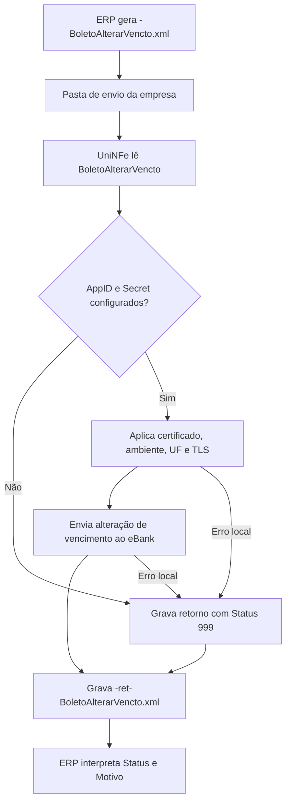

# Alterar vencimento do boleto

O serviço de alteração de vencimento do eBoleto permite que o ERP solicite ao eBank a alteração da data de vencimento de um boleto já existente. O ERP grava o XML de solicitação na pasta de envio da empresa, o UniNFe executa a integração com o eBank e grava o XML de retorno na pasta de retorno.

Use este serviço quando o boleto já foi registrado no banco e a empresa precisa alterar sua data de vencimento.

## Pré-requisitos

Antes de enviar a solicitação, confira na configuração da empresa:

- A empresa está cadastrada no UniNFe.
- A pasta de envio e a pasta de retorno estão configuradas.
- O certificado digital está configurado e válido quando exigido pela integração.
- O ambiente da empresa está configurado conforme a operação desejada.
- A UF da empresa está configurada.
- Os campos `e-bank - AppID` e `e-bank - Secret` estão preenchidos na aba de integrações da configuração da empresa.

Sem `AppID` e `Secret`, o UniNFe não executa o serviço e grava um retorno de erro para o ERP.

## Arquivo de envio

O ERP deve gerar o XML de alteração de vencimento na pasta de envio da empresa com o final fixo:

```text
<identificador>-BoletoAlterarVencto.xml
```

O `<identificador>` deve ser único para a solicitação. Ele pode ser uma data/hora, um número sequencial ou outro controle do ERP.

Exemplo:

```text
20230523T103002_01-BoletoAlterarVencto.xml
```

O conteúdo do XML deve usar a estrutura `BoletoAlterarVencto`:

```xml
<?xml version="1.0" encoding="UTF-8"?>
<BoletoAlterarVencto versao="1.00">
  <ConfigurationId>ZCKWGQ55LTDXKYYC</ConfigurationId>
  <DataVencimento>2025-04-03</DataVencimento>
  <NumeroNoBanco>-2147483641</NumeroNoBanco>
  <Testing>true</Testing>
  <UseHomologServer>true</UseHomologServer>
</BoletoAlterarVencto>
```

Campos principais:

| Campo | Como preencher |
|---|---|
| `ConfigurationId` | ID da configuração da conta corrente no eBank. Esse identificador é fornecido pela Unimake. |
| `DataVencimento` | Nova data de vencimento do boleto, no formato `AAAA-MM-DD`. |
| `NumeroNoBanco` | Número do boleto no banco. |
| `Testing` | Campo opcional. Use `true` para teste e `false` para produção. |
| `UseHomologServer` | Campo opcional. Use somente quando for necessário direcionar a solicitação para ambiente de homologação/depuração solicitado pelo eBank. |

## Fluxo de processamento

1. O ERP grava o arquivo `<identificador>-BoletoAlterarVencto.xml` na pasta de envio.
2. O UniNFe lê o XML e identifica a solicitação de alteração de vencimento.
3. O UniNFe valida se `AppID` e `Secret` do eBank estão configurados para a empresa.
4. O UniNFe aplica as configurações da empresa, certificado, ambiente, UF e preparação TLS quando configurada.
5. A solicitação é enviada ao eBank.
6. O retorno do eBank é gravado na pasta de retorno como `<identificador>-ret-BoletoAlterarVencto.xml`.
7. Se ocorrer falha local ou falha retornada pela integração, o UniNFe grava o mesmo arquivo de retorno com status de erro.
8. O arquivo de solicitação é removido da pasta de envio após o processamento.

## Fluxograma



## Arquivos gerados

| Momento | Pasta | Nome do arquivo | Quando aparece |
|---|---|---|---|
| Pedido de alteração | Pasta de envio | `<identificador>-BoletoAlterarVencto.xml` | Arquivo criado pelo ERP para solicitar a alteração do vencimento. |
| Retorno ao ERP | Pasta de retorno | `<identificador>-ret-BoletoAlterarVencto.xml` | Retorno XML recebido do eBank ou retorno de erro gerado pelo UniNFe. |

Este serviço não gera XML de distribuição fiscal, não movimenta arquivos para `Enviados\Autorizados` e não usa arquivo `.err` para o retorno principal do ERP. Falhas locais tratadas pelo UniNFe são devolvidas no XML `<identificador>-ret-BoletoAlterarVencto.xml`.

## Como tratar o retorno

O ERP deve monitorar a pasta de retorno e aguardar:

```text
<identificador>-ret-BoletoAlterarVencto.xml
```

O retorno usa a estrutura `BoletoAlterarVenctoResponse`. Um retorno de erro segue este formato:

```xml
<?xml version="1.0" encoding="utf-8"?>
<BoletoAlterarVenctoResponse>
  <Status>999</Status>
  <Motivo>Not Found | No resources match requested URI</Motivo>
  <UniNFeVersao>5.1.0.138 | 03-04-2025 - 17:16:05</UniNFeVersao>
</BoletoAlterarVenctoResponse>
```

Campos principais do retorno:

| Campo | Como interpretar |
|---|---|
| `Status` | `0` indica vencimento alterado com sucesso. `1` ou `999` indicam erro. |
| `Motivo` | Mensagem retornada pela integração ou pelo UniNFe explicando o resultado. |
| `TraceId` | Identificador de rastreio quando a integração retornar essa informação. |
| `UniNFeVersao` | Versão do UniNFe que gerou o retorno. |

Quando o status indicar sucesso, o ERP pode atualizar o vencimento do boleto em sua base. Quando indicar erro, o ERP deve apresentar o motivo ao usuário, corrigir os dados ou a configuração e gerar nova solicitação.

## Erros comuns

As causas mais comuns de erro são:

- `AppID` ou `Secret` do eBank não configurados na empresa.
- XML fora da estrutura esperada.
- `ConfigurationId` ausente ou inválido.
- `DataVencimento` ausente, inválida ou em formato diferente de `AAAA-MM-DD`.
- `NumeroNoBanco` ausente ou inválido.
- Ambiente de teste, produção ou homologação incompatível com a credencial usada.
- Certificado digital ausente, inválido ou vencido quando exigido pela integração.
- Falha de comunicação com o eBank.
- Falha de permissão ou acesso às pastas configuradas.

Depois de corrigir o problema, gere novamente o arquivo `<identificador>-BoletoAlterarVencto.xml` na pasta de envio.

## Cuidados para o integrador

- Use sempre o final `-BoletoAlterarVencto.xml`.
- Controle o `<identificador>` para não sobrescrever retornos de solicitações anteriores.
- Preencha `ConfigurationId`, `DataVencimento` e `NumeroNoBanco`.
- Use `Testing` e `UseHomologServer` somente conforme o ambiente de operação combinado com o eBank.
- Aguarde o arquivo `-ret-BoletoAlterarVencto.xml` para saber se a alteração foi aceita.
- Trate `Status` diferente de `0` como falha operacional que precisa de correção ou análise.
