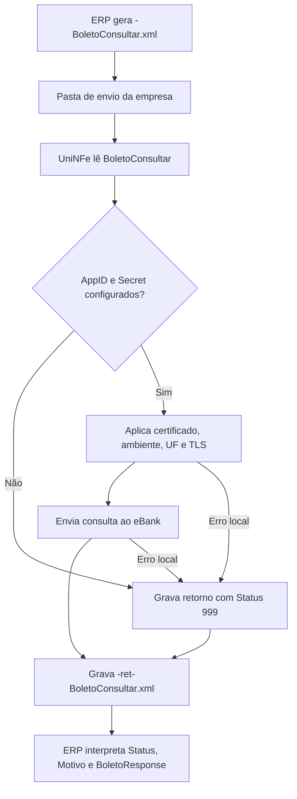

# Consultar boleto

O serviço de consulta do eBoleto permite que o ERP consulte boletos no eBank por período de emissão ou por números do boleto no banco. O ERP grava o XML de solicitação na pasta de envio da empresa, o UniNFe executa a integração com o eBank e grava o XML de retorno na pasta de retorno.

Use este serviço quando o ERP precisa atualizar a situação de boletos, conferir valores, datas, liquidação, dados do pagador, código de barras, QR Code ou outras informações retornadas pelo eBank.

## Pré-requisitos

Antes de enviar a consulta, confira na configuração da empresa:

- A empresa está cadastrada no UniNFe.
- A pasta de envio e a pasta de retorno estão configuradas.
- O certificado digital está configurado e válido quando exigido pela integração.
- O ambiente da empresa está configurado conforme a operação desejada.
- A UF da empresa está configurada.
- Os campos `e-bank - AppID` e `e-bank - Secret` estão preenchidos na aba de integrações da configuração da empresa.

Sem `AppID` e `Secret`, o UniNFe não executa o serviço e grava um retorno de erro para o ERP.

## Arquivo de envio

O ERP deve gerar o XML de consulta na pasta de envio da empresa com o final fixo:

```text
<identificador>-BoletoConsultar.xml
```

O `<identificador>` deve ser único para a consulta. Ele pode ser uma data/hora, um número sequencial ou outro controle do ERP.

Exemplo:

```text
20230523T103002_01-BoletoConsultar.xml
```

O conteúdo do XML deve usar a estrutura `BoletoConsultar`:

```xml
<?xml version="1.0" encoding="UTF-8"?>
<BoletoConsultar versao="1.00">
  <ConfigurationId>ZCKWGQ55LTDXKYYC</ConfigurationId>
  <DataEmissaoInicial>2025-03-25</DataEmissaoInicial>
  <DataEmissaoFinal>2025-03-25</DataEmissaoFinal>
  <NumerosNoBanco>
    <NumeroNoBanco>-2147483641</NumeroNoBanco>
    <NumeroNoBanco>-2147483642</NumeroNoBanco>
  </NumerosNoBanco>
  <PageNumber>0</PageNumber>
  <PageSize>0</PageSize>
  <Testing>true</Testing>
  <UseHomologServer>true</UseHomologServer>
</BoletoConsultar>
```

Campos principais:

| Campo | Como preencher |
|---|---|
| `ConfigurationId` | ID da configuração da conta corrente no eBank. Esse identificador é fornecido pela Unimake. |
| `DataEmissaoInicial` | Data inicial de emissão dos boletos que serão consultados, no formato `AAAA-MM-DD`. Não é obrigatória quando a consulta informa `NumerosNoBanco`. |
| `DataEmissaoFinal` | Data final de emissão dos boletos que serão consultados, no formato `AAAA-MM-DD`. Não é obrigatória quando a consulta informa `NumerosNoBanco`. |
| `NumerosNoBanco` | Grupo opcional quando a consulta é feita por período de emissão. Use para consultar boletos específicos pelo número no banco. |
| `NumeroNoBanco` | Número do boleto no banco. Pode ser repetido dentro de `NumerosNoBanco`, respeitando o limite aceito pela integração. |
| `PageNumber` | Número da página que será consultada, quando a consulta usar paginação. |
| `PageSize` | Quantidade de registros por página, quando a consulta usar paginação. |
| `Testing` | Campo opcional. Use `true` para teste e `false` para produção. |
| `UseHomologServer` | Campo opcional. Use somente quando for necessário direcionar a solicitação para ambiente de homologação/depuração solicitado pelo eBank. |

Para consultar por período, informe `DataEmissaoInicial` e `DataEmissaoFinal`. Para consultar boletos específicos, informe o grupo `NumerosNoBanco`.

## Fluxo de processamento

1. O ERP grava o arquivo `<identificador>-BoletoConsultar.xml` na pasta de envio.
2. O UniNFe lê o XML e identifica a solicitação de consulta.
3. O UniNFe valida se `AppID` e `Secret` do eBank estão configurados para a empresa.
4. O UniNFe aplica as configurações da empresa, certificado, ambiente, UF e preparação TLS quando configurada.
5. A consulta é enviada ao eBank.
6. O retorno do eBank é gravado na pasta de retorno como `<identificador>-ret-BoletoConsultar.xml`.
7. Se ocorrer falha local ou falha retornada pela integração, o UniNFe grava o mesmo arquivo de retorno com status de erro.
8. O arquivo de solicitação é removido da pasta de envio após o processamento.

## Fluxograma



## Arquivos gerados

| Momento | Pasta | Nome do arquivo | Quando aparece |
|---|---|---|---|
| Pedido de consulta | Pasta de envio | `<identificador>-BoletoConsultar.xml` | Arquivo criado pelo ERP para consultar boletos no eBank. |
| Retorno ao ERP | Pasta de retorno | `<identificador>-ret-BoletoConsultar.xml` | Retorno XML recebido do eBank ou retorno de erro gerado pelo UniNFe. |

Este serviço não gera XML de distribuição fiscal, não movimenta arquivos para `Enviados\Autorizados` e não usa arquivo `.err` para o retorno principal do ERP. Falhas locais tratadas pelo UniNFe são devolvidas no XML `<identificador>-ret-BoletoConsultar.xml`.

## Como tratar o retorno

O ERP deve monitorar a pasta de retorno e aguardar:

```text
<identificador>-ret-BoletoConsultar.xml
```

O retorno usa a estrutura `BoletoConsultarResponse`. Quando a consulta encontra boletos, o XML pode conter um ou mais grupos `BoletoResponse`:

```xml
<?xml version="1.0" encoding="utf-8"?>
<BoletoConsultarResponse>
  <Status>0</Status>
  <Motivo>Boletos encontrados</Motivo>
  <BoletoResponse>
    <CodigoBarras/>
    <DataEmissao>20-09-2018</DataEmissao>
    <DataLiquidacao/>
    <DataVencimento>20-09-2018</DataVencimento>
    <NumeroNaEmpresa>1235512</NumeroNaEmpresa>
    <NumeroNoBanco>-2147483648</NumeroNoBanco>
    <Situacao>9</Situacao>
    <TipoLiquidacao>0</TipoLiquidacao>
    <Valor>156.23</Valor>
    <ValorLiquidado>156.23</ValorLiquidado>
  </BoletoResponse>
  <UniNFeVersao>5.1.0.136 | 25-03-2025 - 15:40:45</UniNFeVersao>
</BoletoConsultarResponse>
```

Campos principais do retorno:

| Campo | Como interpretar |
|---|---|
| `Status` | `0` indica consulta realizada com sucesso. `999` indica erro. |
| `Motivo` | Mensagem retornada pela integração ou pelo UniNFe explicando o resultado. |
| `BoletoResponse` | Grupo com os dados de um boleto retornado. Pode repetir quando a consulta retorna mais de um boleto. |
| `CodigoBarras` | Código de barras do boleto, quando retornado. |
| `DataEmissao` | Data de emissão do boleto. |
| `DataLiquidacao` | Data de liquidação, quando houver. |
| `DataVencimento` | Data de vencimento do boleto. |
| `NumeroNaEmpresa` | Número do boleto no controle da empresa. |
| `NumeroNoBanco` | Número do boleto no banco. |
| `Pagador` | Dados do pagador retornados pela consulta. |
| `PdfContent` | Conteúdo ou status da geração do PDF, quando retornado. |
| `QrCodeContent` | Dados do QR Code, quando retornados. |
| `Situacao` | Código da situação do boleto retornada pelo eBank. |
| `TipoLiquidacao` | Código do tipo de liquidação retornado pelo eBank. |
| `Valor`, `ValorAbatimento`, `ValorDesconto`, `ValorJuros`, `ValorLiquidado`, `ValorMulta` | Valores financeiros retornados para o boleto. |
| `TraceId` | Identificador de rastreio quando a integração retornar essa informação. |
| `UniNFeVersao` | Versão do UniNFe que gerou o retorno. |

Quando o status indicar sucesso, o ERP deve atualizar as informações dos boletos retornados. Quando indicar erro, o ERP deve apresentar o motivo ao usuário, corrigir os dados ou a configuração e gerar nova consulta.

## Erros comuns

As causas mais comuns de erro são:

- `AppID` ou `Secret` do eBank não configurados na empresa.
- XML fora da estrutura esperada.
- `ConfigurationId` ausente ou inválido.
- Período de emissão ausente quando a consulta não informa `NumerosNoBanco`.
- `NumeroNoBanco` ausente ou inválido quando a consulta é feita por boletos específicos.
- Ambiente de teste, produção ou homologação incompatível com a credencial usada.
- Certificado digital ausente, inválido ou vencido quando exigido pela integração.
- Falha de comunicação com o eBank.
- Falha de permissão ou acesso às pastas configuradas.

Depois de corrigir o problema, gere novamente o arquivo `<identificador>-BoletoConsultar.xml` na pasta de envio.

## Cuidados para o integrador

- Use sempre o final `-BoletoConsultar.xml`.
- Controle o `<identificador>` para não sobrescrever retornos de consultas anteriores.
- Informe `ConfigurationId`.
- Consulte por período de emissão ou por `NumerosNoBanco`, conforme a necessidade do ERP.
- Trate múltiplos grupos `BoletoResponse` no mesmo retorno.
- Use `Testing` e `UseHomologServer` somente conforme o ambiente de operação combinado com o eBank.
- Aguarde o arquivo `-ret-BoletoConsultar.xml` para atualizar a situação dos boletos.
- Trate `Status` diferente de `0` como falha operacional que precisa de correção ou análise.
