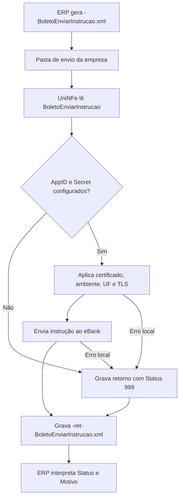

# Enviar instrução do boleto

O serviço de envio de instrução do eBoleto permite que o ERP solicite ao eBank uma ação operacional sobre um boleto existente. O ERP grava o XML de solicitação na pasta de envio da empresa, o UniNFe executa a integração com o eBank e grava o XML de retorno na pasta de retorno.

Use este serviço quando for necessário enviar uma instrução ao banco, como pedido de baixa, concessão ou cancelamento de desconto, alteração de vencimento, protesto, sustação de protesto, abatimento ou alteração de outros dados do boleto.

## Pré-requisitos

Antes de enviar a solicitação, confira na configuração da empresa:

- A empresa está cadastrada no UniNFe.
- A pasta de envio e a pasta de retorno estão configuradas.
- O certificado digital está configurado e válido quando exigido pela integração.
- O ambiente da empresa está configurado conforme a operação desejada.
- A UF da empresa está configurada.
- Os campos `e-bank - AppID` e `e-bank - Secret` estão preenchidos na aba de integrações da configuração da empresa.

Sem `AppID` e `Secret`, o UniNFe não executa o serviço e grava um retorno de erro para o ERP.

## Arquivo de envio

O ERP deve gerar o XML de envio de instrução na pasta de envio da empresa com o final fixo:

```text
<identificador>-BoletoEnviarInstrucao.xml
```

O `<identificador>` deve ser único para a solicitação. Ele pode ser uma data/hora, um número sequencial ou outro controle do ERP.

Exemplo:

```text
20230523T103002_01-BoletoEnviarInstrucao.xml
```

O conteúdo do XML deve usar a estrutura `BoletoEnviarInstrucao`:

```xml
<?xml version="1.0" encoding="UTF-8"?>
<BoletoEnviarInstrucao versao="1.00">
  <ConfigurationId>ZCKWGQ55LTDXKYYC</ConfigurationId>
  <Data>2025-04-03</Data>
  <Instrucao>1</Instrucao>
  <InstrucaoAdicional>1</InstrucaoAdicional>
  <NossoNumero>string</NossoNumero>
  <NumeroNoBanco>string</NumeroNoBanco>
  <QuantidadeDiasDesconto>0</QuantidadeDiasDesconto>
  <SeuNumero>string</SeuNumero>
  <TipoDesconto>0</TipoDesconto>
  <Valor>0.00</Valor>
  <Testing>true</Testing>
  <UseHomologServer>true</UseHomologServer>
</BoletoEnviarInstrucao>
```

Campos principais:

| Campo | Como preencher |
|---|---|
| `ConfigurationId` | ID da configuração da conta corrente no eBank. Esse identificador é fornecido pela Unimake. |
| `Data` | Data usada pela instrução, no formato `AAAA-MM-DD`. O significado depende da instrução enviada. |
| `Instrucao` | Código da instrução principal que será enviada ao boleto. |
| `InstrucaoAdicional` | Código adicional usado em algumas instruções. |
| `NossoNumero` | Número do boleto bancário que receberá a instrução, quando usado pela operação. |
| `NumeroNoBanco` | Número do boleto no banco, quando usado pela operação. |
| `QuantidadeDiasDesconto` | Quantidade de dias antes do vencimento em que o desconto deve ser aplicado. |
| `SeuNumero` | Número do boleto na empresa, quando usado pela operação. |
| `TipoDesconto` | Tipo de desconto usado quando a instrução envolver desconto. |
| `Valor` | Valor aplicado pela instrução, quando a operação exigir valor. |
| `Testing` | Campo opcional. Use `true` para teste e `false` para produção. |
| `UseHomologServer` | Campo opcional. Use somente quando for necessário direcionar a solicitação para ambiente de homologação/depuração solicitado pelo eBank. |

## Códigos de instrução

| Código | Instrução |
|---|---|
| `0` | Pedido de baixa |
| `1` | Concessão de desconto |
| `2` | Cancelamento de desconto concedido |
| `3` | Alteração de vencimento |
| `4` | Alteração do seu número |
| `5` | Pedido de protesto |
| `6` | Sustar protesto e baixar título |
| `7` | Sustar protesto e manter em carteira |
| `8` | Alteração de outros dados |
| `9` | Concessão de abatimento |
| `10` | Cancelamento de abatimento concedido |

## Códigos de instrução adicional

| Código | Instrução adicional |
|---|---|
| `0` | Desconto |
| `1` | Juros por dia |
| `2` | Desconto por dia de antecipação |
| `3` | Cancelamento de protesto automático |
| `4` | Data limite para concessão de desconto |

## Tipos de desconto

| Código | Tipo de desconto |
|---|---|
| `0` | Não consta |
| `1` | Valor fixo até data informada |
| `2` | Percentual até data informada |
| `3` | Valor por antecipação em dia corrido |
| `4` | Valor por antecipação em dia útil |
| `5` | Percentual sobre valor nominal em dia corrido |
| `6` | Percentual sobre valor nominal em dia útil |
| `7` | Cancelamento |
| `8` | Bonificação em valor fixo por dia útil |
| `9` | Bonificação percentual por dia útil |
| `10` | Bonificação em valor fixo por dia corrido |
| `11` | Bonificação percentual por dia corrido |
| `12` | Percentual por antecipação em dia útil |
| `13` | Percentual por antecipação em dia corrido |

## Fluxo de processamento

1. O ERP grava o arquivo `<identificador>-BoletoEnviarInstrucao.xml` na pasta de envio.
2. O UniNFe lê o XML e identifica a solicitação de envio de instrução.
3. O UniNFe valida se `AppID` e `Secret` do eBank estão configurados para a empresa.
4. O UniNFe aplica as configurações da empresa, certificado, ambiente, UF e preparação TLS quando configurada.
5. A instrução é enviada ao eBank.
6. O retorno do eBank é gravado na pasta de retorno como `<identificador>-ret-BoletoEnviarInstrucao.xml`.
7. Se ocorrer falha local ou falha retornada pela integração, o UniNFe grava o mesmo arquivo de retorno com status de erro.
8. O arquivo de solicitação é removido da pasta de envio após o processamento.

## Fluxograma



## Arquivos gerados

| Momento | Pasta | Nome do arquivo | Quando aparece |
|---|---|---|---|
| Pedido de instrução | Pasta de envio | `<identificador>-BoletoEnviarInstrucao.xml` | Arquivo criado pelo ERP para enviar uma instrução ao boleto. |
| Retorno ao ERP | Pasta de retorno | `<identificador>-ret-BoletoEnviarInstrucao.xml` | Retorno XML recebido do eBank ou retorno de erro gerado pelo UniNFe. |

Este serviço não gera XML de distribuição fiscal, não movimenta arquivos para `Enviados\Autorizados` e não usa arquivo `.err` para o retorno principal do ERP. Falhas locais tratadas pelo UniNFe são devolvidas no XML `<identificador>-ret-BoletoEnviarInstrucao.xml`.

## Como tratar o retorno

O ERP deve monitorar a pasta de retorno e aguardar:

```text
<identificador>-ret-BoletoEnviarInstrucao.xml
```

O retorno usa a estrutura `BoletoEnviarInstrucaoResponse`:

```xml
<?xml version="1.0" encoding="utf-8"?>
<BoletoEnviarInstrucaoResponse>
  <Status>0</Status>
  <Motivo>Instruções do boleto enviado com sucesso</Motivo>
  <UniNFeVersao>5.1.0.138 | 16-04-2025 - 14:02:12</UniNFeVersao>
</BoletoEnviarInstrucaoResponse>
```

Campos principais do retorno:

| Campo | Como interpretar |
|---|---|
| `Status` | `0` indica instrução enviada com sucesso. `1` ou `999` indicam erro. |
| `Motivo` | Mensagem retornada pela integração ou pelo UniNFe explicando o resultado. |
| `TraceId` | Identificador de rastreio quando a integração retornar essa informação. |
| `UniNFeVersao` | Versão do UniNFe que gerou o retorno. |

Quando o status indicar sucesso, o ERP pode atualizar a situação operacional do boleto conforme a instrução enviada. Quando indicar erro, o ERP deve apresentar o motivo ao usuário, corrigir os dados ou a configuração e gerar nova solicitação.

## Erros comuns

As causas mais comuns de erro são:

- `AppID` ou `Secret` do eBank não configurados na empresa.
- XML fora da estrutura esperada.
- `ConfigurationId` ausente ou inválido.
- Código de `Instrucao`, `InstrucaoAdicional` ou `TipoDesconto` incompatível com a operação desejada.
- Identificador do boleto ausente ou inválido, como `NossoNumero`, `NumeroNoBanco` ou `SeuNumero`.
- `Data`, `Valor` ou `QuantidadeDiasDesconto` ausentes quando a instrução exigir essas informações.
- Ambiente de teste, produção ou homologação incompatível com a credencial usada.
- Certificado digital ausente, inválido ou vencido quando exigido pela integração.
- Falha de comunicação com o eBank.
- Falha de permissão ou acesso às pastas configuradas.

Depois de corrigir o problema, gere novamente o arquivo `<identificador>-BoletoEnviarInstrucao.xml` na pasta de envio.

## Cuidados para o integrador

- Use sempre o final `-BoletoEnviarInstrucao.xml`.
- Controle o `<identificador>` para não sobrescrever retornos de solicitações anteriores.
- Preencha `ConfigurationId` e a instrução correspondente à operação.
- Informe os campos complementares exigidos pela instrução escolhida.
- Use `Testing` e `UseHomologServer` somente conforme o ambiente de operação combinado com o eBank.
- Aguarde o arquivo `-ret-BoletoEnviarInstrucao.xml` para saber se a instrução foi aceita.
- Trate `Status` diferente de `0` como falha operacional que precisa de correção ou análise.
