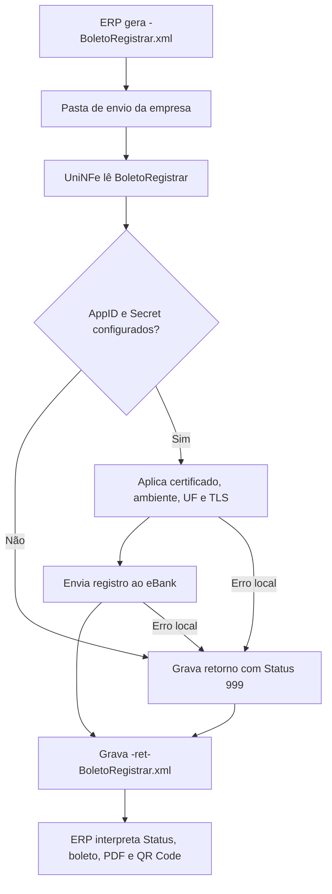

# Registrar boleto

O serviço de registro do eBoleto permite que o ERP envie ao eBank os dados necessários para registrar um boleto. O ERP grava o XML de solicitação na pasta de envio da empresa, o UniNFe executa a integração com o eBank e grava o XML de retorno na pasta de retorno.

Use este serviço quando a empresa precisa registrar um novo boleto no banco por meio da integração eBank.

## Pré-requisitos

Antes de enviar a solicitação, confira na configuração da empresa:

- A empresa está cadastrada no UniNFe.
- A pasta de envio e a pasta de retorno estão configuradas.
- O certificado digital está configurado e válido quando exigido pela integração.
- O ambiente da empresa está configurado conforme a operação desejada.
- A UF da empresa está configurada.
- Os campos `e-bank - AppID` e `e-bank - Secret` estão preenchidos na aba de integrações da configuração da empresa.

Sem `AppID` e `Secret`, o UniNFe não executa o serviço e grava um retorno de erro para o ERP.

## Arquivo de envio

O ERP deve gerar o XML de registro na pasta de envio da empresa com o final fixo:

```text
<identificador>-BoletoRegistrar.xml
```

O `<identificador>` deve ser único para a solicitação. Ele pode ser uma data/hora, um número sequencial, o número do boleto na empresa ou outro controle do ERP.

Exemplos:

```text
20230523T103002_02_obrigatorios-BoletoRegistrar.xml
20230523T103002_01_completo-BoletoRegistrar.xml
```

O conteúdo do XML deve usar a estrutura `BoletoRegistrar`:

```xml
<?xml version="1.0" encoding="UTF-8"?>
<BoletoRegistrar versao="1.00">
  <ConfigurationId>ZCKWGQ55LTDXKYYC</ConfigurationId>
  <Aceite>true</Aceite>
  <Emissao>2025-07-22</Emissao>
  <Especie>2</Especie>
  <NumeroParcela>0</NumeroParcela>
  <Pagador>
    <Nome>Pagador Fictício</Nome>
    <Inscricao>26994558000123</Inscricao>
    <TipoInscricao>0</TipoInscricao>
    <Endereco>
      <Logradouro>Rua</Logradouro>
      <Numero>11</Numero>
      <Complemento>string</Complemento>
      <Bairro>Bairro</Bairro>
      <Cidade>Brasília</Cidade>
      <UF>DF</UF>
      <CEP>11111-111</CEP>
    </Endereco>
  </Pagador>
  <PDFConfig>
    <TryGeneratePDF>true</TryGeneratePDF>
  </PDFConfig>
  <PixConfig>
    <Chave>06117473000150</Chave>
    <RegistrarPIX>true</RegistrarPIX>
  </PixConfig>
  <Testing>true</Testing>
  <ValorNominal>45.88</ValorNominal>
  <Vencimento>2025-08-22</Vencimento>
  <UseHomologServer>true</UseHomologServer>
</BoletoRegistrar>
```

## Campos principais

| Campo ou grupo | Como preencher |
|---|---|
| `ConfigurationId` | ID da configuração da conta corrente no eBank. Esse identificador é fornecido pela Unimake. |
| `Aceite` | Indica se o boleto possui aceite. |
| `Emissao` | Data de emissão do boleto, no formato `AAAA-MM-DD`. |
| `Especie` | Código da espécie do título, conforme regra da integração bancária. |
| `NumeroParcela` | Número da parcela do boleto. |
| `Pagador` | Dados do pagador, incluindo nome, inscrição, tipo de inscrição e endereço. |
| `PDFConfig` | Configuração para geração do PDF do boleto. Use `TryGeneratePDF` para solicitar a geração. |
| `PixConfig` | Configuração de PIX vinculada ao boleto, quando a operação usar PIX. |
| `Testing` | Campo opcional. Use `true` para teste e `false` para produção. |
| `ValorNominal` | Valor nominal do boleto. |
| `Vencimento` | Data de vencimento do boleto, no formato `AAAA-MM-DD`. |
| `UseHomologServer` | Campo opcional. Use somente quando for necessário direcionar a solicitação para ambiente de homologação/depuração solicitado pelo eBank. |

## Grupos opcionais

O modelo completo de registro também permite informar dados complementares:

| Grupo ou campo | Para que serve |
|---|---|
| `Avalista` | Dados do avalista, quando houver. |
| `Carteira` | Carteira bancária usada no boleto. |
| `Desconto`, `Juros`, `Multa` | Regras financeiras aplicadas ao boleto. |
| `FichaAceiteConfig` | Configuração da ficha de aceite, incluindo detalhes de beneficiário, instruções, rodapé e valores. |
| `Mensagens` e `MensagensRecibo` | Mensagens impressas no boleto ou recibo. |
| `NumeroNaEmpresa` | Número do boleto no controle da empresa. |
| `NumeroNoBanco` | Número do boleto no banco, quando a operação permitir informar. |
| `PermiteRecebimentoParcial` | Indica se o boleto permite recebimento parcial. |
| `Protesto` | Configuração de protesto. |
| `ValorAbatimento` e `ValorIOF` | Valores adicionais usados na composição financeira. |

Preencha os grupos opcionais somente quando a carteira, o banco ou a operação exigir essas informações.

## Fluxo de processamento

1. O ERP grava o arquivo `<identificador>-BoletoRegistrar.xml` na pasta de envio.
2. O UniNFe lê o XML e identifica a solicitação de registro.
3. O UniNFe valida se `AppID` e `Secret` do eBank estão configurados para a empresa.
4. O UniNFe aplica as configurações da empresa, certificado, ambiente, UF e preparação TLS quando configurada.
5. O registro é enviado ao eBank.
6. O retorno do eBank é gravado na pasta de retorno como `<identificador>-ret-BoletoRegistrar.xml`.
7. Se ocorrer falha local ou falha retornada pela integração, o UniNFe grava o mesmo arquivo de retorno com status de erro.
8. O arquivo de solicitação é removido da pasta de envio após o processamento.

## Fluxograma



## Arquivos gerados

| Momento | Pasta | Nome do arquivo | Quando aparece |
|---|---|---|---|
| Pedido de registro | Pasta de envio | `<identificador>-BoletoRegistrar.xml` | Arquivo criado pelo ERP para registrar o boleto no eBank. |
| Retorno ao ERP | Pasta de retorno | `<identificador>-ret-BoletoRegistrar.xml` | Retorno XML recebido do eBank ou retorno de erro gerado pelo UniNFe. |
| PDF do boleto | Pasta de retorno, quando gerado pela integração | `<identificador>-ret-BoletoRegistrar.pdf` | Arquivo PDF indicado no retorno quando a geração do PDF é solicitada e concluída. |

Este serviço não gera XML de distribuição fiscal, não movimenta arquivos para `Enviados\Autorizados` e não usa arquivo `.err` para o retorno principal do ERP. Falhas locais tratadas pelo UniNFe são devolvidas no XML `<identificador>-ret-BoletoRegistrar.xml`.

## Como tratar o retorno

O ERP deve monitorar a pasta de retorno e aguardar:

```text
<identificador>-ret-BoletoRegistrar.xml
```

O retorno usa a estrutura `BoletoRegistrarResponse`:

```xml
<?xml version="1.0" encoding="utf-8"?>
<BoletoRegistrarResponse>
  <Status>0</Status>
  <Motivo>Boleto registrado</Motivo>
  <CodigoBarraNumerico>61885413104039157298878833105511271184934708</CodigoBarraNumerico>
  <NumeroNoBanco/>
  <LinhaDigitavel>55666538375117619420465569876583610990625736333</LinhaDigitavel>
  <PdfContentSuccess>True</PdfContentSuccess>
  <PdfContentMessage/>
  <PdfPath>d:\testenfe\Retorno\20230523T103002_02_obrigatorios-ret-BoletoRegistrar.pdf</PdfPath>
  <QRCodeContent>
    <Image/>
    <Success>False</Success>
    <Text/>
  </QRCodeContent>
  <UniNFeVersao>5.1.0.141 | 22-07-2025 - 18:16:54</UniNFeVersao>
</BoletoRegistrarResponse>
```

Campos principais do retorno:

| Campo | Como interpretar |
|---|---|
| `Status` | `0` indica boleto registrado com sucesso. `999` indica erro local ou falha tratada pelo UniNFe. |
| `Motivo` | Mensagem retornada pela integração ou pelo UniNFe explicando o resultado. |
| `CodigoBarraNumerico` | Código de barras numérico do boleto registrado. |
| `NumeroNoBanco` | Número do boleto no banco, quando retornado pela integração. |
| `LinhaDigitavel` | Linha digitável do boleto. |
| `PdfContentSuccess` | Indica se o conteúdo do PDF foi gerado com sucesso. |
| `PdfContentMessage` | Mensagem relacionada à geração do PDF. |
| `PdfContentBase64` | Conteúdo do PDF em Base64, quando retornado. |
| `PdfPath` | Caminho do PDF gerado, quando informado no retorno. |
| `QRCodeContent` | Dados do QR Code, quando o boleto usa PIX ou QR Code. |
| `TraceId` | Identificador de rastreio quando a integração retornar essa informação. |
| `UniNFeVersao` | Versão do UniNFe que gerou o retorno. |

Quando o status indicar sucesso, o ERP deve armazenar os dados de retorno do boleto, como número no banco, linha digitável, código de barras, PDF e QR Code quando existirem. Quando indicar erro, o ERP deve apresentar o motivo ao usuário, corrigir os dados ou a configuração e gerar nova solicitação.

## Erros comuns

As causas mais comuns de erro são:

- `AppID` ou `Secret` do eBank não configurados na empresa.
- XML fora da estrutura esperada.
- `ConfigurationId` ausente ou inválido.
- Dados obrigatórios do pagador ausentes ou inválidos.
- `ValorNominal`, `Vencimento`, `Emissao`, `Especie` ou `Aceite` ausentes ou incompatíveis com a carteira.
- Configuração de PIX, PDF, desconto, juros, multa ou protesto incompatível com a operação.
- Ambiente de teste, produção ou homologação incompatível com a credencial usada.
- Certificado digital ausente, inválido ou vencido quando exigido pela integração.
- Falha de comunicação com o eBank.
- Falha de permissão ou acesso às pastas configuradas.

Depois de corrigir o problema, gere novamente o arquivo `<identificador>-BoletoRegistrar.xml` na pasta de envio.

## Cuidados para o integrador

- Use sempre o final `-BoletoRegistrar.xml`.
- Controle o `<identificador>` para não sobrescrever retornos de solicitações anteriores.
- Preencha `ConfigurationId`, dados do pagador, valor, emissão e vencimento.
- Informe grupos opcionais somente quando forem necessários para a carteira ou para a regra de cobrança.
- Use `Testing` e `UseHomologServer` somente conforme o ambiente de operação combinado com o eBank.
- Aguarde o arquivo `-ret-BoletoRegistrar.xml` para saber se o registro foi aceito.
- Armazene linha digitável, código de barras, número no banco, PDF e QR Code retornados.
- Trate `Status` diferente de `0` como falha operacional que precisa de correção ou análise.
