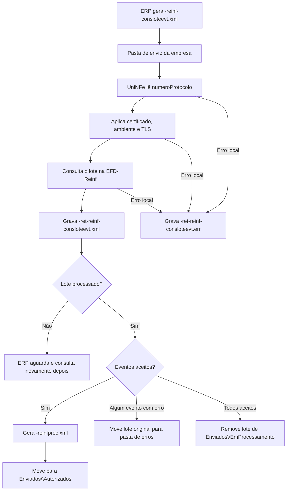

# Consulta de lote assíncrono da EFD-Reinf

A consulta de lote assíncrono da EFD-Reinf permite que o ERP consulte o processamento de um lote enviado anteriormente pela [recepção de lote de eventos](recepcao-lote-eventos.md). O ERP informa o número do protocolo recebido no envio do lote, o UniNFe consulta o ambiente nacional da EFD-Reinf e grava o retorno para o ERP na pasta de retorno.

Quando o lote consultado já foi processado, o UniNFe também pode gerar XMLs processados dos eventos aceitos, combinando o XML original do evento com o retorno individual do ambiente nacional.

## Quando usar

Use este serviço quando:

- O ERP enviou um lote de eventos da EFD-Reinf e recebeu um protocolo de envio.
- O ERP precisa saber se o lote já foi processado.
- O ERP precisa obter o retorno individual dos eventos do lote.
- O suporte precisa conferir se os eventos foram aceitos ou se houve rejeições.

## Pré-requisitos

Antes de executar a consulta, confira:

- A empresa está cadastrada no UniNFe.
- A pasta de envio, a pasta de retorno e a pasta de enviados estão configuradas.
- O certificado digital está configurado e válido.
- O ambiente da empresa é o mesmo usado no envio do lote.
- As configurações de proxy e conexão TLS estão corretas, se a rede exigir proxy ou preparação TLS.
- O protocolo de envio do lote está disponível no ERP.
- O lote aceito na recepção permanece em `Enviados\EmProcessamento` com o nome `<protocoloEnvio>.xml`.

## Arquivo de envio

O ERP deve gerar o arquivo XML na pasta de envio da empresa com o final fixo:

```text
<identificador>-reinf-consloteevt.xml
```

O `<identificador>` deve ser único para a consulta. Ele pode ser uma data/hora, o próprio protocolo adaptado ao padrão de nome de arquivo ou outro código controlado pelo ERP.

Exemplo:

```text
ConsultaLoteAssincrono-reinf-consloteevt.xml
```

## Estrutura do XML

O XML deve usar a raiz `Reinf` e conter o grupo `ConsultaLoteAssincrono` com o número do protocolo:

```xml
<?xml version="1.0" encoding="utf-8"?>
<Reinf>
  <ConsultaLoteAssincrono>
    <numeroProtocolo>2.000000.00000</numeroProtocolo>
  </ConsultaLoteAssincrono>
</Reinf>
```

Campos principais:

| Campo | Como preencher |
|---|---|
| `Reinf` | Elemento principal da consulta. |
| `ConsultaLoteAssincrono` | Grupo com os dados da consulta do lote. |
| `numeroProtocolo` | Protocolo retornado na recepção do lote de eventos da EFD-Reinf. |

## Fluxo de processamento

1. O ERP grava `<identificador>-reinf-consloteevt.xml` na pasta de envio da empresa.
2. O UniNFe identifica o XML como consulta de lote assíncrono da EFD-Reinf.
3. O UniNFe lê o número do protocolo e aplica as configurações da empresa, incluindo certificado digital, ambiente e preparação TLS quando configurada.
4. A consulta é enviada ao ambiente nacional da EFD-Reinf.
5. O retorno da consulta é gravado como `<identificador>-ret-reinf-consloteevt.xml` na pasta de retorno.
6. Se o lote estiver processado e houver eventos aceitos, o UniNFe gera um XML processado para cada evento aceito com o final `-reinfproc.xml`.
7. Os XMLs processados são movidos para `Enviados\Autorizados`, em subpasta organizada pela data identificada no evento.
8. Se algum evento retornar com erro, o XML do lote mantido em `Enviados\EmProcessamento` é movido para a pasta de erros.
9. Se todos os eventos processados forem aceitos, o XML do lote em `Enviados\EmProcessamento` é removido.
10. Se ocorrer falha local antes ou durante a consulta, o UniNFe grava `<identificador>-ret-reinf-consloteevt.err` na pasta de retorno.
11. O arquivo de solicitação é removido da pasta de envio após o processamento.

## Fluxograma



## Arquivos gerados e movimentados

| Momento | Pasta | Nome do arquivo | Quando aparece |
|---|---|---|---|
| Pedido | Pasta de envio | `<identificador>-reinf-consloteevt.xml` | Arquivo criado pelo ERP para consultar o processamento do lote. |
| Retorno da consulta | Pasta de retorno | `<identificador>-ret-reinf-consloteevt.xml` | Retorno XML recebido do ambiente nacional da EFD-Reinf. |
| XML processado do evento | `Enviados\Autorizados\<subpasta por data>` | `<eventoId>-reinfproc.xml` | Gerado para cada evento processado com sucesso. |
| Lote em processamento | `Enviados\EmProcessamento` | `<protocoloEnvio>.xml` | Lote assinado salvo após a recepção, usado para montar os XMLs processados. |
| Lote com erro | Pasta de erros | `<protocoloEnvio>.xml` | Movido quando a consulta retorna algum evento com erro. |
| Erro ao ERP | Pasta de retorno | `<identificador>-ret-reinf-consloteevt.err` | Erro local antes ou durante a consulta, como falha de leitura, certificado, comunicação ou gravação. |

## Como tratar o retorno

O ERP deve monitorar a pasta de retorno e aguardar:

```text
<identificador>-ret-reinf-consloteevt.xml
```

Esse arquivo contém a resposta do ambiente nacional para o protocolo consultado. O ERP deve analisar o status do lote, as mensagens e os retornos individuais dos eventos.

Quando a consulta gerar XMLs `-reinfproc.xml`, armazene esses arquivos como XMLs processados dos eventos aceitos. Eles ficam em `Enviados\Autorizados` e representam a junção do evento enviado com o retorno individual recebido da EFD-Reinf.

Se o lote ainda não estiver processado, aguarde e gere uma nova consulta com o mesmo `numeroProtocolo`.

## Erros locais

Se a consulta não puder ser concluída por falha local, será gerado:

```text
<identificador>-ret-reinf-consloteevt.err
```

As causas mais comuns são:

- XML fora da estrutura esperada.
- Ausência do grupo `ConsultaLoteAssincrono`.
- Número do protocolo ausente ou inválido.
- Certificado digital ausente, inválido ou vencido.
- Ambiente da empresa diferente do ambiente usado no envio do lote.
- XML do lote original não encontrado em `Enviados\EmProcessamento`.
- Proxy ou conexão TLS configurados incorretamente.
- Falha de comunicação com o ambiente nacional da EFD-Reinf.
- Falha de permissão ou acesso às pastas configuradas.

Depois de corrigir o problema, gere novamente o arquivo `<identificador>-reinf-consloteevt.xml` na pasta de envio.

## Cuidados para o integrador

- Use sempre o final `-reinf-consloteevt.xml` no arquivo de consulta.
- Informe em `numeroProtocolo` o protocolo recebido na recepção do lote.
- Consulte o lote no mesmo ambiente em que ele foi enviado.
- Aguarde o retorno `-ret-reinf-consloteevt.xml` para interpretar a resposta.
- Armazene os XMLs `-reinfproc.xml` gerados para eventos aceitos.
- Se o lote ainda não estiver processado, repita a consulta posteriormente com o mesmo protocolo.
- Em erros `.err`, corrija a causa local antes de reenviar a consulta.
