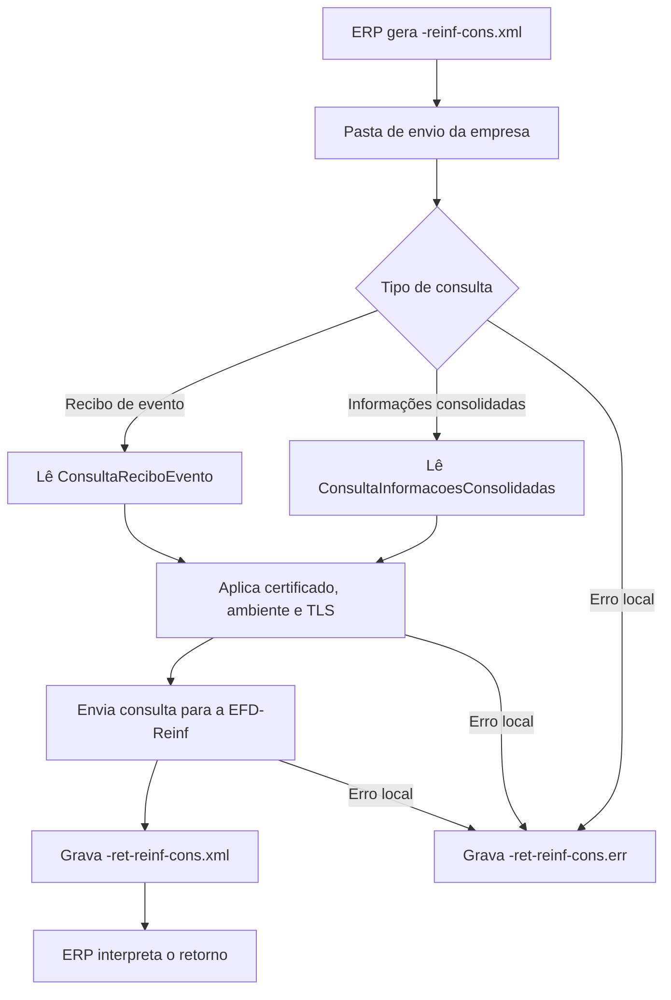

# Consultas da EFD-Reinf

As consultas da EFD-Reinf permitem que o ERP solicite informações ao ambiente nacional usando arquivos XML processados pelo UniNFe. Este serviço atende consultas enviadas com o final `-reinf-cons.xml`, como consulta de recibo de evento e consulta de informações consolidadas.

O UniNFe lê o XML gravado na pasta de envio da empresa, aplica as configurações da empresa, envia a consulta ao ambiente nacional da EFD-Reinf e grava o retorno para o ERP na pasta de retorno.

## Quando usar

Use este serviço quando:

- O ERP precisa consultar o recibo de um evento da EFD-Reinf.
- O ERP precisa consultar informações consolidadas relacionadas a um fechamento.
- O suporte precisa conferir a resposta do ambiente nacional para uma consulta pontual.

## Pré-requisitos

Antes de executar a consulta, confira na configuração da empresa:

- A empresa está cadastrada no UniNFe.
- A pasta de envio e a pasta de retorno estão configuradas.
- O certificado digital está configurado e válido.
- O ambiente da empresa está configurado conforme a consulta desejada.
- As configurações de proxy e conexão TLS estão corretas, se a rede exigir proxy ou preparação TLS.
- Os dados necessários para a consulta estão disponíveis no ERP, como tipo de evento, inscrição do contribuinte ou protocolo de fechamento.

## Arquivo de envio

O ERP deve gerar o arquivo XML na pasta de envio da empresa com o final fixo:

```text
<identificador>-reinf-cons.xml
```

O `<identificador>` deve ser único para a solicitação. Ele pode ser uma data/hora, uma identificação interna do ERP ou outro código que permita relacionar o pedido ao retorno.

Exemplos:

```text
ConsultaReciboEvento_S1000-reinf-cons.xml
ConsultaInformacoesConsolidadas-reinf-cons.xml
```

## Consulta de recibo de evento

Use a estrutura `ConsultaReciboEvento` quando o ERP precisar consultar o recibo de um evento:

```xml
<?xml version="1.0" encoding="utf-8"?>
<Reinf xmlns="http://www.reinf.esocial.gov.br/schemas/envioLoteEventos/v1_05_01">
  <ConsultaReciboEvento>
    <tipoEvento>1000</tipoEvento>
    <tpInsc>1</tpInsc>
    <nrInsc>00000000</nrInsc>
  </ConsultaReciboEvento>
</Reinf>
```

Campos principais:

| Campo | Como preencher |
|---|---|
| `Reinf` | Elemento principal da consulta. |
| `ConsultaReciboEvento` | Grupo com os filtros para consulta do recibo. |
| `tipoEvento` | Código do tipo de evento que será consultado. |
| `tpInsc` | Tipo de inscrição do contribuinte. |
| `nrInsc` | Número de inscrição do contribuinte. |

## Consulta de informações consolidadas

Use a estrutura `ConsultaInformacoesConsolidadas` quando o ERP precisar consultar informações consolidadas a partir de um protocolo de fechamento:

```xml
<?xml version="1.0" encoding="utf-8"?>
<Reinf>
  <ConsultaInformacoesConsolidadas>
    <tipoInscricaoContribuinte>1</tipoInscricaoContribuinte>
    <numeroInscricaoContribuinte>00000000</numeroInscricaoContribuinte>
    <numeroProtocoloFechamento>000000000000000</numeroProtocoloFechamento>
  </ConsultaInformacoesConsolidadas>
</Reinf>
```

Campos principais:

| Campo | Como preencher |
|---|---|
| `Reinf` | Elemento principal da consulta. |
| `ConsultaInformacoesConsolidadas` | Grupo com os filtros para consulta de informações consolidadas. |
| `tipoInscricaoContribuinte` | Tipo de inscrição do contribuinte. |
| `numeroInscricaoContribuinte` | Número de inscrição do contribuinte. |
| `numeroProtocoloFechamento` | Protocolo do fechamento que será consultado. |

## Fluxo de processamento

1. O ERP grava `<identificador>-reinf-cons.xml` na pasta de envio da empresa.
2. O UniNFe identifica o XML como consulta da EFD-Reinf.
3. O UniNFe lê a solicitação e aplica as configurações da empresa, incluindo certificado digital, ambiente e preparação TLS quando configurada.
4. A consulta é enviada ao ambiente nacional da EFD-Reinf.
5. O retorno da consulta é gravado como `<identificador>-ret-reinf-cons.xml` na pasta de retorno.
6. Se ocorrer falha local antes ou durante a consulta, o UniNFe grava `<identificador>-ret-reinf-cons.err` na pasta de retorno.
7. O arquivo de solicitação é removido da pasta de envio após o processamento.

## Fluxograma



## Arquivos gerados

| Momento | Pasta | Nome do arquivo | Quando aparece |
|---|---|---|---|
| Pedido | Pasta de envio | `<identificador>-reinf-cons.xml` | Arquivo criado pelo ERP para consultar informações da EFD-Reinf. |
| Retorno da consulta | Pasta de retorno | `<identificador>-ret-reinf-cons.xml` | Retorno XML recebido do ambiente nacional da EFD-Reinf. |
| Erro ao ERP | Pasta de retorno | `<identificador>-ret-reinf-cons.err` | Erro local antes ou durante a consulta, como falha de leitura, certificado, comunicação ou gravação. |

## Como tratar o retorno

O ERP deve monitorar a pasta de retorno e aguardar:

```text
<identificador>-ret-reinf-cons.xml
```

Esse arquivo contém a resposta do ambiente nacional para a consulta enviada. O ERP deve analisar o status, as mensagens e os dados retornados antes de atualizar sua base local.

Quando a consulta for de recibo, vincule o retorno ao tipo de evento e à inscrição usada no pedido. Quando a consulta for de informações consolidadas, vincule o retorno ao protocolo de fechamento informado.

## Erros locais

Se a consulta não puder ser concluída por falha local, será gerado:

```text
<identificador>-ret-reinf-cons.err
```

As causas mais comuns são:

- XML fora da estrutura esperada.
- Consulta sem uma estrutura reconhecida.
- Tipo de evento ausente ou inválido na consulta de recibo.
- Dados do contribuinte ausentes ou inválidos.
- Protocolo de fechamento ausente ou inválido na consulta de informações consolidadas.
- Certificado digital ausente, inválido ou vencido.
- Ambiente da empresa configurado incorretamente.
- Proxy ou conexão TLS configurados incorretamente.
- Falha de comunicação com o ambiente nacional da EFD-Reinf.
- Falha de permissão ou acesso às pastas configuradas.

Depois de corrigir o problema, gere novamente o arquivo `<identificador>-reinf-cons.xml` na pasta de envio.

## Cuidados para o integrador

- Use sempre o final `-reinf-cons.xml` no arquivo de envio.
- Envie apenas uma consulta por arquivo.
- Use `ConsultaReciboEvento` para consultar recibos de eventos.
- Use `ConsultaInformacoesConsolidadas` para consultar informações consolidadas por protocolo de fechamento.
- Aguarde o retorno `-ret-reinf-cons.xml` para interpretar a resposta.
- Em erros `.err`, corrija a causa local antes de reenviar a consulta.
