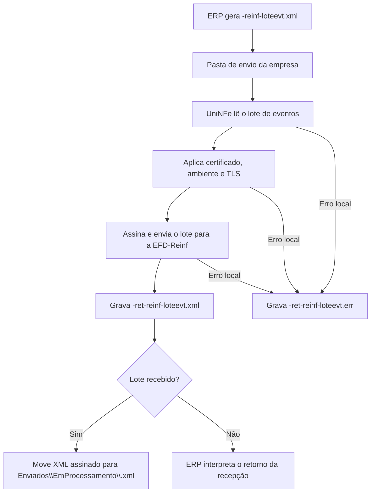

# Recepção de lote de eventos da EFD-Reinf

A recepção de lote de eventos da EFD-Reinf permite que o ERP envie um lote de eventos para o ambiente nacional da EFD-Reinf pelo UniNFe. O envio é assíncrono: nesta etapa o ambiente recebe o lote e devolve um retorno de recepção com as informações necessárias para acompanhamento posterior do processamento.

O UniNFe lê o XML gravado na pasta de envio da empresa, assina o conteúdo conforme a configuração da empresa, envia o lote para a EFD-Reinf e grava o retorno para o ERP na pasta de retorno. Quando o lote é aceito na recepção, o XML assinado é mantido na pasta de arquivos em processamento com o número do protocolo de envio.

## Quando usar

Use este serviço quando:

- O ERP precisa enviar eventos da EFD-Reinf em lote.
- O lote contém um ou mais eventos dentro da estrutura de envio assíncrono.
- O ERP precisa obter o protocolo de envio para consultar depois o processamento do lote.

## Pré-requisitos

Antes de enviar o lote, confira na configuração da empresa:

- A empresa está cadastrada no UniNFe.
- A pasta de envio, a pasta de retorno e a pasta de enviados estão configuradas.
- O certificado digital está configurado e válido.
- O ambiente da empresa está configurado conforme o envio desejado.
- As configurações de proxy e conexão TLS estão corretas, se a rede exigir proxy ou preparação TLS.
- O XML do lote foi gerado no leiaute da EFD-Reinf aceito pelo ambiente de destino.

## Arquivo de envio

O ERP deve gerar o arquivo XML na pasta de envio da empresa com o final fixo:

```text
<identificador>-reinf-loteevt.xml
```

O `<identificador>` deve ser único para o lote. Ele pode ser uma data/hora, uma identificação interna do ERP ou outro código que permita relacionar o pedido ao retorno.

Exemplo:

```text
loteEventosAssincrono-reinf-loteevt.xml
```

## Estrutura do XML

O XML deve usar a raiz `Reinf` e conter o grupo `envioLoteEventos`, com a identificação do contribuinte e a lista de eventos:

```xml
<?xml version="1.0" encoding="utf-8"?>
<Reinf xmlns="http://www.reinf.esocial.gov.br/schemas/envioLoteEventosAssincrono/v1_00_00">
  <envioLoteEventos>
    <ideContribuinte>
      <tpInsc>1</tpInsc>
      <nrInsc>00000000000000</nrInsc>
    </ideContribuinte>
    <eventos>
      <evento Id="ID1000000000000002021052608080800001">
        <Reinf xmlns="http://www.reinf.esocial.gov.br/schemas/evtInfoContribuinte/v2_01_02">
          ...
        </Reinf>
      </evento>
    </eventos>
  </envioLoteEventos>
</Reinf>
```

Campos principais:

| Campo | Como preencher |
|---|---|
| `Reinf` | Elemento principal do lote de eventos assíncrono. |
| `envioLoteEventos` | Grupo que contém a identificação do contribuinte e os eventos enviados. |
| `ideContribuinte/tpInsc` | Tipo de inscrição do contribuinte. |
| `ideContribuinte/nrInsc` | Número de inscrição do contribuinte. |
| `eventos` | Lista de eventos que serão enviados no lote. |
| `evento/@Id` | Identificador único do evento dentro do lote. |
| `evento/Reinf` | XML do evento da EFD-Reinf, conforme o leiaute do tipo de evento enviado. |

## Fluxo de processamento

1. O ERP grava `<identificador>-reinf-loteevt.xml` na pasta de envio da empresa.
2. O UniNFe identifica o XML como lote de eventos da EFD-Reinf.
3. O UniNFe lê o lote e aplica as configurações da empresa, incluindo certificado digital, ambiente e preparação TLS quando configurada.
4. O lote é assinado e enviado ao ambiente nacional da EFD-Reinf.
5. O retorno da recepção é gravado como `<identificador>-ret-reinf-loteevt.xml` na pasta de retorno.
6. Se o lote for recebido pelo ambiente nacional, o UniNFe move o XML assinado para `Enviados\EmProcessamento` com o nome `<protocoloEnvio>.xml`.
7. Se ocorrer falha local antes ou durante o envio, o UniNFe grava `<identificador>-ret-reinf-loteevt.err` na pasta de retorno.
8. O arquivo original de solicitação é removido da pasta de envio após o processamento.

## Fluxograma



## Arquivos gerados e movimentados

| Momento | Pasta | Nome do arquivo | Quando aparece |
|---|---|---|---|
| Pedido | Pasta de envio | `<identificador>-reinf-loteevt.xml` | Arquivo criado pelo ERP para enviar o lote de eventos. |
| Retorno da recepção | Pasta de retorno | `<identificador>-ret-reinf-loteevt.xml` | Retorno XML recebido do ambiente nacional da EFD-Reinf. |
| Lote em processamento | `Enviados\EmProcessamento` | `<protocoloEnvio>.xml` | XML assinado mantido para acompanhamento quando o lote é recebido na recepção. |
| Erro ao ERP | Pasta de retorno | `<identificador>-ret-reinf-loteevt.err` | Erro local antes ou durante o envio, como falha de leitura, certificado, comunicação ou gravação. |

## Como tratar o retorno

O ERP deve monitorar a pasta de retorno e aguardar:

```text
<identificador>-ret-reinf-loteevt.xml
```

Esse arquivo contém o retorno da recepção do lote. Quando o retorno indicar que o lote foi recebido, armazene o protocolo de envio e utilize a consulta de lote da EFD-Reinf para acompanhar o processamento dos eventos.

O arquivo mantido em `Enviados\EmProcessamento` representa o lote assinado que ainda depende de consulta posterior para confirmação do processamento. Ele não substitui o retorno final de processamento dos eventos.

## Erros locais

Se o lote não puder ser enviado por falha local, será gerado:

```text
<identificador>-ret-reinf-loteevt.err
```

As causas mais comuns são:

- XML fora da estrutura esperada.
- Lote sem o grupo `envioLoteEventos`.
- Dados do contribuinte ausentes ou inválidos.
- Evento sem identificador.
- XML de evento fora do leiaute esperado pela EFD-Reinf.
- Certificado digital ausente, inválido ou vencido.
- Ambiente da empresa configurado incorretamente.
- Proxy ou conexão TLS configurados incorretamente.
- Falha de comunicação com o ambiente nacional da EFD-Reinf.
- Falha de permissão ou acesso às pastas configuradas.

Depois de corrigir o problema, gere novamente o arquivo `<identificador>-reinf-loteevt.xml` na pasta de envio.

## Cuidados para o integrador

- Use sempre o final `-reinf-loteevt.xml` no arquivo de envio.
- Gere um identificador único para cada lote enviado.
- Envie o lote no leiaute assíncrono da EFD-Reinf.
- Guarde o retorno `-ret-reinf-loteevt.xml` e o protocolo de envio retornado.
- Após a recepção do lote, consulte o processamento usando o protocolo recebido.
- Em erros `.err`, corrija a causa local antes de reenviar o lote.
