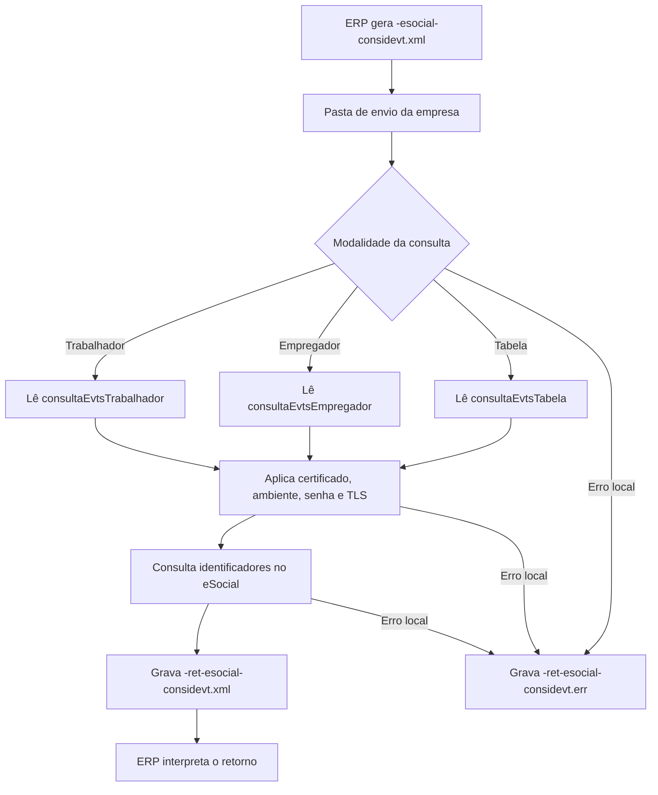

# Consulta de identificadores de eventos do eSocial

A consulta de identificadores de eventos do eSocial permite que o ERP solicite ao ambiente nacional a lista de identificadores de eventos já existentes, conforme os filtros informados no XML. Ela pode ser usada para localizar eventos por trabalhador, por empregador ou por tabela.

O UniNFe lê o XML gravado na pasta de envio da empresa, identifica a modalidade da consulta, envia a solicitação ao eSocial e grava o retorno para o ERP na pasta de retorno.

## Quando usar

Use a consulta de identificadores de eventos quando:

- O ERP precisa localizar eventos vinculados a um trabalhador.
- O ERP precisa localizar eventos do empregador por tipo de evento e período de apuração.
- O ERP precisa localizar eventos de tabela por tipo, chave e período.
- O suporte precisa conferir quais eventos existem no ambiente nacional antes de solicitar download ou conciliação.

## Pré-requisitos

Antes de executar a consulta, confira na configuração da empresa:

- A empresa está cadastrada no UniNFe.
- A pasta de envio e a pasta de retorno estão configuradas.
- O certificado digital está configurado e válido.
- O ambiente da empresa está configurado conforme a consulta desejada.
- As configurações de proxy e conexão TLS estão corretas, se a rede exigir proxy ou preparação TLS.
- A senha ou chave de integração exigida pelo serviço do eSocial está configurada, quando aplicável ao ambiente utilizado.

## Arquivo de envio

O ERP deve gerar o arquivo XML na pasta de envio da empresa com o final fixo:

```text
<identificador>-esocial-considevt.xml
```

O `<identificador>` deve ser único para a solicitação. Ele pode ser uma data/hora, uma identificação interna do ERP ou outro código que permita relacionar o pedido ao retorno.

Exemplos:

```text
ConsultaEvtsTrabalhador-esocial-considevt.xml
ConsultaEvtsEmpregador-esocial-considevt.xml
ConsultaEvtsTabela-esocial-considevt.xml
```

## Consulta por trabalhador

Use a estrutura `consultaEvtsTrabalhador` quando a consulta for feita para um CPF de trabalhador em um período:

```xml
<?xml version="1.0" encoding="utf-8"?>
<eSocial xmlns="http://www.esocial.gov.br/schema/consulta/identificadores-eventos/trabalhador/v1_0_0">
  <consultaIdentificadoresEvts>
    <ideEmpregador>
      <tpInsc>1</tpInsc>
      <nrInsc>00000000000000</nrInsc>
    </ideEmpregador>
    <consultaEvtsTrabalhador>
      <cpfTrab>00000000000</cpfTrab>
      <dtIni>2018-10-02T12:12:12</dtIni>
      <dtFim>2018-10-02T12:12:12</dtFim>
    </consultaEvtsTrabalhador>
  </consultaIdentificadoresEvts>
</eSocial>
```

Campos principais:

| Campo | Como preencher |
|---|---|
| `eSocial` | Elemento principal da consulta por trabalhador. |
| `consultaIdentificadoresEvts` | Grupo com os dados do empregador e os filtros da consulta. |
| `ideEmpregador/tpInsc` | Tipo de inscrição do empregador. |
| `ideEmpregador/nrInsc` | Número de inscrição do empregador. |
| `consultaEvtsTrabalhador/cpfTrab` | CPF do trabalhador que será consultado. |
| `consultaEvtsTrabalhador/dtIni` | Data e hora inicial do período de consulta. |
| `consultaEvtsTrabalhador/dtFim` | Data e hora final do período de consulta. |

## Consulta por empregador

Use a estrutura `consultaEvtsEmpregador` quando a consulta for feita para eventos do empregador por tipo de evento e período de apuração:

```xml
<?xml version="1.0" encoding="utf-8"?>
<eSocial xmlns="http://www.esocial.gov.br/schema/consulta/identificadores-eventos/empregador/v1_0_0">
  <consultaIdentificadoresEvts>
    <ideEmpregador>
      <tpInsc>1</tpInsc>
      <nrInsc>00000000000000</nrInsc>
    </ideEmpregador>
    <consultaEvtsEmpregador>
      <tpEvt>str123</tpEvt>
      <perApur>2017-10</perApur>
    </consultaEvtsEmpregador>
  </consultaIdentificadoresEvts>
</eSocial>
```

Campos principais:

| Campo | Como preencher |
|---|---|
| `eSocial` | Elemento principal da consulta por empregador. |
| `consultaIdentificadoresEvts` | Grupo com os dados do empregador e os filtros da consulta. |
| `ideEmpregador/tpInsc` | Tipo de inscrição do empregador. |
| `ideEmpregador/nrInsc` | Número de inscrição do empregador. |
| `consultaEvtsEmpregador/tpEvt` | Tipo do evento que será consultado. |
| `consultaEvtsEmpregador/perApur` | Período de apuração da consulta. |

## Consulta por tabela

Use a estrutura `consultaEvtsTabela` quando a consulta for feita para eventos de tabela:

```xml
<?xml version="1.0" encoding="utf-8"?>
<eSocial xmlns="http://www.esocial.gov.br/schema/consulta/identificadores-eventos/tabela/v1_0_0">
  <consultaIdentificadoresEvts>
    <ideEmpregador>
      <tpInsc>1</tpInsc>
      <nrInsc>00000000000000</nrInsc>
    </ideEmpregador>
    <consultaEvtsTabela>
      <tpEvt>str123</tpEvt>
      <chEvt>str1234</chEvt>
      <dtIni>2018-10-02T12:12:12</dtIni>
      <dtFim>2018-10-02T12:12:12</dtFim>
    </consultaEvtsTabela>
  </consultaIdentificadoresEvts>
</eSocial>
```

Campos principais:

| Campo | Como preencher |
|---|---|
| `eSocial` | Elemento principal da consulta por tabela. |
| `consultaIdentificadoresEvts` | Grupo com os dados do empregador e os filtros da consulta. |
| `ideEmpregador/tpInsc` | Tipo de inscrição do empregador. |
| `ideEmpregador/nrInsc` | Número de inscrição do empregador. |
| `consultaEvtsTabela/tpEvt` | Tipo do evento de tabela que será consultado. |
| `consultaEvtsTabela/chEvt` | Chave do evento de tabela. |
| `consultaEvtsTabela/dtIni` | Data e hora inicial do período de consulta. |
| `consultaEvtsTabela/dtFim` | Data e hora final do período de consulta. |

## Fluxo de processamento

1. O ERP grava `<identificador>-esocial-considevt.xml` na pasta de envio da empresa.
2. O UniNFe identifica o XML como consulta de identificadores de eventos do eSocial.
3. O UniNFe lê a solicitação e identifica se a consulta é por trabalhador, empregador ou tabela.
4. O UniNFe aplica as configurações da empresa, incluindo certificado digital, ambiente, senha ou chave de integração e preparação TLS quando configurada.
5. A consulta é enviada ao ambiente nacional do eSocial.
6. O retorno da consulta é gravado como `<identificador>-ret-esocial-considevt.xml` na pasta de retorno.
7. Se ocorrer falha local antes ou durante a consulta, o UniNFe grava `<identificador>-ret-esocial-considevt.err` na pasta de retorno.
8. O arquivo de solicitação é removido da pasta de envio após o processamento.

## Fluxograma



## Arquivos gerados

| Momento | Pasta | Nome do arquivo | Quando aparece |
|---|---|---|---|
| Pedido | Pasta de envio | `<identificador>-esocial-considevt.xml` | Arquivo criado pelo ERP para consultar identificadores de eventos do eSocial. |
| Retorno da consulta | Pasta de retorno | `<identificador>-ret-esocial-considevt.xml` | Retorno XML recebido do ambiente nacional do eSocial. |
| Erro ao ERP | Pasta de retorno | `<identificador>-ret-esocial-considevt.err` | Erro local antes ou durante a consulta, como falha de leitura, certificado, comunicação ou gravação. |

## Como tratar o retorno

O ERP deve monitorar a pasta de retorno e aguardar:

```text
<identificador>-ret-esocial-considevt.xml
```

Esse arquivo contém a resposta do ambiente nacional para os filtros enviados. O ERP deve analisar o status, as mensagens e a lista de identificadores retornada antes de atualizar sua base local ou solicitar o download dos eventos.

Quando a resposta trouxer identificadores de eventos, armazene-os mantendo o vínculo com a modalidade usada na consulta e com os filtros enviados.

## Erros locais

Se a consulta não puder ser concluída por falha local, será gerado:

```text
<identificador>-ret-esocial-considevt.err
```

As causas mais comuns são:

- XML fora da estrutura esperada.
- Solicitação sem uma das estruturas suportadas: `consultaEvtsTrabalhador`, `consultaEvtsEmpregador` ou `consultaEvtsTabela`.
- Dados do empregador ausentes ou inválidos.
- CPF do trabalhador ausente ou inválido na consulta por trabalhador.
- Tipo de evento, chave do evento, período de apuração ou intervalo de datas ausente ou inválido.
- Certificado digital ausente, inválido ou vencido.
- Ambiente da empresa configurado incorretamente.
- Senha ou chave de integração não configurada quando exigida.
- Proxy ou conexão TLS configurados incorretamente.
- Falha de comunicação com o ambiente nacional do eSocial.
- Falha de permissão ou acesso às pastas configuradas.

Depois de corrigir o problema, gere novamente o arquivo `<identificador>-esocial-considevt.xml` na pasta de envio.

## Cuidados para o integrador

- Use sempre o final `-esocial-considevt.xml` no arquivo de envio.
- Envie apenas uma modalidade de consulta por arquivo.
- Use `consultaEvtsTrabalhador` para localizar eventos de um trabalhador por CPF e período.
- Use `consultaEvtsEmpregador` para localizar eventos do empregador por tipo de evento e período de apuração.
- Use `consultaEvtsTabela` para localizar eventos de tabela por tipo, chave e período.
- Aguarde o retorno `-ret-esocial-considevt.xml` para interpretar a resposta.
- Em erros `.err`, corrija a causa local antes de reenviar a solicitação.
