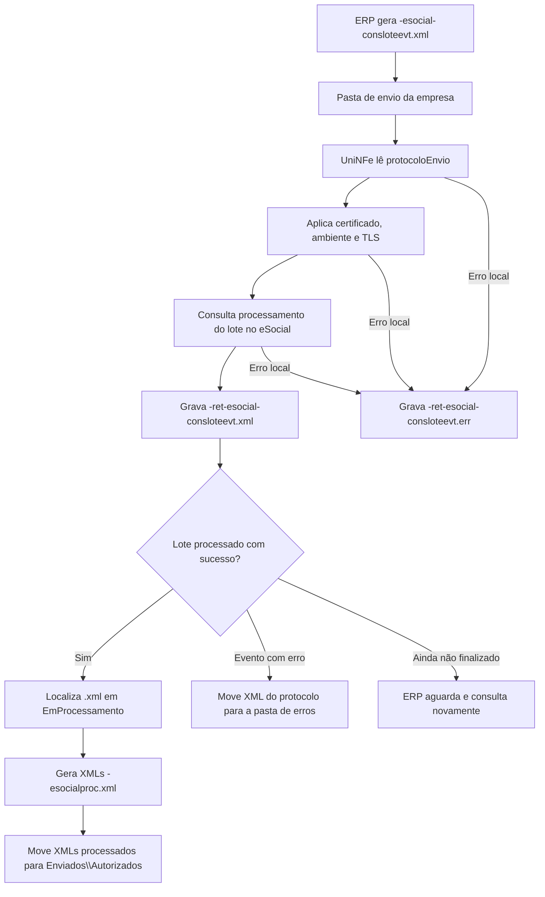

# Consulta de lote de eventos do eSocial

A consulta de lote de eventos do eSocial permite que o ERP consulte o processamento de um lote enviado anteriormente pela [recepção de lote de eventos](recepcao-lote-eventos.md). O ERP informa o protocolo de envio, o UniNFe consulta o ambiente nacional do eSocial e grava o retorno do processamento na pasta de retorno.

Quando os eventos do lote são processados com sucesso, o UniNFe também gera os XMLs processados dos eventos e os move para a pasta de autorizados da empresa.

## Quando usar

Use a consulta de lote de eventos quando:

- O lote de eventos já foi enviado ao eSocial.
- A recepção do lote retornou um protocolo de envio.
- O ERP precisa saber se os eventos foram processados com sucesso ou com erro.
- O ERP precisa receber os XMLs processados dos eventos aceitos.

## Pré-requisitos

Antes de executar a consulta, confira na configuração da empresa:

- A empresa está cadastrada no UniNFe.
- A pasta de envio, a pasta de retorno, a pasta de erros e a pasta de XMLs enviados estão configuradas.
- O certificado digital está configurado e válido.
- O ambiente da empresa está configurado conforme a consulta desejada.
- O protocolo de envio do lote está disponível no ERP.
- O XML assinado do lote recebido com sucesso está em `Enviados\EmProcessamento`, com o nome do protocolo de envio.
- As configurações de proxy e conexão TLS estão corretas, se a rede exigir proxy ou preparação TLS.

## Arquivo de envio

O ERP deve gerar o arquivo XML na pasta de envio da empresa com o final fixo:

```text
<identificador>-esocial-consloteevt.xml
```

O `<identificador>` deve ser único para a consulta. Ele pode ser uma data/hora, o protocolo de envio adaptado ao padrão de nome de arquivo ou outro identificador controlado pelo ERP.

Exemplo:

```text
ConsultaLoteEventos-esocial-consloteevt.xml
```

O XML deve usar a raiz `eSocial` do leiaute de consulta de processamento de lote:

```xml
<?xml version="1.0" encoding="utf-8"?>
<eSocial xmlns="http://www.esocial.gov.br/schema/lote/eventos/envio/consulta/retornoProcessamento/v1_0_0">
  <consultaLoteEventos>
    <protocoloEnvio>1.8.1111111111111111111</protocoloEnvio>
  </consultaLoteEventos>
</eSocial>
```

Campos principais:

| Campo | Como preencher |
|---|---|
| `eSocial` | Elemento principal da consulta de lote. |
| `consultaLoteEventos` | Grupo com a solicitação de consulta do processamento. |
| `protocoloEnvio` | Protocolo retornado na recepção do lote de eventos. |

## Fluxo de processamento

1. O ERP grava `<identificador>-esocial-consloteevt.xml` na pasta de envio da empresa.
2. O UniNFe identifica o XML como consulta de lote de eventos do eSocial.
3. O UniNFe remove retornos de erro antigos do mesmo identificador, quando existirem.
4. O UniNFe lê o XML de consulta e obtém o protocolo de envio.
5. O UniNFe aplica as configurações da empresa, incluindo certificado digital, ambiente e preparação TLS quando configurada.
6. A consulta é enviada ao ambiente nacional do eSocial.
7. O retorno da consulta é gravado como `<identificador>-ret-esocial-consloteevt.xml` na pasta de retorno.
8. Quando o lote e seus eventos retornam processados com sucesso, o UniNFe localiza o XML assinado em `Enviados\EmProcessamento`, gera os XMLs processados dos eventos e move esses arquivos para `Enviados\Autorizados`.
9. Quando algum evento do lote retorna com erro, o XML do protocolo em processamento é movido para a pasta de erros.
10. Se ocorrer falha local antes ou durante a consulta, o UniNFe grava `<identificador>-ret-esocial-consloteevt.err` na pasta de retorno.
11. O arquivo de solicitação é removido da pasta de envio após o processamento.

## Fluxograma



## Arquivos gerados e movimentados

| Momento | Pasta | Nome do arquivo | Quando aparece |
|---|---|---|---|
| Pedido | Pasta de envio | `<identificador>-esocial-consloteevt.xml` | Arquivo criado pelo ERP para consultar o processamento do lote. |
| Retorno da consulta | Pasta de retorno | `<identificador>-ret-esocial-consloteevt.xml` | Retorno XML recebido do ambiente nacional do eSocial. |
| Erro ao ERP | Pasta de retorno | `<identificador>-ret-esocial-consloteevt.err` | Erro local antes ou durante a consulta, como falha de leitura, certificado, comunicação ou gravação. |
| XML em processamento | `Enviados\EmProcessamento` | `<protocolo-de-envio>.xml` | XML assinado salvo na recepção do lote quando o lote foi recebido com sucesso. |
| XML processado do evento | `Enviados\Autorizados\<subpasta por data>` | `<eventoId>-esocialproc.xml` | Gerado quando o evento do lote é processado com sucesso. |
| XML com problema | Pasta de erros configurada | `<protocolo-de-envio>.xml` | Movido quando há evento do lote com erro de processamento. |

## Como tratar o retorno

O ERP deve monitorar a pasta de retorno e aguardar:

```text
<identificador>-ret-esocial-consloteevt.xml
```

Esse arquivo contém o retorno do processamento do lote. O ERP deve analisar o status do lote e de cada evento para atualizar sua base.

Quando o evento for processado com sucesso, o UniNFe gera:

```text
<eventoId>-esocialproc.xml
```

Esse XML fica em `Enviados\Autorizados`, dentro da subpasta organizada conforme a data do evento, e deve ser armazenado pelo ERP como XML processado do eSocial.

Se o lote ainda não estiver finalizado, aguarde o tempo necessário e gere novamente a consulta com o mesmo protocolo de envio.

## Erros locais

Se a consulta não puder ser concluída por falha local, será gerado:

```text
<identificador>-ret-esocial-consloteevt.err
```

As causas mais comuns são:

- XML fora da estrutura esperada.
- Protocolo de envio ausente ou inválido.
- XML do protocolo não localizado em `Enviados\EmProcessamento`.
- Certificado digital ausente, inválido ou vencido.
- Ambiente da empresa configurado incorretamente.
- Proxy ou conexão TLS configurados incorretamente.
- Falha de comunicação com o ambiente nacional do eSocial.
- Falha de permissão ou acesso às pastas configuradas.

Depois de corrigir o problema, gere novamente o arquivo `<identificador>-esocial-consloteevt.xml` na pasta de envio.

## Cuidados para o integrador

- Use sempre o final `-esocial-consloteevt.xml` no arquivo de consulta.
- Informe em `protocoloEnvio` o protocolo retornado pela recepção do lote.
- Consulte no mesmo ambiente em que o lote foi enviado.
- Aguarde o retorno `-ret-esocial-consloteevt.xml` para interpretar o processamento.
- Armazene os XMLs `-esocialproc.xml` gerados para eventos processados com sucesso.
- Se o retorno indicar processamento ainda pendente, consulte novamente depois.
- Em erros `.err`, corrija a causa local antes de reenviar a consulta.
