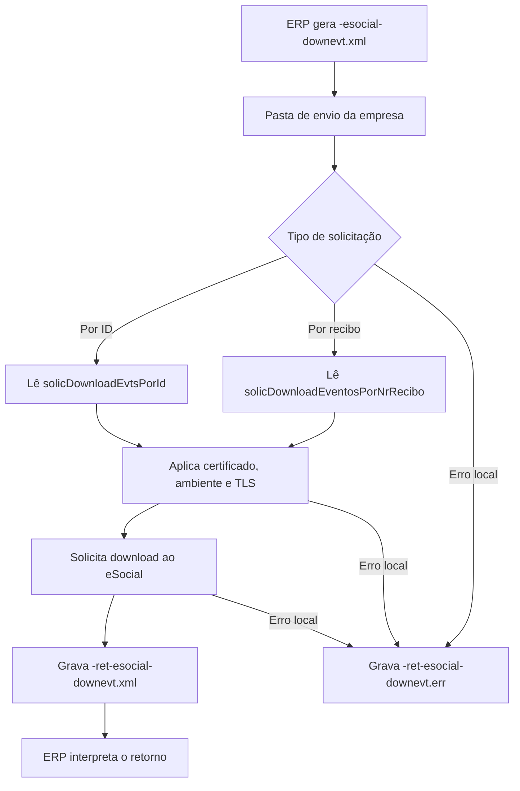

# Download de eventos do eSocial

O download de eventos do eSocial permite que o ERP solicite ao UniNFe a recuperação de um evento já existente no ambiente nacional do eSocial. A consulta pode ser feita pelo identificador do evento ou pelo número de recibo.

O UniNFe lê o XML gravado na pasta de envio da empresa, envia a solicitação ao serviço do eSocial e grava o retorno para o ERP na pasta de retorno.

## Quando usar

Use o download de eventos quando:

- O ERP precisa recuperar o XML de um evento pelo identificador.
- O ERP precisa recuperar o XML de um evento pelo número de recibo.
- O ERP precisa recompor sua base local com dados já enviados ao eSocial.
- O suporte precisa confirmar o conteúdo retornado pelo ambiente nacional.

## Pré-requisitos

Antes de executar o download, confira na configuração da empresa:

- A empresa está cadastrada no UniNFe.
- A pasta de envio e a pasta de retorno estão configuradas.
- O certificado digital está configurado e válido.
- O ambiente da empresa está configurado conforme a consulta desejada.
- O identificador do evento ou o número de recibo está disponível no ERP.
- As configurações de proxy e conexão TLS estão corretas, se a rede exigir proxy ou preparação TLS.

## Arquivo de envio

O ERP deve gerar o arquivo XML na pasta de envio da empresa com o final fixo:

```text
<identificador>-esocial-downevt.xml
```

O `<identificador>` deve ser único para a solicitação. Ele pode ser uma data/hora, o ID do evento, o número de recibo adaptado ao padrão de nome de arquivo ou outro identificador controlado pelo ERP.

Exemplos:

```text
DownloadEventosPorId-esocial-downevt.xml
DownloadEventosPorNrRec-esocial-downevt.xml
```

## Download por ID do evento

Para baixar pelo identificador do evento, use a estrutura `solicDownloadEvtsPorId`:

```xml
<?xml version="1.0" encoding="utf-8"?>
<eSocial xmlns="http://www.esocial.gov.br/schema/download/solicitacao/id/v1_0_0">
  <download>
    <ideEmpregador>
      <tpInsc>1</tpInsc>
      <nrInsc>00000000000000</nrInsc>
    </ideEmpregador>
    <solicDownloadEvtsPorId>
      <id>ID1111111111111111111111111111111111</id>
    </solicDownloadEvtsPorId>
  </download>
</eSocial>
```

Campos principais:

| Campo | Como preencher |
|---|---|
| `eSocial` | Elemento principal da solicitação de download por ID. |
| `download` | Grupo com os dados do empregador e da solicitação. |
| `ideEmpregador/tpInsc` | Tipo de inscrição do empregador. |
| `ideEmpregador/nrInsc` | Número de inscrição do empregador. |
| `solicDownloadEvtsPorId/id` | Identificador do evento que será baixado. |

## Download por número de recibo

Para baixar pelo número de recibo, use a estrutura `solicDownloadEventosPorNrRecibo`:

```xml
<?xml version="1.0" encoding="utf-8"?>
<eSocial xmlns="http://www.esocial.gov.br/schema/download/solicitacao/nrRecibo/v1_0_0">
  <download>
    <ideEmpregador>
      <tpInsc>1</tpInsc>
      <nrInsc>00000000000000</nrInsc>
    </ideEmpregador>
    <solicDownloadEventosPorNrRecibo>
      <nrRec>1.2.1111111111111111111</nrRec>
    </solicDownloadEventosPorNrRecibo>
  </download>
</eSocial>
```

Campos principais:

| Campo | Como preencher |
|---|---|
| `eSocial` | Elemento principal da solicitação de download por recibo. |
| `download` | Grupo com os dados do empregador e da solicitação. |
| `ideEmpregador/tpInsc` | Tipo de inscrição do empregador. |
| `ideEmpregador/nrInsc` | Número de inscrição do empregador. |
| `solicDownloadEventosPorNrRecibo/nrRec` | Número de recibo do evento que será baixado. |

## Fluxo de processamento

1. O ERP grava `<identificador>-esocial-downevt.xml` na pasta de envio da empresa.
2. O UniNFe identifica o XML como download de eventos do eSocial.
3. O UniNFe lê a solicitação e identifica se o download será feito por ID ou por número de recibo.
4. O UniNFe aplica as configurações da empresa, incluindo certificado digital, ambiente e preparação TLS quando configurada.
5. A solicitação é enviada ao ambiente nacional do eSocial.
6. O retorno do download é gravado como `<identificador>-ret-esocial-downevt.xml` na pasta de retorno.
7. Se ocorrer falha local antes ou durante o download, o UniNFe grava `<identificador>-ret-esocial-downevt.err` na pasta de retorno.
8. O arquivo de solicitação é removido da pasta de envio após o processamento.

## Fluxograma



## Arquivos gerados

| Momento | Pasta | Nome do arquivo | Quando aparece |
|---|---|---|---|
| Pedido | Pasta de envio | `<identificador>-esocial-downevt.xml` | Arquivo criado pelo ERP para solicitar o download de evento do eSocial. |
| Retorno do download | Pasta de retorno | `<identificador>-ret-esocial-downevt.xml` | Retorno XML recebido do ambiente nacional do eSocial. |
| Erro ao ERP | Pasta de retorno | `<identificador>-ret-esocial-downevt.err` | Erro local antes ou durante o download, como falha de leitura, certificado, comunicação ou gravação. |

## Como tratar o retorno

O ERP deve monitorar a pasta de retorno e aguardar:

```text
<identificador>-ret-esocial-downevt.xml
```

Esse arquivo contém a resposta do ambiente nacional do eSocial para a solicitação de download. O ERP deve analisar o status, as mensagens e o conteúdo retornado antes de atualizar sua base local.

Se o evento for retornado, armazene o XML conforme a regra de negócio do ERP, mantendo o vínculo com o ID do evento ou com o número de recibo utilizado na consulta.

## Erros locais

Se o download não puder ser concluído por falha local, será gerado:

```text
<identificador>-ret-esocial-downevt.err
```

As causas mais comuns são:

- XML fora da estrutura esperada.
- Solicitação sem `solicDownloadEvtsPorId` ou `solicDownloadEventosPorNrRecibo`.
- ID do evento ausente ou inválido.
- Número de recibo ausente ou inválido.
- Certificado digital ausente, inválido ou vencido.
- Ambiente da empresa configurado incorretamente.
- Proxy ou conexão TLS configurados incorretamente.
- Falha de comunicação com o ambiente nacional do eSocial.
- Falha de permissão ou acesso às pastas configuradas.

Depois de corrigir o problema, gere novamente o arquivo `<identificador>-esocial-downevt.xml` na pasta de envio.

## Cuidados para o integrador

- Use sempre o final `-esocial-downevt.xml` no arquivo de envio.
- Use `solicDownloadEvtsPorId` para download pelo ID do evento.
- Use `solicDownloadEventosPorNrRecibo` para download pelo número de recibo.
- Não envie as duas modalidades no mesmo XML.
- Aguarde o retorno `-ret-esocial-downevt.xml` para interpretar a resposta.
- Em erros `.err`, corrija a causa local antes de reenviar a solicitação.
