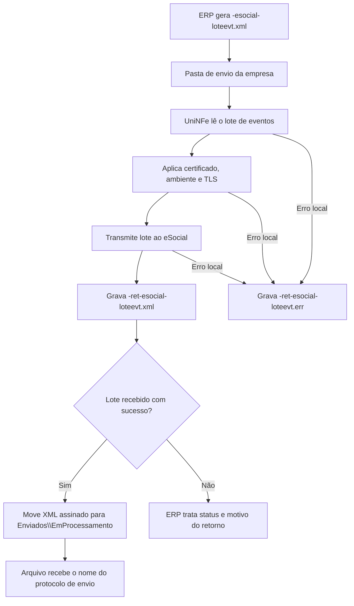

# Recepção de lote de eventos do eSocial

A recepção de lote de eventos do eSocial permite que o ERP envie ao UniNFe um lote com um ou mais eventos do eSocial para transmissão ao ambiente nacional. O UniNFe lê o XML gravado na pasta de envio da empresa, transmite o lote, grava o retorno da recepção para o ERP e, quando o lote é recebido com sucesso, mantém o XML assinado em processamento para consulta posterior.

Use este serviço quando o ERP já montou o lote de eventos do eSocial e precisa transmiti-lo pelo UniNFe usando o certificado digital configurado para a empresa.

## Quando usar

Use a recepção de lote de eventos quando:

- O ERP precisa enviar um lote de eventos do eSocial.
- O XML já está no leiaute de envio de lote do eSocial.
- O ERP precisa obter o protocolo de envio do lote.
- O processamento final dos eventos será consultado posteriormente pelo serviço de consulta de lote.

## Pré-requisitos

Antes de executar o envio, confira na configuração da empresa:

- A empresa está cadastrada no UniNFe.
- A pasta de envio, a pasta de retorno, a pasta de erros e a pasta de XMLs enviados estão configuradas.
- O certificado digital está configurado e válido.
- O ambiente da empresa está configurado conforme o envio desejado.
- As configurações de proxy e conexão TLS estão corretas, se a rede exigir proxy ou preparação TLS.
- O XML do lote foi gerado no leiaute correto do eSocial.

## Arquivo de envio

O ERP deve gerar o arquivo XML na pasta de envio da empresa com o final fixo:

```text
<identificador>-esocial-loteevt.xml
```

O `<identificador>` deve ser único para o envio. Ele pode ser uma data/hora, uma referência interna do ERP, o CNPJ do empregador combinado com uma sequência ou outro identificador controlado pelo ERP.

Exemplos:

```text
EnvioLoteEventos-esocial-loteevt.xml
201710_CNPJ-esocial-loteevt.xml
```

O XML deve usar a raiz `eSocial` do leiaute de envio de lote de eventos:

```xml
<?xml version="1.0" encoding="utf-8"?>
<eSocial xmlns="http://www.esocial.gov.br/schema/lote/eventos/envio/v1_1_1">
  <envioLoteEventos grupo="1">
    <ideEmpregador>
      <tpInsc>1</tpInsc>
      <nrInsc>00000000000000</nrInsc>
    </ideEmpregador>
    <ideTransmissor>
      <tpInsc>1</tpInsc>
      <nrInsc>00000000000000</nrInsc>
    </ideTransmissor>
    <eventos>
      <evento Id="ID1000000000000002017111710361100001">
        <eSocial xmlns="http://www.esocial.gov.br/schema/evt/evtInfoEmpregador/v_S_01_03_00">
          <!-- Evento do eSocial -->
        </eSocial>
      </evento>
    </eventos>
  </envioLoteEventos>
</eSocial>
```

Campos e grupos principais:

| Campo ou grupo | Como preencher |
|---|---|
| `eSocial` | Elemento principal do lote de envio. |
| `envioLoteEventos` | Grupo com as informações do lote de eventos. |
| `envioLoteEventos/@grupo` | Grupo do eSocial ao qual os eventos pertencem. |
| `ideEmpregador/tpInsc` | Tipo de inscrição do empregador. |
| `ideEmpregador/nrInsc` | Número de inscrição do empregador. |
| `ideTransmissor/tpInsc` | Tipo de inscrição do transmissor. |
| `ideTransmissor/nrInsc` | Número de inscrição do transmissor. |
| `eventos/evento` | Cada evento enviado no lote. |
| `evento/@Id` | Identificador único do evento. |
| `evento/eSocial` | XML do evento do eSocial, no namespace e versão correspondente ao tipo de evento. |

## Fluxo de processamento

1. O ERP grava `<identificador>-esocial-loteevt.xml` na pasta de envio da empresa.
2. O UniNFe identifica o XML como lote de eventos do eSocial.
3. O UniNFe remove retornos de erro antigos do mesmo identificador, quando existirem.
4. O UniNFe lê o XML do lote.
5. O UniNFe aplica as configurações da empresa, incluindo certificado digital, ambiente e preparação TLS quando configurada.
6. O lote é transmitido ao ambiente nacional do eSocial.
7. O retorno da recepção é gravado como `<identificador>-ret-esocial-loteevt.xml` na pasta de retorno.
8. Quando o retorno indica lote recebido com sucesso, o UniNFe salva o XML assinado e move o arquivo para `Enviados\EmProcessamento` com o nome do protocolo de envio.
9. Se ocorrer falha local antes ou durante o envio, o UniNFe grava `<identificador>-ret-esocial-loteevt.err` na pasta de retorno.
10. O arquivo original é retirado da pasta de envio após o processamento.

## Fluxograma



## Arquivos gerados e movimentados

| Momento | Pasta | Nome do arquivo | Quando aparece |
|---|---|---|---|
| Pedido | Pasta de envio | `<identificador>-esocial-loteevt.xml` | Arquivo criado pelo ERP para enviar o lote de eventos do eSocial. |
| Retorno da recepção | Pasta de retorno | `<identificador>-ret-esocial-loteevt.xml` | Retorno XML recebido após a transmissão do lote. |
| Erro ao ERP | Pasta de retorno | `<identificador>-ret-esocial-loteevt.err` | Erro local antes ou durante o envio, como falha de leitura, certificado, comunicação ou gravação. |
| XML assinado em processamento | `Enviados\EmProcessamento` | `<protocolo-de-envio>.xml` | Gravado quando o lote é recebido com sucesso pelo eSocial. |

## Como tratar o retorno

O ERP deve monitorar a pasta de retorno e aguardar:

```text
<identificador>-ret-esocial-loteevt.xml
```

Esse arquivo contém o retorno da recepção do lote. O ERP deve analisar o status, o motivo e, quando disponível, o protocolo de envio.

Quando o lote for recebido com sucesso, use o protocolo retornado para acompanhar o processamento pelo serviço de consulta de lote do eSocial. O XML assinado fica em `Enviados\EmProcessamento` com o nome do protocolo, aguardando a etapa de consulta do processamento.

## Erros locais

Se o envio não puder ser concluído por falha local, será gerado:

```text
<identificador>-ret-esocial-loteevt.err
```

As causas mais comuns são:

- XML fora da estrutura esperada.
- Raiz ou namespace do lote incompatível com envio de lote de eventos do eSocial.
- Eventos sem identificador válido.
- Certificado digital ausente, inválido ou vencido.
- Ambiente da empresa configurado incorretamente.
- Proxy ou conexão TLS configurados incorretamente.
- Falha de comunicação com o ambiente nacional do eSocial.
- Falha de permissão ou acesso às pastas configuradas.

Depois de corrigir o problema, gere novamente o arquivo `<identificador>-esocial-loteevt.xml` na pasta de envio.

## Cuidados para o integrador

- Use sempre o final `-esocial-loteevt.xml` no arquivo de envio.
- Use a raiz `eSocial` com o leiaute de envio de lote de eventos.
- Inclua eventos compatíveis com o grupo informado no lote.
- Use identificadores únicos para os eventos e para o arquivo de envio.
- Aguarde o retorno `-ret-esocial-loteevt.xml` para obter o status da recepção.
- Quando houver protocolo de envio, use-o para consultar o processamento do lote.
- Em erros `.err`, corrija a causa local antes de reenviar o lote.
