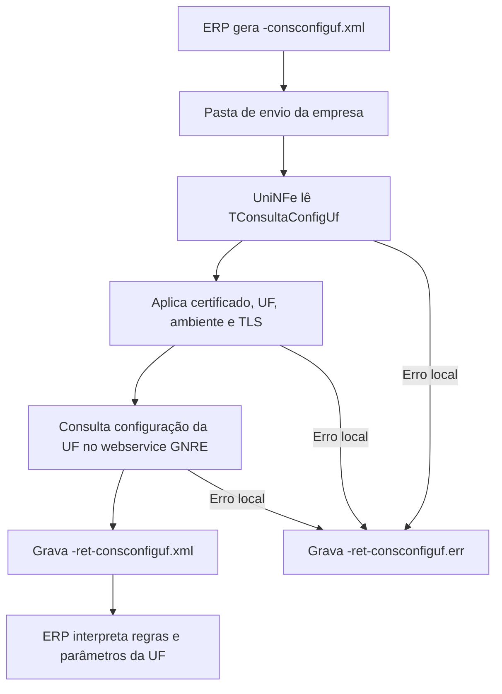

# Consulta de configuração da UF GNRE

A consulta de configuração da UF GNRE permite que o ERP consulte no webservice GNRE as regras e parâmetros de uma UF para determinada receita. O UniNFe lê o XML gravado na pasta de envio da empresa, envia a consulta ao serviço da GNRE e grava o retorno para o ERP.

Use este serviço antes de montar ou validar guias GNRE quando o ERP precisa saber quais informações uma UF exige para uma receita, como tipo de GNRE, campos extras, regras por receita e demais dados retornados pelo serviço.

## Quando usar

Use a consulta de configuração da UF GNRE quando:

- O ERP precisa montar uma guia GNRE conforme as regras da UF favorecida.
- O ERP precisa validar quais campos são exigidos para uma receita.
- O ERP precisa consultar tipos de GNRE aceitos pela UF.
- O ERP precisa atualizar parâmetros usados na geração das guias.

## Pré-requisitos

Antes de executar a consulta, confira na configuração da empresa:

- A empresa está cadastrada no UniNFe.
- A pasta de envio e a pasta de retorno estão configuradas.
- O certificado digital está configurado e válido.
- A UF da empresa está configurada corretamente.
- O ambiente da empresa está configurado conforme a consulta desejada.
- As configurações de proxy e conexão TLS estão corretas, se a rede exigir proxy ou preparação TLS.

## Arquivo de envio

O ERP deve gerar o arquivo XML na pasta de envio da empresa com o final fixo:

```text
<identificador>-consconfiguf.xml
```

O `<identificador>` deve ser único para a consulta. Ele pode ser uma data/hora, a UF consultada, a receita consultada ou outro identificador controlado pelo ERP.

Exemplo:

```text
TConsultaConfigUf-consconfiguf.xml
```

O XML deve usar a raiz `TConsultaConfigUf`:

```xml
<?xml version="1.0" encoding="utf-8"?>
<TConsultaConfigUf xmlns="http://www.gnre.pe.gov.br" Versao="2.00">
  <ambiente>2</ambiente>
  <uf>PR</uf>
  <receita courier="N">123456</receita>
  <tiposGnre>S</tiposGnre>
</TConsultaConfigUf>
```

Campos principais:

| Campo | Como preencher |
|---|---|
| `TConsultaConfigUf` | Elemento principal da consulta de configuração da UF. |
| `Versao` | Versão do leiaute GNRE. No exemplo do UniNFe, a versão utilizada é `2.00`. |
| `ambiente` | Ambiente da consulta. Use o mesmo ambiente configurado para a operação. |
| `uf` | UF que terá a configuração consultada. |
| `receita` | Código da receita que será consultada. |
| `receita/@courier` | Indicador de courier da receita, quando aplicável. |
| `tiposGnre` | Informe `S` quando desejar consultar os tipos de GNRE disponíveis para a UF. |

## Fluxo de processamento

1. O ERP grava `<identificador>-consconfiguf.xml` na pasta de envio da empresa.
2. O UniNFe identifica o XML como consulta de configuração da UF GNRE.
3. O UniNFe remove retornos de erro antigos do mesmo identificador, quando existirem.
4. O UniNFe lê o XML `TConsultaConfigUf`.
5. O UniNFe aplica as configurações da empresa, incluindo certificado digital, UF, ambiente e preparação TLS quando configurada.
6. A consulta é enviada ao webservice GNRE.
7. O retorno da consulta é gravado como `<identificador>-ret-consconfiguf.xml` na pasta de retorno.
8. Se ocorrer falha local antes ou durante a consulta, o UniNFe grava `<identificador>-ret-consconfiguf.err` na pasta de retorno.
9. O arquivo de solicitação é removido da pasta de envio após o processamento.

## Fluxograma



## Arquivos gerados

| Momento | Pasta | Nome do arquivo | Quando aparece |
|---|---|---|---|
| Pedido | Pasta de envio | `<identificador>-consconfiguf.xml` | Arquivo criado pelo ERP para consultar configuração da UF GNRE. |
| Retorno da consulta | Pasta de retorno | `<identificador>-ret-consconfiguf.xml` | Retorno XML recebido do webservice com as configurações da UF. |
| Erro ao ERP | Pasta de retorno | `<identificador>-ret-consconfiguf.err` | Erro local antes ou durante a consulta, como falha de leitura, certificado, comunicação ou gravação. |

## Como tratar o retorno

O ERP deve monitorar a pasta de retorno e aguardar:

```text
<identificador>-ret-consconfiguf.xml
```

Esse arquivo contém a resposta do webservice GNRE para a UF e receita consultadas. O ERP deve ler as regras retornadas e usá-las para orientar o preenchimento, validação ou atualização de parâmetros usados na geração das guias GNRE.

Quando a consulta retornar dados de tipos de GNRE, receitas ou campos exigidos, armazene ou atualize essas informações conforme a regra de negócio do ERP.

## Erros locais

Se a consulta não puder ser concluída por falha local, será gerado:

```text
<identificador>-ret-consconfiguf.err
```

As causas mais comuns são:

- XML fora da estrutura esperada.
- Raiz diferente de `TConsultaConfigUf`.
- UF ausente ou inválida.
- Receita ausente ou inválida.
- Ambiente configurado ou informado incorretamente.
- Certificado digital ausente, inválido ou vencido.
- Proxy ou conexão TLS configurados incorretamente.
- Falha de comunicação com o webservice GNRE.
- Falha de permissão ou acesso às pastas configuradas.

Depois de corrigir o problema, gere novamente o arquivo `<identificador>-consconfiguf.xml` na pasta de envio.

## Cuidados para o integrador

- Use sempre o final `-consconfiguf.xml` no arquivo de consulta.
- Use a raiz `TConsultaConfigUf` no XML.
- Informe a UF e a receita conforme a regra da operação.
- Use `tiposGnre` com `S` quando precisar consultar os tipos de GNRE da UF.
- Aguarde o arquivo `-ret-consconfiguf.xml` para interpretar as regras retornadas.
- Em erros `.err`, corrija a causa local antes de reenviar a consulta.
