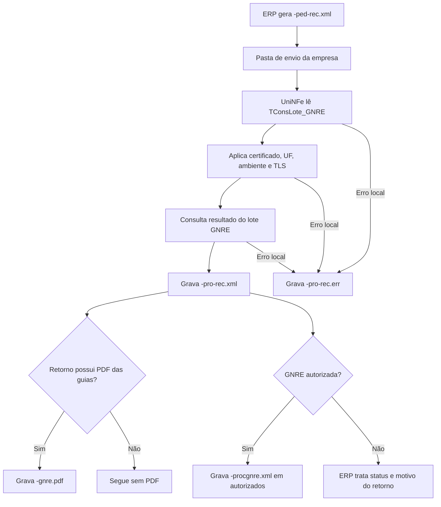

# Consulta de resultado do lote GNRE

A consulta de resultado do lote GNRE permite que o ERP consulte o processamento de um lote enviado anteriormente pela [recepção de lote GNRE](recepcao-lote.md). O ERP informa o número do recibo recebido na recepção, o UniNFe consulta o webservice GNRE e grava o resultado para o ERP.

Use este serviço depois de enviar o lote GNRE e obter um recibo. A recepção confirma o envio do lote; esta consulta mostra o resultado do processamento, podendo gerar também o PDF das guias e o XML processado quando a GNRE estiver autorizada.

## Quando usar

Use a consulta de resultado do lote GNRE quando:

- O ERP já enviou um lote GNRE.
- O retorno da recepção trouxe um número de recibo.
- O ERP precisa saber se o lote foi processado, autorizado ou rejeitado.
- O ERP deseja receber o PDF das guias, quando disponibilizado pelo serviço.
- O ERP precisa armazenar o XML processado da GNRE autorizada.

## Pré-requisitos

Antes de executar a consulta, confira na configuração da empresa:

- A empresa está cadastrada no UniNFe.
- A pasta de envio, a pasta de retorno e a pasta de XMLs enviados estão configuradas.
- O certificado digital está configurado e válido.
- A UF da empresa está configurada corretamente.
- O ambiente da empresa está configurado conforme a consulta desejada.
- O número do recibo do lote GNRE está disponível no ERP.
- As configurações de proxy e conexão TLS estão corretas, se a rede exigir proxy ou preparação TLS.

## Arquivo de envio

O ERP deve gerar o arquivo XML na pasta de envio da empresa com o final fixo:

```text
<identificador>-ped-rec.xml
```

O `<identificador>` deve ser único para a consulta. Ele pode ser o número do recibo, uma data/hora, um número sequencial ou outro identificador controlado pelo ERP.

Exemplos:

```text
TConsLote_GNRE-ped-rec.xml
GNRE_NFe6538-ped-rec.xml
```

O XML deve usar a raiz `TConsLote_GNRE`:

```xml
<?xml version="1.0" encoding="utf-8"?>
<TConsLote_GNRE xmlns="http://www.gnre.pe.gov.br">
  <ambiente>2</ambiente>
  <numeroRecibo>2100250239</numeroRecibo>
  <incluirPDFGuias>S</incluirPDFGuias>
</TConsLote_GNRE>
```

Campos principais:

| Campo | Como preencher |
|---|---|
| `TConsLote_GNRE` | Elemento principal da consulta de resultado do lote GNRE. |
| `versao` | Versão do leiaute, quando informada no XML. Nos exemplos do UniNFe, pode ser usada a versão `2.00`. |
| `ambiente` | Ambiente da consulta. Use o mesmo ambiente utilizado na recepção do lote. |
| `numeroRecibo` | Número do recibo retornado pela recepção do lote GNRE. |
| `incluirPDFGuias` | Informe `S` quando desejar que o serviço retorne o PDF das guias, se disponível. |

## Fluxo de processamento

1. O ERP grava `<identificador>-ped-rec.xml` na pasta de envio da empresa.
2. O UniNFe identifica o XML como consulta de resultado de lote GNRE.
3. O UniNFe remove retornos de erro antigos do mesmo identificador, quando existirem.
4. O UniNFe lê o XML `TConsLote_GNRE`.
5. O UniNFe aplica as configurações da empresa, incluindo certificado digital, UF, ambiente e preparação TLS quando configurada.
6. A consulta é enviada ao webservice GNRE.
7. Se o retorno trouxer PDF das guias, o UniNFe grava `<identificador>-gnre.pdf` na pasta de retorno.
8. Se a GNRE estiver autorizada, o UniNFe grava `<identificador>-procgnre.xml` na pasta de XMLs autorizados da empresa.
9. O retorno da consulta é gravado como `<identificador>-pro-rec.xml` na pasta de retorno.
10. Se ocorrer falha local antes ou durante a consulta, o UniNFe grava `<identificador>-pro-rec.err` na pasta de retorno.
11. O arquivo de solicitação é removido da pasta de envio após o processamento.

## Fluxograma



## Arquivos gerados

| Momento | Pasta | Nome do arquivo | Quando aparece |
|---|---|---|---|
| Pedido | Pasta de envio | `<identificador>-ped-rec.xml` | Arquivo criado pelo ERP para consultar o resultado do lote GNRE. |
| Retorno da consulta | Pasta de retorno | `<identificador>-pro-rec.xml` | Retorno XML recebido do webservice com o resultado do processamento do lote. |
| PDF das guias | Pasta de retorno | `<identificador>-gnre.pdf` | Gerado quando o retorno disponibiliza o PDF das guias. |
| XML processado | `Enviados\Autorizados\<subpasta por data>` | `<identificador>-procgnre.xml` | Gerado quando a GNRE é autorizada. |
| Erro ao ERP | Pasta de retorno | `<identificador>-pro-rec.err` | Erro local antes ou durante a consulta, como falha de leitura, certificado, comunicação ou gravação. |

## Como tratar o retorno

O ERP deve monitorar a pasta de retorno e aguardar:

```text
<identificador>-pro-rec.xml
```

Esse arquivo contém o resultado do processamento do lote GNRE. O ERP deve analisar o status e o motivo retornados para decidir se a GNRE foi autorizada, rejeitada ou se ainda exige nova consulta.

Quando houver PDF das guias, o ERP também poderá consumir:

```text
<identificador>-gnre.pdf
```

Quando a GNRE estiver autorizada, o UniNFe grava o XML processado:

```text
<identificador>-procgnre.xml
```

Esse XML fica na pasta de XMLs autorizados da empresa, dentro da subpasta organizada conforme a configuração de gravação por data.

## Erros locais

Se a consulta não puder ser concluída por falha local, será gerado:

```text
<identificador>-pro-rec.err
```

As causas mais comuns são:

- XML fora da estrutura esperada.
- Raiz diferente de `TConsLote_GNRE`.
- Número do recibo ausente ou inválido.
- Ambiente diferente do ambiente usado na recepção do lote.
- Certificado digital ausente, inválido ou vencido.
- UF ou ambiente da empresa configurados incorretamente.
- Proxy ou conexão TLS configurados incorretamente.
- Falha de comunicação com o webservice GNRE.
- Falha de permissão ou acesso às pastas configuradas.

Depois de corrigir o problema, gere novamente o arquivo `<identificador>-ped-rec.xml` na pasta de envio.

## Cuidados para o integrador

- Use sempre o final `-ped-rec.xml` no arquivo de consulta.
- Use a raiz `TConsLote_GNRE` no XML.
- Informe em `numeroRecibo` o recibo retornado pela recepção do lote.
- Consulte no mesmo ambiente em que o lote foi enviado.
- Use `incluirPDFGuias` com `S` quando desejar receber o PDF das guias.
- Aguarde o arquivo `-pro-rec.xml` para interpretar o resultado do processamento.
- Armazene o XML `-procgnre.xml` quando a GNRE for autorizada.
- Em erros `.err`, corrija a causa local antes de reenviar a consulta.
