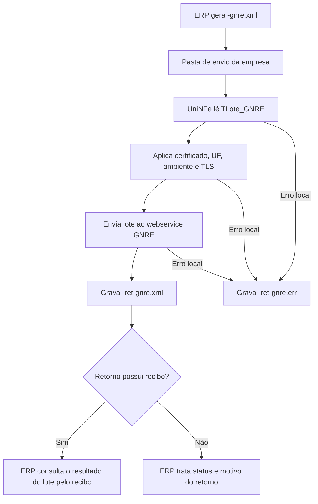

# Recepção de lote GNRE

A recepção de lote GNRE permite que o ERP envie ao UniNFe um lote de guias GNRE para processamento no webservice. O UniNFe lê o XML gravado na pasta de envio da empresa, envia o lote ao serviço da GNRE e grava o retorno da recepção para o ERP.

Este serviço registra o envio do lote e retorna a resposta da recepção. Para acompanhar o resultado final do processamento do lote, o ERP deve usar o serviço de consulta de resultado do lote GNRE, informando o recibo retornado pela recepção quando ele estiver disponível no retorno.

## Quando usar

Use a recepção de lote GNRE quando:

- O ERP precisa enviar uma ou mais guias GNRE para processamento.
- O ERP precisa obter o recibo ou retorno inicial do envio do lote.
- A empresa trabalha com GNRE versão 2.00 no leiaute `TLote_GNRE`.
- O processamento final será acompanhado posteriormente pela consulta de resultado do lote.

## Pré-requisitos

Antes de executar o envio, confira na configuração da empresa:

- A empresa está cadastrada no UniNFe.
- A pasta de envio, a pasta de retorno e a pasta de erros estão configuradas.
- O certificado digital está configurado e válido.
- A UF da empresa está configurada corretamente.
- O ambiente da empresa está configurado conforme o envio desejado.
- As configurações de proxy e conexão TLS estão corretas, se a rede exigir proxy ou preparação TLS.

## Arquivo de envio

O ERP deve gerar o arquivo XML na pasta de envio da empresa com o final fixo:

```text
<identificador>-gnre.xml
```

O `<identificador>` deve ser único para o envio. Ele pode ser uma data/hora, um número sequencial, uma referência interna do ERP ou outro identificador controlado pelo ERP.

Exemplos:

```text
TLote_GNRE-gnre.xml
GNRE_NFe6538-gnre.xml
```

O XML deve usar a raiz `TLote_GNRE`:

```xml
<?xml version="1.0" encoding="utf-8"?>
<TLote_GNRE versao="2.00" xmlns="http://www.gnre.pe.gov.br">
  <guias>
    <TDadosGNRE versao="2.00">
      <ufFavorecida>PR</ufFavorecida>
      <tipoGnre>0</tipoGnre>
      <contribuinteEmitente>
        <razaoSocial>Unimake Software</razaoSocial>
        <endereco>Rua teste</endereco>
        <municipio>18402</municipio>
        <uf>PR</uf>
        <cep>87704030</cep>
        <telefone>31414900</telefone>
      </contribuinteEmitente>
      <itensGNRE>
        <item>
          <receita>123456</receita>
          <documentoOrigem tipo="01">1234</documentoOrigem>
          <dataVencimento>2020-09-14</dataVencimento>
          <valor tipo="11">10.00</valor>
        </item>
      </itensGNRE>
      <valorGNRE>150.33</valorGNRE>
    </TDadosGNRE>
  </guias>
</TLote_GNRE>
```

Campos principais:

| Campo | Como preencher |
|---|---|
| `TLote_GNRE` | Elemento principal do lote GNRE. |
| `versao` | Versão do leiaute GNRE. Nos exemplos do UniNFe, a versão utilizada é `2.00`. |
| `guias` | Grupo que contém uma ou mais guias do lote. |
| `TDadosGNRE` | Dados de cada guia GNRE. |
| `ufFavorecida` | UF favorecida pela guia. |
| `tipoGnre` | Tipo da GNRE conforme regra do serviço. |
| `contribuinteEmitente` | Dados do contribuinte emitente da guia. |
| `itensGNRE/item` | Itens da GNRE, incluindo receita, documento de origem, vencimento e valores. |
| `valorGNRE` | Valor total da guia GNRE. |
| `dataPagamento` | Data de pagamento, quando exigida no envio. |

## Fluxo de processamento

1. O ERP grava `<identificador>-gnre.xml` na pasta de envio da empresa.
2. O UniNFe identifica o XML como lote GNRE.
3. O UniNFe remove retornos de erro antigos do mesmo identificador, quando existirem.
4. O UniNFe lê o XML `TLote_GNRE`.
5. O UniNFe aplica as configurações da empresa, incluindo certificado digital, UF, ambiente e preparação TLS quando configurada.
6. O lote é enviado ao webservice GNRE.
7. O retorno da recepção é gravado como `<identificador>-ret-gnre.xml` na pasta de retorno.
8. Se ocorrer falha local antes ou durante o envio, o UniNFe grava `<identificador>-ret-gnre.err` na pasta de retorno.
9. O arquivo de solicitação é removido da pasta de envio após o processamento.

## Fluxograma



## Arquivos gerados

| Momento | Pasta | Nome do arquivo | Quando aparece |
|---|---|---|---|
| Pedido | Pasta de envio | `<identificador>-gnre.xml` | Arquivo criado pelo ERP para enviar o lote GNRE. |
| Retorno da recepção | Pasta de retorno | `<identificador>-ret-gnre.xml` | Retorno XML recebido do webservice após a recepção do lote. |
| Erro ao ERP | Pasta de retorno | `<identificador>-ret-gnre.err` | Erro local antes ou durante o envio, como falha de leitura, certificado, comunicação ou gravação. |

## Como tratar o retorno

O ERP deve monitorar a pasta de retorno e aguardar:

```text
<identificador>-ret-gnre.xml
```

Esse arquivo contém a resposta da recepção do lote GNRE. O ERP deve analisar o status e o motivo retornados. Quando o retorno trouxer recibo do lote, armazene esse recibo para consultar posteriormente o resultado do processamento.

A recepção do lote não substitui a consulta de resultado. O processamento final da guia deve ser acompanhado pelo serviço de consulta de resultado do lote GNRE.

## Erros locais

Se o envio não puder ser concluído por falha local, será gerado:

```text
<identificador>-ret-gnre.err
```

As causas mais comuns são:

- XML fora da estrutura esperada.
- Raiz diferente de `TLote_GNRE`.
- Campos obrigatórios da guia ausentes ou preenchidos incorretamente.
- Certificado digital ausente, inválido ou vencido.
- UF ou ambiente da empresa configurados incorretamente.
- Proxy ou conexão TLS configurados incorretamente.
- Falha de comunicação com o webservice GNRE.
- Falha de permissão ou acesso às pastas configuradas.

Depois de corrigir o problema, gere novamente o arquivo `<identificador>-gnre.xml` na pasta de envio.

## Cuidados para o integrador

- Use sempre o final `-gnre.xml` no arquivo de envio.
- Use a raiz `TLote_GNRE` no XML.
- Use um identificador único para relacionar o pedido ao retorno.
- Leia o retorno `-ret-gnre.xml` antes de considerar o lote recebido.
- Armazene o recibo retornado para consultar o resultado do lote.
- Trate arquivos `.err` como falhas locais e corrija a causa antes de reenviar o lote.
