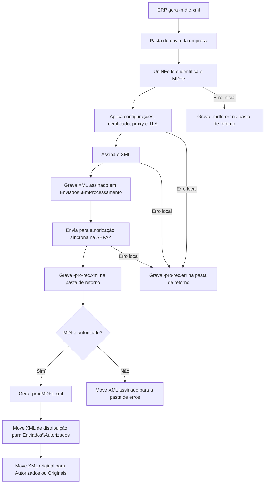

# Autorização síncrona de MDFe

A autorização síncrona de MDFe permite que o ERP envie um Manifesto Eletrônico de Documentos Fiscais ao UniNFe por troca de arquivos. O ERP grava o XML do MDFe na pasta de envio configurada para a empresa, o UniNFe assina o documento, transmite para a SEFAZ e grava o retorno na pasta de retorno.

Use este serviço quando a empresa emite MDFe e precisa que o UniNFe faça o envio direto do XML para autorização.

## Pré-requisitos

Antes de enviar um MDFe, confira na configuração da empresa:

- A empresa emissora está cadastrada no UniNFe.
- A pasta de envio, a pasta de retorno e a pasta de XMLs enviados estão configuradas.
- O certificado digital da empresa está configurado e válido.
- O ambiente de emissão está configurado conforme a operação desejada.
- As configurações de proxy estão preenchidas, se a rede exigir proxy para acesso à internet.
- O XML do MDFe contém todos os grupos e campos exigidos pelo leiaute para a operação fiscal.

## Arquivo de envio

O ERP deve gerar o XML do MDFe na pasta de envio da empresa com o final fixo:

```text
<identificador>-mdfe.xml
```

O `<identificador>` deve ser único para evitar conflito entre documentos. Normalmente ele é a chave de acesso do MDFe.

Exemplo:

```text
41190876676436000167580010000500001000437558-mdfe.xml
```

O conteúdo do arquivo deve ser o XML do MDFe, com a estrutura esperada para o documento fiscal:

```xml
<?xml version="1.0" encoding="utf-8"?>
<MDFe xmlns="http://www.portalfiscal.inf.br/mdfe">
  <infMDFe Id="MDFe41190876676436000167580010000500001000437558" versao="3.00">
    <ide>
      <cUF>41</cUF>
      <tpAmb>2</tpAmb>
      <mod>58</mod>
      <serie>1</serie>
      <nMDF>50000</nMDF>
      <dhEmi>2019-08-16T15:00:00-02:00</dhEmi>
      <tpEmis>1</tpEmis>
    </ide>
    <emit>
      <CNPJ>76676436000167</CNPJ>
      <IE>1015495185</IE>
      <xNome>EMPRESA EMITENTE</xNome>
    </emit>
  </infMDFe>
</MDFe>
```

O exemplo acima mostra apenas os principais grupos. O XML real deve conter todos os campos exigidos pelo leiaute do MDFe para a operação fiscal.

Campos e grupos principais:

| Campo ou grupo | Como preencher |
|---|---|
| `infMDFe/@Id` | Identificador do MDFe. Deve ser compatível com a chave de acesso do documento. |
| `ide` | Dados de identificação do manifesto, como UF, ambiente, modelo, série, número, data de emissão, tipo de emissão, UF inicial e UF final. |
| `emit` | Dados do emitente do MDFe. |
| `infModal` | Dados do modal de transporte, como informações rodoviárias, veículos, condutores e dados exigidos para a operação. |
| `infDoc` | Documentos fiscais vinculados ao manifesto, como NF-e ou CT-e, conforme a operação. |
| `seg` | Informações de seguro, quando exigidas. |
| `prodPred` | Produto predominante, quando exigido pelo leiaute e pela operação. |
| `tot` | Totais do manifesto. |
| `infAdic` | Informações adicionais de interesse do fisco e do contribuinte. |
| `infRespTec` | Dados do responsável técnico, quando exigidos para a operação. |

Não inclua XML de consulta, evento ou status de serviço neste arquivo. Este serviço é síncrono: o envio e o retorno do webservice acontecem no mesmo processamento.

## Fluxo de processamento

1. O ERP grava o arquivo `<identificador>-mdfe.xml` na pasta de envio.
2. O UniNFe identifica o documento como MDFe pelo XML e pelo final do arquivo.
3. O UniNFe lê o XML, aplica as configurações da empresa, prepara certificado, proxy e conexão TLS quando configurado.
4. O XML é assinado e gravado em `Enviados\EmProcessamento` com o mesmo nome do arquivo de envio.
5. O UniNFe envia o MDFe para autorização síncrona na SEFAZ.
6. O retorno do webservice é gravado na pasta de retorno como `<identificador>-pro-rec.xml`.
7. Se o MDFe for autorizado, o UniNFe cria o XML de distribuição `<identificador>-procMDFe.xml` e move os arquivos para a pasta de autorizados.
8. Se a configuração da empresa estiver marcada para salvar somente o XML de distribuição, o XML original assinado é movido para `Enviados\Originais`.
9. Se o MDFe for rejeitado, o XML assinado é movido para a pasta de erros e o ERP deve tratar a rejeição informada no retorno.
10. Se ocorrer erro local durante o envio, o UniNFe grava um arquivo `<identificador>-pro-rec.err` na pasta de retorno.
11. Se o erro ocorrer antes de concluir a identificação do serviço de envio, o UniNFe pode gravar `<identificador>-mdfe.err` na pasta de retorno.

## Fluxograma



## Arquivos gerados e movimentados

| Momento | Pasta | Nome do arquivo | Quando aparece |
|---|---|---|---|
| Envio pelo ERP | Pasta de envio | `<identificador>-mdfe.xml` | Arquivo criado pelo ERP para solicitar a autorização do MDFe. |
| Em processamento | `Enviados\EmProcessamento` | `<identificador>-mdfe.xml` | XML já assinado pelo UniNFe enquanto o serviço está processando a autorização. |
| Retorno ao ERP | Pasta de retorno | `<identificador>-pro-rec.xml` | Retorno XML recebido do webservice, tanto para autorização quanto para rejeição retornada pela SEFAZ. |
| Erro local do envio | Pasta de retorno | `<identificador>-pro-rec.err` | Erro local durante o processamento, como falha de leitura, certificado, assinatura, comunicação ou gravação. |
| Erro de validação do arquivo | Pasta de retorno | `<identificador>-mdfe.err` | Erro identificado antes da conclusão do serviço de autorização do MDFe. |
| XML de distribuição | `Enviados\Autorizados\<subpasta por data>` | `<identificador>-procMDFe.xml` | MDFe autorizado. É o XML principal para armazenamento fiscal e uso pelo ERP. |
| XML original assinado | `Enviados\Autorizados\<subpasta por data>` ou `Enviados\Originais\<subpasta por data>` | `<identificador>-mdfe.xml` | MDFe autorizado. O destino depende da configuração para salvar somente o XML de distribuição. |
| XML rejeitado | Pasta de erros configurada | `<identificador>-mdfe.xml` | MDFe rejeitado pela SEFAZ ou com falha que exige correção e novo envio. |

## Como tratar o retorno

O ERP deve monitorar a pasta de retorno e aguardar o arquivo:

```text
<identificador>-pro-rec.xml
```

Esse arquivo contém a resposta do webservice da SEFAZ. O ERP deve ler as informações de status, motivo e protocolo quando existirem. Quando o status indicar autorização, o ERP também deve localizar e armazenar o XML de distribuição:

```text
<identificador>-procMDFe.xml
```

O XML de distribuição é gravado na pasta `Enviados\Autorizados`, dentro da subpasta criada conforme a configuração de organização por data. Ele contém o MDFe autorizado com o protocolo anexado.

Quando o status indicar rejeição, o ERP deve apresentar o motivo ao usuário, corrigir os dados do MDFe e gerar um novo arquivo `-mdfe.xml` na pasta de envio. A rejeição não deve ser tratada como autorização.

## Erros locais

Se o UniNFe não conseguir concluir o processamento por falha local, será gerado um arquivo de erro na pasta de retorno. Durante o envio síncrono, o retorno esperado é:

```text
<identificador>-pro-rec.err
```

Também pode haver retorno de erro do próprio tipo de arquivo MDFe:

```text
<identificador>-mdfe.err
```

Esses arquivos devem ser tratados pelo ERP ou pelo suporte antes de reenviar o MDFe. As causas mais comuns são:

- XML fora da estrutura esperada.
- Certificado digital ausente, inválido ou vencido.
- Falha de assinatura.
- Ambiente, proxy ou conexão TLS configurados incorretamente.
- Falha de comunicação com o webservice.
- Falha de permissão ou acesso às pastas configuradas.

Depois de corrigir o problema, gere novamente o arquivo `<identificador>-mdfe.xml` na pasta de envio.

## Cuidados para o integrador

- Use sempre o final `-mdfe.xml` para o arquivo de envio do MDFe.
- Não reutilize o mesmo identificador enquanto houver processamento pendente para o documento.
- Aguarde o arquivo `-pro-rec.xml` para saber o resultado retornado pela SEFAZ.
- Armazene o XML `-procMDFe.xml` quando o MDFe for autorizado.
- Em rejeições, corrija o XML e envie novamente; não altere manualmente arquivos em `EmProcessamento`.
- Em erros `.err`, corrija a causa local antes de reenviar o documento.
