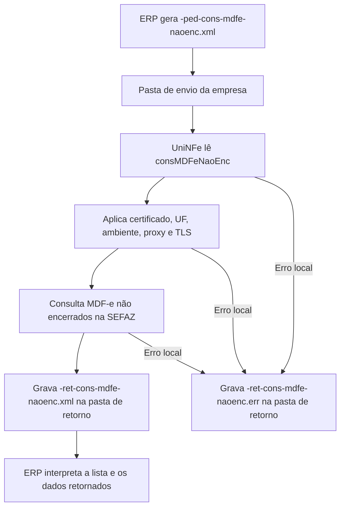

# Consulta de MDFe não encerrados

A consulta de MDFe não encerrados permite que o ERP consulte na SEFAZ quais MDF-e ainda constam como não encerrados para um CNPJ e ambiente. O resultado ajuda o usuário, o suporte e o integrador a identificar documentos que ainda precisam ser encerrados ou analisados.

Esta consulta não emite MDFe, não encerra manifesto e não gera XML de distribuição. Ela apenas envia uma solicitação de consulta e grava o retorno da SEFAZ para o ERP.

## Quando usar

Use este serviço quando:

- O ERP precisa identificar MDF-e ainda não encerrados.
- O usuário precisa regularizar manifestos abertos.
- O suporte precisa conferir se existem documentos pendentes para o CNPJ da empresa.
- Antes de executar encerramentos, a empresa deseja saber quais MDF-e ainda aparecem como não encerrados na SEFAZ.

## Pré-requisitos

Antes de executar a consulta, confira na configuração da empresa:

- A empresa está cadastrada no UniNFe.
- A pasta de envio e a pasta de retorno estão configuradas.
- O certificado digital está configurado e válido.
- A UF da empresa está configurada corretamente.
- O ambiente informado no XML corresponde ao ambiente que será consultado.
- As configurações de proxy estão preenchidas, se a rede exigir proxy para acesso à internet.

## Arquivo de envio

O ERP deve gerar o XML de consulta na pasta de envio da empresa com o final fixo:

```text
<identificador>-ped-cons-mdfe-naoenc.xml
```

O `<identificador>` deve ser único para a consulta. Ele pode ser uma data/hora, um número sequencial, o CNPJ consultado ou outro identificador controlado pelo ERP.

Exemplo:

```text
01010101010-ped-cons-mdfe-naoenc.xml
```

O conteúdo do XML deve usar a estrutura de consulta de MDFe não encerrados:

```xml
<?xml version="1.0" encoding="utf-8"?>
<consMDFeNaoEnc xmlns="http://www.portalfiscal.inf.br/mdfe" versao="3.00">
  <tpAmb>2</tpAmb>
  <xServ>CONSULTAR NÃO ENCERRADOS</xServ>
  <CNPJ>55801377000131</CNPJ>
</consMDFeNaoEnc>
```

Campos principais:

| Campo | Como preencher |
|---|---|
| `versao` | Versão do leiaute da consulta. |
| `tpAmb` | Ambiente consultado. Use `1` para produção ou `2` para homologação. |
| `xServ` | Informe `CONSULTAR NÃO ENCERRADOS`. |
| `CNPJ` | CNPJ para o qual serão consultados os MDF-e não encerrados. |

A UF usada na comunicação é obtida da configuração da empresa no UniNFe.

## Fluxo de processamento

1. O ERP grava o arquivo `<identificador>-ped-cons-mdfe-naoenc.xml` na pasta de envio.
2. O UniNFe lê o XML e identifica a consulta de MDFe não encerrados.
3. O UniNFe aplica as configurações da empresa, certificado, UF, ambiente, proxy e conexão TLS quando configurado.
4. A consulta é enviada ao webservice da SEFAZ.
5. O retorno do webservice é gravado na pasta de retorno como `<identificador>-ret-cons-mdfe-naoenc.xml`.
6. O arquivo de solicitação é removido da pasta de envio após o processamento.
7. Se ocorrer falha local, o UniNFe grava `<identificador>-ret-cons-mdfe-naoenc.err` na pasta de retorno.

## Fluxograma



## Arquivos gerados

| Momento | Pasta | Nome do arquivo | Quando aparece |
|---|---|---|---|
| Pedido de consulta | Pasta de envio | `<identificador>-ped-cons-mdfe-naoenc.xml` | Arquivo criado pelo ERP para consultar MDF-e não encerrados. |
| Retorno ao ERP | Pasta de retorno | `<identificador>-ret-cons-mdfe-naoenc.xml` | Retorno XML recebido da SEFAZ com o resultado da consulta. |
| Erro ao ERP | Pasta de retorno | `<identificador>-ret-cons-mdfe-naoenc.err` | Erro local antes ou durante a consulta, como falha de leitura, certificado, comunicação ou gravação. |

## Como tratar o retorno

O ERP deve monitorar a pasta de retorno e aguardar:

```text
<identificador>-ret-cons-mdfe-naoenc.xml
```

Esse arquivo contém a resposta da SEFAZ para o CNPJ e ambiente consultados. O ERP deve analisar o status, o motivo e as informações de MDF-e retornadas para orientar o usuário sobre os documentos que precisam de acompanhamento ou encerramento.

Quando houver MDF-e não encerrado, o ERP deve usar as informações retornadas para localizar o documento correspondente e seguir o fluxo adequado de encerramento. Esta consulta não encerra automaticamente nenhum manifesto.

## Erros locais

Se a consulta não puder ser concluída por falha local, será gerado:

```text
<identificador>-ret-cons-mdfe-naoenc.err
```

As causas mais comuns são:

- XML de consulta fora da estrutura esperada.
- Ambiente ausente ou inválido.
- CNPJ ausente ou inválido.
- Certificado digital ausente, inválido ou vencido.
- UF incorreta na configuração da empresa.
- Proxy ou conexão TLS configurados incorretamente.
- Falha de comunicação com o webservice.
- Falha de permissão ou acesso às pastas configuradas.

Depois de corrigir o problema, gere novamente o arquivo `<identificador>-ped-cons-mdfe-naoenc.xml` na pasta de envio.

## Cuidados para o integrador

- Use sempre o final `-ped-cons-mdfe-naoenc.xml` para a consulta.
- Informe em `CNPJ` o documento que deve ser consultado na SEFAZ.
- Consulte o mesmo ambiente usado nas operações da empresa.
- Aguarde o arquivo `-ret-cons-mdfe-naoenc.xml` para interpretar o resultado.
- Não trate esta consulta como encerramento de MDFe; ela apenas informa documentos ainda não encerrados.
- Em erros `.err`, corrija a causa local antes de reenviar a consulta.
