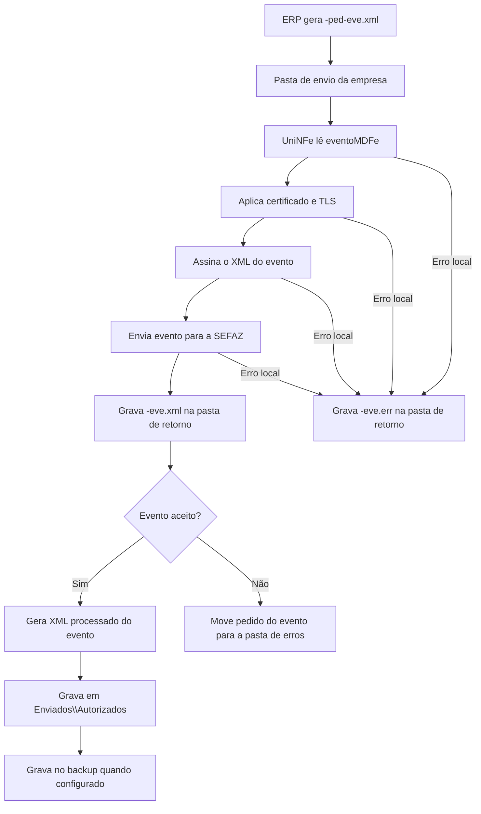

# Eventos do MDFe

O serviço de eventos do MDFe permite que o ERP envie eventos vinculados a um Manifesto Eletrônico de Documentos Fiscais já emitido. O ERP grava o XML do evento na pasta de envio, o UniNFe assina o XML, transmite o evento para a SEFAZ e grava o retorno na pasta de retorno.

Use este serviço quando for necessário registrar uma ocorrência fiscal relacionada ao MDFe, como cancelamento, encerramento, inclusão de condutor, inclusão de DF-e ou eventos relacionados ao pagamento da operação.

## Eventos atendidos nos exemplos

Os exemplos disponíveis para MDFe cobrem estes tipos de evento:

| Tipo de evento | Descrição no XML |
|---|---|
| `110111` | Cancelamento |
| `110112` | Encerramento |
| `110114` | Inclusao Condutor |
| `110115` | Inclusao DF-e |
| `110116` | Pagamento Operacao MDF-e |
| `110118` | Alteracao Pagamento Servico MDFe |

Use o tipo de evento, o detalhamento e as regras fiscais conforme o manual do MDFe e conforme a situação real do manifesto.

## Pré-requisitos

Antes de enviar um evento, confira:

- A empresa emissora está cadastrada no UniNFe.
- A pasta de envio e a pasta de retorno estão configuradas.
- A pasta de XMLs enviados e a pasta de backup estão configuradas quando usadas pela empresa.
- O certificado digital da empresa está configurado e válido.
- O MDFe referenciado no evento existe e a chave informada é a chave correta.
- O ambiente do evento é o mesmo ambiente em que o MDFe foi emitido.

## Arquivo de envio

O ERP deve gerar o XML do evento na pasta de envio da empresa com o final fixo:

```text
<identificador>-ped-eve.xml
```

O `<identificador>` deve ser único para o evento. Uma forma prática é usar uma composição com o documento, o tipo de evento e a sequência.

Exemplos:

```text
cancelameto1101103511031029073900013955001000000001105112804101-ped-eve.xml
encerramento1101123511031029073900013955001000000001105112804101-ped-eve.xml
inclusaocondutor31131223864838000129580000000000051003000003-ped-eve.xml
inclusaoDFe1101154119060611747300015058001000000001111700344401-ped-eve.xml
PagamentoOperacaoMDFe_1101164120039999999999999958001000000999999999999901-ped-eve.xml
AlteracaoPagtoServMDFe_110118_41200399999999999999580010000009999999999999-ped-eve.xml
```

O conteúdo do XML deve usar a estrutura de evento do MDFe:

```xml
<?xml version="1.0" encoding="utf-8"?>
<eventoMDFe xmlns="http://www.portalfiscal.inf.br/mdfe" versao="3.00">
  <infEvento Id="ID1101113511031029073900013955001000000001105112804102">
    <cOrgao>35</cOrgao>
    <tpAmb>2</tpAmb>
    <CNPJ>10290739000139</CNPJ>
    <chMDFe>35110310290739000139550010000000011051128041</chMDFe>
    <dhEvento>2013-10-31T09:44:20-02:00</dhEvento>
    <tpEvento>110111</tpEvento>
    <nSeqEvento>1</nSeqEvento>
    <detEvento versaoEvento="3.00">
      <evCancMDFe>
        <descEvento>Cancelamento</descEvento>
        <nProt>010101010101010</nProt>
        <xJust>Justificativa do cancelamento</xJust>
      </evCancMDFe>
    </detEvento>
  </infEvento>
</eventoMDFe>
```

Campos principais:

| Campo | Como preencher |
|---|---|
| `infEvento/@Id` | Identificador do evento. Deve ser compatível com o tipo de evento, a chave do MDFe e a sequência. |
| `cOrgao` | Código da UF ou órgão responsável pelo evento. |
| `tpAmb` | Ambiente do evento. Use o mesmo ambiente do MDFe. |
| `CNPJ` | CNPJ do emissor do evento. |
| `chMDFe` | Chave de acesso do MDFe vinculado ao evento. |
| `dhEvento` | Data e hora do evento. |
| `tpEvento` | Tipo do evento, como `110111`, `110112`, `110114`, `110115`, `110116` ou `110118`. |
| `nSeqEvento` | Número sequencial do evento para a mesma chave e tipo de evento. |
| `detEvento` | Grupo de detalhes do evento. O conteúdo muda conforme o tipo de evento. |
| `nProt` | Número do protocolo do MDFe ou do evento relacionado, quando exigido pelo tipo de evento. |
| `xJust` | Justificativa do evento, quando exigida pelo tipo de evento. |

Para encerramento, informe os dados de encerramento exigidos no grupo de detalhe, como protocolo, data, UF e município. Para inclusão de condutor ou inclusão de DF-e, preencha os grupos específicos do evento. Para eventos de pagamento, preencha os dados de pagamento, viagem, componentes, valores, prazos e dados bancários conforme a operação.

## Fluxo de processamento

1. O ERP grava o arquivo `<identificador>-ped-eve.xml` na pasta de envio.
2. O UniNFe lê o XML `eventoMDFe`.
3. O UniNFe aplica as configurações da empresa, certificado e conexão TLS quando configurada.
4. O UniNFe assina o XML do evento.
5. O evento é enviado para a SEFAZ.
6. O retorno do webservice é gravado na pasta de retorno como `<identificador>-eve.xml`.
7. Se o evento for aceito, o UniNFe gera o XML processado do evento em `Enviados\Autorizados`.
8. Quando houver pasta de backup configurada, o XML processado do evento também é gravado no backup.
9. Se o evento for rejeitado ou não puder ser confirmado como aceito, o XML original do pedido é movido para a pasta de erros.
10. Se ocorrer erro local, o UniNFe grava `<identificador>-eve.err` na pasta de retorno.
11. O arquivo de solicitação é removido da pasta de envio após o processamento.

## Fluxograma



## Arquivos gerados e movimentados

| Momento | Pasta | Nome do arquivo | Quando aparece |
|---|---|---|---|
| Pedido do evento | Pasta de envio | `<identificador>-ped-eve.xml` | Arquivo criado pelo ERP para enviar o evento do MDFe. |
| Retorno ao ERP | Pasta de retorno | `<identificador>-eve.xml` | Retorno XML recebido da SEFAZ com o resultado do evento. |
| Erro ao ERP | Pasta de retorno | `<identificador>-eve.err` | Erro local antes ou durante o processamento do evento. |
| Evento processado | `Enviados\Autorizados\<subpasta por data>` | `<chaveMDFe>_<tipoEvento>_<sequencia>-procEventoMDFe.xml` | Evento aceito pela SEFAZ. O conteúdo do arquivo é um XML `procEventoMDFe`. |
| Backup do evento processado | Pasta de backup, quando configurada | `<chaveMDFe>_<tipoEvento>_<sequencia>-procEventoMDFe.xml` | Cópia de segurança do evento aceito. |
| XML rejeitado ou não aceito | Pasta de erros configurada | `<identificador>-ped-eve.xml` | Evento rejeitado ou não confirmado como aceito pela SEFAZ. |

## Como tratar o retorno

O ERP deve monitorar a pasta de retorno e aguardar:

```text
<identificador>-eve.xml
```

Esse arquivo contém a resposta da SEFAZ para o evento enviado. O ERP deve analisar o status e o motivo retornados.

Quando o evento for aceito, o UniNFe gera um XML processado do evento com o conteúdo `procEventoMDFe`. O arquivo é gravado em `Enviados\Autorizados`, dentro da subpasta de data configurada, usando o padrão:

```text
<chaveMDFe>_<tipoEvento>_<sequencia>-procEventoMDFe.xml
```

O ERP deve armazenar esse XML como comprovante do evento aceito. Para eventos de cancelamento, o UniNFe também pode acionar a rotina de geração ou impressão configurada para o documento.

Quando o evento for rejeitado, o ERP deve apresentar o motivo ao usuário, corrigir os dados e gerar um novo arquivo `-ped-eve.xml` na pasta de envio.

## Erros locais

Se o UniNFe não conseguir concluir o processamento por falha local, será gerado:

```text
<identificador>-eve.err
```

As causas mais comuns são:

- XML do evento fora da estrutura esperada.
- Identificador do evento incompatível com tipo, chave ou sequência.
- Chave do MDFe ausente ou inválida.
- Certificado digital ausente, inválido ou vencido.
- Ambiente do evento diferente do ambiente do MDFe.
- Falha de assinatura.
- Falha de comunicação com o webservice.
- Falha de permissão ou acesso às pastas configuradas.

Depois de corrigir o problema, gere novamente o arquivo `<identificador>-ped-eve.xml` na pasta de envio.

## Cuidados para o integrador

- Use sempre o final `-ped-eve.xml` para envio de evento do MDFe.
- Informe `tpEvento` e `nSeqEvento` de acordo com a operação fiscal.
- Mantenha o identificador `infEvento/@Id` compatível com o evento enviado.
- Use o mesmo ambiente do MDFe original.
- Aguarde o arquivo `-eve.xml` para interpretar o retorno da SEFAZ.
- Armazene o XML processado do evento quando o evento for aceito.
- Em rejeições, corrija o XML e envie um novo pedido de evento.
- Em erros `.err`, corrija a causa local antes de reenviar.
