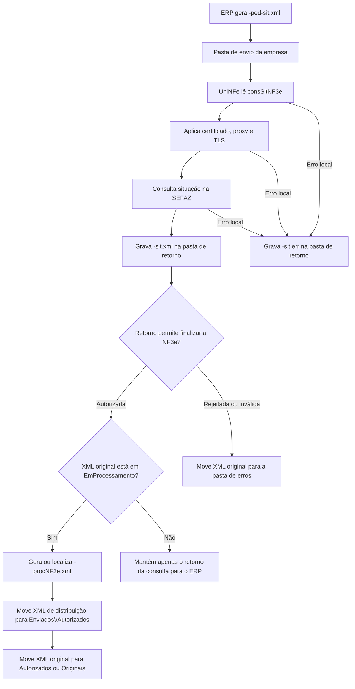

# Consulta de situação da NF3e

A consulta de situação da NF3e permite que o ERP consulte na SEFAZ a situação de uma Nota Fiscal de Energia Elétrica Eletrônica pela chave de acesso. Ela é usada para confirmar se a NF3e está autorizada, rejeitada, cancelada, substituída, ajustada ou se houve alguma ocorrência que precise ser tratada pelo ERP.

Este serviço também ajuda a finalizar documentos que ficaram em processamento. Quando o UniNFe encontra o XML original da NF3e em `Enviados\EmProcessamento` e a SEFAZ retorna autorização, o UniNFe pode gerar o XML de distribuição `-procNF3e.xml` e mover os arquivos para as pastas corretas.

## Quando usar

Use a consulta de situação quando:

- O ERP precisa confirmar a situação atual de uma NF3e na SEFAZ.
- Houve dúvida sobre o resultado do envio.
- A NF3e ficou em processamento e é necessário tentar finalizar o fluxo.
- O XML de distribuição autorizado ainda não foi localizado pelo ERP.

## Pré-requisitos

Antes de executar a consulta, confira na configuração da empresa:

- A empresa emissora está cadastrada no UniNFe.
- A pasta de envio, a pasta de retorno e a pasta de XMLs enviados estão configuradas.
- O certificado digital da empresa está configurado e válido.
- O ambiente da consulta é o mesmo ambiente usado na emissão da NF3e.
- As configurações de proxy estão preenchidas, se a rede exigir proxy para acesso à internet.

## Arquivo de envio

O ERP deve gerar o XML de consulta na pasta de envio da empresa com o final fixo:

```text
<identificador>-ped-sit.xml
```

O `<identificador>` deve ser único para a consulta. Ele pode ser a própria chave da NF3e ou outro identificador controlado pelo ERP.

Exemplo:

```text
consSitNF3e-ped-sit.xml
```

O conteúdo do XML deve usar a estrutura de consulta de situação da NF3e:

```xml
<?xml version="1.0" encoding="utf-8"?>
<consSitNF3e versao="1.00" xmlns="http://www.portalfiscal.inf.br/nf3e">
  <tpAmb>1</tpAmb>
  <xServ>CONSULTAR</xServ>
  <chNF3e>41345691436436000183123456789012345678901234</chNF3e>
</consSitNF3e>
```

Campos principais:

| Campo | Como preencher |
|---|---|
| `tpAmb` | Ambiente da consulta. Use o mesmo ambiente em que a NF3e foi emitida. |
| `xServ` | Informe `CONSULTAR`. |
| `chNF3e` | Chave de acesso da NF3e que será consultada. |

## Fluxo de processamento

1. O ERP grava o arquivo `<identificador>-ped-sit.xml` na pasta de envio.
2. O UniNFe lê o XML de consulta e identifica a chave da NF3e.
3. O UniNFe aplica as configurações da empresa, certificado, proxy e conexão TLS quando configurado.
4. A consulta é enviada para a SEFAZ.
5. O retorno do webservice é gravado na pasta de retorno como `<identificador>-sit.xml`.
6. Se o retorno indicar autorização e o XML original estiver em `Enviados\EmProcessamento`, o UniNFe gera ou localiza o XML `<identificador-da-nf3e>-procNF3e.xml`.
7. O XML de distribuição autorizado é movido para `Enviados\Autorizados`.
8. O XML original assinado é movido para `Enviados\Autorizados` ou `Enviados\Originais`, conforme a configuração da empresa.
9. Se a consulta indicar rejeição ou situação que retire o documento do fluxo, o XML original é movido para a pasta de erros.
10. Se ocorrer falha local, o UniNFe grava `<identificador>-sit.err` na pasta de retorno.

## Fluxograma



## Arquivos gerados e movimentados

| Momento | Pasta | Nome do arquivo | Quando aparece |
|---|---|---|---|
| Pedido de consulta | Pasta de envio | `<identificador>-ped-sit.xml` | Arquivo criado pelo ERP para consultar a situação da NF3e. |
| Retorno ao ERP | Pasta de retorno | `<identificador>-sit.xml` | Retorno XML recebido da SEFAZ com a situação da NF3e. |
| Erro ao ERP | Pasta de retorno | `<identificador>-sit.err` | Erro local antes ou durante a consulta, como falha de leitura, certificado, comunicação ou gravação. |
| XML original em processamento | `Enviados\EmProcessamento` | `<identificador-da-nf3e>-nf3e.xml` | XML da NF3e que ainda está aguardando finalização no fluxo do UniNFe. |
| XML de distribuição | `Enviados\Autorizados\<subpasta por data>` | `<identificador-da-nf3e>-procNF3e.xml` | Gerado ou movido quando a SEFAZ retorna autorização e o XML original é localizado. |
| XML original assinado | `Enviados\Autorizados\<subpasta por data>` ou `Enviados\Originais\<subpasta por data>` | `<identificador-da-nf3e>-nf3e.xml` | Movido quando a NF3e é finalizada como autorizada. O destino depende da configuração para salvar somente o XML de distribuição. |
| XML com problema | Pasta de erros configurada | `<identificador-da-nf3e>-nf3e.xml` | Movido quando a consulta indica rejeição, invalidação do fluxo ou divergência que impede finalizar o documento. |

## Como tratar o retorno

O ERP deve monitorar a pasta de retorno e aguardar:

```text
<identificador>-sit.xml
```

Esse arquivo contém a resposta da SEFAZ para a chave consultada. O ERP deve analisar o status e o motivo retornados para atualizar a situação da NF3e em sua base.

Quando a situação indicar autorização, procure também o XML de distribuição:

```text
<identificador-da-nf3e>-procNF3e.xml
```

Esse arquivo fica em `Enviados\Autorizados`, dentro da subpasta de data configurada no UniNFe, e deve ser armazenado pelo ERP como XML fiscal autorizado.

Se o XML original da NF3e não estiver em `Enviados\EmProcessamento`, o UniNFe ainda grava o retorno da consulta para o ERP, mas não tem como gerar o XML de distribuição a partir do documento original. Nesse caso, use o retorno para atualizar a situação no ERP e avalie se será necessário recuperar o XML autorizado por outro procedimento.

Se o retorno da consulta trouxer eventos processados vinculados à NF3e, o UniNFe também pode gravar os XMLs de evento processado correspondentes nas pastas de XMLs enviados.

## Erros locais

Se a consulta não puder ser concluída por falha local, será gerado:

```text
<identificador>-sit.err
```

As causas mais comuns são:

- XML de consulta fora da estrutura esperada.
- Chave da NF3e ausente ou inválida.
- Certificado digital ausente, inválido ou vencido.
- Ambiente da consulta diferente do ambiente de emissão.
- Proxy ou conexão TLS configurados incorretamente.
- Falha de comunicação com o webservice.
- Falha de permissão ou acesso às pastas configuradas.

Depois de corrigir o problema, gere novamente o arquivo `<identificador>-ped-sit.xml` na pasta de envio.

## Cuidados para o integrador

- Use sempre o final `-ped-sit.xml` para consulta de situação.
- Informe a chave completa da NF3e em `chNF3e`.
- Consulte no mesmo ambiente em que a NF3e foi emitida.
- Aguarde o arquivo `-sit.xml` para interpretar o retorno da SEFAZ.
- Não altere manualmente arquivos em `Enviados\EmProcessamento`.
- Quando a consulta finalizar uma NF3e autorizada, armazene o XML `-procNF3e.xml`.
- Em erros `.err`, corrija a causa local antes de reenviar a consulta.
