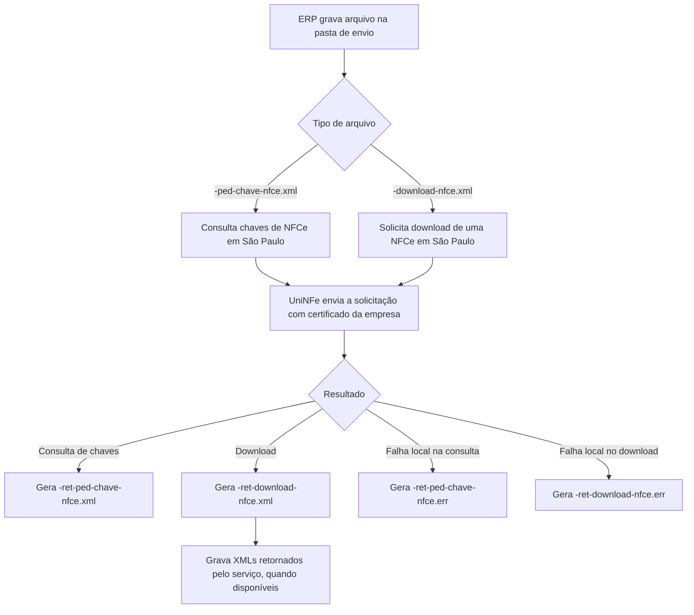

# Consulta de chaves e download de XML da NFCe em São Paulo

Este serviço permite consultar chaves de NFCe e baixar o XML de uma NFCe no ambiente da SEFAZ de São Paulo.

Ele é exclusivo para NFCe do estado de São Paulo. Use somente para empresas configuradas como NFCe e com UF São Paulo. Para NFCe de outros estados, estes arquivos não devem ser usados como rotina de integração.

O fluxo possui duas operações independentes:

- consulta de lista de chaves de NFCe, usando `-ped-chave-nfce.xml`;
- download do XML de uma NFCe específica, usando `-download-nfce.xml`.

A consulta de chaves ajuda o ERP a localizar chaves de NFCe em um período. Depois disso, o ERP pode solicitar o download de uma chave específica.

## Quando usar

Use este serviço quando:

- a empresa emitente está configurada no UniNFe como NFCe do estado de São Paulo;
- o ERP precisa consultar chaves de NFCe disponíveis em um intervalo de data e hora;
- o ERP precisa baixar o XML de uma NFCe pela chave de acesso;
- o certificado digital da empresa está disponível no UniNFe para autenticação no serviço.

Não use este fluxo para autorizar NFCe, cancelar NFCe, inutilizar numeração ou consultar situação de uma chave. Esses processos possuem documentações próprias na seção de NFe/NFCe.

## Pré-requisitos

Antes de gerar os arquivos, confira na configuração da empresa:

- a empresa está cadastrada como NFCe;
- a UF da empresa é São Paulo;
- o ambiente está correto, produção ou homologação;
- o certificado digital está configurado e válido;
- as pastas de envio, retorno e erro estão configuradas;
- as configurações de proxy estão preenchidas, se a rede exigir proxy para acesso à internet.

## Consulta de chaves de NFCe

Para consultar a lista de chaves, o ERP deve gravar na pasta de envio da empresa um XML com o final:

```text
<identificador>-ped-chave-nfce.xml
```

Exemplo de nome:

```text
ListagemChavesSaoPaulo-ped-chave-nfce.xml
```

O conteúdo deve usar a estrutura:

```xml
<?xml version="1.0" encoding="utf-8"?>
<nfceListagemChaves xmlns="http://www.portalfiscal.inf.br/nfe" versao="1.00">
  <tpAmb>2</tpAmb>
  <dataHoraInicial>2026-01-10T08:30</dataHoraInicial>
  <dataHoraFinal>2026-02-20T08:30</dataHoraFinal>
</nfceListagemChaves>
```

### Campos da consulta de chaves

| Campo | Como preencher |
|---|---|
| `versao` | Versão do leiaute do pedido. O exemplo disponível usa `1.00`. |
| `tpAmb` | Ambiente da consulta. Use `1` para produção ou `2` para homologação, conforme a empresa configurada no UniNFe. |
| `dataHoraInicial` | Data e hora inicial do período consultado, no formato `AAAA-MM-DDTHH:MM`. |
| `dataHoraFinal` | Data e hora final do período consultado, no formato `AAAA-MM-DDTHH:MM`. |

### Retorno da consulta de chaves

Quando a consulta é processada, o UniNFe grava na pasta de retorno:

```text
<identificador>-ret-ped-chave-nfce.xml
```

Se ocorrer falha local antes de obter um retorno válido do serviço, o UniNFe grava:

```text
<identificador>-ret-ped-chave-nfce.err
```

## Download do XML da NFCe

Para baixar o XML de uma NFCe, o ERP deve gravar na pasta de envio da empresa um XML com o final:

```text
<identificador>-download-nfce.xml
```

Exemplo de nome:

```text
DownloadXMLSaoPaulo-download-nfce.xml
```

O conteúdo deve usar a estrutura:

```xml
<?xml version="1.0" encoding="utf-8"?>
<nfceDownloadXML versao="1.00" xmlns="http://www.portalfiscal.inf.br/nfe">
  <tpAmb>2</tpAmb>
  <chNFCe>12345678901234567890123456789012345678901234</chNFCe>
</nfceDownloadXML>
```

### Campos do download

| Campo | Como preencher |
|---|---|
| `versao` | Versão do leiaute do pedido. O exemplo disponível usa `1.00`. |
| `tpAmb` | Ambiente da consulta. Use `1` para produção ou `2` para homologação, conforme a empresa configurada no UniNFe. |
| `chNFCe` | Chave de acesso da NFCe que será baixada. A chave deve ter 44 dígitos e ser de modelo `65`. |

### Retorno do download

Quando o download é processado, o UniNFe grava na pasta de retorno:

```text
<identificador>-ret-download-nfce.xml
```

Quando o serviço retorna sucesso para o download, o UniNFe também grava na pasta de retorno os XMLs de NFCe e eventos disponibilizados no retorno do webservice.

Se ocorrer falha local antes de obter um retorno válido do serviço, o UniNFe grava:

```text
<identificador>-ret-download-nfce.err
```

## Fluxo operacional

1. O ERP grava o arquivo de consulta de chaves ou download na pasta de envio da empresa.
2. O UniNFe identifica o serviço pelo final do nome do arquivo.
3. O UniNFe usa a configuração da empresa, incluindo ambiente, UF, certificado digital e proxy.
4. A solicitação é enviada ao serviço de NFCe.
5. O retorno do webservice é gravado na pasta de retorno.
6. No download com retorno autorizado, os XMLs disponibilizados pelo serviço também são gravados na pasta de retorno.
7. O arquivo de solicitação original é removido da pasta de envio após o processamento.
8. Se houver falha local, o arquivo `.err` correspondente é gravado na pasta de retorno.



## Arquivos envolvidos

| Operação | Pasta | Arquivo | O que significa |
|---|---|---|---|
| Consulta de chaves | Pasta de envio | `<identificador>-ped-chave-nfce.xml` | Pedido para listar chaves de NFCe em um período. |
| Retorno da consulta de chaves | Pasta de retorno | `<identificador>-ret-ped-chave-nfce.xml` | Resposta do serviço com o resultado da consulta. |
| Erro da consulta de chaves | Pasta de retorno | `<identificador>-ret-ped-chave-nfce.err` | Falha local ao processar a consulta. |
| Download de NFCe | Pasta de envio | `<identificador>-download-nfce.xml` | Pedido para baixar o XML de uma NFCe pela chave de acesso. |
| Retorno do download | Pasta de retorno | `<identificador>-ret-download-nfce.xml` | Resposta do serviço de download. |
| XMLs baixados | Pasta de retorno | XMLs retornados pelo serviço | NFCe e eventos disponibilizados quando o download retorna com sucesso. |
| Erro do download | Pasta de retorno | `<identificador>-ret-download-nfce.err` | Falha local ao processar o download. |

## Como tratar o retorno

Para consulta de chaves, o ERP deve ler `<identificador>-ret-ped-chave-nfce.xml` e identificar no conteúdo retornado quais chaves estão disponíveis para o período solicitado.

Para download, o ERP deve ler `<identificador>-ret-download-nfce.xml` e, quando o serviço retornar sucesso, processar também os XMLs de NFCe e eventos gravados na pasta de retorno.

Arquivos `.err` indicam falha local de processamento, como XML inválido, certificado indisponível, erro de comunicação, configuração incorreta ou impossibilidade de gravar o retorno.

## Erros comuns

As causas mais comuns de erro são:

- empresa configurada com UF diferente de São Paulo;
- empresa configurada para outro tipo de documento, em vez de NFCe;
- ambiente do XML diferente do ambiente configurado para a empresa;
- chave informada em `chNFCe` inválida, incompleta ou que não seja de NFCe;
- período da consulta de chaves informado em formato incorreto;
- certificado digital ausente, vencido ou inacessível;
- falha de comunicação com o serviço;
- falta de permissão de leitura e gravação nas pastas configuradas.

## Cuidados para o integrador

- Use este serviço somente para NFCe de São Paulo.
- Use `-ped-chave-nfce.xml` para consultar a lista de chaves.
- Use `-download-nfce.xml` para baixar o XML de uma chave específica.
- Não use estes arquivos para NFCe de outros estados.
- Monitore a pasta de retorno para os XMLs de resposta e para os XMLs baixados pelo serviço.
- Trate arquivos `.err` como erro local de processamento e corrija a causa antes de reenviar.
