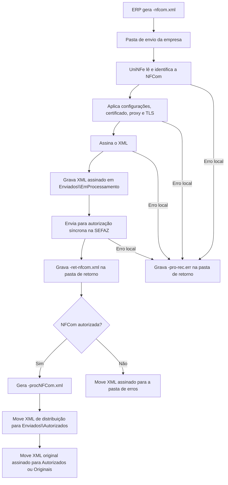

# Autorização síncrona de NFCom

A autorização síncrona de NFCom permite que o ERP envie uma Nota Fiscal Fatura de Serviço de Comunicação Eletrônica ao UniNFe por troca de arquivos. O ERP grava o XML da NFCom na pasta de envio configurada para a empresa, o UniNFe assina o documento, transmite para a SEFAZ e grava o retorno na pasta de retorno.

Use este serviço quando a empresa emite NFCom e precisa que o UniNFe faça o envio direto do XML para autorização.

## Pré-requisitos

Antes de enviar uma NFCom, confira na configuração da empresa:

- A empresa emissora está cadastrada no UniNFe.
- A pasta de envio, a pasta de retorno e a pasta de XMLs enviados estão configuradas.
- O certificado digital da empresa está configurado e válido.
- O ambiente de emissão está configurado conforme a operação desejada.
- As configurações de proxy estão preenchidas, se a rede exigir proxy para acesso à internet.
- Os dados do responsável técnico estão preenchidos, quando a emissão da empresa exigir essa informação.

Se o XML da NFCom não possuir o grupo do responsável técnico e os dados estiverem configurados na empresa, o UniNFe utiliza os dados da configuração para compor o XML antes do envio.

## Arquivo de envio

O ERP deve gerar o XML da NFCom na pasta de envio da empresa com o final fixo:

```text
<identificador>-nfcom.xml
```

O `<identificador>` deve ser único para evitar conflito entre documentos. Normalmente ele é a chave da NFCom.

Exemplos:

```text
31250999999999999999620010000000031030000000-nfcom.xml
RTC_31250999999999999999620010000000051050000000-nfcom.xml
NFCom-nfcom.xml
```

O conteúdo do arquivo deve ser o XML da NFCom, com a estrutura esperada para o documento fiscal. Não inclua XML de lote, recibo ou consulta, porque este serviço é síncrono: o envio e o retorno do webservice acontecem no mesmo processamento.

## Fluxo de processamento

1. O ERP grava o arquivo `<identificador>-nfcom.xml` na pasta de envio.
2. O UniNFe identifica o documento como NFCom pelo XML e pelo final do arquivo.
3. O UniNFe lê o XML, aplica as configurações da empresa, prepara certificado, proxy e conexão TLS quando configurado.
4. O XML é assinado e gravado em `Enviados\EmProcessamento` com o mesmo nome do arquivo de envio.
5. O UniNFe envia a NFCom para autorização síncrona na SEFAZ.
6. O retorno do webservice é gravado na pasta de retorno como `<identificador>-ret-nfcom.xml`.
7. Se a NFCom for autorizada, o UniNFe cria o XML de distribuição `<identificador>-procNFCom.xml` e move os arquivos para a pasta de autorizados.
8. Se a NFCom for rejeitada, o XML assinado é movido para a pasta de erros e o ERP deve tratar a rejeição informada no retorno.
9. Se ocorrer erro local no processamento, o UniNFe grava um arquivo `<identificador>-pro-rec.err` na pasta de retorno com os detalhes do erro.

## Fluxograma



## Arquivos gerados e movimentados

| Momento | Pasta | Nome do arquivo | Quando aparece |
|---|---|---|---|
| Envio pelo ERP | Pasta de envio | `<identificador>-nfcom.xml` | Arquivo criado pelo ERP para solicitar a autorização da NFCom. |
| Em processamento | `Enviados\EmProcessamento` | `<identificador>-nfcom.xml` | XML já assinado pelo UniNFe enquanto o serviço está processando a autorização. |
| Retorno ao ERP | Pasta de retorno | `<identificador>-ret-nfcom.xml` | Retorno XML recebido do webservice, tanto para autorização quanto para rejeição retornada pela SEFAZ. |
| Erro ao ERP | Pasta de retorno | `<identificador>-pro-rec.err` | Erro local antes ou durante o processamento, como falha de leitura, certificado, assinatura, comunicação ou gravação. |
| XML de distribuição | `Enviados\Autorizados\<subpasta por data>` | `<identificador>-procNFCom.xml` | NFCom autorizada. É o XML principal para armazenamento fiscal e uso pelo ERP. |
| XML original assinado | `Enviados\Autorizados\<subpasta por data>` ou `Enviados\Originais\<subpasta por data>` | `<identificador>-nfcom.xml` | NFCom autorizada. O destino depende da configuração para salvar somente o XML de distribuição. |
| XML rejeitado | Pasta de erros configurada | `<identificador>-nfcom.xml` | NFCom rejeitada pela SEFAZ ou com falha que exige correção e novo envio. |

## Como tratar o retorno

O ERP deve monitorar a pasta de retorno e aguardar o arquivo:

```text
<identificador>-ret-nfcom.xml
```

Esse arquivo contém a resposta do webservice da SEFAZ. O ERP deve ler as informações de status, motivo e protocolo quando existirem. Quando o status indicar autorização, o ERP também deve localizar e armazenar o XML de distribuição:

```text
<identificador>-procNFCom.xml
```

O XML de distribuição é gravado na pasta `Enviados\Autorizados`, dentro da subpasta criada conforme a configuração de organização por data. Ele contém a NFCom autorizada com o protocolo anexado.

Quando o status indicar rejeição, o ERP deve apresentar o motivo ao usuário, corrigir os dados da NFCom e gerar um novo arquivo `-nfcom.xml` na pasta de envio. A rejeição não deve ser tratada como autorização.

## Erros locais

Se o UniNFe não conseguir concluir o processamento por falha local, será gerado um arquivo de erro na pasta de retorno:

```text
<identificador>-pro-rec.err
```

Esse arquivo deve ser tratado pelo ERP ou pelo suporte antes de reenviar a NFCom. As causas mais comuns são:

- XML fora da estrutura esperada.
- Certificado digital ausente, inválido ou vencido.
- Falha de assinatura.
- Ambiente, proxy ou conexão TLS configurados incorretamente.
- Falha de comunicação com o webservice.
- Falha de permissão ou acesso às pastas configuradas.

Depois de corrigir o problema, gere novamente o arquivo `<identificador>-nfcom.xml` na pasta de envio.

## Cuidados para o integrador

- Use sempre o final `-nfcom.xml` para o arquivo de envio da NFCom.
- Não reutilize o mesmo identificador enquanto houver processamento pendente para o documento.
- Aguarde o arquivo `-ret-nfcom.xml` para saber o resultado retornado pela SEFAZ.
- Armazene o XML `-procNFCom.xml` quando a NFCom for autorizada.
- Em rejeições, corrija o XML e envie novamente; não altere manualmente arquivos em `EmProcessamento`.
- Em erros `.err`, corrija a causa local antes de reenviar o documento.
