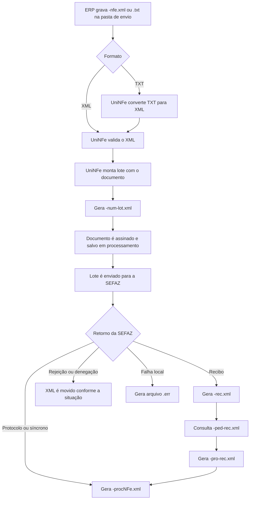
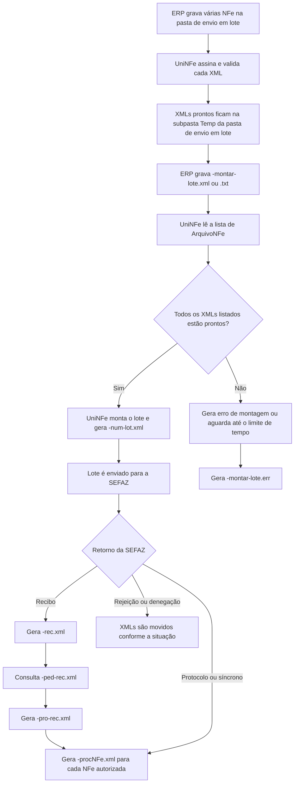

# Autorização de NFe e NFCe por arquivo

A autorização é o fluxo usado para transmitir uma NFe ou NFCe para a SEFAZ, obter o recibo ou protocolo de autorização, consultar o processamento quando necessário e gerar o XML processado do documento.

No UniNFe, o ERP pode trabalhar de duas formas principais:

- gravar uma NFe ou NFCe pronta na pasta de envio, usando o final `-nfe.xml`;
- solicitar a montagem de um lote de NFe, usando `-montar-lote.xml` ou `-montar-lote.txt`.

O envio direto de documento atende NFe e NFCe. A montagem explícita de lote com vários arquivos é voltada ao fluxo de NFe e usa uma pasta própria de envio em lote. Nesse fluxo, o ERP não deve gravar as NFe na pasta de envio normal.

## Quando usar

Use este fluxo quando:

- o ERP precisa autorizar uma NFe ou NFCe;
- o ERP gera o XML fiscal e deseja que o UniNFe assine, valide, transmita e grave os retornos;
- o ERP precisa enviar uma NFe individual;
- o ERP precisa montar um lote com várias NFe já geradas;
- houve retorno com recibo e é necessário consultar o processamento do lote.

Para consultar uma chave já existente na SEFAZ, use a [consulta de situação](consulta-situacao-arquivo.md). Para enviar eventos posteriores à autorização, use [eventos](eventos.md).

## Pré-requisitos

Antes de enviar documentos, confira na configuração da empresa:

- a empresa está cadastrada no UniNFe;
- a pasta de envio, retorno, enviados e erros estão configuradas;
- para lote de várias NFe, a pasta de envio em lote está configurada;
- o certificado digital está configurado e válido;
- o ambiente está correto, produção ou homologação;
- o tipo de emissão está adequado ao documento;
- para NFCe, as configurações de CSC, ID Token e QR Code estão preenchidas quando exigidas pelo leiaute usado;
- as configurações de proxy estão preenchidas, se a rede exigir proxy para acesso à internet.

## Fluxo 1: envio individual de NFe ou NFCe

Para autorizar um documento individual, o ERP deve gerar o XML na pasta de envio da empresa com o final fixo:

```text
<chave>-nfe.xml
```

Exemplos:

```text
99999999999999999999999999999999999999999991-nfe.xml
41170706117473000150550010000463191912756548-nfe.xml
```

O XML deve conter a estrutura `NFe`, com `infNFe` e a chave de acesso no atributo `Id`.

O modelo fiscal dentro da chave e da tag `mod` define o tipo do documento:

- `mod` igual a `55`: NFe;
- `mod` igual a `65`: NFCe.

O UniNFe valida o XML, monta o lote, assina o documento e envia para a SEFAZ. Mesmo quando o ERP envia apenas uma nota, o envio à SEFAZ é feito dentro de um lote.

### Envio individual por TXT

O ERP também pode gravar um arquivo com final:

```text
<chave>-nfe.txt
```

Nesse caso, o UniNFe converte o TXT em XML antes do envio. A conversão de TXT para XML de NFe/NFCe possui documentação própria em [Conversão de TXT para XML de NFe e NFCe](conversao-txt-para-xml.md).

Depois de convertido, o XML segue o mesmo fluxo de autorização do envio direto.

### Passo a passo do envio individual

1. O ERP grava `<chave>-nfe.xml` ou `<chave>-nfe.txt` na pasta de envio normal.
2. Se o arquivo for TXT, o UniNFe converte o conteúdo para XML.
3. O UniNFe valida o XML.
4. O UniNFe verifica se a chave já está em processamento.
5. O UniNFe monta o lote de envio com o documento.
6. O UniNFe grava `<chave>-num-lot.xml` na pasta de retorno, informando ao ERP o número do lote usado para aquele documento.
7. O documento é assinado e salvo na pasta de enviados em processamento.
8. O lote é enviado para a SEFAZ.
9. Se o retorno trouxer protocolo ou processamento síncrono, o UniNFe finaliza o documento e gera `<chave>-procNFe.xml`.
10. Se o retorno trouxer recibo, o UniNFe grava `<idLote>-rec.xml` e consulta o recibo para obter o resultado do processamento.
11. Se houver rejeição ou denegação, o UniNFe movimenta o XML conforme a situação fiscal.
12. Se houver falha local, o UniNFe grava um arquivo `.err` na pasta de retorno.

### Fluxograma do envio individual



### Arquivos do envio individual

| Etapa | Pasta | Arquivo | O que significa |
|---|---|---|---|
| Entrada XML | Pasta de envio normal | `<chave>-nfe.xml` | Documento criado pelo ERP para autorizar NFe ou NFCe. |
| Entrada TXT | Pasta de envio normal | `<chave>-nfe.txt` | Documento em TXT para conversão antes da autorização. |
| XML convertido | Pasta de envio normal | `<chave>-nfe.xml` | XML gerado pelo UniNFe quando a entrada foi TXT. |
| Número do lote | Pasta de retorno | `<chave>-num-lot.xml` | Informa ao ERP o número do lote criado para o documento. |
| Documento em processamento | Pasta de XMLs enviados, em processamento | `<chave>-nfe.xml` | XML assinado preservado durante o envio e usado para recuperação. |
| Recibo do lote | Pasta de retorno | `<idLote>-rec.xml` | Indica que o lote foi recebido e será processado de forma assíncrona. |
| Resultado do recibo | Pasta de retorno | `<recibo>-pro-rec.xml` | Resultado da consulta do recibo, com autorização, rejeição ou outra situação do lote. |
| XML autorizado | Pasta de XMLs enviados, em autorizados | `<chave>-procNFe.xml` | XML da NFe ou NFCe com protocolo de autorização. |
| XML denegado | Pasta de XMLs enviados, conforme configuração | `<chave>-den.xml` | XML gerado quando a SEFAZ denega o documento. |
| Erro local | Pasta de retorno | `<chave>-nfe.err`, `<idLote>-rec.err` ou `<recibo>-pro-rec.err` | Erro local conforme a etapa em que a falha ocorreu. |

## Fluxo 2: montagem de lote de várias NFe

No envio em lote, o ERP deve usar a pasta de envio em lote configurada na empresa, não a pasta de envio normal. Essa pasta é separada para que o UniNFe assine e valide cada NFe, deixe os XMLs prontos na subpasta `Temp` da pasta de envio em lote e só monte o lote quando o ERP enviar o arquivo de sinalização `-montar-lote.xml` ou `-montar-lote.txt`.

O fluxo funciona em duas fases:

- primeiro, o ERP grava os XMLs `-nfe.xml` na pasta de envio em lote;
- depois, quando quiser transmitir o conjunto, o ERP grava o arquivo `-montar-lote.xml` ou `-montar-lote.txt` informando quais XMLs devem compor o lote.

Enquanto o sinal de montagem não chega, as NFe ficam assinadas e validadas na subpasta `Temp` da pasta de envio em lote, aguardando a montagem do lote.

Para montar explicitamente um lote com várias NFe, o ERP deve gerar uma solicitação com o final:

```text
<identificador>-montar-lote.xml
```

Exemplo:

```xml
<?xml version="1.0" encoding="utf-8"?>
<MontarLoteNFe>
  <ArquivoNFe>51080676472349000430550010000001041671821888-nfe.xml</ArquivoNFe>
  <ArquivoNFe>51090878712643000155550010000170552254161715-nfe.xml</ArquivoNFe>
</MontarLoteNFe>
```

Cada `ArquivoNFe` deve apontar para uma NFe já gerada na pasta de lote configurada para a empresa. O UniNFe aguarda os XMLs ficarem disponíveis na área temporária do lote, monta o lote e envia para a autorização.

Também é aceito o pedido em TXT:

```text
<identificador>-montar-lote.txt
```

Nesse formato, cada linha informa o nome de um arquivo de NFe que fará parte do lote. O UniNFe transforma o TXT em XML de montagem de lote e remove o TXT original.

### Passo a passo do envio em lote

1. O ERP grava cada NFe com final `-nfe.xml` na pasta de envio em lote da empresa.
2. O UniNFe assina e valida cada XML encontrado nessa pasta.
3. Após assinar e validar, o UniNFe move os XMLs prontos para a subpasta `Temp` da própria pasta de envio em lote.
4. Os documentos ficam aguardando o sinal do ERP para montagem do lote.
5. O ERP grava `<identificador>-montar-lote.xml` ou `<identificador>-montar-lote.txt` na pasta de envio em lote.
6. O arquivo de montagem informa os nomes dos XMLs que devem entrar no lote.
7. O UniNFe localiza os XMLs já assinados e validados na subpasta `Temp` da pasta de envio em lote.
8. O UniNFe monta o lote e grava `<chave>-num-lot.xml` na pasta de retorno para cada NFe incluída.
9. O lote é enviado para a SEFAZ.
10. Se a SEFAZ retornar recibo, o UniNFe grava `<idLote>-rec.xml` e consulta o recibo.
11. Quando a consulta do recibo retorna o protocolo, o UniNFe gera um `<chave>-procNFe.xml` para cada NFe autorizada.
12. Os XMLs autorizados são movidos para a pasta de autorizados; rejeitados vão para erro; denegados seguem o tratamento de denegação.

### Fluxograma do envio em lote



### Arquivos da montagem de lote

| Etapa | Pasta | Arquivo | O que significa |
|---|---|---|---|
| Entrada das NFe | Pasta de envio em lote | `<chave>-nfe.xml` | XMLs individuais criados pelo ERP para compor um lote futuro. |
| XML pronto para lote | Subpasta `Temp` da pasta de envio em lote | `<chave>-nfe.xml` | XML já assinado e validado, aguardando o arquivo de montagem. |
| Sinal de montagem XML | Pasta de envio em lote | `<identificador>-montar-lote.xml` | Lista de XMLs que devem compor o lote. |
| Sinal de montagem TXT | Pasta de envio em lote | `<identificador>-montar-lote.txt` | Lista de arquivos, um por linha, que será convertida para XML de montagem. |
| XML de montagem gerado | Pasta de envio em lote | `<identificador>-montar-lote.xml` | Criado quando o ERP envia a lista em TXT. |
| Erro de montagem | Pasta de retorno | `<identificador>-montar-lote.err` | Falha local ao montar o lote, como arquivo listado ausente ou XML ainda não pronto. |
| Número do lote por NFe | Pasta de retorno | `<chave>-num-lot.xml` | Informa ao ERP o número do lote no qual a NFe foi incluída. |
| Lote de envio | Subpasta `Temp` da pasta de envio normal | `<idLote>-env-lot.xml` | XML do lote montado pelo UniNFe para transmissão à SEFAZ. |
| Recibo do lote | Pasta de retorno | `<idLote>-rec.xml` | Retorno da SEFAZ indicando que o lote foi recebido. |
| Pedido de consulta do recibo | Pasta de envio normal | `<recibo>-ped-rec.xml` | Consulta do resultado do recibo, gerada automaticamente pelo UniNFe ou manualmente pelo ERP. |
| Resultado do recibo | Pasta de retorno | `<recibo>-pro-rec.xml` | Resultado da consulta do lote processado. |
| XML autorizado | Pasta de XMLs enviados, em autorizados | `<chave>-procNFe.xml` | XML autorizado, gerado para cada NFe autorizada do lote. |
| XML original autorizado | Pasta de XMLs enviados, em autorizados ou originais | `<chave>-nfe.xml` | XML original assinado, movimentado conforme a configuração de salvamento. |
| XML rejeitado | Pasta de erros | `<chave>-nfe.xml` | XML movido quando a NFe é rejeitada. |

## Consulta de recibo

Quando a SEFAZ recebe um lote em processamento assíncrono, ela retorna um número de recibo. O UniNFe pode consultar esse recibo automaticamente após o tempo médio informado pela SEFAZ.

O ERP também pode gerar manualmente um pedido de consulta de recibo na pasta de envio:

```text
<recibo>-ped-rec.xml
```

Exemplo para NFe:

```xml
<?xml version="1.0" encoding="utf-8"?>
<consReciNFe versao="4.00" xmlns="http://www.portalfiscal.inf.br/nfe">
  <tpAmb>2</tpAmb>
  <nRec>123456789012345</nRec>
</consReciNFe>
```

Exemplo para NFCe:

```xml
<?xml version="1.0" encoding="utf-8"?>
<consReciNFe versao="4.00" xmlns="http://www.portalfiscal.inf.br/nfe">
  <tpAmb>2</tpAmb>
  <nRec>410000007934162</nRec>
  <mod>65</mod>
</consReciNFe>
```

No pedido de NFCe, informe `mod` igual a `65`. Quando `mod` não é informado, a consulta de recibo é tratada como NFe.

## Como tratar o retorno

O ERP deve acompanhar a pasta de retorno e as pastas de enviados configuradas.

Quando a autorização é concluída, o arquivo mais importante para guarda fiscal é:

```text
<chave>-procNFe.xml
```

Esse XML contém a NFe ou NFCe junto com o protocolo de autorização. Ele deve ser preservado pelo ERP.

Quando o envio retorna apenas recibo, o ERP pode aguardar o UniNFe consultar o recibo automaticamente ou gerar o pedido `<recibo>-ped-rec.xml`. O resultado da consulta será gravado como `<recibo>-pro-rec.xml`.

Quando houver rejeição, o XML da nota pode ser movido para a pasta de erros e o ERP deve tratar o motivo retornado pela SEFAZ. Quando houver denegação, o UniNFe gera o XML denegado e conclui o fluxo conforme a configuração.

Quando ocorrer falha local, será gerado um arquivo `.err` correspondente ao ponto do fluxo em que a falha ocorreu.

## Recuperação por consulta de situação

Durante a autorização, o UniNFe salva o XML assinado em processamento antes do envio. Isso ajuda a recuperar o documento caso ocorra falha técnica depois da assinatura, como queda de internet, instabilidade da SEFAZ, queda de energia ou fechamento inesperado do aplicativo.

Se o retorno original não for obtido, a [consulta de situação](consulta-situacao-arquivo.md) pode confirmar a situação da chave na SEFAZ e completar a geração do XML processado quando o documento estiver autorizado.

## Diferenças entre NFe e NFCe

| Ponto | NFe | NFCe |
|---|---|---|
| Modelo | `55` | `65` |
| Envio direto | `-nfe.xml` ou `-nfe.txt` | `-nfe.xml` ou `-nfe.txt` |
| Consulta de recibo | `-ped-rec.xml` sem necessidade de `mod` | `-ped-rec.xml` com `mod` igual a `65` |
| QR Code e CSC | Não aplicável ao fluxo normal de NFe | Pode exigir CSC, ID Token e versão de QR Code configurados |
| Montagem explícita de várias notas | Usada no fluxo de lote de NFe | O envio direto de NFCe segue o fluxo de autorização por documento/lote gerado pelo UniNFe |

## Erros comuns

As causas mais comuns de erro são:

- XML da NFe ou NFCe fora do leiaute esperado;
- chave de acesso incorreta ou divergente do conteúdo do XML;
- documento já existente no fluxo de envio;
- certificado digital ausente, vencido ou inacessível;
- ambiente incorreto para o documento;
- CSC ou ID Token ausente em NFCe quando exigido;
- falha de validação do XML;
- falha de comunicação com a SEFAZ;
- recibo inexistente, expirado ou ainda não processado;
- falta de permissão de leitura e gravação nas pastas configuradas.

## Cuidados para o integrador

- Use `-nfe.xml` para enviar NFe ou NFCe já em XML.
- Use `-nfe.txt` somente quando desejar que o UniNFe converta o TXT para XML antes da autorização.
- Preserve o XML `-procNFe.xml` quando o documento for autorizado.
- Não gere novamente o mesmo documento enquanto ele estiver em processamento.
- Para NFCe, confira as configurações de CSC, ID Token e QR Code antes do envio.
- Para lote com várias NFe, garanta que todos os arquivos informados existam na pasta de lote.
- Se receber apenas recibo, aguarde ou consulte o recibo antes de considerar o documento autorizado.
- Em falhas técnicas sem retorno conclusivo, use a consulta de situação para recuperar a situação fiscal da chave.
