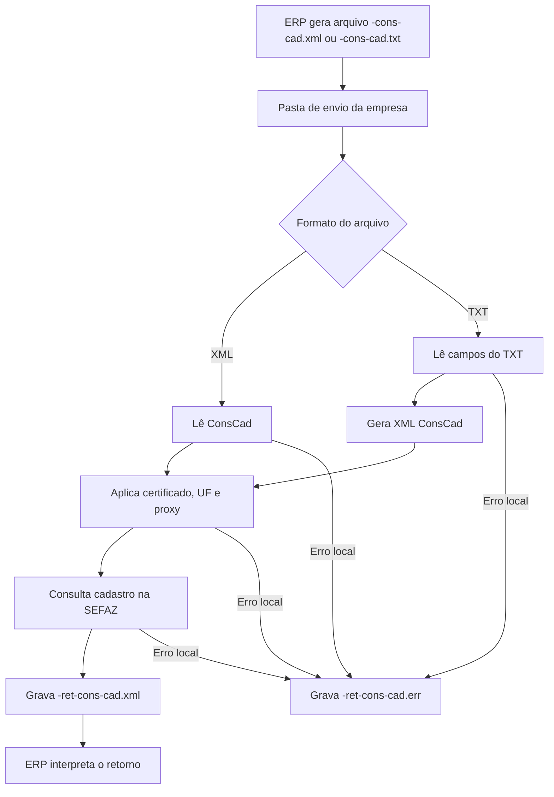

# Consulta cadastro de contribuinte por arquivo

A consulta cadastro de contribuinte por arquivo permite que o ERP consulte o cadastro de um contribuinte na SEFAZ usando um arquivo XML ou TXT processado pelo UniNFe. O serviço é usado no contexto de NFe e NFCe e retorna a resposta oficial da consulta na pasta de retorno.

Esta documentação trata da integração por arquivos. A consulta feita pela tela do UniNFe está documentada em [Consulta cadastro de contribuinte](../consulta-cadastro-contribuinte.md).

## Quando usar

Use este serviço quando:

- O ERP precisa consultar dados cadastrais de um contribuinte antes de emitir ou validar uma operação.
- O ERP quer automatizar a consulta por arquivo, sem operação manual na tela.
- O suporte precisa confirmar o retorno da SEFAZ para uma UF e um CNPJ, CPF ou inscrição estadual.

## Pré-requisitos

Antes de executar a consulta, confira:

- A empresa está cadastrada no UniNFe.
- A pasta de envio e a pasta de retorno estão configuradas.
- O certificado digital está configurado e válido.
- A UF informada no pedido está correta.
- O documento ou inscrição do contribuinte a ser consultado está disponível.
- As configurações de proxy estão corretas, se a rede exigir proxy.

## Arquivos de envio

O ERP pode gerar a consulta em XML ou TXT na pasta de envio da empresa.

Para XML, use o final:

```text
<identificador>-cons-cad.xml
```

Para TXT, use o final:

```text
<identificador>-cons-cad.txt
```

Exemplos:

```text
12345678901234-cons-cad.xml
12345678901235-cons-cad.txt
```

## Estrutura do XML

No XML, use a raiz `ConsCad` com o grupo `infCons`:

```xml
<?xml version="1.0" encoding="utf-8"?>
<ConsCad xmlns="http://www.portalfiscal.inf.br/nfe" versao="2.00">
  <infCons>
    <xServ>CONS-CAD</xServ>
    <UF>SP</UF>
    <CNPJ>12345678901234</CNPJ>
  </infCons>
</ConsCad>
```

Campos principais:

| Campo | Como preencher |
|---|---|
| `ConsCad/@versao` | Versão do leiaute da consulta. |
| `infCons/xServ` | Serviço solicitado. Use `CONS-CAD`. |
| `infCons/UF` | UF onde o cadastro será consultado. |
| `infCons/CNPJ` | CNPJ do contribuinte, quando a consulta for por CNPJ. |
| `infCons/CPF` | CPF do contribuinte, quando a consulta for por CPF. |
| `infCons/IE` | Inscrição estadual do contribuinte, quando a consulta for por IE. |

Informe apenas o identificador aplicável à consulta, conforme o cadastro que deseja localizar.

## Estrutura do TXT

No TXT, informe uma propriedade por linha no formato `campo|valor`:

```text
xServ|CONS-CAD
UF|PR
CNPJ|06117473000150
Versao|2.00
```

Campos principais:

| Campo | Como preencher |
|---|---|
| `xServ` | Serviço solicitado. Use `CONS-CAD`. |
| `UF` | UF onde o cadastro será consultado. |
| `CNPJ` | CNPJ do contribuinte, quando a consulta for por CNPJ. |
| `CPF` | CPF do contribuinte, quando a consulta for por CPF. |
| `IE` | Inscrição estadual do contribuinte, quando a consulta for por IE. |
| `Versao` | Versão do leiaute da consulta. |

## Fluxo com XML

1. O ERP grava `<identificador>-cons-cad.xml` na pasta de envio da empresa.
2. O UniNFe identifica o arquivo como consulta cadastro de contribuinte.
3. O UniNFe lê os dados da consulta, aplica certificado digital, UF e proxy quando configurado.
4. A consulta é enviada à SEFAZ.
5. O retorno da SEFAZ é gravado como `<identificador>-ret-cons-cad.xml` na pasta de retorno.
6. Se ocorrer falha local antes ou durante a consulta, o UniNFe grava `<identificador>-ret-cons-cad.err` na pasta de retorno.
7. O arquivo de solicitação é removido da pasta de envio após o processamento.

## Fluxo com TXT

1. O ERP grava `<identificador>-cons-cad.txt` na pasta de envio da empresa.
2. O UniNFe identifica o arquivo como consulta cadastro de contribuinte em TXT.
3. O UniNFe lê os campos do TXT e gera o XML correspondente.
4. O XML gerado passa a ser usado no fluxo normal da consulta cadastro.
5. Se ocorrer falha na leitura ou geração do XML, o UniNFe grava `<identificador>-ret-cons-cad.err` na pasta de retorno.
6. O arquivo TXT original é removido da pasta de envio após o processamento.

## Fluxograma



## Arquivos gerados

| Momento | Pasta | Nome do arquivo | Quando aparece |
|---|---|---|---|
| Pedido XML | Pasta de envio | `<identificador>-cons-cad.xml` | Arquivo XML criado pelo ERP para consulta cadastro. |
| Pedido TXT | Pasta de envio | `<identificador>-cons-cad.txt` | Arquivo TXT criado pelo ERP para gerar a consulta. |
| Retorno da consulta | Pasta de retorno | `<identificador>-ret-cons-cad.xml` | Retorno XML recebido da SEFAZ. |
| Erro ao ERP | Pasta de retorno | `<identificador>-ret-cons-cad.err` | Erro local antes ou durante a consulta, como falha de leitura, certificado, comunicação ou geração do XML. |

## Como tratar o retorno

O ERP deve monitorar a pasta de retorno e aguardar:

```text
<identificador>-ret-cons-cad.xml
```

Esse XML contém a resposta da SEFAZ para a consulta cadastro. O ERP deve analisar o status, motivo e os dados cadastrais retornados antes de atualizar sua base local.

Quando a entrada for TXT, considere que a geração do XML é uma etapa intermediária. O retorno que importa para o ERP é o `-ret-cons-cad.xml` ou, em caso de falha, o `-ret-cons-cad.err`.

## Erros locais

Se a consulta não puder ser concluída por falha local, será gerado:

```text
<identificador>-ret-cons-cad.err
```

As causas mais comuns são:

- XML fora da estrutura esperada.
- TXT sem campos obrigatórios.
- Versão do leiaute não informada.
- UF ausente ou inválida.
- CNPJ, CPF ou IE ausente para a consulta.
- Certificado digital ausente, inválido ou vencido.
- Proxy configurado incorretamente.
- Falha de comunicação com a SEFAZ.
- Falha de permissão ou acesso às pastas configuradas.

Depois de corrigir o problema, gere novamente o arquivo `-cons-cad.xml` ou `-cons-cad.txt` na pasta de envio.

## Cuidados para o integrador

- Use `-cons-cad.xml` quando o ERP já gerar o XML da consulta.
- Use `-cons-cad.txt` quando o ERP gerar a consulta no formato texto.
- Informe sempre a UF e a versão do leiaute.
- Informe CNPJ, CPF ou IE conforme a consulta desejada.
- Aguarde o retorno `-ret-cons-cad.xml` para interpretar a resposta da SEFAZ.
- Em erros `.err`, corrija a causa local antes de reenviar a consulta.
