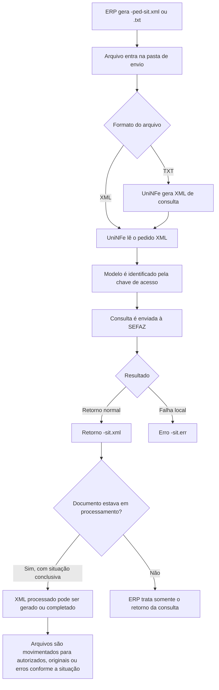

# Consulta de situação de NFe e NFCe por arquivo

A consulta de situação permite verificar na SEFAZ a situação atual de uma NFe ou NFCe pela chave de acesso. Ela é usada para confirmar se o documento está autorizado, cancelado, denegado, rejeitado, inexistente na base da SEFAZ ou em outra situação retornada pelo ambiente fiscal.

O UniNFe processa a consulta por arquivo XML ou TXT gravado na pasta de envio da empresa. O modelo do documento é identificado pela própria chave de acesso:

- chave com modelo `55`: NFe;
- chave com modelo `65`: NFCe.

## Quando usar

Use este serviço quando:

- o ERP precisa confirmar a situação fiscal de uma NFe ou NFCe pela chave de acesso;
- houve falha no retorno de autorização e é necessário recuperar a situação diretamente na SEFAZ;
- o suporte precisa verificar se uma nota está autorizada, cancelada, denegada ou rejeitada;
- o ERP precisa tentar completar o fluxo de uma nota que ficou em processamento no UniNFe.

Para verificar apenas se o webservice da SEFAZ está disponível, use a consulta status de serviço. Para inutilizar numeração não utilizada, use o serviço de inutilização.

## Pré-requisitos

Antes de executar a consulta, confira na configuração da empresa:

- a empresa está cadastrada no UniNFe;
- a pasta de envio e a pasta de retorno estão configuradas;
- a pasta de XMLs enviados está configurada;
- o certificado digital está configurado e válido;
- o ambiente da empresa corresponde ao ambiente que será consultado;
- o tipo de emissão está configurado corretamente;
- as configurações de proxy estão preenchidas, se a rede exigir proxy para acesso à internet.

## Arquivo XML de envio

Para enviar por XML, o ERP deve gerar o arquivo na pasta de envio da empresa com o final fixo:

```text
<chave>-ped-sit.xml
```

Exemplos:

```text
99999999999999999999999999999999999999999993-ped-sit.xml
41170701761135000132650010000186931903758906-ped-sit.xml
```

Estrutura do XML:

```xml
<?xml version="1.0" encoding="utf-8"?>
<consSitNFe xmlns="http://www.portalfiscal.inf.br/nfe" versao="4.00">
  <tpAmb>2</tpAmb>
  <xServ>CONSULTAR</xServ>
  <tpEmis>1</tpEmis>
  <chNFe>41170701761135000132650010000186931903758906</chNFe>
</consSitNFe>
```

## Arquivo TXT de envio

Para enviar por TXT, o ERP deve gerar o arquivo na pasta de envio da empresa com o final fixo:

```text
<chave>-ped-sit.txt
```

Exemplo:

```text
41170701761135000132650010000186931903758906-ped-sit.txt
```

O conteúdo deve informar os campos no formato `campo|valor`:

```text
tpAmb|2
xServ|CONSULTAR
tpEmis|1
chNFe|41170701761135000132650010000186931903758906
versao|4.00
```

Ao receber o TXT, o UniNFe gera o XML correspondente para processamento. Depois do processamento, o arquivo de solicitação é removido.

## Campos do pedido

| Campo | Como preencher |
|---|---|
| `versao` | Versão do leiaute da consulta. Para os exemplos atuais de NFe/NFCe, use `4.00`. No XML, fica no atributo `versao` de `consSitNFe`; no TXT, fica na linha `versao`. |
| `tpAmb` | Ambiente consultado. Use `1` para produção ou `2` para homologação. |
| `xServ` | Informe `CONSULTAR`. |
| `tpEmis` | Tipo de emissão consultado. Quando não informado no XML, o UniNFe usa o tipo de emissão configurado na empresa. |
| `chNFe` | Chave de acesso da NFe ou NFCe que será consultada. A chave deve ter 44 dígitos e determina se a consulta é de NFe ou NFCe pelo modelo fiscal contido nela. |

## Fluxo de processamento

1. O ERP grava o arquivo `-ped-sit.xml` ou `-ped-sit.txt` na pasta de envio.
2. O UniNFe identifica o pedido de consulta de situação.
3. Se o arquivo for TXT, o UniNFe gera o XML de consulta.
4. O UniNFe aplica as configurações da empresa, certificado, ambiente, tipo de emissão, proxy e conexão TLS quando configurado.
5. A consulta é enviada ao webservice da SEFAZ, como NFe ou NFCe conforme o modelo da chave de acesso.
6. O retorno da SEFAZ é gravado na pasta de retorno com o final `-sit.xml`.
7. O arquivo de solicitação é removido da pasta de envio.
8. Se ocorrer falha local antes ou durante a consulta, o UniNFe grava um arquivo `-sit.err` na pasta de retorno.
9. Se a consulta confirmar autorização, cancelamento ou denegação e o XML original estiver em processamento, o UniNFe pode gerar ou completar o XML processado e movimentar os arquivos para as pastas correspondentes.

## Fluxograma



## Arquivos gerados e movimentados

| Momento | Pasta | Nome do arquivo | Quando aparece |
|---|---|---|---|
| Pedido XML | Pasta de envio | `<chave>-ped-sit.xml` | Arquivo criado pelo ERP para consultar a situação por XML. |
| Pedido TXT | Pasta de envio | `<chave>-ped-sit.txt` | Arquivo criado pelo ERP para consultar a situação por TXT. |
| XML gerado a partir do TXT | Pasta de envio ou pasta de validação, conforme origem do arquivo | `<chave>.xml` | Criado quando o ERP envia o pedido em TXT. |
| Retorno ao ERP | Pasta de retorno | `<chave>-sit.xml` | Retorno XML recebido da SEFAZ com a situação do documento. |
| Erro ao ERP | Pasta de retorno | `<chave>-sit.err` | Erro local antes ou durante a consulta, como falha de leitura, certificado, comunicação ou gravação. |
| XML processado da NFe/NFCe | Pasta de XMLs enviados, conforme situação do documento | `<chave>-procNFe.xml` | Pode ser gerado ou completado quando a consulta confirma situação fiscal conclusiva e o XML original está em processamento. |
| XML original da NFe/NFCe | Pasta de XMLs enviados, em autorizados, originais ou erros | `<chave>-nfe.xml` | Pode ser movimentado quando a consulta conclui o fluxo de um documento que estava em processamento. |

## Como tratar o retorno

O ERP deve monitorar a pasta de retorno e aguardar um destes arquivos:

```text
<chave>-sit.xml
<chave>-sit.err
```

O retorno XML contém a resposta da SEFAZ para a chave consultada. O ERP deve analisar o status e o motivo retornados para atualizar a situação do documento.

Quando o retorno indicar documento autorizado, cancelado ou denegado, o ERP pode atualizar a situação fiscal conforme a resposta da SEFAZ. Quando o documento estiver em processamento no UniNFe, a consulta também pode ajudar a completar a geração do XML processado e a movimentação dos arquivos internos.

Quando o retorno indicar rejeição, inexistência da chave ou outra situação impeditiva, o ERP deve exibir o motivo ao usuário e orientar a correção conforme o caso.

Quando o retorno for `.err`, o problema ocorreu localmente no UniNFe antes de obter um retorno normal da SEFAZ. Depois de corrigir a causa, gere novamente o arquivo `-ped-sit.xml` ou `-ped-sit.txt`.

## Recuperação de XML processado

Quando uma NFe ou NFCe fica em processamento e a SEFAZ já possui uma situação conclusiva para a chave, a consulta de situação pode auxiliar na recuperação do fluxo.

Se o retorno confirmar autorização, cancelamento ou denegação e o XML original estiver disponível na pasta de processamento, o UniNFe pode:

- gerar ou completar o XML processado `-procNFe.xml`;
- mover o XML processado para a pasta de autorizados;
- mover o XML original para autorizados ou originais, conforme a configuração de salvamento;
- mover o XML para a pasta de erros quando a situação fiscal indicar rejeição ou inconsistência;
- remover o documento do controle de fluxo quando a situação já estiver concluída.

Esse comportamento é útil quando houve falha de comunicação, queda de energia, fechamento inesperado do aplicativo ou perda do retorno original de autorização.

## Erros comuns

As causas mais comuns de erro são:

- arquivo sem a tag `consSitNFe` ou com estrutura diferente do leiaute esperado;
- ausência da versão da consulta;
- chave de acesso ausente, incompleta ou inválida;
- ambiente incompatível com a chave consultada;
- tipo de emissão incompatível com a operação;
- certificado digital ausente, vencido ou inacessível;
- proxy ou conexão TLS configurados incorretamente;
- falha de comunicação com o webservice;
- XML original não localizado em processamento para recuperação do XML processado;
- falta de permissão de leitura e gravação nas pastas configuradas.

## Cuidados para o integrador

- Use sempre `-ped-sit.xml` ou `-ped-sit.txt` como final do arquivo de envio.
- Informe a chave completa em `chNFe`.
- Use uma chave de modelo `55` para NFe e de modelo `65` para NFCe.
- Consulte o mesmo ambiente em que o documento foi emitido.
- Aguarde o arquivo `-sit.xml` para interpretar a situação fiscal retornada pela SEFAZ.
- Não trate esta consulta como autorização nova de documento; ela consulta uma chave já existente ou uma tentativa anterior.
- Em erros `.err`, corrija a causa local antes de reenviar a consulta.
