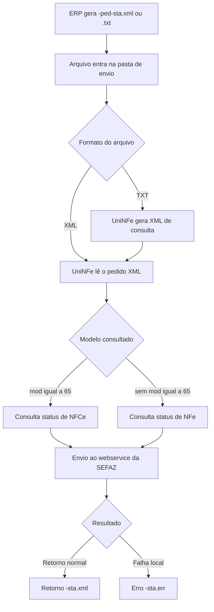

# Consulta status de serviço de NFe e NFCe por arquivo

A consulta status de serviço permite verificar se o webservice da SEFAZ está disponível para operações de NFe ou NFCe em uma determinada UF, ambiente e tipo de emissão.

Use esta consulta antes de iniciar operações fiscais, durante implantação ou quando houver suspeita de indisponibilidade da SEFAZ. Ela não autoriza documento, não cancela, não inutiliza numeração e não consulta uma chave específica; o objetivo é apenas retornar a situação do serviço.

O UniNFe processa a consulta por arquivo XML ou TXT gravado na pasta de envio da empresa. Quando o pedido XML informa `mod` igual a `65`, a consulta é enviada como NFCe. Quando `mod` não é informado, o processamento segue como NFe.

## Quando usar

Use este serviço quando:

- o ERP precisa confirmar se o webservice de NFe ou NFCe está disponível;
- o envio, cancelamento, inutilização ou evento falhou por suspeita de indisponibilidade da SEFAZ;
- o suporte precisa validar ambiente, UF, certificado, proxy ou comunicação;
- a empresa deseja testar a comunicação antes de iniciar operações fiscais.

Para consultar a situação de uma NFe ou NFCe específica pela chave de acesso, use o serviço de consulta de situação.

## Pré-requisitos

Antes de executar a consulta, confira na configuração da empresa:

- a empresa está cadastrada no UniNFe;
- a pasta de envio e a pasta de retorno estão configuradas;
- o certificado digital está configurado e válido;
- o ambiente da empresa corresponde ao ambiente que será consultado;
- o tipo de emissão está configurado corretamente;
- as configurações de proxy estão preenchidas, se a rede exigir proxy para acesso à internet.

## Arquivo XML de envio

Para enviar por XML, o ERP deve gerar o arquivo na pasta de envio da empresa com o final fixo:

```text
<identificador>-ped-sta.xml
```

Exemplos:

```text
20100222T222310-ped-sta.xml
COM_TAG_mod_20100222T222310-ped-sta.xml
```

Estrutura para consulta de NFe:

```xml
<?xml version="1.0" encoding="utf-8"?>
<consStatServ versao="4.00" xmlns="http://www.portalfiscal.inf.br/nfe">
  <tpAmb>2</tpAmb>
  <cUF>35</cUF>
  <xServ>STATUS</xServ>
</consStatServ>
```

Estrutura para consulta de NFCe:

```xml
<?xml version="1.0" encoding="utf-8"?>
<consStatServ versao="4.00" xmlns="http://www.portalfiscal.inf.br/nfe">
  <tpAmb>2</tpAmb>
  <cUF>41</cUF>
  <xServ>STATUS</xServ>
  <mod>65</mod>
</consStatServ>
```

## Arquivo TXT de envio

Para enviar por TXT, o ERP deve gerar o arquivo na pasta de envio da empresa com o final fixo:

```text
<identificador>-ped-sta.txt
```

Exemplo:

```text
20100222T222310-ped-sta.txt
```

O conteúdo deve informar os campos no formato `campo|valor`:

```text
tpEmis|1
tpAmb|2
cUF|41
versao|4.00
```

Ao receber o TXT, o UniNFe gera o XML correspondente para processamento. Depois do processamento, o arquivo de solicitação é removido.

## Campos do pedido

| Campo | Como preencher |
|---|---|
| `versao` | Versão do leiaute da consulta. Para os exemplos atuais de NFe/NFCe, use `4.00`. No XML, fica no atributo `versao` de `consStatServ`; no TXT, fica na linha `versao`. |
| `tpAmb` | Ambiente consultado. Use `1` para produção ou `2` para homologação. |
| `cUF` | Código da UF cujo serviço será consultado. |
| `xServ` | Informe `STATUS`. |
| `tpEmis` | Tipo de emissão consultado. Quando não informado no XML, o UniNFe usa o tipo de emissão configurado na empresa. |
| `mod` | Modelo fiscal consultado. Use `65` no XML para consultar NFCe. Quando não informado, a consulta é tratada como NFe. |

## Fluxo de processamento

1. O ERP grava o arquivo `-ped-sta.xml` ou `-ped-sta.txt` na pasta de envio.
2. O UniNFe identifica o pedido de consulta status de serviço.
3. Se o arquivo for TXT, o UniNFe gera o XML de consulta.
4. O UniNFe aplica as configurações da empresa, certificado, ambiente, tipo de emissão, proxy e conexão TLS quando configurado.
5. A consulta é enviada ao webservice da SEFAZ, como NFe ou NFCe conforme o pedido.
6. O retorno da SEFAZ é gravado na pasta de retorno com o final `-sta.xml`.
7. O arquivo de solicitação é removido da pasta de envio.
8. Se ocorrer falha local antes ou durante a consulta, o UniNFe grava um arquivo `-sta.err` na pasta de retorno.

## Fluxograma



## Arquivos gerados

| Momento | Pasta | Nome do arquivo | Quando aparece |
|---|---|---|---|
| Pedido XML | Pasta de envio | `<identificador>-ped-sta.xml` | Arquivo criado pelo ERP para consultar a disponibilidade do serviço por XML. |
| Pedido TXT | Pasta de envio | `<identificador>-ped-sta.txt` | Arquivo criado pelo ERP para consultar a disponibilidade do serviço por TXT. |
| XML gerado a partir do TXT | Pasta de envio ou pasta de validação, conforme origem do arquivo | `<identificador>.xml` | Criado quando o ERP envia o pedido em TXT. |
| Retorno ao ERP | Pasta de retorno | `<identificador>-sta.xml` | Retorno XML recebido da SEFAZ com a situação do serviço. |
| Erro ao ERP | Pasta de retorno | `<identificador>-sta.err` | Erro local antes ou durante a consulta, como falha de leitura, certificado, comunicação ou gravação. |

Esta consulta não gera XML de distribuição, XML processado, protocolo de autorização ou arquivo em autorizados, pois não há documento fiscal sendo autorizado.

## Como tratar o retorno

O ERP deve monitorar a pasta de retorno e aguardar um destes arquivos:

```text
<identificador>-sta.xml
<identificador>-sta.err
```

O retorno XML contém a resposta da SEFAZ para a UF, ambiente, modelo e tipo de emissão consultados. O ERP deve analisar o status e o motivo retornados para decidir se pode iniciar ou continuar as operações fiscais.

Quando o retorno indicar que o serviço está disponível, o ERP pode prosseguir com as operações de NFe ou NFCe. Quando indicar indisponibilidade, o ERP deve aguardar a normalização do serviço ou orientar o usuário conforme a operação fiscal permitida para o cenário.

Quando o retorno for `.err`, o problema ocorreu localmente no UniNFe antes de obter um retorno normal da SEFAZ. Depois de corrigir a causa, gere novamente o arquivo `-ped-sta.xml` ou `-ped-sta.txt`.

## Erros comuns

As causas mais comuns de erro são:

- arquivo sem a tag `consStatServ` ou com estrutura diferente do leiaute esperado;
- ausência da versão da consulta;
- ambiente, UF ou tipo de emissão ausente ou inválido;
- ausência de `mod` igual a `65` quando a intenção era consultar NFCe por XML;
- certificado digital ausente, vencido ou inacessível;
- proxy ou conexão TLS configurados incorretamente;
- falha de comunicação com o webservice;
- falta de permissão de leitura e gravação nas pastas configuradas.

## Cuidados para o integrador

- Use sempre `-ped-sta.xml` ou `-ped-sta.txt` como final do arquivo de envio.
- Informe a UF correta em `cUF`.
- Consulte o mesmo ambiente usado nas operações da empresa.
- Para consulta de NFCe por XML, informe `mod` igual a `65`.
- Aguarde o arquivo `-sta.xml` para interpretar a disponibilidade do serviço.
- Não trate esta consulta como autorização, cancelamento, inutilização ou consulta de situação de documento; ela apenas informa a disponibilidade do webservice.
- Em erros `.err`, corrija a causa local antes de reenviar a consulta.
