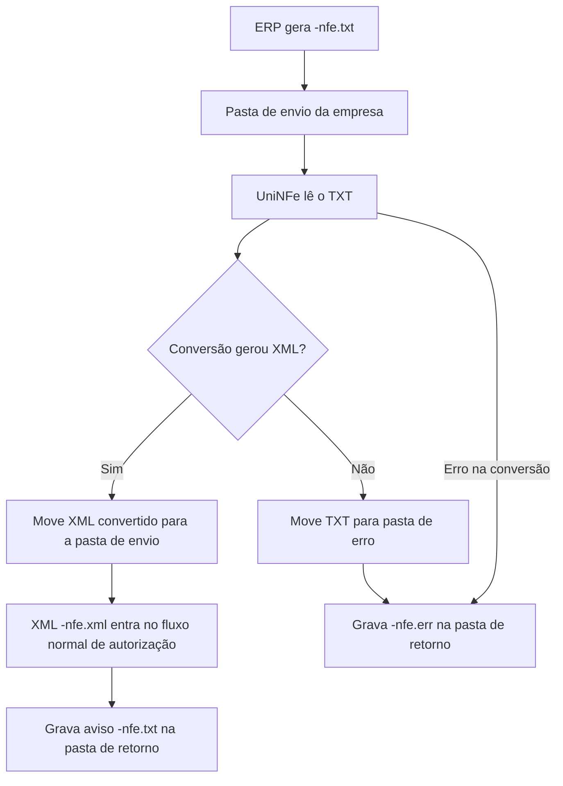

# Conversão de TXT para XML de NFe e NFCe

A conversão de TXT para XML permite que o ERP envie uma NFe ou NFCe no leiaute texto do UniNFe. O UniNFe lê o arquivo TXT, converte o conteúdo para XML e grava o XML gerado na pasta de envio para seguir o processamento normal da nota.

Este serviço não envia a nota diretamente ao webservice fiscal. Ele prepara o XML da NFe ou NFCe a partir do TXT. Depois da conversão, o XML `-nfe.xml` passa a ser processado pelo fluxo normal de autorização.

## Quando usar

Use este serviço quando:

- O ERP gera NFe ou NFCe no formato TXT do UniNFe.
- O ERP precisa converter o TXT em XML antes do envio fiscal.
- O integrador quer manter o contrato de integração por arquivos TXT.
- O suporte precisa validar se o TXT está sendo convertido corretamente antes do envio.

## Pré-requisitos

Antes de usar a conversão, confira:

- A empresa está cadastrada no UniNFe.
- A pasta de envio está configurada.
- A pasta de retorno está configurada.
- A pasta de erros está configurada.
- O TXT segue o leiaute de NFe/NFCe aceito pelo UniNFe.
- O nome do arquivo termina com `-nfe.txt`.

## Arquivo de envio

O ERP deve gerar o arquivo TXT na pasta de envio da empresa com o final fixo:

```text
<identificador>-nfe.txt
```

O `<identificador>` deve ser único para a nota ou para o arquivo gerado pelo ERP. Em geral, ele é a chave de acesso, número interno ou outro identificador que permita relacionar o TXT, o XML convertido e os retornos posteriores.

Exemplos:

```text
99999999999999999999999999999999999999999999-nfe.txt
ComRespTec_001-nfe.txt
```

## Estrutura do TXT

O TXT é composto por linhas identificadas por grupos. Cada linha usa campos separados por `|`.

Exemplo simplificado:

```text
NOTA FISCAL|1|
A|4.00|NFCe|
B|51| |VENDA DE MERCADORIA ADQUIR. DE TERCEIROS|65|003|006939|2024-03-06T14:12:31-04:00|2024-03-06T14:12:31-04:00|1|1|5103403|4|1||1|1|1|1|0|4.00|||
C|RESTAURANTE COME COME|COME COME|111111111||||1|
C02|99999999000150|
H|1||
I|2|SEM GTIN|COCA LATA|01064900|||||||5102|UN|1.0000|3.5000|3.50||UN|1.0000|3.5000|||||1||||
W|
Y|
YA|0|99|RECEBIDO|3,50|||||
```

Campos principais do exemplo:

| Linha | Para que serve |
|---|---|
| `NOTA FISCAL` | Indica o início de uma nota fiscal no arquivo TXT. |
| `A` | Define dados gerais do leiaute e o modelo do documento, como NFe ou NFCe. |
| `B` | Define dados de identificação da nota. |
| `C` e `C02` | Informam dados do emitente. |
| `H` e `I` | Informam itens e produtos da nota. |
| `W` | Informa totais da nota. |
| `Y` e `YA` | Informam dados de pagamento. |

O arquivo TXT pode conter uma ou mais notas, conforme o leiaute aceito pelo conversor.

## Fluxo de processamento

1. O ERP grava `<identificador>-nfe.txt` na pasta de envio da empresa.
2. O UniNFe identifica o arquivo como TXT de NFe/NFCe.
3. O UniNFe converte o TXT para XML.
4. Se a conversão gerar XMLs válidos, o UniNFe move cada XML convertido para a pasta de envio.
5. O XML convertido passa a ter o final `-nfe.xml` e segue o fluxo normal de autorização da NFe ou NFCe.
6. O UniNFe grava na pasta de retorno um aviso em TXT com o resultado da conversão.
7. Quando aplicável, o TXT original é salvo na pasta de retorno com o final `-orig.txt`.
8. Se a conversão falhar, o UniNFe grava um arquivo de erro para o ERP e remove XMLs parciais gerados durante a tentativa.

## Fluxograma



## Arquivos gerados e movimentados

| Momento | Pasta | Nome do arquivo | Quando aparece |
|---|---|---|---|
| Pedido | Pasta de envio | `<identificador>-nfe.txt` | Arquivo TXT criado pelo ERP para conversão. |
| XML convertido | Pasta de envio | `<chave>-nfe.xml` | XML gerado com sucesso a partir do TXT. |
| Aviso de conversão | Pasta de retorno | `<identificador>-nfe.txt` | Retorno TXT informando que a conversão foi concluída. |
| TXT original | Pasta de retorno | `<identificador>-orig.txt` | Cópia do TXT original, quando o arquivo veio da pasta de envio ou validação. |
| Erro de conversão | Pasta de retorno | `<identificador>-nfe.err` | Erro ocorrido na conversão do TXT para XML. |
| TXT com erro | Pasta de erros | `<identificador>-nfe.txt` | TXT movido quando há falha ou após o tratamento do arquivo original. |

## Retorno de sucesso

Quando a conversão é concluída, o UniNFe grava um arquivo TXT de retorno com o final:

```text
<identificador>-nfe.txt
```

O conteúdo contém `cStat=01` e a mensagem de sucesso:

```text
cStat=01
xMotivo=Conversão efetuada com sucesso.
Nota fiscal: 000006939 Serie: 003 - ChaveNFe: 99999999999999999999999999999999999999999999
```

Quando o TXT contém mais de uma nota, o retorno informa a quantidade convertida e lista as notas fiscais convertidas.

## Erros de conversão

Quando a conversão não gera informações suficientes para criar o XML, o UniNFe retorna:

```text
cStat=02
xMotivo=Falha na conversão. Sem informações para converter o arquivo texto
```

Quando o conversor identifica erro no conteúdo do TXT, o retorno contém:

```text
cStat=99
xMotivo=Falha na conversão
MensagemErro=<descrição do erro>
```

Nessas situações, o retorno é gravado com o final:

```text
<identificador>-nfe.err
```

## Cuidados para o integrador

- Use sempre o final `-nfe.txt` no arquivo TXT de entrada.
- Gere o TXT conforme o leiaute aceito pelo UniNFe.
- Monitore a pasta de retorno para identificar sucesso ou erro da conversão.
- Após a conversão com sucesso, acompanhe o processamento do XML `-nfe.xml` pelo fluxo normal de autorização.
- Não trate o arquivo `<identificador>-nfe.txt` da pasta de retorno como XML fiscal; ele é apenas o aviso da conversão.
- Em caso de erro, corrija o TXT original e gere novamente o arquivo `-nfe.txt` na pasta de envio.
